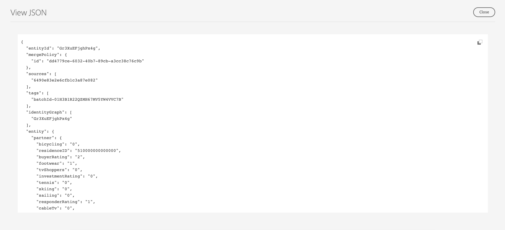

# Interessentenprofile

Adobe Experience Platform ermöglicht die Bereitstellung koordinierter, konsistenter und relevanter Erlebnisse für Ihre Kundinnen und Kunden, unabhängig davon, wo und wann sie mit Ihrer Marke interagieren.

Mithilfe von potenziellen Profilen werden Personen repräsentiert, die noch nicht mit Ihrem Unternehmen interagiert haben, aber Kontakt mit Ihnen aufnehmen möchten. Mit potenziellen Profilen können Sie Ihre Kundenprofile durch Attribute vertrauenswürdiger Drittanbieter-Partner ergänzen.

## Durchsuchen {#browse}

Um auf die Profile zuzugreifen, wählen Sie **[!UICONTROL Profile]** im **[!UICONTROL Perspektiven]** Abschnitt.

Die **[!UICONTROL Durchsuchen]** angezeigt. Eine Liste aller potenziellen Profile für Ihre Organisation wird angezeigt.

![Die [!UICONTROL Profile] -Schaltfläche markiert ist, wird die [!UICONTROL Durchsuchen] Seite für Interessenten-Profile.](../images/prospect-profile/browse-profiles.png)

>[!IMPORTANT]
>
>Während die meisten Browsing-Funktionen zwischen Kundenprofilen und Interessenten-Profilen identisch sind, haben Sie **cannot** Prospektprofile nach Zusammenführungsrichtlinie durchsuchen. Dies liegt daran, dass Interessenten-Profile automatisch von einer vom System entworfenen zeitbasierten Zusammenführungsrichtlinie verwaltet werden. Weitere Informationen zu Zusammenführungsrichtlinien finden Sie im [Zusammenführungsrichtlinienübersicht](../merge-policies/overview.md).

Weiterführende Informationen zu Browsing-Profilen finden Sie im Abschnitt [Abschnitt &quot;Durchsuchen&quot;des Profil-Benutzerhandbuchs](./user-guide.md#browse-identity).

## Profildetails {#profile-details}

>[!IMPORTANT]
>
>Ein Prospektprofil läuft automatisch nach 25 Tagen Aufenthalt in Adobe Experience Platform ab.

Um weitere Informationen zu einem bestimmten Profil anzuzeigen, wählen Sie ein Profil auf der [!UICONTROL Durchsuchen] Seite.

Es werden Informationen zum potenziellen Profil angezeigt, einschließlich der Attribute, die mit dem Profil und der Zielgruppenmitgliedschaft verknüpft sind.

Weitere Informationen zu diesen Registerkarten finden Sie im [Anzeigen des Bereichs Profildetails im Profil-Benutzerhandbuch](./user-guide.md#profile-detail).

Sie können auch alle Attribute im JSON-Format anzeigen, indem Sie **[!UICONTROL JSON anzeigen]**.

![Die [!UICONTROL JSON anzeigen] wird auf der Seite mit den Profildetails des Interessenten-Profils markiert.](../images/prospect-profile/profile-select-view-json.png)

Die [!UICONTROL JSON anzeigen] angezeigt. Die Attribute des potenziellen Profils werden jetzt im JSON-Formular angezeigt.

## Vorgeschlagene Anwendungsfälle {#use-cases}

Informationen dazu, wie Sie die Prospektprofilfunktionalität in Experience Platform in Kombination mit anderen Platform-Funktionen verwenden können, finden Sie in der folgenden Anwendungsfalldokumentation:

- [Engagieren und Akquirieren neuer Kundinnen und Kunden über die Interessentenfunktion](../../rtcdp/partner-data/prospecting.md)

## Nächste Schritte

Nach dem Lesen dieses Handbuchs wissen Sie jetzt, wie Prospektprofile in Adobe Experience Platform verwendet werden können. Um zu erfahren, wie diese Profile in Audiences verwendet werden können, lesen Sie bitte den Abschnitt [Handbuch für potenzielle Zielgruppen](../../segmentation/ui/prospect-audience.md).
