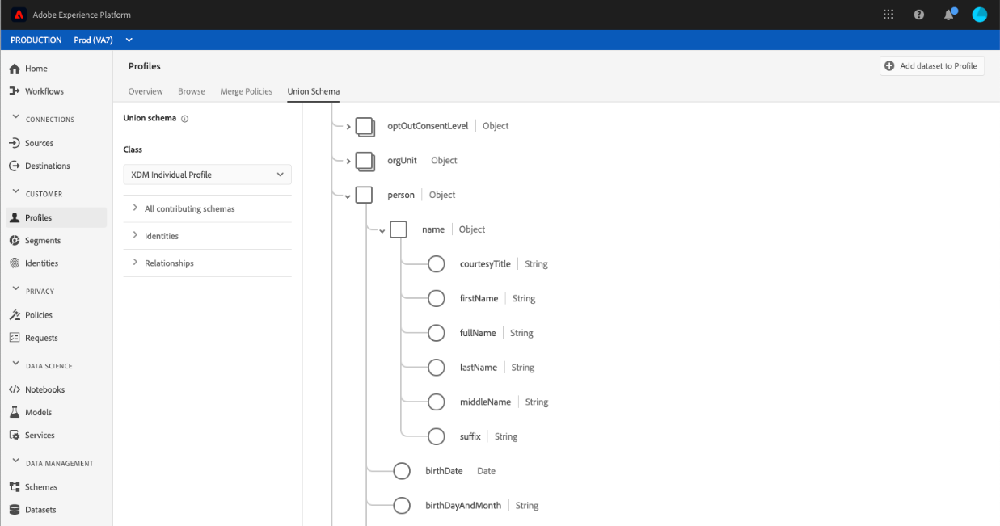
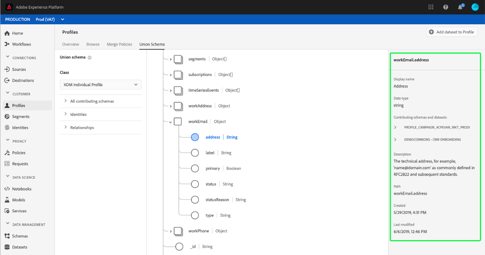
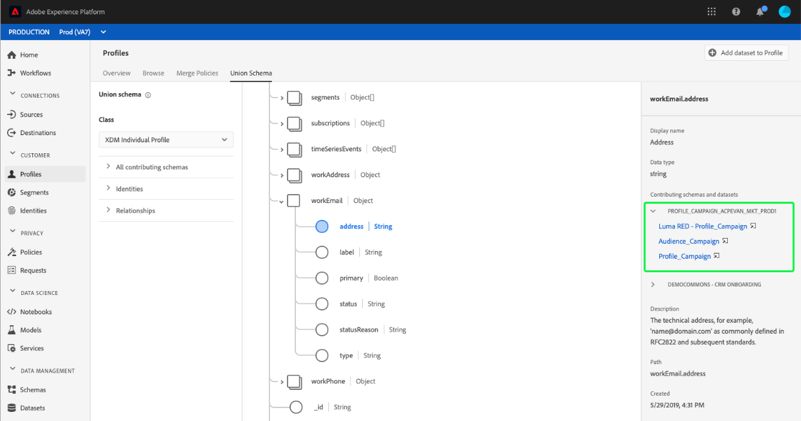
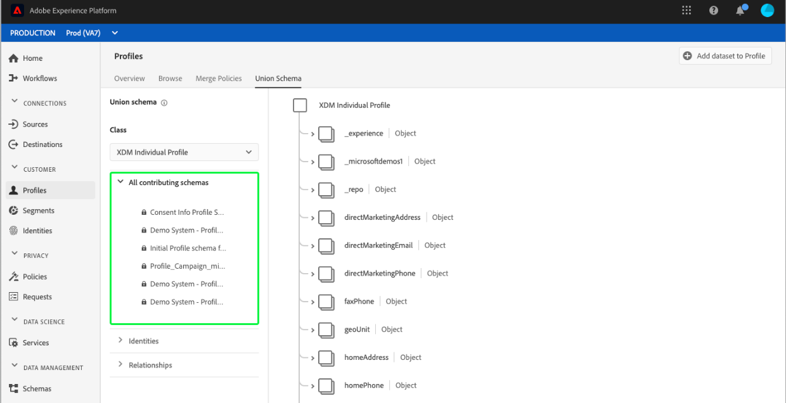

# [!UICONTROL Vereinigung ] schemaUI-Handbuch

In der Adobe Experience Platform-Benutzeroberfläche können Sie ganz einfach jedes Schema der Vereinigung innerhalb Ihres Unternehmens Ansicht und Vorschau der Felder, Identitäten, Beziehungen und beitragenden Schema für eine bestimmte Klasse durchführen. In diesem Handbuch finden Sie detaillierte Informationen zur Ansicht und Erforschung von Schemas der Vereinigung mithilfe der Plattform-Benutzeroberfläche.

## Erste Schritte

Dieses UI-Handbuch erfordert ein Verständnis der verschiedenen [!DNL Experience Platform]-Dienste, die mit der Verwaltung von Echtzeit-Daten zum Profil von Kunden verbunden sind. Bevor Sie dieses Handbuch lesen oder in der Benutzeroberfläche arbeiten, lesen Sie bitte die Dokumentation für die folgenden Dienste:

* [[!DNL Real-time Customer Profile]](../home.md): Bietet ein einheitliches, Echtzeit-Profil für Kunden, das auf aggregierten Daten aus mehreren Quellen basiert.
* [[!DNL Identity Service]](../../identity-service/home.md): Ermöglicht  [!DNL Real-time Customer Profile] die Überbrückung von Identitäten aus unterschiedlichen Datenquellen, in die sie eingeordnet werden  [!DNL Platform].
* [[!DNL Experience Data Model (XDM)]](../../xdm/home.md): Das standardisierte Framework, mit dem [!DNL Platform] Kundenerlebnisdaten organisiert.

## Schemas zur Vereinigung

Mit dem Echtzeit-Profil für Kunden können Sie robuste, zentralisierte Profil mit Kundenattributen und Ereignissen mit Zeitstempel erstellen, die bei jeder Kundeninteraktion in Adobe Experience Platform integriert sind. Format und Struktur dieser Daten werden von Experience Data Model-(XDM-)Schemas bereitgestellt, wobei jedes Schema auf einer XDM-Klasse basiert und Felder enthält, die mit dieser Klasse kompatibel sind.

Schema können für mehrere Anwendungsfälle erstellt werden, wobei auf dieselbe Klasse verwiesen wird, aber für die jeweilige Klasse spezifische Felder enthalten sind. Wenn ein Schema zum Profil aktiviert ist, wird es Teil eines Vereinigung-Schemas. Mit anderen Worten, Vereinigung-Schema bestehen aus mehreren Schemas, die dieselbe Klasse teilen und zum Profil aktiviert wurden. Mit dem Schema Vereinigung können Sie eine Zusammenstellung aller Felder sehen, die in Schemas enthalten sind, die dieselbe Klasse teilen. Das Echtzeit-Profil des Kunden verwendet das Vereinigung-Schema, um eine ganzheitliche Ansicht der einzelnen Kunden zu erstellen.

Die Arbeit mit Vereinigung-Schemas erfordert ein grundlegendes Verständnis der XDM-Schema. Für weitere Informationen lesen Sie bitte zunächst die [Grundlagen der Schema-Komposition](../../xdm/schema/composition.md).

## Ansicht Vereinigung Schema

Um zu Schemas der Vereinigung in der Plattform-Benutzeroberfläche zu navigieren, wählen Sie **[!UICONTROL Profil]** aus der linken Navigation und wählen Sie dann die Registerkarte **[!UICONTROL Vereinigung Schema]**. Die Registerkarte [!UICONTROL Vereinigung Schema] wird geöffnet, um das Schema Vereinigung für die aktuell ausgewählte Klasse anzuzeigen.

## Klasse auswählen

Um das Vereinigung-Schema für eine bestimmte XDM-Klasse anzuzeigen, wählen Sie die Klasse aus dem Dropdownmenü **[!UICONTROL Class]**. Da nicht alle Klassen Vereinigungen-Schema haben, sind nur Klassen mit Vereinigung-Schemas (d. h. Klassen mit Schemas, die zum Profil aktiviert wurden) in der Dropdown-Liste verfügbar.

Nachdem eine Klasse ausgewählt wurde, wird das angezeigte Schema aktualisiert, um das Schema der Vereinigung für die ausgewählte Klasse wiederzugeben. Sie können beispielsweise **[!UICONTROL XDM Individuelles Profil]** auswählen, um das Vereinigung-Schema für diese Klasse Ansicht.

## Schemas zur Vereinigung

Sie können das Schema &quot;Vereinigung&quot;erkunden, indem Sie einen Bildlauf nach oben und unten zur Ansicht der gesamten Schema-Struktur durchführen und eine rechte spitze Klammer (`>`) auswählen, um verschachtelte  zu erweitern.

Wählen Sie ein beliebiges Feld aus, um dessen Details wie Anzeigename, Datentyp, Beschreibungen, Pfad, Erstellungsdatum und Datum der letzten Änderung Ansicht. Sie können auch eine Liste der beitragenden Schema mit dem ausgewählten Feld Ansicht.

Wenn Sie den Namen eines beitragenden Schemas auswählen, werden die Namen der mit diesem Schema zusammenhängenden Datensätze angezeigt, die Daten in das ausgewählte Feld eintragen. Jeder Dataset-Name wird als Link angezeigt. Wenn Sie einen Dataset-Namen auswählen, wird die Registerkarte &quot;Aktivität&quot;für diesen Datensatz in einem neuen Fenster geöffnet.

Weitere Informationen zu Datensätzen, einschließlich Anzeigen der Aktivität von Datasets und Anzeigen einer Vorschau der Datensatzdaten in der Benutzeroberfläche finden Sie im Handbuch [Datasets UI guide](../../catalog/datasets/user-guide.md).

## Ansicht leistende Schemas

Sie können auch die Ansicht durchführen, welche spezifischen Schema zum Schema der Vereinigung beitragen, indem Sie **[!UICONTROL Alle beitragenden Schema]** auswählen, um die Liste der Schema zu erweitern. Je nachdem, welche Klasse Sie ausgewählt haben und wie viele Schema Ihr Unternehmen in Platform erstellt hat, kann es sich hierbei um eine kurze Liste mit einem einzigen Schema oder einer langen Liste mit vielen Schemas handeln.

Wenn Sie den Namen eines bestimmten Schemas auswählen, werden die Felder im Schema Vereinigung hervorgehoben, die Teil des ausgewählten Schemas sind. Nach der Auswahl eines Schemas wird das Schema &quot;Vereinigung&quot;grau mit schwarzen Balken angezeigt, die die Felder anzeigen, die zum beitragenden Schema gehören.

## Identitäten der Ansicht

Über die Benutzeroberfläche können Sie eine Liste von Identitäten, die im Schema Vereinigung enthalten sind, durch Auswahl von **[!UICONTROL Identitäten]** zur Erweiterung der Liste Ansicht werden.

Wenn Sie eine individuelle Identität aus der Liste auswählen, wird das angezeigte Schema bei Bedarf automatisch aktualisiert, um das Identitätsfeld anzuzeigen. Dies kann die Erweiterung mehrerer Felder einschließen, wenn das Identitätsfeld verschachtelt ist.

Das Identitätsfeld wird im Schema Vereinigung hervorgehoben und die Identitätsdetails werden auf der rechten Seite des Bildschirms angezeigt. Die Details enthalten eine Liste der beitragenden Schema, die das Identitätsfeld enthalten, und Sie können einen Drilldown durchführen, um Links zu den mit diesem Schema verknüpften Datensätzen zu finden, die Daten in das ausgewählte Identitätsfeld eintragen.

## Ansichten

Die Benutzeroberfläche des Vereinigung-Schemas ermöglicht es Ihnen außerdem, Beziehungen anzuzeigen, die für Schema anhand der ausgewählten Schema-Klasse definiert wurden. Das Definieren einer Beziehung ist eine Möglichkeit, zwei Schema aus verschiedenen Klassen zu verbinden, um komplexere Einblicke in Kundendaten zu erhalten.

Wenn Beziehungen für die ausgewählte Klasse eingerichtet wurden, zeigt die Auswahl von **[!UICONTROL Beziehungen]** eine Liste von Feldern an, die zum Erstellen von Beziehungen verwendet werden. Nicht alle Schema verwenden Beziehungen oder benötigen Beziehungen, daher ist es üblich, dass der Abschnitt &quot;Beziehungen&quot;keine Felder enthält.

Weitere Informationen zu Schema-Beziehungen, einschließlich ihrer Definition mithilfe der Benutzeroberfläche, finden Sie in diesem Dokument zu Schema-Beziehungen](../../xdm/tutorials/relationship-ui.md).[

Wenn Sie ein Beziehungsfeld aus der Liste auswählen, wird das angezeigte Schema bei Bedarf aktualisiert, um das hervorgehobene Beziehungsfeld anzuzeigen. Dies kann das Erweitern mehrerer Felder beinhalten, wenn das Beziehungsfeld verschachtelt ist.

## Nächste Schritte

Durch Lesen dieses Handbuchs wissen Sie jetzt, wie Vereinigungen mithilfe der [!DNL Experience Platform]-Benutzeroberfläche Ansicht und navigiert werden können. Weitere Informationen zu Schemas, einschließlich deren Verwendung auf der gesamten Plattform, finden Sie unter [XDM-Systemübersicht](../../xdm/home.md).
