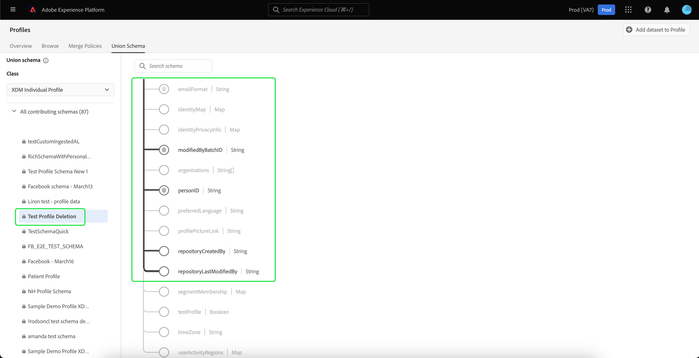
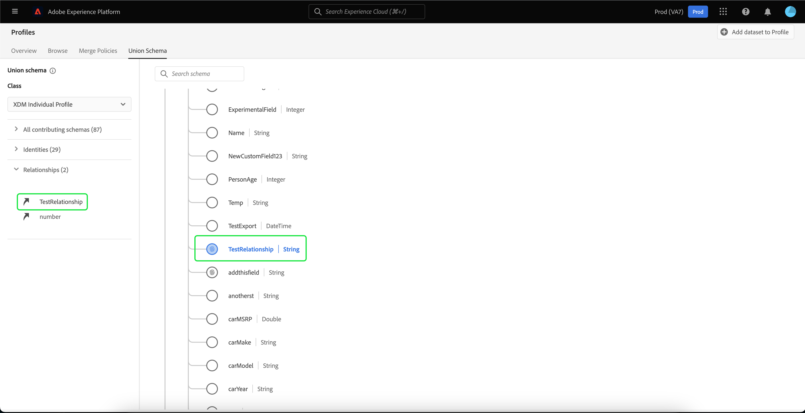

# Handbuch [!UICONTROL Vereinigungsschema] Benutzeroberfläche

In der Benutzeroberfläche von Adobe Experience Platform können Sie problemlos jedes Vereinigungsschema innerhalb Ihres Unternehmens anzeigen und eine Vorschau der Felder, Identitäten, Beziehungen und beitragenden Schemata für eine bestimmte Klasse anzeigen. Dieses Handbuch enthält detaillierte Informationen zum Anzeigen und Erkunden von Vereinigungsschemata mithilfe der Experience Platform-Benutzeroberfläche.

## Erste Schritte

Dieses Handbuch für die Benutzeroberfläche setzt ein Verständnis der verschiedenen [!DNL Experience Platform]-Services voraus, die mit der Verwaltung von Echtzeit-Kundenprofildaten verbunden sind. Bevor Sie dieses Handbuch lesen oder in der Benutzeroberfläche arbeiten, lesen Sie bitte die Dokumentation für die folgenden Services:

* [[!DNL Real-Time Customer Profile]](../home.md): Bietet ein einheitliches Echtzeit-Kundenprofil, das auf aggregierten Daten aus verschiedenen Quellen basiert.
* [[!DNL Identity Service]](../../identity-service/home.md): Aktiviert die [!DNL Real-Time Customer Profile] durch Überbrückung von Identitäten aus unterschiedlichen Datenquellen, während sie in [!DNL Experience Platform] aufgenommen werden.
* [[!DNL Experience Data Model (XDM)]](../../xdm/home.md): Das standardisierte Framework, mit dem Kundenerlebnisdaten von [!DNL Experience Platform] organisiert werden.

## Grundlagen zu Vereinigungsschemata

Mit dem Echtzeit-Kundenprofil können Sie robuste, zentralisierte Profile erstellen, die Kundenattribute und Ereignisse mit Zeitstempel enthalten, wobei jede Kundeninteraktion über in Adobe Experience Platform integrierte Systeme hinweg erfolgt. Das Format und die Struktur dieser Daten werden von Experience-Datenmodell (XDM)-Schemata bereitgestellt, wobei jedes Schema auf einer XDM-Klasse basiert und Felder enthält, die mit dieser Klasse kompatibel sind.

Schemata können für mehrere Anwendungsfälle erstellt werden, die auf dieselbe Klasse verweisen, aber Felder enthalten, die für ihre Verwendung spezifisch sind. Wenn ein Schema für das Profil aktiviert ist, wird es Teil eines Vereinigungsschemas. Mit anderen Worten: Vereinigungsschemata bestehen aus mehreren Schemata, die dieselbe Klasse haben und für Profil aktiviert wurden. Mit dem Vereinigungsschema können Sie eine Zusammenführung aller Felder sehen, die in Schemas enthalten sind, die dieselbe Klasse haben. Das Echtzeit-Kundenprofil verwendet das Vereinigungsschema, um eine ganzheitliche Ansicht jedes einzelnen Kunden zu erstellen.

Das Arbeiten mit Vereinigungsschemata erfordert ein tiefes Verständnis von XDM-Schemata. Um weitere Informationen zu erhalten, lesen Sie zunächst die [Grundlagen der Schemakomposition](../../xdm/schema/composition.md).

## Vereinigungsschemata anzeigen

Um in der Experience Platform-Benutzeroberfläche zu den Vereinigungsschemata zu navigieren, wählen Sie **[!UICONTROL linken Navigationsbereich die Option]** Profile“ und dann die Registerkarte **[!UICONTROL Vereinigungsschema]** aus. Die Registerkarte [!UICONTROL Vereinigungsschema] wird geöffnet, um das Vereinigungsschema für die aktuell ausgewählte Klasse anzuzeigen.

## Klasse auswählen

Um das Vereinigungsschema für eine bestimmte XDM-Klasse anzuzeigen, wählen Sie die Klasse aus dem Dropdown-Menü **[!UICONTROL Klasse]** aus. Da nicht alle Klassen Vereinigungsschemata haben, sind in der Dropdown-Liste nur Klassen mit Vereinigungsschemata (d. h. Klassen mit Schemata, die für Profil aktiviert wurden) verfügbar.

Nachdem eine Klasse ausgewählt wurde, wird das angezeigte Schema aktualisiert, um das Vereinigungsschema für die ausgewählte Klasse widerzuspiegeln. Sie können beispielsweise auf **[!UICONTROL Individuelles XDM-Profil]** klicken, um das Vereinigungsschema für diese Klasse anzuzeigen.

## Erkunden von Vereinigungsschemata

Sie können das Vereinigungsschema erkunden, indem Sie nach oben und unten scrollen, um die vollständige Schemastruktur anzuzeigen, und indem Sie eine rechte spitze Klammer (`>`) auswählen, um verschachtelte Felder zu erweitern.

Wählen Sie ein beliebiges Feld aus, um seine Details anzuzeigen, einschließlich Anzeigename, Datentyp, Beschreibung, Pfad, Erstellungsdatum und Datum der letzten Änderung. Sie können auch eine Liste der beitragenden Schemata anzeigen, die das ausgewählte Feld enthalten.

Wenn Sie den Namen eines beitragenden Schemas auswählen, werden die Namen der Datensätze angezeigt, die mit diesem Schema verknüpft sind und Daten in das ausgewählte Feld aufnehmen. Jeder Datensatzname wird als Link angezeigt. Wenn Sie einen Datensatznamen auswählen, wird die Registerkarte Aktivität für diesen Datensatz in einem neuen Fenster geöffnet.

Weitere Informationen zu Datensätzen, einschließlich der Anzeige von Datensatzaktivitäten und der Vorschau von Datensatzdaten in der Benutzeroberfläche, finden Sie im [Handbuch zur Benutzeroberfläche von Datensätzen](../../catalog/datasets/user-guide.md).

## Beitragende Schemata anzeigen

Sie können auch anzeigen, welche spezifischen Schemata zum Vereinigungsschema beitragen, indem Sie &quot;**[!UICONTROL beitragenden Schemata“]**, um die Liste der Schemata zu erweitern. Je nach ausgewählter Klasse und der Anzahl der Schemata, die Ihr Unternehmen in Experience Platform erstellt hat, kann es sich um eine kurze Liste mit einem einzigen Schema oder eine lange Liste mit vielen Schemata handeln.

Wenn Sie den Namen eines bestimmten Schemas auswählen, werden die Felder innerhalb des Vereinigungsschemas hervorgehoben, die Teil des ausgewählten Schemas sind. Nachdem ein Schema ausgewählt wurde, wird das Vereinigungsschema mit schwarzen Balken ausgegraut, die die Felder angeben, die Teil des beitragenden Schemas sind.

## Anzeigen von Identitäten

Über die Benutzeroberfläche können Sie eine Liste von Identitäten anzeigen, die im Vereinigungsschema enthalten sind, indem Sie **[!UICONTROL Identitäten]** auswählen, um die Liste zu erweitern.

Wenn Sie eine einzelne Identität aus der Liste auswählen, wird das angezeigte Schema automatisch nach Bedarf aktualisiert, um das Identitätsfeld anzuzeigen. Dazu kann das Erweitern mehrerer Felder gehören, wenn das Identitätsfeld verschachtelt ist.

Das Identitätsfeld wird innerhalb des Vereinigungsschemas hervorgehoben und die Details der Identität werden auf der rechten Seite des Bildschirms angezeigt. Zu den Details gehört eine Liste der beitragenden Schemata, die das Identitätsfeld enthalten, und Sie können einen Drilldown durchführen, um Links zu den Datensätzen zu finden, die mit diesem Schema verknüpft sind und Daten in das ausgewählte Identitätsfeld aufnehmen.

## Beziehungen zeigen

In der Benutzeroberfläche des Vereinigungsschemas können Sie auch Beziehungen sehen, die für Schemas basierend auf der ausgewählten Schemaklasse definiert wurden. Durch das Definieren einer Beziehung können zwei Schemata miteinander verbunden werden, die zu verschiedenen Klassen gehören, um komplexere Einblicke in Kundendaten zu erhalten.

Wenn Beziehungen für die ausgewählte Klasse hergestellt wurden, wird durch Auswahl von **[!UICONTROL Beziehungen]** eine Liste der Felder angezeigt, die zum Erstellen von Beziehungen verwendet werden. Nicht alle Schemas verwenden Beziehungen oder müssen definiert werden. Daher ist es üblich, dass der Abschnitt Beziehungen keine Felder enthält.

Weitere Informationen zu Schemabeziehungen, einschließlich ihrer Definition mithilfe der Benutzeroberfläche, finden Sie [diesem Dokument zu Schemabeziehungen](../../xdm/tutorials/relationship-ui.md).

Wenn Sie ein Beziehungsfeld in der Liste auswählen, wird das angezeigte Schema nach Bedarf aktualisiert, um das hervorgehobene Beziehungsfeld anzuzeigen. Dazu kann das Erweitern mehrerer Felder gehören, wenn das Beziehungsfeld verschachtelt ist.

## Nächste Schritte

Durch das Lesen dieses Handbuchs wissen Sie jetzt, wie Sie Vereinigungsschemata mithilfe der [!DNL Experience Platform]-Benutzeroberfläche anzeigen und darin navigieren können. Um weitere Informationen zu Schemata zu erhalten, einschließlich ihrer Verwendung in Experience Platform, lesen Sie zunächst die [Übersicht über das XDM-System](../../xdm/home.md).
