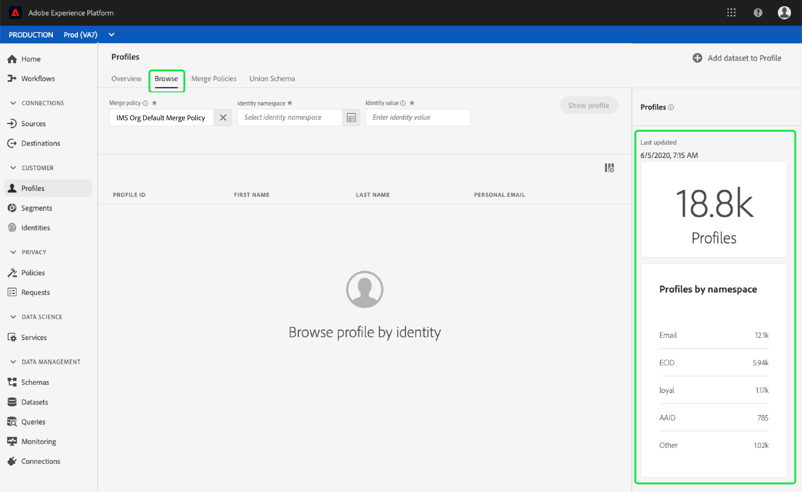
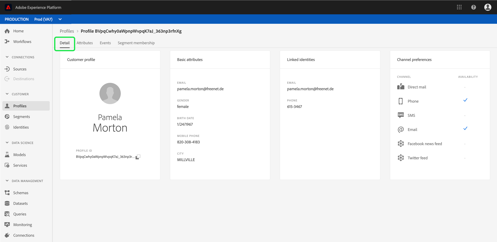

# Handbuch zum Echtzeit-Profil

Das Echtzeit-Kundenprofil erstellt eine ganzheitliche Sicht Ihrer einzelnen Kunden und fasst Daten aus mehreren Kanälen (einschließlich Online-, Offline-, CRM- und Drittanbieter-Daten) zusammen.

Dieses Dokument dient als Leitfaden für die Interaktion mit Echtzeit-Kundendaten in der Benutzeroberfläche der Adobe Experience Platform.

## Erste Schritte

Dieses Benutzerhandbuch erfordert ein Verständnis der verschiedenen Experience Platformen-Services, die mit der Verwaltung von Echtzeit-Profilen für Kunden verbunden sind. Bevor Sie dieses Benutzerhandbuch lesen, lesen Sie bitte die Dokumentation für die folgenden Dienste:

* [Echtzeit-Profil](../home.md): Bietet ein einheitliches, Echtzeit-Profil für Kunden, das auf aggregierten Daten aus mehreren Quellen basiert.
* [Identitätsdienst](../../identity-service/home.md): Ermöglicht Kunden-Profil in Echtzeit durch Überbrückung von Identitäten aus unterschiedlichen Datenquellen, während sie in die Platform aufgenommen werden.
* [Erlebnisdatenmodell (XDM)](../../xdm/home.md): Das standardisierte Framework, mit dem Platform Kundenerlebnisdaten organisiert.

## Übersicht

Klicken Sie in der Benutzeroberfläche [der](http://platform.adobe.com)Experience Platform im linken Navigationsbereich auf **Profile** , um die Registerkarte _Übersicht_ zu öffnen. Diese Registerkarte enthält Links zu Dokumentationen und Videos, die Ihnen helfen, Profile zu verstehen und mit ihnen zu arbeiten.

## Durchsuchen von Profilen

Klicken Sie auf die Registerkarte &quot; **Durchsuchen** &quot;, um Profile nach Identität zu durchsuchen.

### Profil-Metriken {#profile-metrics}

Auf der rechten Seite der Registerkarte &quot; **Durchsuchen** &quot;finden Sie eine Reihe wichtiger Profil-Metriken zu Ihren Profil-Daten, einschließlich der Gesamtzahl der [Profil](#profile-count) sowie einer Auflistung der [Profil nach Namensraum](#profiles-by-namespace).

Diese Profil-Metriken werden mit der standardmäßigen Zusammenführungsrichtlinie Ihres Unternehmens ausgewertet. Weitere Informationen zum Arbeiten mit Zusammenführungsrichtlinien, einschließlich der Definition einer standardmäßigen Zusammenführungsrichtlinie, finden Sie im [Benutzerhandbuch](merge-policies.md)&quot;Richtlinien zusammenführen&quot;.

Zusätzlich zu diesen Metriken bietet der Bereich &quot;Profil-Metriken&quot;auch das Datum und die Uhrzeit der *letzten Aktualisierung* , die anzeigen, wann die Metriken zuletzt ausgewertet wurden.

### Anzahl der Profil {#profile-count}

Die Anzahl der Profil zeigt die Gesamtzahl der Profil an, die Ihr Unternehmen innerhalb der Experience Platform hat, nachdem die standardmäßige Zusammenführungsrichtlinie Ihres Unternehmens Profil-Fragmente zusammengeführt hat, um für jeden einzelnen Kunden ein Profil zu bilden. Mit anderen Worten, Ihr Unternehmen verfügt möglicherweise über mehrere Produktfragmente, die sich auf einen einzelnen Profil beziehen, der mit Ihrer Marke über verschiedene Kanal hinweg interagiert. Diese Fragmente werden jedoch zusammengeführt (gemäß der standardmäßigen Fusionsrichtlinie) und geben ein &quot;1&quot;-Profil zurück, da sie alle mit derselben Person zusammenhängen.

Die Profil-Anzahl umfasst auch Profil mit Attributen (Datensatzdaten) sowie Profil, die nur Zeitreihendaten (Ereignis) enthalten, wie z. B. Adobe Analytics-Profil. Die Anzahl der Profil wird regelmäßig aktualisiert, um eine aktuelle Gesamtanzahl der Profil innerhalb der Platform bereitzustellen.

Wenn die Erfassung von Profilen im Profil Store die Anzahl um mehr als 5 % erhöht oder verringert, wird ein Auftrag zur Aktualisierung der Anzahl ausgelöst. Für Streaming-Daten-Workflows wird stündlich geprüft, ob der Schwellenwert für die Erhöhung oder Verringerung um 5 % erreicht wurde. Ist dies der Fall, wird automatisch ein Auftrag ausgelöst, um die Anzahl der Profile zu aktualisieren. Bei der Stapelverarbeitung wird innerhalb von 15 Minuten nach dem erfolgreichen Einsetzen eines Stapels in den Profil Store ein Auftrag ausgeführt, um die Anzahl der Profil zu aktualisieren, wenn der Schwellenwert für die Erhöhung oder Verringerung um 5 % erreicht wurde.

### Profile nach Namensraum {#profiles-by-namespace}

Die Metrik &quot; *Profil nach Namensraum* &quot;zeigt die Gesamtanzahl und Unterteilung der Namensraum für alle zusammengeführten Profil im Profil Store an. Die Gesamtanzahl der Profil nach Namensraum (d. h. das Addieren der für jeden Namensraum angezeigten Werte) ist immer höher als die Metrik für die Anzahl der Profil, da ein Profil mit mehreren Namensräumen verknüpft sein könnte. Wenn ein Kunde beispielsweise auf mehr als einem Kanal mit Ihrer Marke interagiert, werden mehrere Namensraum mit diesem Kunden verknüpft.

Ähnlich wie bei der Metrik für die [Profil-Anzahl](#profile-count) wird ein Auftrag zur Aktualisierung der Namensraum-Metriken ausgelöst, wenn durch die Erfassung von Profilen im Profil-Store die Anzahl um mehr als 5 % erhöht oder verringert wird. Für Streaming-Daten-Workflows wird stündlich geprüft, ob der Schwellenwert für die Erhöhung oder Verringerung um 5 % erreicht wurde. Ist dies der Fall, wird automatisch ein Auftrag ausgelöst, um die Anzahl der Profile zu aktualisieren. Bei der Stapelverarbeitung wird innerhalb von 15 Minuten nach dem erfolgreichen Einsetzen eines Stapels in den Profil Store ein Auftrag zur Aktualisierung der Metriken ausgeführt, wenn der Schwellenwert für die Erhöhung oder Verringerung um 5 % erreicht wurde.

### Richtlinie zusammenführen

Mit der **Auswahl der Richtlinie** zusammenführen wird automatisch die standardmäßige Zusammenführungsrichtlinie für Ihr Unternehmen ausgewählt. Wenn Sie diese Richtlinie nicht verwenden möchten, können Sie die `X` Option neben der Standardrichtlinie für die Zusammenführung auswählen auswählen, um ein Dialogfeld *zur Auswahl der Zusammenführungsrichtlinie* zu öffnen, in dem Sie eine andere Zusammenführungsrichtlinie auswählen können. Weitere Informationen zu Richtlinien zum Zusammenführen finden Sie im Benutzerhandbuch &quot;Richtlinien zusammenführen&quot;.

### Identitäts-Namensraum

Mit der **Identitäts-Namensraum** -Auswahl wird ein Dialogfeld geöffnet, in dem Sie den Identitäts-Namensraum auswählen können, mit dem Sie suchen möchten, und die Attribute anpassen können, die bei der Suche angezeigt werden, indem Sie das Filtersymbol auswählen und festlegen, welche Attribute Sie hinzufügen oder entfernen möchten.

Wählen Sie im Dialogfeld &quot;Identitätsnamen ** auswählen&quot;den Namensraum aus, nach dem Sie suchen möchten, oder verwenden Sie die **Suchleiste** im Dialogfeld, um mit der Eingabe des Namens eines Namensraums zu beginnen. Sie können einen Namensraum auswählen, um weitere Details Ansicht. Sobald Sie den Namensraum gefunden haben, den Sie suchen möchten, können Sie das Optionsfeld auswählen und die **Auswahl** drücken, um fortzufahren.

### Identitätswert

Nach Auswahl eines **Identitäts-Namensraums** kehren Sie zur Registerkarte &quot; *Durchsuchen* &quot;zurück, auf der Sie einen **Identitätswert** eingeben können. Dieser Wert ist spezifisch für ein einzelnes Profil und muss ein gültiger Eintrag für den bereitgestellten Namensraum sein. Wenn Sie beispielsweise den **Identitäts-Namensraum** &quot;E-Mail&quot;auswählen, ist ein **Identitätswert** in Form einer gültigen E-Mail-Adresse erforderlich.

Nachdem ein Wert eingegeben wurde, wählen Sie &quot;Profil **anzeigen** &quot;und ein Profil, das dem Wert entspricht, wird zurückgegeben. Wählen Sie die **Profil-ID** aus, um die Details des Profils Ansicht.

### Profil

Nach Auswahl der **Profil-ID** wird die Registerkarte &quot; _Details_ &quot;geöffnet. Auf dieser Seite finden Sie Informationen zum ausgewählten Profil, einschließlich Basisattribute, verknüpfte Identitäten und verfügbare Kanal. Die angezeigten Profil-Informationen wurden aus mehreren Profil-Fragmenten zusammengeführt, um eine Ansicht des jeweiligen Kunden zu bilden.

Sie können zusätzliche Informationen zum Profil, einschließlich Attribute, Ereignis und Segmente, zu denen das Profil gehört, Ansicht leisten.

## Zusammenführungsrichtlinien

Klicken Sie auf Richtlinien **zusammenführen** , um eine Liste der zu Ihrem Unternehmen gehörenden Zusammenführungsrichtlinien Ansicht. Jede aufgelistete Richtlinie zeigt ihren Namen an, unabhängig davon, ob es sich um die standardmäßige Zusammenführungsrichtlinie handelt oder nicht, und das Schema, für das sie gilt.

For more information on merge policies, see the [Merge Policies user guide](merge-policies.md).

## Vereinigung Schema

Klicken Sie auf **Vereinigung Schema** , um die Schema der Vereinigung für Ihren Profil Store Ansicht. Ein Vereinigung-Schema ist eine Zusammenführung aller Erlebnis-Datenmodellfelder (XDM) derselben Klasse, deren Schema für die Verwendung im Echtzeit-Customer-Profil aktiviert wurden. Klicken Sie auf eine Klasse in der linken Liste, um die Struktur des Schemas &quot;Vereinigung&quot;auf der Arbeitsfläche Ansicht.

Wenn Sie beispielsweise &quot;XDM-Profil&quot;auswählen, wird das Schema &quot;Vereinigung&quot;für die XDM-Klasse für individuelles Profil angezeigt.

Weitere Informationen zu Schemas der Vereinigung und ihrer Rolle im Echtzeit-Profil finden Sie im Abschnitt zu Schemas zur Vereinigung im [Schema-Kompositionshandbuch](../../xdm/schema/composition.md) .

## Nächste Schritte

Indem Sie dieses Handbuch lesen, wissen Sie jetzt, wie Sie Ihre Profil-Daten mithilfe der Benutzeroberfläche &quot;Experience Platform&quot;Ansicht und verwalten. Informationen zur Nutzung von Echtzeit-Kundendaten zur Erstellung von Audiencen-Profilen finden Sie in der [Segmentierungsdokumentation](../../segmentation/home.md).