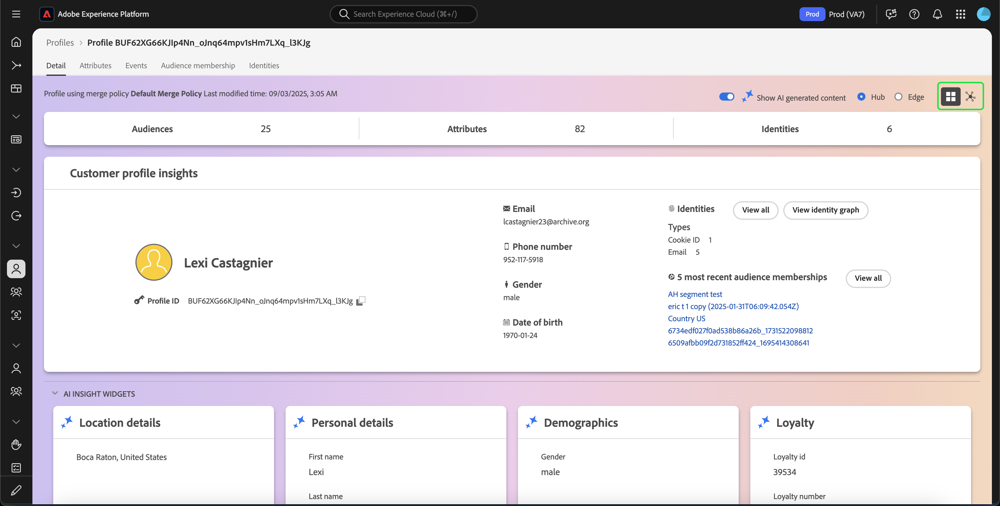
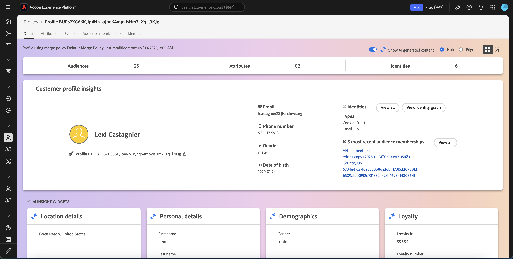

# Handbuch für die [!DNL Real-Time Customer Profile]-Benutzeroberfläche

[!DNL Real-Time Customer Profile] erstellt eine ganzheitliche Sicht auf Ihre einzelnen Kunden und kombiniert Daten aus verschiedenen Kanälen, einschließlich Online-, Offline-, CRM- und Drittanbieterdaten. Dieses Dokument dient als Anleitung für die Interaktion mit [!DNL Real-Time Customer Profile] in der Adobe Experience Platform-Benutzeroberfläche.

## Erste Schritte

Dieses Handbuch für die Benutzeroberfläche setzt ein Verständnis der verschiedenen [!DNL Experience Platform]-Services voraus, die mit der Verwaltung von [!DNL Real-Time Customer Profiles] zusammenhängen. Bevor Sie dieses Handbuch lesen oder in der Benutzeroberfläche arbeiten, lesen Sie bitte die Dokumentation für die folgenden Services:

* [[!DNL Real-Time Customer Profile] Übersicht](../home.md): Bietet ein einheitliches Echtzeit-Kundenprofil, das auf aggregierten Daten aus verschiedenen Quellen basiert.
* [[!DNL Identity Service]](../../identity-service/home.md): Aktiviert die [!DNL Real-Time Customer Profile] durch Überbrückung von Identitäten aus unterschiedlichen Datenquellen, während sie in [!DNL Experience Platform] aufgenommen werden.
* [[!DNL Experience Data Model (XDM)]](../../xdm/home.md): Das standardisierte Framework, mit dem Kundenerlebnisdaten von [!DNL Experience Platform] organisiert werden.

## [!UICONTROL Overview]

Wählen Sie in der Benutzeroberfläche von Experience Platform im linken Navigationsbereich die Option **[!UICONTROL Profiles]** aus, um die Registerkarte **[!UICONTROL Overview]** mit dem Profil-Dashboard zu öffnen.

>[!NOTE]
>
>Wenn Experience Platform neu in Ihrem Unternehmen ist und noch keine aktiven Profildatensätze oder Zusammenführungsrichtlinien erstellt hat, ist das [!UICONTROL Profiles]-Dashboard nicht sichtbar. Stattdessen werden auf der Registerkarte [!UICONTROL Overview] Links und Dokumentationen angezeigt, die Ihnen bei den ersten Schritten mit dem Echtzeit-Kundenprofil helfen können.

### Profil-Dashboard {#profile-dashboard}

Im Profil-Dashboard werden Schlüsselmetriken im Zusammenhang mit den Profildaten Ihres Unternehmens beschrieben.

Weitere Informationen finden Sie im [Handbuch zum Profil-Dashboard](../../dashboards/guides/profiles.md).

## Registerkarte [!UICONTROL Browse]

Auf der Registerkarte **[!UICONTROL Browse]** können Sie Ihre Profile entweder in einer **-,**- oder **-** anzeigen, indem Sie den Umschalter auswählen.

Darüber hinaus können Sie Ihre Profile mithilfe einer Zusammenführungsrichtlinie durchsuchen oder mithilfe eines Identity-Namespace und -Werts nach bestimmten Profilen suchen.

### Durchsuchen nach [!UICONTROL Merge policy]

Auf der Registerkarte **[!UICONTROL Browse]** ist standardmäßig die standardmäßige Zusammenführungsrichtlinie für Ihre Organisation festgelegt. Um eine andere Zusammenführungsrichtlinie auszuwählen, wählen Sie die `X` neben dem Namen der Zusammenführungsrichtlinie aus und öffnen Sie dann das Dialogfeld **[!UICONTROL Select merge policy]** über die Auswahl.

>[!NOTE]
>
>Wenn keine Zusammenführungsrichtlinie ausgewählt ist, verwenden Sie die Auswahlschaltfläche neben dem **[!UICONTROL Merge policy]**, um das Auswahldialogfeld zu öffnen.

Um eine Zusammenführungsrichtlinie aus dem Dialogfeld **[!UICONTROL Select merge policy]** auszuwählen, wählen Sie das Optionsfeld neben dem Richtliniennamen aus und verwenden Sie dann **[!UICONTROL Select]** , um zur Registerkarte [!UICONTROL Browse] zurückzukehren. Sie können dann **[!UICONTROL View]** auswählen, um die Beispielprofile zu aktualisieren und ein Sampling der Profile mit der neuen angewendeten Zusammenführungsrichtlinie anzuzeigen.

Die angezeigten Profile stellen ein Beispiel von bis zu 20 Profilen aus dem Profilspeicher Ihres Unternehmens dar, nachdem die ausgewählte Zusammenführungsrichtlinie angewendet wurde. Die Beispielprofile für die ausgewählte Zusammenführungsrichtlinie werden aktualisiert, wenn neue Daten zum Profilspeicher Ihres Unternehmens hinzugefügt werden.

Um die Details eines der Beispielprofile anzuzeigen, wählen Sie die **[!UICONTROL Profile ID]** aus. Weitere Informationen finden Sie im Abschnitt weiter unten in diesem Handbuch [Anzeigen von Profildetails](#profile-detail).

Weitere Informationen zu Zusammenführungsrichtlinien und ihrer Rolle in Experience Platform finden Sie unter [Übersicht über Zusammenführungsrichtlinien](../merge-policies/overview.md).

### Durchsuchen nach [!UICONTROL Identity] {#browse-identity}

Auf der Registerkarte **[!UICONTROL Browse]** können Sie einen Identity-Namespace verwenden, um ein bestimmtes Profil anhand eines Identitätswerts nachzuschlagen. Zum Durchsuchen nach einer Identität müssen Sie eine Zusammenführungsrichtlinie, einen Identity-Namespace und einen Identitätswert angeben.

Verwenden Sie bei Bedarf die **[!UICONTROL Merge policy]**, um das Dialogfeld &quot;**[!UICONTROL Select merge policy]**&quot; zu öffnen, und wählen Sie die Zusammenführungsrichtlinie aus, die Sie verwenden möchten.

Verwenden Sie dann die **[!UICONTROL Identity namespace]**, um das Dialogfeld **[!UICONTROL Select identity namespace]** zu öffnen, und wählen Sie den Namespace aus, nach dem Sie suchen möchten. Wenn Ihr Unternehmen über viele Namespaces verfügt, können Sie über die Suchleiste im Dialogfeld mit der Eingabe des Namens eines Namespace beginnen.

Sie können einen Namespace auswählen, um zusätzliche Details anzuzeigen, oder das Optionsfeld auswählen, um einen Namespace auszuwählen. Sie können dann **[!UICONTROL Select]** verwenden, um fortzufahren.

Nachdem Sie einen [!UICONTROL Identity namespace] ausgewählt und zur Registerkarte [!UICONTROL Browse] zurückgekehrt sind, können Sie einen **[!UICONTROL Identity value]** eingeben, der sich auf den von Ihnen ausgewählten Namespace bezieht.

>[!NOTE]
>
>Dieser Wert ist spezifisch für ein einzelnes Kundenprofil und muss ein gültiger Eintrag für den bereitgestellten Namespace sein. Wenn Sie beispielsweise den Identity-Namespace „E-Mail“ auswählen, ist ein Identitätswert in Form einer gültigen E-Mail-Adresse erforderlich.

Nachdem Sie einen Wert eingegeben haben, wählen Sie **[!UICONTROL View]** aus und ein einzelnes Profil, das dem Wert entspricht, wird zurückgegeben. Wählen Sie die **[!UICONTROL Profile ID]** aus, um ein Profil anzuzeigen.

## Profil anzeigen {#view-profile}

>[!CONTEXTUALHELP]
>id="platform_errors_uplib_201001_404"
>title="Entität nicht gefunden"
>abstract="Das bedeutet, dass die angeforderte Entität von Experience Platform nicht gefunden wurde. Versuchen Sie eine der folgenden Lösungen, um diesen Fehler zu beheben:<ul><li>Stellen Sie sicher, dass die richtige Profilkennung in der URL der Entität aufgeführt ist, auf die Sie zugreifen möchten.</li><li>Stellen Sie sicher, dass Sie über die richtige Kombination aus Organisation und Sandbox für die Entität verfügen, auf die Sie zugreifen möchten.</li></ul>"

Nach Auswahl eines **[!UICONTROL Profile ID]** wird die Registerkarte **[!UICONTROL Detail]** geöffnet. Die auf der Registerkarte **[!UICONTROL Detail]** angezeigten Profilinformationen wurden aus mehreren Profilfragmenten zusammengeführt, um eine zentrale Ansicht des jeweiligen Kunden zu erstellen. Dazu gehören Kundendetails wie grundlegende Attribute, verknüpfte Identitäten und Kanalvoreinstellungen.

Darüber hinaus können Sie weitere Details zu Profilen anzeigen, z. B. [Attribute](#attributes), [Ereignisse](#events) und [Zielgruppenzugehörigkeit](#audience-membership).

### Registerkarte „Details“ {#profile-detail}

Die Registerkarte **[!UICONTROL Details]** enthält detailliertere Informationen zum ausgewählten Profil und ist in vier Abschnitte unterteilt: Kundenprofil-Insights, KI-insight-Widgets, anpassbare Widgets und automatisch klassifizierte Widgets.

Darüber hinaus können Sie ein- oder ausschalten, ob die KI-generierten Einblicke angezeigt werden, die Details für den Hub im Vergleich zu den Edge anzeigen und die Details in der Diagrammansicht anzeigen.

#### Kundenprofil-Erkenntnisse {#customer-profile-insights}

Im Abschnitt **[!UICONTROL Customer profile insights]** wird eine kurze Einführung in die Attribute des Profils angezeigt. Dazu gehören die Profil-ID, die E-Mail-Adresse, die Telefonnummer, das Geschlecht, das Geburtsdatum sowie die Identitäten und Zielgruppenzugehörigkeiten des Profils.

#### Widgets für KI-Erkenntnisse {#ai-insight-widgets}

[!BADGE Alpha]{type=Informative} Diese Funktion befindet sich derzeit in Alpha.

Im Abschnitt **[!UICONTROL AI insight widgets]** werden Widgets angezeigt, die von KI generiert werden. Diese Widgets bieten schnelle Einblicke in das Profil, basierend auf den Profildaten, einschließlich Demografie (wie Alter, Geschlecht oder Standort), Benutzerverhalten (wie Kaufverlauf, Website-Aktivität oder Social-Media-Interaktion) sowie Psychografie (wie Interessen, Vorlieben oder Lifestyle-Entscheidungen). Alle KI-Widgets verwenden Daten, **bereits** Profil vorhanden sind.

#### Anpassbare Widgets {#customizable-widgets}

Im **[!UICONTROL Customizable widgets]** Abschnitt werden Widgets angezeigt, die Sie an Ihre Geschäftsanforderungen anpassen können. Sie können Attribute in separaten Widgets gruppieren, unerwünschte Widgets entfernen oder das Layout der Widgets anpassen.

Die Standardfelder können auch auf Organisationsebene geändert werden, um die bevorzugten Profilattribute anzuzeigen. Weitere Informationen zum Anpassen dieser Felder, einschließlich schrittweiser Anweisungen zum Hinzufügen und Entfernen von Attributen und zum Ändern der Größe von Dashboard-Bedienfeldern, finden Sie im [Handbuch zur Anpassung von Profildetails](profile-customization.md).

Sie können auch zwischen der Anzeige der Attributnamen als Anzeigenamen und der Feldpfadnamen umschalten. Um zwischen diesen beiden Anzeigen zu wechseln, wählen Sie den Umschalter **[!UICONTROL Show display names]** aus.

#### Automatisch klassifizierte Widgets {#auto-classified-widgets}

[!BADGE Alpha]{type=Informative} Diese Funktion befindet sich derzeit in Alpha.

Im Abschnitt **[!UICONTROL Auto-classified widgets]** werden Widgets angezeigt, die das Vereinigungsschema nutzen, um die Quellfeldgruppen zu bestimmen, zu denen ein Attribut gehört, und einen klareren Kontext bereitstellen, woher die Daten stammen. Sie können die Suchleiste verwenden, um in Ihren Widgets leichter nach Keywords zu suchen.

Diese Widgets kombinieren sowohl Ereignisdaten (mit dem Widget Erlebnisereignisse) als auch Attributdaten, sodass Sie eine einheitliche Ansicht Ihres Profils haben. Sie können diese Widgets verwenden, um die Struktur der Daten Ihres Profils zu untersuchen und Ihre [anpassbaren Widgets“ ](#customizable-widgets) strukturieren.

>[!NOTE]
>
>Wenn mehrere Quellfeldgruppen vorhanden sind, verwenden die Widgets nur **eine** verfügbaren Optionen.

### Registerkarte „Attribute“ {#attributes}

Die Registerkarte **[!UICONTROL Attributes]** enthält eine Listenansicht, in der alle Attribute zusammengefasst sind, die sich auf ein einzelnes Profil beziehen, nachdem die angegebene Zusammenführungsrichtlinie angewendet wurde.

Diese Attribute können auch als JSON-Objekt angezeigt werden, indem Sie auf **[!UICONTROL View JSON]** klicken. Dies ist hilfreich für alle Benutzenden, die besser verstehen möchten, wie die Profilattribute in Experience Platform aufgenommen werden.

Um die in der Edge verfügbaren Attribute anzuzeigen, klicken Sie in der Datenspeicherort-Auswahl auf **[!UICONTROL Edge]** .

Weitere Informationen zu Edge-Profilen finden Sie in der [Dokumentation zu Edge-Profilen](../edge-profiles.md).

### Registerkarte „Ereignisse“ {#events}

Die Registerkarte **[!UICONTROL Events]** enthält Daten aus den 100 neuesten ExperienceEvents, die mit dem Kunden verknüpft sind. Diese Daten können E-Mail-Öffnungen, Warenkorbaktivitäten und Seitenansichten umfassen. Die Auswahl von **[!UICONTROL View all]** für ein einzelnes Ereignis bietet zusätzliche Felder und Werte, die als Teil des Ereignisses erfasst werden.

Ereignisse können auch als JSON-Objekt angezeigt werden, indem Sie auf **[!UICONTROL View JSON]** klicken. Dies ist hilfreich, um zu verstehen, wie Ereignisse in Experience Platform erfasst werden.

### Registerkarte „Zielgruppenzugehörigkeit“ {#audience-membership}

Auf der Registerkarte **[!UICONTROL Audience membership]** wird eine Liste mit dem Namen und der Beschreibung der Zielgruppen angezeigt, zu denen das einzelne Kundenprofil derzeit gehört. Diese Liste wird automatisch aktualisiert, wenn das Profil für Zielgruppen geeignet ist oder von diesen abläuft. Die Gesamtzahl der Zielgruppen, für die das Profil derzeit qualifiziert ist, wird auf der rechten Seite der Registerkarte angezeigt.

Weitere Informationen zur Segmentierung in Experience Platform finden Sie in der Dokumentation [Adobe Experience Platform Segmentation Service](../../segmentation/home.md).

Um die Zielgruppenzugehörigkeit der Profile anzuzeigen, die in der Edge verfügbar sind, wählen Sie **[!UICONTROL Edge]** in der Datenspeicherort-Auswahl aus. Weitere Informationen zur Edge-Segmentierung finden Sie im [Handbuch zur Edge-Segmentierung](../../segmentation/methods/edge-segmentation.md).

## Zusammenführungsrichtlinien

Wählen Sie im **[!UICONTROL Profiles]** Hauptmenü die Registerkarte **[!UICONTROL Merge Policies]** , um eine Liste der Zusammenführungsrichtlinien anzuzeigen, die zu Ihrer Organisation gehören. Jede aufgelistete Richtlinie zeigt ihren Namen an, unabhängig davon, ob es sich um die standardmäßige Zusammenführungsrichtlinie handelt oder nicht, und die Schemaklasse, für die sie gilt.

Weiterführende Informationen zu Zusammenführungsrichtlinien finden Sie unter [Zusammenführungsrichtlinien – Übersicht](../merge-policies/overview.md).

## Vereinigungsschema {#union-schema}

Wählen Sie im **[!UICONTROL Profiles]** Hauptmenü die Registerkarte **[!UICONTROL Union Schema]** aus, um verfügbare Vereinigungsschemata für Ihre aufgenommenen Daten anzuzeigen. Ein Vereinigungsschema ist eine Zusammenführung aller [!DNL Experience Data Model] (XDM)-Felder unter derselben Klasse, deren Schemata für die Verwendung in [!DNL Real-Time Customer Profile] aktiviert wurden.

Weitere Informationen zu Vereinigungsschemata finden Sie im [Handbuch zur Vereinigungsschema-Benutzeroberfläche](union-schema.md).

## Berechnete Attribute {#computed-attributes}

Wählen Sie im **[!UICONTROL Profiles]** Hauptmenü die Registerkarte **[!UICONTROL Computed attributes]** , um eine Liste der berechneten Attribute anzuzeigen, die zu Ihrer Organisation gehören.

Weitere Informationen zu berechneten Attributen finden Sie unter [Berechnete Attribute - Übersicht](../computed-attributes/overview.md). Weitere Informationen zur Verwendung berechneter Attribute in der Experience Platform-Benutzeroberfläche finden Sie im [Handbuch zur Benutzeroberfläche für berechnete Attribute](../computed-attributes/ui.md).

## Nächste Schritte

Durch das Lesen dieses Handbuchs wissen Sie, wie Sie die Profildaten Ihres Unternehmens mithilfe der Experience Platform-Benutzeroberfläche anzeigen und verwalten können. Informationen zum Arbeiten mit Profildaten mithilfe von Experience Platform-APIs finden Sie im [Handbuch zur Echtzeit-Kundenprofil-API](../api/overview.md).
