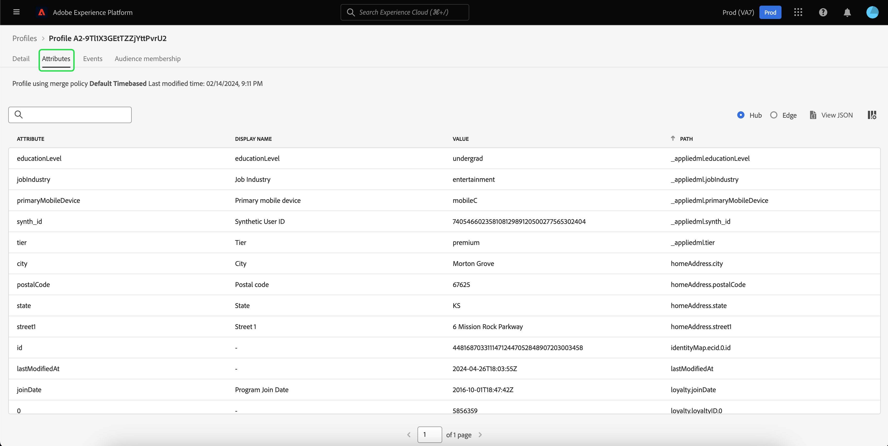

# Handbuch für die [!DNL Real-time Customer Profile]-Benutzeroberfläche

[!DNL Real-time Customer Profile] erstellt eine ganzheitliche Ansicht Ihrer einzelnen Kunden, wobei Daten aus mehreren Kanälen, einschließlich Online-, Offline-, CRM- und Drittanbieter-Daten, kombiniert werden. Dieses Dokument dient als Leitfaden für die Interaktion mit [!DNL Real-time Customer Profile] Daten in der Adobe Experience Platform-Benutzeroberfläche.

## Erste Schritte

Dieses UI-Handbuch setzt ein Verständnis der verschiedenen [!DNL Experience Platform] Verwaltungsdienste [!DNL Real-time Customer Profiles]. Bevor Sie dieses Handbuch lesen oder in der Benutzeroberfläche arbeiten, lesen Sie bitte die Dokumentation für die folgenden Dienste:

* [[!DNL Real-time Customer Profile] Übersicht](../home.md): Bietet ein einheitliches Echtzeit-Kundenprofil, das auf aggregierten Daten aus mehreren Quellen basiert.
* [[!DNL Identity Service]](../../identity-service/home.md): Aktiviert [!DNL Real-time Customer Profile] durch Überbrückung von Identitäten aus unterschiedlichen Datenquellen bei der Erfassung in [!DNL Platform].
* [[!DNL Experience Data Model (XDM)]](../../xdm/home.md): Das standardisierte Framework, mit dem Kundenerlebnisdaten von [!DNL Platform] organisiert werden.

## [!UICONTROL Übersicht]

Wählen Sie in der Benutzeroberfläche &quot;Experience Platform&quot;die Option **[!UICONTROL Profile]** im linken Navigationsbereich, um die **[!UICONTROL Übersicht]** Registerkarte mit dem Profil-Dashboard.

>[!NOTE]
>
>Wenn Ihr Unternehmen neu bei Platform ist und noch keine aktiven Profildatensätze oder Zusammenführungsrichtlinien erstellt wurden, wird die [!UICONTROL Profile] Das Dashboard ist nicht sichtbar. Stattdessen werden auf der Registerkarte [!UICONTROL Übersicht] Links und Dokumentationen angezeigt, um Ihnen bei den ersten Schritten mit dem Echtzeit-Kundenprofil zu helfen.

### Profil-Dashboard {#profile-dashboard}

Im Profil-Dashboard werden Schlüsselmetriken im Zusammenhang mit den Profildaten Ihres Unternehmens beschrieben.

Weitere Informationen finden Sie unter [Profil-Dashboard-Handbuch](../../dashboards/guides/profiles.md).

## [!UICONTROL Durchsuchen] Registerkartenmetriken

Wählen Sie die **[!UICONTROL Durchsuchen]** um mehrere Metriken anzuzeigen, die mit den Profildaten Ihres Unternehmens verbunden sind. Sie können diese Registerkarte auch verwenden, um den Profilspeicher mithilfe einer Zusammenführungsrichtlinie oder einer Identität zu durchsuchen, wie im nächsten Abschnitt dieses Handbuchs beschrieben.

Auf der rechten Seite des **[!UICONTROL Durchsuchen]** Registerkarte ist [Profilanzahl](#profile-count) sowie eine Auflistung von [Profile nach Namespace](#profiles-by-namespace).

>[!NOTE]
>
>Diese Profilmetriken können von den Metriken abweichen, die auf der [Profil-Dashboard](#profile-dashboard) weil sie mit der standardmäßigen Zusammenführungsrichtlinie Ihres Unternehmens ausgewertet werden. Weitere Informationen zum Arbeiten mit Zusammenführungsrichtlinien, einschließlich der Definition einer standardmäßigen Zusammenführungsrichtlinie, finden Sie unter [Übersicht über Zusammenführungsrichtlinien](../merge-policies/overview.md).

Zusätzlich zu diesen Metriken bietet dieser Abschnitt ein Datum und eine Uhrzeit der letzten Aktualisierung, die zeigen, wann die Metriken zuletzt ausgewertet wurden.

### Anzahl der Profile {#profile-count}

Die Anzahl der Profile zeigt die Gesamtanzahl der Profile an, über die Ihre Organisation in Experience Platform verfügt, nachdem die standardmäßige Zusammenführungsrichtlinie Ihrer Organisation Profilfragmente zusammengeführt hat, um für jeden Kunden ein einzelnes Profil zu erstellen. Mit anderen Worten: Ihre Organisation hat möglicherweise verschiedene Profilfragmente, die sich auf einen einzelnen Kunden beziehen, der mit Ihrer Marke über unterschiedliche Kanäle interagiert. Diese Fragmente würden jedoch zusammengeführt (gemäß der standardmäßigen Zusammenführungsrichtlinie) und eine Anzahl von „1“ zurückgeben, da sie alle mit derselben Person verbunden sind.

Die Profilanzahl umfasst auch Profile mit Attributen (Datensatzdaten) sowie Profile, die nur Zeitreihendaten (Ereignisdaten) enthalten, z. B. Adobe Analytics-Profile. Die Profilanzahl wird regelmäßig aktualisiert, um eine aktuelle Gesamtanzahl von Profilen in Platform bereitzustellen.

#### Profilzählungsmetrik aktualisieren

Wenn die Aufnahme von Datensätzen in die [!DNL Profile] Store erhöht oder verringert die Anzahl um mehr als 5 %. Ein Auftrag wird ausgelöst, um die Anzahl zu aktualisieren. Für Streaming-Daten-Workflows wird stündlich geprüft, ob der Schwellenwert für eine Zu- oder Abnahme um 5 % erreicht wurde. Ist dies der Fall, wird automatisch ein Auftrag ausgelöst, um die Profilanzahl zu aktualisieren. Bei der Batch-Erfassung wird innerhalb von 15 Minuten nach erfolgreicher Aufnahme eines Batches in den Profilspeicher ein Auftrag ausgeführt, um die Profilanzahl zu aktualisieren, wenn der Schwellenwert für die Erhöhung oder Verringerung um 5 % erreicht ist.

### [!UICONTROL Profile nach Namespace] {#profiles-by-namespace}

Die **[!UICONTROL Profile nach Namespace]** zeigt die Gesamtanzahl und Aufschlüsselung der Namespaces für alle zusammengeführten Profile in Ihrem Profilspeicher an. Die Gesamtzahl der Profile nach Namespace (d. h. das Addieren der für jeden Namespace angezeigten Werte) ist immer höher als die Metrik für die Profilanzahl, da einem Profil mehrere Namespaces zugeordnet sein können. Wenn beispielsweise ein Kunde mit Ihrer Marke auf mehr als einem Kanal interagiert, werden diesem einzelnen Kunden mehrere Namespaces zugeordnet.

#### Aktualisieren der [!UICONTROL Profile nach Namespace] Metrik

Ähnlich wie bei [Profilanzahl](#profile-count) Metrik, wenn die Aufnahme von Datensätzen in die [!DNL Profile] Store erhöht oder verringert die Anzahl um mehr als 5 %. Ein Auftrag wird ausgelöst, um die Namespace-Metriken zu aktualisieren. Für Streaming-Daten-Workflows wird stündlich geprüft, ob der Schwellenwert für eine Zu- oder Abnahme um 5 % erreicht wurde. Ist dies der Fall, wird automatisch ein Auftrag ausgelöst, um die Profilanzahl zu aktualisieren. Für die Batch-Erfassung innerhalb von 15 Minuten nach erfolgreicher Aufnahme eines Batches in die [!DNL Profile] speichern, wird ein Auftrag zur Aktualisierung der Metriken ausgeführt, wenn der Schwellenwert für die Erhöhung oder Verringerung um 5 % erreicht wird.

## Verwendung [!UICONTROL Durchsuchen] Registerkarte zum Anzeigen von Profilen

Im **[!UICONTROL Durchsuchen]** -Tab können Sie Beispielprofile mithilfe einer Zusammenführungsrichtlinie anzeigen oder mithilfe eines Identitäts-Namespace und -Werts nach bestimmten Profilen suchen.

### Durchsuchen nach [!UICONTROL Zusammenführungsrichtlinie]

Die **[!UICONTROL Durchsuchen]** ist standardmäßig auf die standardmäßige Zusammenführungsrichtlinie für Ihre Organisation festgelegt. Um eine andere Zusammenführungsrichtlinie auszuwählen, wählen Sie die `X` neben dem Namen der Zusammenführungsrichtlinie und verwenden Sie dann die Auswahl, um die **[!UICONTROL Zusammenführungsrichtlinie auswählen]** angezeigt.

>[!NOTE]
>
>Wenn keine Zusammenführungsrichtlinie ausgewählt ist, verwenden Sie die Auswahlschaltfläche neben dem **[!UICONTROL Zusammenführungsrichtlinie]** -Feld, um das Auswahldialogfeld zu öffnen.

So wählen Sie eine Zusammenführungsrichtlinie aus der **[!UICONTROL Zusammenführungsrichtlinie auswählen]** wählen Sie das Optionsfeld neben dem Richtliniennamen aus und verwenden Sie dann **[!UICONTROL Auswählen]** , um zur [!UICONTROL Durchsuchen] Registerkarte. Sie können dann **[!UICONTROL Ansicht]** , um die Beispielprofile zu aktualisieren und eine Auswahl von Profilen mit der neuen Zusammenführungsrichtlinie anzuzeigen.

Die angezeigten Profile stellen ein Beispiel von bis zu 20 Profilen aus dem Profilspeicher Ihres Unternehmens dar, nachdem die ausgewählte Zusammenführungsrichtlinie angewendet wurde. Die Beispielprofile für die ausgewählte Zusammenführungsrichtlinie werden aktualisiert, wenn dem Profilspeicher Ihres Unternehmens neue Daten hinzugefügt werden.

Um die Details eines der Beispielprofile anzuzeigen, wählen Sie die **[!UICONTROL Profil-ID]**. Weitere Informationen finden Sie im Abschnitt weiter unten in diesem Handbuch unter [Anzeigen von Profildetails](#profile-detail).

Weitere Informationen zu Zusammenführungsrichtlinien und ihrer Rolle in Platform finden Sie unter [Übersicht über Zusammenführungsrichtlinien](../merge-policies/overview.md).

### Durchsuchen nach [!UICONTROL Identität] {#browse-identity}

Im **[!UICONTROL Durchsuchen]** -Registerkarte verwenden, können Sie einen Identitäts-Namespace verwenden, um ein bestimmtes Profil nach einem Identitätswert zu suchen. Für das Durchsuchen nach einer Identität müssen Sie eine Zusammenführungsrichtlinie, einen Identitäts-Namespace und einen Identitätswert angeben.

Verwenden Sie bei Bedarf die **[!UICONTROL Zusammenführungsrichtlinie]** Auswahl zum Öffnen **[!UICONTROL Zusammenführungsrichtlinie auswählen]** und wählen Sie die Zusammenführungsrichtlinie aus, die Sie verwenden möchten.

Verwenden Sie dann die **[!UICONTROL Identitäts-Namespace]** Auswahl zum Öffnen **[!UICONTROL Identitäts-Namespace auswählen]** und wählen Sie den Namespace aus, nach dem Sie suchen möchten. Wenn Ihr Unternehmen über viele Namespaces verfügt, können Sie über die Suchleiste im Dialogfeld mit der Eingabe des Namens eines Namespace beginnen.

Sie können einen Namespace auswählen, um weitere Details anzuzeigen, oder das Optionsfeld auswählen, um einen Namespace auszuwählen. Sie können dann **[!UICONTROL Auswählen]** , um fortzufahren.

Nach Auswahl einer [!UICONTROL Identitäts-Namespace] und zurück zum [!UICONTROL Durchsuchen] Registerkarte können Sie eine **[!UICONTROL Identitätswert]** sich auf den ausgewählten Namespace beziehen.

>[!NOTE]
>
>Dieser Wert ist spezifisch für ein einzelnes Kundenprofil und muss ein gültiger Eintrag für den angegebenen Namespace sein. Beispielsweise würde die Auswahl des Identitäts-Namespace &quot;E-Mail&quot;einen Identitätswert in Form einer gültigen E-Mail-Adresse erfordern.

Nachdem ein Wert eingegeben wurde, wählen Sie **[!UICONTROL Ansicht]** und ein einzelnes Profil, das dem Wert entspricht, zurückgegeben wird. Wählen Sie die **[!UICONTROL Profil-ID]** um die Profildetails anzuzeigen.

## Profildetails anzeigen {#profile-detail}

Nach Auswahl einer **[!UICONTROL Profil-ID]**, die **[!UICONTROL Detail]** -Registerkarte geöffnet. Die Profilinformationen werden auf der Seite **[!UICONTROL Detail]** wurde aus mehreren Profilfragmenten zusammengeführt, um eine Ansicht des einzelnen Kunden zu bilden. Dazu gehören Kundendetails wie grundlegende Attribute, verknüpfte Identitäten und Kanalpräferenzen.

Die angezeigten Standardfelder können auch auf Organisationsebene geändert werden, um die bevorzugten Profilattribute anzuzeigen. Weitere Informationen zum Anpassen dieser Felder, einschließlich einer schrittweisen Anleitung zum Hinzufügen und Entfernen von Attributen und zum Ändern der Größe von Dashboard-Bedienfeldern, finden Sie in der [Handbuch zur Profildetailanpassung](profile-customization.md).

Sie können zusätzliche Informationen zum individuellen Kundenprofil anzeigen, indem Sie auf eine andere der verfügbaren Registerkarten klicken. Diese Registerkarten umfassen Attribute, Ereignisse und die Registerkarte Segmentmitgliedschaft , auf der die Segmente angezeigt werden, für die das Profil derzeit qualifiziert ist.

### Registerkarte „Attribute“

Die **[!UICONTROL Attribute]** bietet eine Listenansicht, die alle Attribute zusammenfasst, die sich auf ein einzelnes Profil beziehen, nachdem die angegebene Zusammenführungsrichtlinie angewendet wurde.

Diese Attribute können auch als JSON-Objekt angezeigt werden, indem Sie **[!UICONTROL JSON anzeigen]**. Dies ist hilfreich für alle Benutzer, die besser verstehen möchten, wie die Profilattribute in Platform erfasst werden.

### Registerkarte „Ereignisse“

Die **[!UICONTROL Veranstaltungen]** tab enthält Daten aus den 100 neuesten ExperienceEvents, die mit dem Kunden verknüpft sind. Diese Daten können E-Mail-Öffnungen, Warenkorbaktivitäten und Seitenansichten umfassen. Auswählen **[!UICONTROL Alle anzeigen]** für jedes einzelne Ereignis stellt zusätzliche Felder und Werte bereit, die als Teil des Ereignisses erfasst werden.

Ereignisse können auch als JSON-Objekt angezeigt werden, indem Sie **[!UICONTROL JSON anzeigen]**. Dies ist hilfreich, um zu verstehen, wie Ereignisse in Platform erfasst werden.

### Registerkarte Segmentmitgliedschaft

Die **[!UICONTROL Segmentmitgliedschaft]** zeigt eine Liste mit dem Namen und der Beschreibung der Segmente an, zu denen das individuelle Kundenprofil derzeit gehört. Diese Liste wird automatisch aktualisiert, wenn das Profil für Segmente qualifiziert ist oder aus diesen abläuft. Die Gesamtanzahl der Segmente, für die das Profil derzeit qualifiziert ist, wird auf der rechten Seite des Tabs angezeigt.

Weitere Informationen zur Segmentierung in Experience Platform finden Sie im Abschnitt [Dokumentation zu Adobe Experience Platform Segmentation Service](../../segmentation/home.md).

## Zusammenführungsrichtlinien

Aus der Hauptrolle **[!UICONTROL Profile]** auswählen, wählen Sie die **[!UICONTROL Zusammenführungsrichtlinien]** um eine Liste mit Zusammenführungsrichtlinien anzuzeigen, die zu Ihrer Organisation gehören. Jede aufgelistete Richtlinie zeigt ihren Namen an, unabhängig davon, ob es sich um die standardmäßige Zusammenführungsrichtlinie handelt oder nicht, sowie die Schemaklasse, für die sie gilt.

Weiterführende Informationen zu Zusammenführungsrichtlinien finden Sie unter [Zusammenführungsrichtlinien – Übersicht](../merge-policies/overview.md).

## Vereinigungsschema {#union-schema}

Aus der Hauptrolle **[!UICONTROL Profile]** auswählen, wählen Sie die **[!UICONTROL Vereinigungsschema]** , um verfügbare Vereinigungsschemas für die erfassten Daten anzuzeigen. Ein Vereinigungsschema ist eine Zusammenfassung aller [!DNL Experience Data Model] (XDM)-Felder unter derselben Klasse, deren Schemas für die Verwendung in aktiviert wurden [!DNL Real-time Customer Profile].

Weitere Informationen zu Vereinigungsschemas finden Sie im [UI-Handbuch für Vereinigungsschema](union-schema.md).

## Nächste Schritte

Durch Lesen dieses Handbuchs wissen Sie, wie Sie die Profildaten Ihres Unternehmens mithilfe der Experience Platform-Benutzeroberfläche anzeigen und verwalten können. Informationen zum Arbeiten mit Profildaten mithilfe von Experience Platform-APIs finden Sie im Abschnitt [Handbuch zur Echtzeit-Kundenprofil-API](../api/overview.md).
