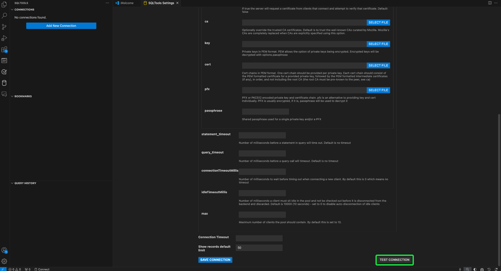
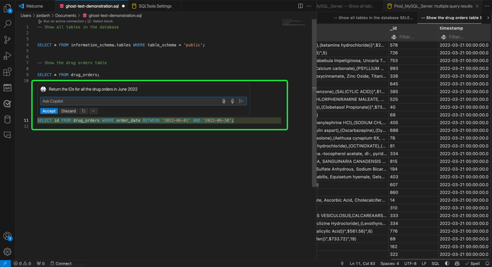

# Verbinden von [!DNL GitHub Copilot] und [!DNL Visual Studio Code] mit dem Abfrage-Service

>[!IMPORTANT]
>
>Bevor Sie dieses integrierte Tool verwenden, müssen Sie wissen, welche Daten für GitHub freigegeben werden. Freigegebene Daten enthalten kontextuelle Informationen über den Code und die Dateien, die bearbeitet werden („Eingabeaufforderungen„), sowie Details zu Benutzeraktionen („Benutzerinteraktionsdaten„).  Bitte lesen Sie die Datenschutzerklärung von [[!DNL GitHub Copilot]](https://docs.github.com/en/site-policy/privacy-policies/github-general-privacy-statement#github-privacy-statement) um mehr über die von ihnen erfassten Daten zu erfahren. Sie müssen auch die Auswirkungen auf die Sicherheit berücksichtigen, die sich aus der Einbeziehung von Drittanbieterdiensten ergeben, da Sie für die Einhaltung der Data Governance-Richtlinien Ihrer Organisation verantwortlich sind. Adobe übernimmt keine Verantwortung für datenbezogene Probleme oder Probleme, die sich aus der Verwendung dieses Tools ergeben können. Weitere Informationen finden Sie in der GitHub-Dokumentation .

[!DNL GitHub Copilot], unterstützt durch OpenAI Codex, ist ein KI-gesteuertes Tool, das Ihr Programmiererlebnis verbessert, indem es Codeausschnitte und ganze Funktionen direkt in Ihrem Editor vorschlägt. Durch die Integration mit [!DNL Visual Studio Code] ([!DNL VS Code]) können [!DNL Copilot] Ihren Workflow erheblich beschleunigen, insbesondere bei der Arbeit mit komplexen Abfragen. In diesem Handbuch erfahren Sie, wie Sie [!DNL GitHub Copilot] und [!DNL VS Code] mit dem Abfrage-Service verbinden, um Ihre Abfragen effizienter zu schreiben und zu verwalten. Weitere Informationen zu [!DNL Copilot] finden Sie auf [GitHub-Produktseite Copilot](https://github.com/pricing) und in der [offiziellen [!DNL Copilot] Dokumentation](https://docs.github.com/en/copilot/about-github-copilot/what-is-github-copilot).

In diesem Dokument werden die Schritte beschrieben, die zum Verbinden von [!DNL GitHub Copilot] und [!DNL VS Code] mit dem Abfrage-Service von Adobe Experience Platform erforderlich sind.

## Erste Schritte {#get-started}

Für dieses Handbuch müssen Sie bereits Zugriff auf ein GitHub-Konto haben und sich für [!DNL GitHub Copilot] angemeldet haben. Sie können [sich über die GitHub-Website anmelden](https://github.com/github-copilot/signup). Sie benötigen auch [!DNL VS Code]. Sie können [Download [!DNL VS Code]  von ihrer offiziellen Website](https://code.visualstudio.com/download).

Nachdem Sie [!DNL VS Code] installiert und Ihr [!DNL Copilot]-Abonnement aktiviert haben, rufen Sie Ihre Verbindungsberechtigungen für Experience Platform ab. Diese Anmeldeinformationen befinden sich auf der Registerkarte [!UICONTROL Credentials] des Arbeitsbereichs [!UICONTROL Queries] in der Benutzeroberfläche von Experience Platform. Lesen Sie das Handbuch zu Anmeldeinformationen, um zu erfahren[ wie Sie diese Werte in der Experience Platform-Benutzeroberfläche finden](../ui/credentials.md). Wenden Sie sich an den Admin Ihrer Organisation, wenn Sie derzeit keinen Zugriff auf den [!UICONTROL Queries]-Arbeitsbereich haben.

### Erforderliche [!DNL Visual Studio Code] {#required-extensions}

Die folgenden [!DNL Visual Studio Code] sind erforderlich, um Ihre Experience Platform SQL-Datenbanken direkt im Code-Editor effektiv zu verwalten und abzufragen. Laden Sie diese Erweiterungen herunter und installieren Sie sie.

- [SQLTools](https://marketplace.visualstudio.com/items?itemName=mtxr.sqltools): Verwenden Sie die Erweiterung „SQLTools“, um mehrere SQL-Datenbanken zu verwalten und abzufragen. Es enthält Funktionen wie einen Abfrage-Runner, SQL-Formatierer und Verbindungs-Explorer mit Unterstützung für zusätzliche Treiber, um die Entwicklerproduktivität zu steigern. Weitere Einzelheiten finden Sie in der Übersicht zu Visual Studio Marketplace .
- [SQLTools PostgreSQL/Cockroach Driver](https://marketplace.visualstudio.com/items?itemName=mtxr.sqltools-driver-pg): Mit dieser Erweiterung können Sie PostgreSQL- und CockroachDB-Datenbanken direkt in Ihrem Code-Editor verbinden, abfragen und verwalten.

Die nächsten Erweiterungen ermöglichen [!DNL GitHub Copilot] und seine Chat-Funktionen.

- [[!DNL GitHub Copilot]](https://marketplace.visualstudio.com/items?itemName=GitHub.copilot): Bietet Vorschläge für die Inline-Codierung während der Eingabe.
- [[!DNL GitHub Copilot] Chat](https://marketplace.visualstudio.com/items?itemName=GitHub.copilot-chat): Eine begleitende Erweiterung, die Unterstützung durch konversationelle KI bietet.

## Erstellen einer Verbindung {#create-connection}

Wählen Sie das Zylindersymbol () in der linken Navigation von [!DNL VS Code], gefolgt von **[!DNL Add New Connection]** oder dem Zylinder-Plus-Symbol ().

Der **[!DNL Connection Assistant]** wird angezeigt. Wählen Sie den **[!DNL PostgreSQL]** Datenbanktreiber aus.

![Die SQLTools-Einstellungsseite in [!DNL VS Code] mit hervorgehobener Option „PostgreSQl“.](../images/clients/github-copilot/postgres-database-driver.png)

### Einstellungen der Eingangsverbindung {#input-connection-settings}

Die [!DNL Connection Settings] wird angezeigt. Geben Sie Ihre Experience Platform-Anmeldedaten in die entsprechenden Felder der [!DNL Connection Assistant] SQLTools ein. Die erforderlichen Werte werden in der folgenden Tabelle erläutert.

| Eigenschaft | Beschreibung |
| --- |--- |
| [!DNL Connection name] | Geben Sie eine &quot;[!DNL Connection name]&quot; wie `Prod_MySQL_Server` an, die beschreibend ist und ihren Zweck klar angibt (z. B. eine Produktionsumgebung für einen MySQL-Server). Zu den Best Practices gehören: <ul><li>Befolgen Sie die Namenskonventionen Ihrer Organisation, um sicherzustellen, dass sie innerhalb des Systems eindeutig sind.</li><li>Halten Sie sie kurz, um Klarheit zu schaffen und Verwechslungen mit anderen Verbindungen zu vermeiden.</li><li>Fügen Sie relevante Details zur Funktion oder Umgebung der Verbindung in den Namen ein.</li></ul> |
| [!DNL Connect using] | Verwenden Sie die Option **[!DNL Server and Port]** , um die Serveradresse (Host-Name) und die Portnummer anzugeben, um eine Direktverbindung zu Experience Platform herzustellen |
| [!DNL Server address] | Geben Sie den **[!UICONTROL Host]** ein, der in Ihren Experience Platform Postgres-Anmeldeinformationen angegeben ist, z. B. `acmeprod.platform-query.adobe.io`. |
| [!DNL Port] | Dieser Wert wird normalerweise für Experience Platform-Services `80`. |
| [!DNL Database] | Geben Sie den **[!UICONTROL Database]** ein, der in Ihren Experience Platform Postgres-Anmeldeinformationen angegeben ist, z. B. `prod:all`. |
| [!DNL Username] | Diese Eigenschaft verweist auf Ihre Organisations-ID. Geben Sie den **[!UICONTROL Username]** Wert ein, der in Ihren Experience Platform Postgres-Anmeldedaten angegeben ist. |
| [!DNL Password] | Diese Eigenschaft ist Ihr Zugriffstoken. Geben Sie den **[!UICONTROL Password]** Wert ein, der in Ihren Experience Platform Postgres-Anmeldedaten angegeben ist. |

Wählen Sie als Nächstes **[!DNL Use Password]** und dann **[!DNL Save as plaintext in settings]** aus dem angezeigten Dropdown-Menü aus. Das Feld [!DNL Password] wird angezeigt. Verwenden Sie dieses Texteingabefeld, um Ihr Zugriffs-Token einzugeben.

Um SSL zu aktivieren, wählen Sie abschließend das [!DNL SSL] Eingabefeld aus und wählen Sie [!DNL Enabled] aus dem angezeigten Dropdown-Menü aus.

>[!TIP]
>
>Nachdem Sie alle Ihre Anmeldedaten eingegeben haben, können Sie Ihre Verbindung testen, bevor Sie sie speichern. Scrollen Sie nach unten zum unteren Rand des Arbeitsbereichs und wählen Sie **[!DNL Test Connection]** aus.
>
>{width="100" zoomable="yes"}

Nachdem Sie Ihre Verbindungsdetails korrekt eingegeben haben, wählen Sie **[!DNL Save Connection]** aus, um Ihre Einstellungen zu bestätigen.

Die [!DNL Review connection details] Ansicht wird angezeigt und zeigt Ihre -Verbindungsdaten an. Wenn Sie sicher sind, dass Ihre Verbindungsdetails korrekt sind, wählen Sie **[!DNL Connect Now]** aus.

Ihr [!DNL VS Code] Arbeitsbereich wird mit einem Vorschlag aus [!DNL GitHub Copilot] angezeigt.

![Eine verbundene SQL-Sitzung in [!DNL VS Code].](../images/clients/github-copilot/connected.png)

## [!DNL GitHub Copilot] Schnellanleitung

Sobald die Verbindung mit Ihrer Experience Platform-Instanz hergestellt wurde, können Sie [!DNL Copilot] als KI-Codierungs-Assistenten verwenden, damit Sie Code schneller und zuverlässiger schreiben können. In diesem Abschnitt werden die wichtigsten Funktionen und deren Verwendung beschrieben.

## Erste Schritte mit [!DNL GitHub Copilot] {#get-started-with-copilot}

Stellen Sie zunächst sicher, dass Sie die neueste Version von [!DNL VS Code] installiert haben. Eine veraltete [!DNL VS Code] kann verhindern, dass wichtige [!DNL Copilot] wie beabsichtigt funktionieren. Stellen Sie als Nächstes sicher, dass die [!DNL Enable Auto Completions] aktiviert ist. Wenn [!DNL Copilot] ordnungsgemäß ausgeführt wird, wird das **[!DNL Copilot]-Symbol** () in der Statusleiste angezeigt (wenn ein Problem auftritt, wird stattdessen das [!DNL Copilot]-Fehlersymbol angezeigt). Wählen Sie das **[!DNL Copilot]aus** um das [!DNL [!DNL GitHub Copilot] Menu] zu öffnen. Wählen Sie im **[!DNL [!DNL GitHub Copilot] Menu]** die Option **[!DNL Edit Settings]**

![Der [!DNL VS Code]-Editor mit dem angezeigten [!DNL GitHub Copilot Menu], dem [!DNL Copilot] und den hervorgehobenen Bearbeitungseinstellungen.](../images/clients/github-copilot/github-copilot-menu.png)

Scrollen Sie in den Optionen nach unten und stellen Sie sicher, dass das Kontrollkästchen für die [!DNL Enable Auto Completions] aktiviert ist.

![Das Einstellungsbedienfeld für [!DNL GitHub Copilot] mit dem Kontrollkästchen „Automatische Vervollständigung aktivieren“ wurde ausgewählt und hervorgehoben.](../images/clients/github-copilot/enable-auto-completions.png)

## Code-Vervollständigungen {#code-completions}

Nachdem Sie die [!DNL GitHub Copilot]-Erweiterung installiert und sich angemeldet haben, wird automatisch eine Funktion namens **Ghost Text** aktiviert, die Code-Vervollständigungen bei der Eingabe vorschlägt. Diese Vorschläge helfen Ihnen, Code effizienter und mit weniger Unterbrechungen zu schreiben. Sie können auch Kommentare verwenden, um die Vorschläge für den KI-Code anzuleiten. Das bedeutet, dass technisch nicht versierte Benutzer einfache Sprache in Code konvertieren können, um ihre Daten zu untersuchen.

![Die VSCode-Benutzeroberfläche mit einem hervorgehobenen Code-Vorschlag und dem hervorgehobenen [!DNL GitHub Copilot]-Symbol.](../images/clients/github-copilot/ghost-text.png)

>[!TIP]
>
>Wenn Sie die [!DNL Copilot] für eine bestimmte Datei oder Sprache deaktivieren möchten, wählen Sie das Symbol in der Statusleiste aus und deaktivieren Sie es.

### Akzeptieren vollständiger oder teilweiser Ghost-Textvorschläge {#accept-suggestions}

Wenn [!DNL GitHub Copilot] Code-Vervollständigungen vorschlägt, können Sie entweder teilweise oder vollständige Vorschläge akzeptieren. Wählen Sie **Tabulatortaste** aus, um den gesamten Vorschlag zu akzeptieren, oder halten Sie **Strg (oder Befehl in Mac)** gedrückt und drücken Sie die **Nach-rechts**, um einen Textteil zu akzeptieren. Um einen Vorschlag zurückzuweisen, drücken Sie **Esc**.

>[!TIP]
>  
>Wenn Sie keine Vorschläge erhalten, stellen Sie sicher[[!DNL Copilot]  dass in der Sprache Ihrer Datei aktiviert ](#get-started-with-copilot).

![Der [!DNL VS Code]-Editor zeigt einen schwach grauen Textvorschlag von [!DNL GitHub Copilot] als Ghost-Text neben teilweise eingegebenem Code an.](../images/clients/github-copilot/accept-partial-suggestions.png)

### Alternativvorschläge {#alternative-suggestions}

Um durch die Vorschläge mit Alternativcode zu navigieren, wählen Sie die Pfeile im Dialogfeld [!DNL Copilot] aus.

![Der [!DNL VS Code]-Editor mit dem Bedienfeld „Copilot-Alternativvorschläge“.](../images/clients/github-copilot/code-suggestions.png)

## Inline-Chat verwenden {#inline-chat}

Sie können auch direkt mit [!DNL Copilot] über Ihren Code chatten. Verwenden Sie **Strg (oder Befehl) + I**, um den Inline-Chat-Dialog zu Triggern. Diese Funktion wird verwendet, um Code zu iterieren und Vorschläge im Kontext zu verfeinern. Sie können einen Code-Block markieren und den Inline-Chat verwenden, um eine andere von der KI vorgeschlagene Lösung zu sehen, bevor Sie sie akzeptieren.

<!-- THis section is poss unnecessary:
There are inline features for chat including doc, expalin, fix and test

 -->

## Dedizierte Chat-Ansicht {#dedicated-chat}

Sie können eine herkömmlichere Chat-Oberfläche mit einer dedizierten Chat-Seitenleiste verwenden, um Ideen und Strategien zu formulieren, Programmierungsprobleme zu lösen und Implementierungsdetails zu besprechen. Wählen Sie das Chat-Symbol () in der [!DNL VS Code] Seitenleiste, um ein eigenes Chatfenster zu öffnen.

![Die [!DNL GitHub Copilot] Seitenleiste des Chats mit hervorgehobenem Chatsymbol.](../images/clients/github-copilot/chat-sidebar.png)

Sie können auch auf den Chatverlauf zugreifen, indem Sie das Verlaufssymbol () oben im Chat-Panel.

## Nächste Schritte

Sie können jetzt Ihre Experience Platform-Datenbanken effizient direkt über Ihren Code-Editor abfragen und die KI-basierten Code-Vorschläge von [!DNL GitHub Copilot] verwenden, um das Schreiben und Optimieren von SQL-Abfragen zu optimieren. Weiterführende Informationen zum Schreiben und Ausführen von Abfragen finden Sie in der [Anleitung zur Ausführung von Abfragen](../best-practices/writing-queries.md).
