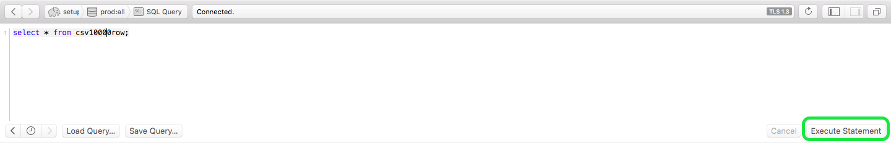

# Verbinden [!DNL Postico] zu Query Service (Mac)

In diesem Dokument werden die Schritte zum Verbinden von [!DNL Postico] mit Adobe Experience Platform [!DNL Query Service].

>[!NOTE]
>
> In diesem Handbuch wird davon ausgegangen, dass Sie bereits Zugriff auf [!DNL Postico] und sind mit dem Navigieren in der Benutzeroberfläche vertraut. Weitere Informationen [!DNL Postico] finden Sie im Abschnitt [offiziell [!DNL Postico] Dokumentation](https://eggerapps.at/postico/docs).
> 
> Zusätzlich [!DNL Postico] is **only** auf macOS-Geräten verfügbar.

Verbindung herstellen [!DNL Postico] zu Query Service, öffnen Sie [!DNL Postico] und wählen Sie **[!DNL New Favorite]**.

![Die [!DNL Postico] Benutzeroberfläche mit hervorgehobenem neuen Favoriten.](../images/clients/postico/open-postico.png)

Sie können jetzt Werte eingeben, um eine Verbindung mit Adobe Experience Platform herzustellen.

Weitere Informationen zum Auffinden Ihres Datenbanknamens, Hosts, Ports und Ihrer Anmeldedaten finden Sie in der [Handbuch zu Anmeldeinformationen](../ui/credentials.md). Um Ihre Anmeldeinformationen zu finden, melden Sie sich bei [!DNL Platform], wählen Sie **[!UICONTROL Abfragen]**, gefolgt von **[!UICONTROL Anmeldeinformationen]**.

Nachdem Sie Ihre Anmeldedaten eingefügt haben, wählen Sie **[!DNL Connect]** , um eine Verbindung mit Query Service herzustellen.

Nach der Verbindung mit Platform können Sie eine Liste aller zuvor mit Query Service vorgenommenen Relationen anzeigen.

![Eine Liste der Verbindungen im [!DNL Postico] Benutzeroberfläche.](../images/clients/postico/show-queries.png)

## SQL-Anweisungen erstellen

Um eine neue SQL-Abfrage zu erstellen, wählen Sie &quot;SQL-Abfrage&quot;aus und öffnen Sie sie.

![Die [!DNL Postico] Benutzeroberfläche mit hervorgehobenem SQL-Abfragebefehl.](../images/clients/postico/create-query.png)

Es wird ein Feld angezeigt, in das Sie die auszuführende Abfrage eingeben können. Wenn Sie fertig sind, wählen Sie **[!DNL Execute Statement]** , um die Abfrage auszuführen.

Es wird eine Tabelle mit den Ergebnissen Ihrer abgeschlossenen Abfrage-Ausführung angezeigt.

## Nächste Schritte

Jetzt, da Sie mit [!DNL Query Service]können Sie [!DNL Postico] , um Abfragen zu schreiben. Weitere Informationen dazu, wie Sie Abfragen formulieren und ausführen, finden Sie im Handbuch zum Thema [Ausführen von Abfragen](../best-practices/writing-queries.md).
