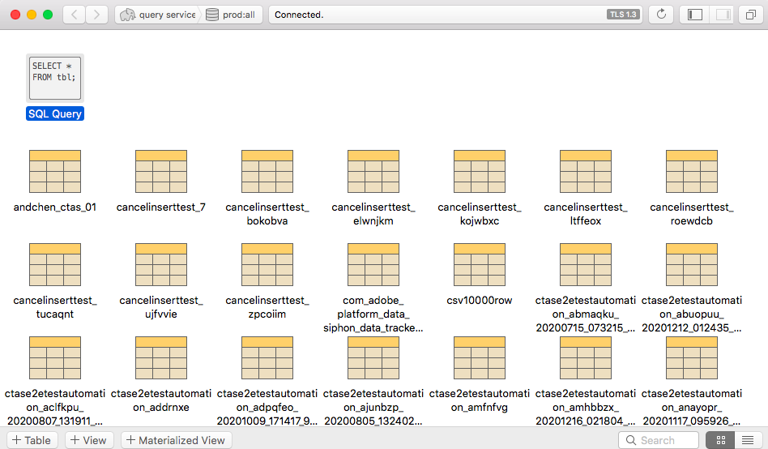

# Verbinden von [!DNL Postico] mit Query Service (Mac)

In diesem Dokument werden die Schritte zum Verbinden von [!DNL Postico] mit Adobe Experience Platform [!DNL Query Service] beschrieben.

>[!NOTE]
>
> In diesem Handbuch wird davon ausgegangen, dass Sie bereits Zugriff auf [!DNL Postico] haben und mit der Navigation in der Benutzeroberfläche vertraut sind. Weitere Informationen zu [!DNL Postico] finden Sie in der [offiziellen [!DNL Postico] Dokumentation](https://eggerapps.at/postico/docs).
> 
> Außerdem ist [!DNL Postico] **nur** auf macOS-Geräten verfügbar.

Um [!DNL Postico] mit Query Service zu verbinden, öffnen Sie [!DNL Postico] und wählen Sie **[!DNL New Favorite]** aus.

Sie können jetzt Werte eingeben, um eine Verbindung mit Adobe Experience Platform herzustellen.

Weitere Informationen zum Auffinden Ihrer Datenbanknamen, Host-, Port- und Anmeldedaten finden Sie im Handbuch [Anmeldeinformationen](../ui/credentials.md). Um Ihre Anmeldeinformationen zu finden, melden Sie sich bei [!DNL Platform] an, wählen Sie **[!UICONTROL Abfragen]**, gefolgt von **[!UICONTROL Anmeldeinformationen]**.

Nachdem Sie Ihre Anmeldedaten eingefügt haben, wählen Sie **[!DNL Connect]** aus, um eine Verbindung mit Query Service herzustellen.

Nach der Verbindung mit Platform können Sie eine Liste aller zuvor mit Query Service vorgenommenen Relationen anzeigen.

## SQL-Anweisungen erstellen

Um eine neue SQL-Abfrage zu erstellen, wählen Sie &quot;SQL-Abfrage&quot;aus und öffnen Sie sie.

Es wird ein Feld angezeigt, in das Sie die auszuführende Abfrage eingeben können. Wenn Sie fertig sind, wählen Sie **[!DNL Execute Statement]** aus, um die Abfrage auszuführen.

Es wird eine Tabelle mit den Ergebnissen Ihrer abgeschlossenen Abfrage-Ausführung angezeigt.

## Nächste Schritte

Nachdem Sie sich mit [!DNL Query Service] angemeldet haben, können Sie [!DNL Postico] verwenden, um Abfragen zu schreiben. Weitere Informationen dazu, wie Sie Abfragen formulieren und ausführen, finden Sie im Handbuch zum Thema [Ausführen von Abfragen](../best-practices/writing-queries.md).
