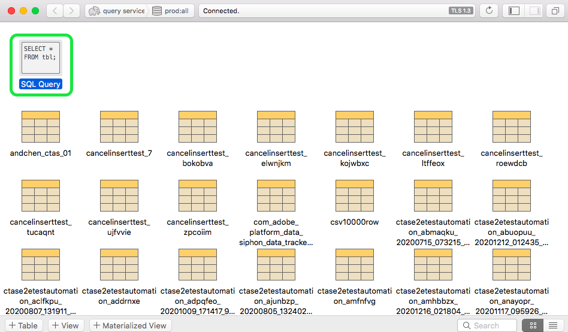

# Verbinden von [!DNL Postico] mit Abfrage Service (Mac)

Dieses Dokument beschreibt die Schritte zum Verbinden von [!DNL Postico] mit Adobe Experience Platform [!DNL Query Service].

>[!NOTE]
>
> Dieses Handbuch setzt voraus, dass Sie bereits Zugriff auf [!DNL Postico] haben und mit der Navigation in der Oberfläche vertraut sind. Weitere Informationen zu [!DNL Postico] finden Sie in der [offiziellen  [!DNL Postico] Dokumentation](https://eggerapps.at/postico/docs).
> 
> Außerdem ist [!DNL Postico] nur **auf macOS-Geräten verfügbar.**

Um [!DNL Postico] mit Abfrage Service zu verbinden, öffnen Sie [!DNL Postico] und wählen Sie **[!DNL New Favorite]**.

Sie können jetzt Werte eingeben, um eine Verbindung mit Adobe Experience Platform herzustellen.

 Weiterführende Informationen zum Finden Ihres Datenbanknamens, Hosts, Ports und Ihrer Anmeldedaten finden Sie auf der Seite [Anmeldedaten in Platform](https://platform.adobe.com/query/configuration). Melden Sie sich zur Suche nach Ihren Anmeldeinformationen bei [!DNL Platform] an, wählen Sie **[!UICONTROL Abfragen]** und anschließend **[!UICONTROL Anmeldeinformationen]**.

Nachdem Sie Ihre Anmeldeinformationen eingefügt haben, wählen Sie **[!DNL Connect]**, um eine Verbindung mit dem Abfrage Service herzustellen.

Nach der Verbindung mit Platform können Sie eine Liste aller Beziehungen sehen, die zuvor mit Abfrage Service hergestellt wurden.

## SQL-Anweisungen erstellen

Um eine neue SQL-Abfrage zu erstellen, wählen Sie &quot;SQL-Abfrage&quot; und öffnen Sie sie.

Es wird ein Feld angezeigt, in das Sie die auszuführende Abfrage eingeben können. Wenn Sie fertig sind, wählen Sie **[!DNL Execute Statement]** aus, um die Abfrage auszuführen.

Eine Tabelle mit den Ergebnissen der Ausführung der abgeschlossenen Abfrage wird angezeigt.

## Nächste Schritte

Nachdem Sie eine Verbindung mit [!DNL Query Service] hergestellt haben, können Sie [!DNL Postico] verwenden, um Abfragen zu schreiben. Weitere Informationen dazu, wie Sie Abfragen formulieren und ausführen, finden Sie im Handbuch zum Thema [Ausführen von Abfragen](../best-practices/writing-queries.md).
