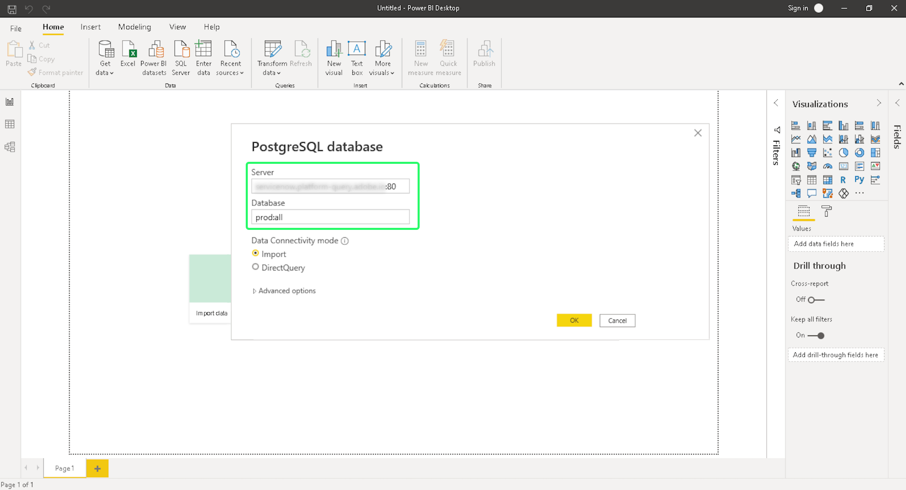
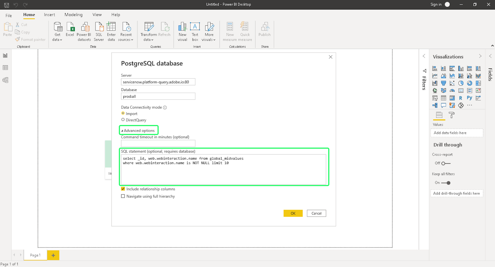

# Power BI zu Query Service verbinden

In diesem Dokument werden die Schritte zum Verbinden von Power BI Desktop mit Adobe Experience Platform Query Service beschrieben.

## Erste Schritte

Für dieses Handbuch benötigen Sie bereits Zugriff auf das Power BI-Desktop-Programm und sind mit der Navigation in der Benutzeroberfläche vertraut. Wenn Sie Power BI Desktop herunterladen möchten, finden Sie weitere Informationen unter [Offizielle Power BI-Dokumentation](https://docs.microsoft.com/de-de/power-bi/).

>[!IMPORTANT]
>
> Das Power BI-Desktop-Programm ist **only** auf Windows-Geräten verfügbar.

Um die erforderlichen Anmeldeinformationen zum Verbinden von Power BI mit Experience Platform zu erhalten, benötigen Sie Zugriff auf den Arbeitsbereich Abfragen in der Platform-Benutzeroberfläche. Wenden Sie sich an Ihren IMS-Organisationsadministrator, wenn Sie derzeit keinen Zugriff auf den Arbeitsbereich &quot;Abfragen&quot;haben.

Nach der Installation von Power BI müssen Sie installieren `Npgsql`, ein .NET-Treiberpaket für PostgreSQL. Weitere Informationen zu Npgsql finden Sie im [Npgsql-Dokumentation](https://www.npgsql.org/doc/index.html).

>[!IMPORTANT]
>
>Sie müssen Version 4.0.10 oder niedriger herunterladen, da neuere Versionen zu Fehlern führen.

Unter &quot;[!DNL Npgsql GAC Installation]&quot;Wählen Sie im Bildschirm für die benutzerdefinierte Einrichtung die Option **[!DNL Will be installed on local hard drive]**.

Um sicherzustellen, dass Npgsql ordnungsgemäß installiert wurde, starten Sie den Computer neu, bevor Sie mit den nächsten Schritten fortfahren.

## Power BI zu Query Service verbinden {#connect-power-bi}

Um Power BI mit Query Service zu verbinden, öffnen Sie den Power BI und wählen Sie **[!DNL Get Data]** im oberen Menüband.

Geben Sie &quot;PostgreSQL&quot;in die Suchleiste ein, um die Liste der Datenquellen einzuschränken. Wählen Sie unter den angezeigten Ergebnissen die Option **[!DNL PostgreSQL database]**, gefolgt von **[!DNL Connect]**.

Das Datenbankdialogfeld PostgreSQl wird angezeigt und fordert Werte für Ihren Server und Ihre Datenbank an. Diese Werte werden aus Ihren Adobe Experience Platform-Anmeldedaten übernommen. Um Ihre Anmeldeinformationen zu finden, melden Sie sich bei der Platform-Benutzeroberfläche an und wählen Sie **[!UICONTROL Abfragen]** aus der linken Navigation, gefolgt von **[!UICONTROL Anmeldeinformationen]**. Weitere Informationen zum Auffinden Ihres Datenbanknamens, Hosts, Ports und Ihrer Anmeldedaten finden Sie in der [Handbuch zu Anmeldeinformationen](../ui/credentials.md).

Für **[!DNL Server]** Geben Sie in Power BI den Wert für den Host im Abschnitt Query Service-Anmeldedaten ein. Für die Produktion fügen Sie Port hinzu `:80` an das Ende der Host-Zeichenfolge. Beispiel: `made-up.platform-query.adobe.io:80`.

Die **[!DNL Database]** -Feld kann entweder &quot;all&quot;oder ein Datensatz-Tabellenname sein. Beispiel: `prod:all`.

>[!IMPORTANT]
>
>Verschachtelte Datenstrukturen in BI-Tools von Drittanbietern können reduziert werden, um ihre Benutzerfreundlichkeit zu verbessern und den erforderlichen Arbeitsaufwand zum Abrufen, Analysieren, Transformieren und Berichten von Daten zu reduzieren. Weitere Informationen finden Sie in der Dokumentation unter[`FLATTEN` Funktion](../best-practices/flatten-nested-data.md) Anweisungen zum Aktivieren dieser Einstellung beim Herstellen einer Verbindung zu einer Datenbank.

### Data Connectivity-Modus

Als Nächstes können Sie Ihre **[!DNL Data Connectivity mode]**. Auswählen **[!DNL Import]** gefolgt von **[!DNL OK]** , um eine Liste aller verfügbaren Tabellen anzuzeigen, oder wählen Sie **[!DNL DirectQuery]** die Datenquelle direkt abfragen, ohne Daten direkt in den Power BI zu importieren oder zu kopieren.

Weitere Informationen finden Sie unter **[!DNL Import]** -Modus, lesen Sie bitte den Abschnitt unter [Tabellen importieren](#import). Weitere Informationen finden Sie unter **[!DNL DirectQuery]** -Modus, lesen Sie bitte den Abschnitt unter [Datensatz ohne Datenimport abfragen](#direct-query).

Auswählen **[!DNL OK]** nach Bestätigung Ihrer Datenbankdetails.

### Authentifizierung

Eine Eingabeaufforderung mit der Aufforderung, Ihren Benutzernamen, Ihr Kennwort und Ihre Anwendungseinstellungen anzufordern, wird angezeigt. Der Benutzername in diesem Fall ist Ihre Organisations-ID und das Kennwort Ihr Authentifizierungstoken. Beide finden Sie auf der Seite mit den Anmeldedaten für Query Service .

Füllen Sie diese Details aus und wählen Sie dann **[!DNL Connect]** , um mit dem nächsten Schritt fortzufahren.

## Importieren einer Tabelle {#import}

Durch Auswahl der **[!DNL Import]** [!DNL Data Connectivity mode], wird der vollständige Datensatz importiert, sodass Sie die ausgewählten Tabellen und Spalten im Power BI-Desktop-Programm unverändert verwenden können.

>[!IMPORTANT]
>
>Um Datenänderungen zu sehen, die seit dem ersten Import aufgetreten sind, müssen Sie die Daten im Power BI aktualisieren, indem Sie den vollständigen Datensatz erneut importieren.

Um eine Tabelle zu importieren, geben Sie die Server- und Datenbankdetails ein [wie oben beschrieben](#connect-power-bi) und wählen Sie die **[!DNL Import]** [!DNL Data Connectivity mode], gefolgt von **[!DNL OK]**. Ein Dialogfeld mit einer Liste aller verfügbaren Tabellen wird angezeigt. Wählen Sie die Tabelle aus, deren Vorschau Sie anzeigen möchten, gefolgt von **[!DNL Load]** , um den Datensatz in den Power BI zu bringen.

Der Tisch ist jetzt in den Power BI importiert.

### Importieren von Tabellen mit benutzerdefiniertem SQL

Power BI- und andere Drittanbieter-Tools wie Tableau ermöglichen es Benutzern derzeit nicht, verschachtelte Objekte wie XDM-Objekte in Platform zu importieren. Um dies zu berücksichtigen, können Sie mit Power BI mithilfe von benutzerdefiniertem SQL auf diese verschachtelten Felder zugreifen und eine reduzierte Ansicht der Daten erstellen. Power BI lädt dann diese reduzierte Ansicht der zuvor verschachtelten Daten als normale Tabelle.

Wählen Sie im Popover PostgreSQL-Datenbank die Option **[!DNL Advanced options]** , um eine benutzerdefinierte SQL-Abfrage in die **[!DNL SQL statement]** Abschnitt. Diese benutzerdefinierte Abfrage sollte verwendet werden, um Ihre JSON-Name-Wert-Paare in ein Tabellenformat zu reduzieren.

Nachdem Sie Ihre benutzerdefinierte Abfrage eingegeben haben, wählen Sie **[!DNL OK]** , um mit der Verbindung Ihrer Datenbank fortzufahren. Siehe [Authentifizierung](#authentication) weiter oben für Anleitungen zum Verbinden einer Datenbank aus diesem Teil des Workflows.

Nach Abschluss der Authentifizierung wird im Power BI Desktop-Dashboard eine Vorschau der reduzierten Daten als Tabelle angezeigt. Der Server- und Datenbankname werden oben im Dialogfeld aufgeführt. Auswählen **[!DNL Load]** , um den Importvorgang abzuschließen.

Die Visualisierungen können jetzt über das Power BI Desktop-Programm bearbeitet und exportiert werden.

## Datensatz ohne Datenimport abfragen {#direct-query}

Die **[!DNL DirectQuery]** [!DNL Data Connectivity mode] fragt die Datenquelle direkt ab, ohne Daten in den Power BI Desktop zu importieren oder zu kopieren. Mit diesem Verbindungsmodus können Sie alle Visualisierungen mit aktuellen Daten über die Benutzeroberfläche aktualisieren. Die zum Erstellen oder Aktualisieren der Visualisierung erforderliche Zeit hängt jedoch von der Leistung der zugrunde liegenden Datenquelle ab.

So verwenden Sie [!DNL Data Connectivity mode], wählen Sie die **[!DNL DirectQuery]** umschalten **[!DNL Advanced options]** , um eine benutzerdefinierte SQL-Abfrage in die **[!DNL SQL statement]** Abschnitt. Stellen Sie sicher, dass **[!DNL Include relationship columns]** ausgewählt ist. Nachdem Sie die Abfrage abgeschlossen haben, wählen Sie **[!DNL OK]** , um fortzufahren.

Eine Vorschau Ihrer Abfrage wird angezeigt. Auswählen **[!DNL Load]** um die Ergebnisse der Abfrage anzuzeigen.

## Nächste Schritte

Durch Lesen dieses Dokuments sollten Sie jetzt verstehen, wie Sie eine Verbindung zum Power BI Desktop-Programm und den verschiedenen verfügbaren Datenverbindungsmodi herstellen. Weitere Informationen zum Schreiben und Ausführen von Abfragen finden Sie im Abschnitt [Anleitung zur Ausführung von Abfragen](../best-practices/writing-queries.md).
