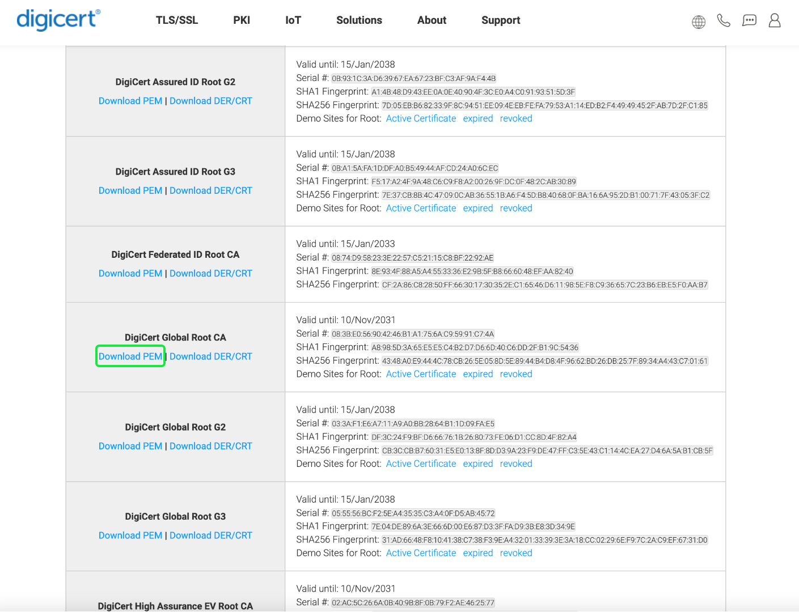

# [!DNL Query Service] SSL-Optionen

Für mehr Sicherheit bietet Adobe Experience Platform [!DNL Query Service] bietet native Unterstützung für SSL-Verbindungen zum Verschlüsseln der Client-/Server-Kommunikation. In diesem Dokument werden die verfügbaren SSL-Optionen für Client-Verbindungen von Drittanbietern beschrieben, mit denen [!DNL Query Service] und wie eine Verbindung mit der `verify-full` SSL-Parameterwert.

## Voraussetzungen

In diesem Dokument wird davon ausgegangen, dass Sie bereits eine Desktop-Client-Anwendung eines Drittanbieters zur Verwendung mit Ihren Platform-Daten heruntergeladen haben. Spezifische Anweisungen zur Integration von SSL-Sicherheit bei der Verbindung mit einem Drittanbieter-Client finden Sie in der entsprechenden Dokumentation zum Verbindungshandbuch. Für eine Liste aller [!DNL Query Service] unterstützte Clients finden Sie unter [Übersicht über Client-Verbindungen](./overview.md).

## Verfügbare SSL-Optionen {#available-ssl-options}

Platform unterstützt verschiedene SSL-Optionen, um Ihren Datensicherheitsanforderungen gerecht zu werden und den Verarbeitungsaufwand für Verschlüsselung und Schlüsselaustausch auszugleichen.

Die verschiedenen `sslmode` Parameterwerte bieten unterschiedliche Schutzniveaus. Durch die Verschlüsselung Ihrer Daten in Bewegung mit SSL-Zertifikaten hilft es, Angriffe, Abhören und Identitätswechsel vom Typ &quot;man-in-the-Middle&quot;(MITM) zu verhindern. Die nachstehende Tabelle enthält eine Aufschlüsselung der verschiedenen verfügbaren SSL-Modi und des von ihnen gebotenen Schutzes.

>[!NOTE]
>
> Der SSL-Wert `disable` wird von Adobe Experience Platform aufgrund der erforderlichen Einhaltung des Datenschutzes nicht unterstützt.

| sslmode | Abhörschutz | MITM-Schutz | Beschreibung |
|---|---|---|---|
| `allow` | Teilweise | Nein | Sicherheit ist keine Priorität, Schnelligkeit und ein geringer Verarbeitungsaufwand sind wichtiger. Dieser Modus entscheidet sich nur dann für die Verschlüsselung, wenn der Server darauf besteht. |
| `prefer` | Teilweise | Nein | Verschlüsselung ist nicht erforderlich, die Kommunikation wird jedoch verschlüsselt, wenn der Server sie unterstützt. |
| `require` | Ja | Nein | Verschlüsselung ist bei allen Kommunikationen erforderlich. Das Netzwerk ist vertrauenswürdig, um eine Verbindung zum richtigen Server herzustellen. Die Überprüfung des SSL-Zertifikats des Servers ist nicht erforderlich. |
| `verify-ca` | Ja | Abhängig von CA-Richtlinien | Verschlüsselung ist bei allen Kommunikationen erforderlich. Vor der Datenfreigabe ist eine Servervalidierung erforderlich. Dazu müssen Sie ein Stammzertifikat in Ihrem [!DNL PostgreSQL] Basisverzeichnis. [Details finden Sie unten](#instructions) |
| `verify-full` | Ja | Ja | Verschlüsselung ist bei allen Kommunikationen erforderlich. Vor der Datenfreigabe ist eine Servervalidierung erforderlich. Dazu müssen Sie ein Stammzertifikat in Ihrem [!DNL PostgreSQL] Basisverzeichnis. [Details finden Sie unten](#instructions). |

>[!NOTE]
>
>Der Unterschied zwischen `verify-ca` und `verify-full` hängt von der Richtlinie der Stammzertifikat-Autorität (CA) ab. Wenn Sie eine eigene lokale Zertifizierungsstelle für die Ausgabe privater Zertifikate für Ihre Anwendungen erstellt haben, verwenden Sie `verify-ca` bietet oft genug Schutz. Bei Verwendung einer öffentlichen Zertifizierungsstelle, `verify-ca` ermöglicht Verbindungen zu einem Server, den jemand anders bei der CA registriert hat. `verify-full` sollte immer mit einer öffentlichen Stamm-CA verwendet werden.

Bei der Herstellung einer Drittanbieter-Verbindung zu einer Platform-Datenbank wird empfohlen, `sslmode=require` mindestens um eine sichere Verbindung für Ihre in Bewegung befindlichen Daten sicherzustellen. Die `verify-full` Der SSL-Modus wird für die Verwendung in den meisten sicherheitskritischen Umgebungen empfohlen.

## Einrichten eines Stammzertifikats für die Serverüberprüfung {#root-certificate}

>[!IMPORTANT]
>
>Die TLS/SSL-Zertifikate für Produktionsumgebungen für die Query Service Interactive Postgres API wurden am Mittwoch, 24. Januar 2024 aktualisiert. Obwohl dies eine Jahresanforderung ist, hat sich in diesem Fall auch das Stammzertifikat in der Kette geändert, da der Adobe TLS/SSL-Zertifikatanbieter seine Zertifikatshierarchie aktualisiert hat. Dies kann sich auf bestimmte Postgres-Clients auswirken, wenn in ihrer Liste der Zertifizierungsstellen das Stammzertifikat fehlt. Beispielsweise muss einem PSQL-CLI-Client möglicherweise die Root-Zertifikate zu einer expliziten Datei hinzugefügt werden. `~/postgresql/root.crt`, andernfalls kann dies zu einem Fehler führen. Beispiel: `psql: error: SSL error: certificate verify failed`. Siehe [offizielle PostgreSQL-Dokumentation](https://www.postgresql.org/docs/current/libpq-ssl.html#LIBQ-SSL-CERTIFICATES) für weitere Informationen zu diesem Thema. Das Stammzertifikat, das hinzugefügt werden soll, kann heruntergeladen werden von [https://cacerts.digicert.com/DigiCertGlobalRootG2.crt.pem](https://cacerts.digicert.com/DigiCertGlobalRootG2.crt.pem).

Um eine sichere Verbindung sicherzustellen, muss die SSL-Nutzung sowohl auf dem Client als auch auf dem Server konfiguriert werden, bevor die Verbindung hergestellt wird. Wenn die SSL-Verschlüsselung nur auf dem Server konfiguriert ist, sendet der Client möglicherweise vertrauliche Informationen wie Passwörter, bevor festgestellt wird, dass der Server hohe Sicherheit erfordert.

Standardmäßig ist [!DNL PostgreSQL] führt keine Überprüfung des Serverzertifikats durch. So überprüfen Sie die Identität des Servers und stellen sicher, dass eine sichere Verbindung besteht, bevor vertrauliche Daten gesendet werden (als Teil der SSL-Kommunikation) `verify-full` -Modus), müssen Sie ein Stammzertifikat (selbstsigniert) auf Ihrem lokalen Computer (`root.crt`) und ein Blattzertifikat, das vom Stammzertifikat auf dem Server signiert wurde.

Wenn die Variable `sslmode` -Parameter auf `verify-full`, überprüft libpq, ob der Server vertrauenswürdig ist, indem es die Zertifikatskette bis zum Stammzertifikat überprüft, das auf dem Client gespeichert ist. Anschließend wird überprüft, ob der Hostname mit dem im Serverzertifikat gespeicherten Namen übereinstimmt.

Um die Verifizierung von Serverzertifikaten zu ermöglichen, müssen Sie mindestens ein Stammzertifikat (`root.crt`) in der [!DNL PostgreSQL] in Ihrem Basisverzeichnis. Der Dateipfad ähnelt dem `~/.postgresql/root.crt`.

## Aktivieren des verifizierbaren vollständigen SSL-Modus für die Verwendung mit einem Drittanbieter [!DNL Query Service] connection {#instructions}

Wenn Sie eine strengere Sicherheitskontrolle benötigen als `sslmode=require`können Sie die hervorgehobenen Schritte ausführen, um einen Drittanbieter-Client mit [!DNL Query Service] using `verify-full` SSL-Modus.

>[!NOTE]
>
>Zum Erzielen eines SSL-Zertifikats stehen viele Optionen zur Verfügung. Aufgrund des wachsenden Trends bei Schurkenzertifikaten wird DigiCert in diesem Handbuch verwendet, da sie ein vertrauenswürdiger globaler Anbieter von TLS/SSL-, PKI-, IoT- und Signaturlösungen mit hoher Sicherheit sind.

1. Navigieren Sie zu [die Liste der verfügbaren DigiCert-Stammzertifikate](https://www.digicert.com/kb/digicert-root-certificates.htm)
1. Suchen Sie nach &quot;[!DNL DigiCert Global Root G2]&quot; aus der Liste der verfügbaren Zertifikate.
1. Auswählen [!DNL **PEM herunterladen**] , um die Datei auf Ihren lokalen Computer herunterzuladen.
   
1. Benennen Sie die Datei mit dem Sicherheitszertifikat in `root.crt`.
1. Kopieren Sie die Datei in die [!DNL PostgreSQL] Ordner. Der erforderliche Dateipfad unterscheidet sich je nach Betriebssystem. Wenn der Ordner noch nicht vorhanden ist, erstellen Sie den Ordner.
   - Wenn Sie macOS verwenden, lautet der Pfad `/Users/<username>/.postgresql`
   - Wenn Sie Windows verwenden, lautet der Pfad `%appdata%\postgresql`

>[!TIP]
>
>Suchen Sie nach `%appdata%` Dateispeicherort auf einem Windows-Betriebssystem, drücken Sie ⊞ **Win + R** und Eingabe `%appdata%` in das Suchfeld ein.

Nach dem [!DNL DigiCert Global Root G2] Die CRT-Datei ist in Ihrer [!DNL PostgreSQL] Ordner, können Sie eine Verbindung herstellen zu [!DNL Query Service] mithilfe der `sslmode=verify-full` oder `sslmode=verify-ca` -Option.

## Nächste Schritte

Durch Lesen dieses Dokuments erhalten Sie ein besseres Verständnis der verfügbaren SSL-Optionen zum Verbinden eines Drittanbieter-Clients mit [!DNL Query Service]und wie Sie die `verify-full` SSL-Option zum Verschlüsseln Ihrer bewegten Daten.

Wenn Sie dies noch nicht getan haben, folgen Sie den Anweisungen unter [einen Client eines Drittanbieters mit [!DNL Query Service]](./overview.md).
