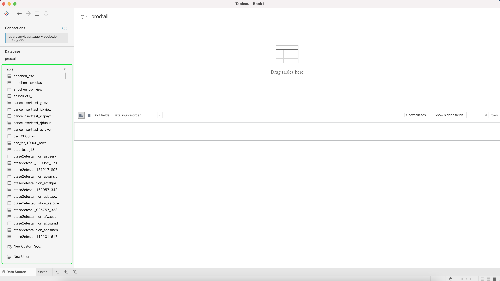

# Verbinden [!DNL Tableau] zu Query Service

In diesem Dokument werden die Schritte zum Verbinden von Tableau mit Adobe Experience Platform beschrieben [!DNL Query Service].

>[!NOTE]
>
> In diesem Handbuch wird davon ausgegangen, dass Sie bereits Zugriff auf [!DNL Tableau] und sind mit dem Navigieren in der Benutzeroberfläche vertraut. Weitere Informationen [!DNL Tableau] finden Sie im Abschnitt [offiziell [!DNL Tableau] Dokumentation](https://help.tableau.com/current/pro/desktop/en-us/default.htm).

Verbindung herstellen [!DNL Tableau] nach [!DNL Query Service], öffnen [!DNL Tableau]und im **[!DNL To a Server]** Abschnittsauswahl **[!DNL More]** gefolgt von **[!DNL PostgreSQL]**

Sie können jetzt Werte eingeben, um eine Verbindung mit Adobe Experience Platform herzustellen. Weitere Informationen zum Auffinden Ihres Datenbanknamens, Hosts, Ports und Ihrer Anmeldedaten finden Sie in der [Handbuch zu Anmeldeinformationen](../ui/credentials.md). Um Ihre Anmeldeinformationen zu finden, melden Sie sich bei [!DNL Platform], wählen Sie **[!UICONTROL Abfragen]**, gefolgt von **[!UICONTROL Anmeldeinformationen]**.

Vergewissern Sie sich, dass Sie die **[!UICONTROL SSL erforderlich]** vor dem Versuch, eine Verbindung herzustellen.

>[!IMPORTANT]
>
>Siehe [[!DNL Query Service] SSL-Dokumentation](./ssl-modes.md) Erfahren Sie mehr über die SSL-Unterstützung für Drittanbieterverbindungen zu Adobe Experience Platform Query Service und über die Verbindung mit `verify-full` SSL-Modus.

Nachdem Sie alle Ihre Anmeldedaten ausgefüllt haben, wählen Sie **[!DNL Sign In]** , um fortzufahren.

Sie haben jetzt eine Verbindung mit Adobe Experience Platform hergestellt, wobei eine Liste Ihrer Tabellen auf der Seite angezeigt wird.

## Nächste Schritte

Jetzt, da Sie mit [!DNL Query Service]können Sie [!DNL Tableau] , um Abfragen zu schreiben. Weitere Informationen zum Schreiben und Ausführen von Abfragen finden Sie im Handbuch unter [Ausführen von Abfragen](../best-practices/writing-queries.md).
