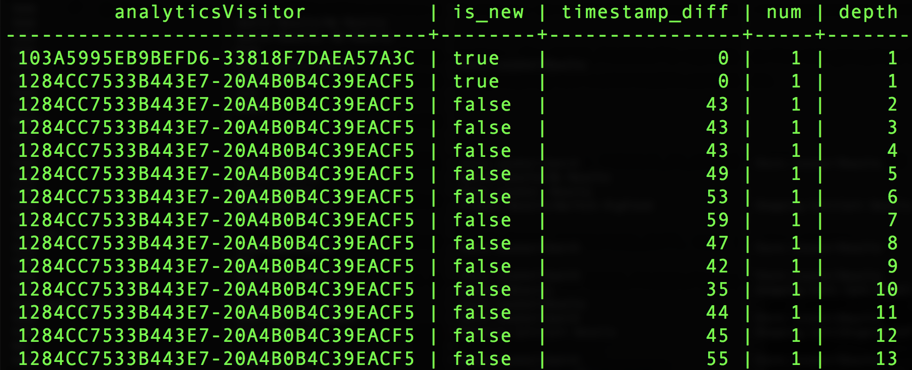
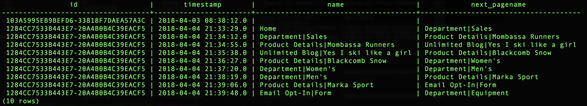

# Verwenden von von Adobe definierten Funktionen

Einer der Hauptvorteile von Adobe besteht darin, dass sie die Erlebnisdaten verstehen und wissen, was Kunden mit diesen Daten machen müssen. Mit diesem Verständnis können Sie Hilfsfunktionen aufbauen, die Ihnen die Arbeit erleichtern.

Dieses Dokument umfasst von Adobe definierte Funktionen (ADFs) zur Unterstützung von drei wichtigen Analytics-Aktivitäten:
- [Sessionierung](#sessionization)
- [Attribution](#attribution)
- [Pathing](#pathing)

## Sessionierung

Die `SESS_TIMEOUT()` Reproduktion der Besuchergruppen in Adobe Analytics. Es führt eine ähnliche zeitbasierte Gruppierung durch, jedoch mit anpassbaren Parametern.

**Syntax:**

`SESS_TIMEOUT(timestamp, timeout_in_seconds) OVER ([partition] [order] [frame])`

**Rückgabe:**

Struktur mit Feldern `(timestamp_diff, num, is_new, depth)`

### Überprüfen Sie die Zeilenebene `SESS_TIMEOUT()` und -ausgabe

```sql
SELECT analyticsVisitor,
      session.is_new,
      session.timestamp_diff,
      session.num,
      session.depth
FROM  (
        SELECT endUserIDs._experience.aaid.id as analyticsVisitor,
        SESS_TIMEOUT(timestamp, 60 * 30)
        OVER (PARTITION BY endUserIDs._experience.aaid.id
        ORDER BY timestamp
        ROWS BETWEEN UNBOUNDED PRECEDING AND CURRENT ROW)
        AS session
        FROM your_analytics_table
        WHERE _ACP_YEAR = 2018
      )
LIMIT 100;
```



### Erstellen eines neuen Trendberichts mit Besuchern, Sitzungen und Ansichten

```sql
SELECT
      date_format( from_utc_timestamp(timestamp, 'EDT') , 'yyyy-MM-dd') as Day,
      COUNT(DISTINCT analyticsVisitor ) as Visitors,
      COUNT(DISTINCT analyticsVisitor || session.num ) as Sessions,
      SUM( PageViews ) as PageViews
FROM
    (
      SELECT
          timestamp,
          endUserIDs._experience.aaid.id as analyticsVisitor,
          SESS_TIMEOUT(timestamp, 60 * 30)
      OVER (PARTITION BY endUserIDs._experience.aaid.id
      ORDER BY timestamp
      ROWS BETWEEN UNBOUNDED PRECEDING AND CURRENT ROW)
      AS session,
          web.webPageDetails.pageviews.value as PageViews
      FROM your_analytics_table
      WHERE _ACP_YEAR = 2018
    )
GROUP BY Day 
ORDER BY Day DESC 
LIMIT 31;
```


## Attribution

Bei der Zuordnung werden Metriken oder Konversionen wie Umsatz, Bestellung oder Anmeldungen Ihren Marketingbemühungen zugeordnet.

In Adobe Analytics werden die Zuordnungseinstellungen mithilfe von Variablen wie eVars konfiguriert und beim Erfassen von Daten generiert.

Die Zuordnungs-ADFs, die im Abfrage Service gefunden werden, ermöglichen es, diese Zuordnungen zur Abfrage zu definieren und zu generieren.

Dieses Beispiel konzentriert sich auf die Last Touch-Zuordnung, aber auch auf die First Touch-Zuordnung von Adobe.

>[!NOTE] Andere Optionen mit Timeouts und Ereignis-basiertem Ablauf stehen in zukünftigen Versionen von Abfrage Service zur Verfügung.

**Syntax:**

`ATTRIBUTION_LAST_TOUCH(timestamp, [channel_name], column) OVER ([partition] [order] [frame])`

**Rückgabe:**

Struktur mit Feld `(value)`

### Kennenlernen der Zuordnung auf Zeilenebene

```sql
SELECT
  endUserIds._experience.aaid.id,
  _experience.analytics.customDimensions.evars.evar10 as MemberLevel,
  ATTRIBUTION_LAST_TOUCH(timestamp, 'eVar10', _experience.analytics.customDimensions.evars.evar10)
      OVER(PARTITION BY endUserIds._experience.aaid.id
           ORDER BY timestamp
           ROWS BETWEEN UNBOUNDED PRECEDING AND CURRENT ROW).value
      AS LastMemberLevel,
  commerce.purchases.value as Orders
FROM your_analytics_table 
WHERE _ACP_YEAR=2018 AND _ACP_MONTH=4
LIMIT 50;
```


### Erstellen Sie eine Aufschlüsselung der Bestellungen nach der Ebene der letzten Mitglieder (eVar10)

```sql
SELECT
  LastMemberLevel,
  SUM(Orders) as MemberLevelOrders
FROM 
(SELECT
  ATTRIBUTION_LAST_TOUCH(timestamp, 'eVar10', _experience.analytics.customDimensions.evars.evar10)
      OVER(PARTITION BY endUserIds._experience.aaid.id
           ORDER BY timestamp
           ROWS BETWEEN UNBOUNDED PRECEDING AND CURRENT ROW).value
      AS LastMemberLevel,
  commerce.purchases.value as Orders
FROM your_analytics_table 
WHERE _ACP_YEAR=2018 AND _ACP_MONTH=4
)
GROUP BY LastMemberLevel 
ORDER BY MemberLevelOrders DESC
LIMIT 25;
```


## Pathing

Pfade helfen zu verstehen, wie Kunden durch Ihre Site navigieren. Die `NEXT()` und `PREVIOUS()` ADF ermöglichen dies.

**Syntax:**

```
NEXT(key, [shift, [ignoreNulls]]) OVER ([partition] [order] [frame])
PREVIOUS(key, [shift, [ignoreNulls]]) OVER ([partition] [order] [frame])
```

**Rückgabe:**

Struktur mit Feld `(value)`

### Wählen Sie die aktuelle Seite und die nächste Seite aus

```sql
SELECT 
      endUserIds._experience.aaid.id,
      timestamp,
      web.webPageDetails.name,
      NEXT(web.webPageDetails.name, 1, true)
          OVER(PARTITION BY endUserIds._experience.aaid.id
              ORDER BY timestamp
              ROWS BETWEEN CURRENT ROW AND UNBOUNDED FOLLOWING).value
          AS next_pagename
FROM your_analytics_table
WHERE _ACP_YEAR=2018 
LIMIT 10;
```



### Erstellen eines Unterteilungsberichts für die fünf Seitennamen am Anfang der Sitzung

```sql
  SELECT 
    PageName,
    PageName_2,
    PageName_3,
    PageName_4,
    PageName_5,
    SUM(PageViews) as PageViews
  FROM
    (SELECT
      PageName,
      NEXT(PageName, 1, true)
        OVER(PARTITION BY VisitorID, session.num
              ORDER BY timestamp
              ROWS BETWEEN CURRENT ROW AND UNBOUNDED FOLLOWING).value
        AS PageName_2,
      NEXT(PageName, 2, true)
        OVER(PARTITION BY VisitorID, session.num
              ORDER BY timestamp
              ROWS BETWEEN CURRENT ROW AND UNBOUNDED FOLLOWING).value
        AS PageName_3,
      NEXT(PageName, 3, true)
         OVER(PARTITION BY VisitorID, session.num
              ORDER BY timestamp
              ROWS BETWEEN CURRENT ROW AND UNBOUNDED FOLLOWING).value
        AS PageName_4,
      NEXT(PageName, 4, true)
         OVER(PARTITION BY VisitorID, session.num
              ORDER BY timestamp
              ROWS BETWEEN CURRENT ROW AND UNBOUNDED FOLLOWING).value
        AS PageName_5,
      PageViews,
      session.depth AS SessionPageDepth
    FROM
      (SELECT
        endUserIds._experience.aaid.id as VisitorID,
        timestamp,
        web.webPageDetails.pageviews.value AS PageViews,
        web.webPageDetails.name AS PageName,
        SESS_TIMEOUT(timestamp, 60 * 30) 
          OVER (PARTITION BY endUserIDs._experience.aaid.id 
                ORDER BY timestamp 
                ROWS BETWEEN UNBOUNDED PRECEDING AND CURRENT ROW) 
        AS session
      FROM your_analytics_table
      WHERE _ACP_YEAR=2018)
    )
  WHERE SessionPageDepth=1
  GROUP BY PageName, PageName_2, PageName_3, PageName_4, PageName_5
  ORDER BY PageViews DESC
  LIMIT 100;
```


