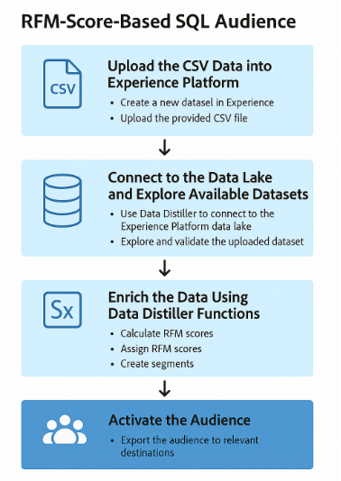
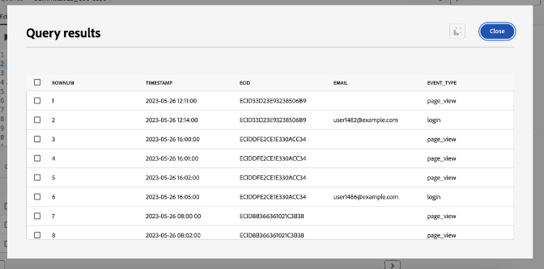
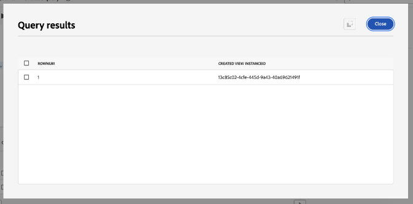
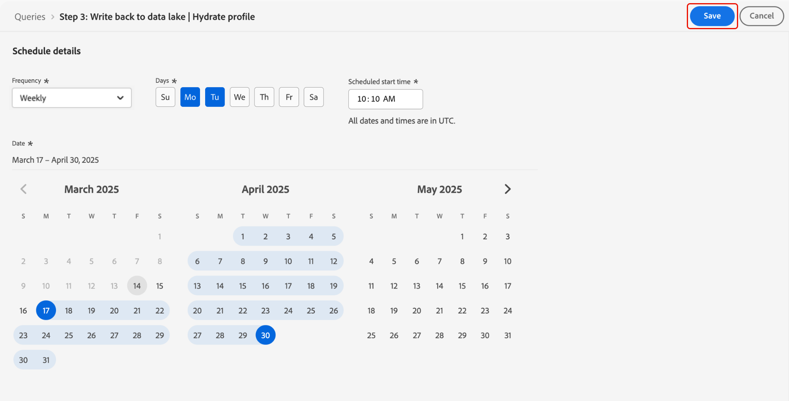

# Wichtigste Tipps zur Wertmaximierung mit Adobe Experience Platform Data Distiller - OS656

Diese Seite enthält den Beispieldatensatz, damit Sie das anwenden können, was Sie in der Adobe Summit-Sitzung „OS656 - Top-Tipps zur Wertmaximierung mit Adobe Experience Platform Data Distiller&quot; gelernt haben. Sie erfahren, wie Sie Implementierungen von Adobe Real-Time Customer Data Platform und Journey Optimizer beschleunigen können, indem Sie Echtzeit-Kundenprofildaten anreichern. Diese Anreicherung nutzt tiefe Einblicke in Kundenverhaltensmuster, um Zielgruppen für die Bereitstellung und Optimierung von Erlebnissen zu erstellen.

Mithilfe der Fallstudie zu Luma analysieren Sie die Verhaltensdaten der Benutzer und erstellen ein Modell *Neuigkeit, Häufigkeit, Währung (RFM)* eine Marketing-Analysetechnik für die Kundensegmentierung basierend auf Kaufmustern.

## Voraussetzung

Um diesen Anwendungsfall ausführen zu können, muss Ihre Adobe Experience Platform-Instanz für [Data Distiller](./overview.md) lizenziert sein. Weitere Informationen erhalten Sie vom Adobe-Support.

Außerdem müssen Sie die Mandanten **ID Ihrer Organisation kennen,** für die Ausführung von Abfragen erforderlich ist. Ihre Mandanten-ID ist der erste Teil der URL, wenn Sie sich bei Experience Platform anmelden. Sie wird unmittelbar nach dem @-Symbol angezeigt.

Beispielsweise in der folgenden URL:

```http
https://experience.adobe.com/#/@pfreportingonprod/sname:prod/platform/home
```

Die Mandanten-ID ist `pfreportingonprod`.

## Überblick über das RFM-Modell {#rfm-overview}

RFM, kurz für Recency (R), Frequency (F), and Monetary (M), ist ein datengestützter Ansatz zur Kundensegmentierung und -analyse. Diese Methode bewertet drei wichtige Aspekte des Kundenverhaltens: wie kürzlich ein Kunde einen Kauf getätigt hat, wie oft er interagiert und wie viel er ausgibt. Durch die Quantifizierung dieser Faktoren können Unternehmen verwertbare Einblicke in Kundensegmente gewinnen und zielgerichtete Marketing-Strategien entwickeln, die den individuellen Kundenbedürfnissen besser entsprechen.

## Kundenverhalten mit dem RFM-Modell verstehen {#understand-customer-behavior}

Das RFM-Modell segmentiert Kundinnen und Kunden basierend auf dem Transaktionsverhalten mithilfe von drei Schlüsselparametern.

- **Neuigkeit** misst die Zeit seit dem letzten Kauf eines Kunden und zeigt das Interaktionsniveau und das zukünftige Kaufpotenzial an.
- **Häufigkeit** verfolgt, wie oft ein Kunde interagiert, und dient als klarer Indikator für Loyalität und anhaltende Interaktion.
- **Geldwert** ermittelt die Gesamtausgaben der Kunden und verdeutlicht deren Gesamtwert für das Unternehmen.

Durch Kombination dieser Faktoren weisen Unternehmen jedem Kunden numerische Werte (in der Regel auf einer Skala von `1` bis `4`) zu. Niedrigere Werte weisen auf günstigere Ergebnisse hin. Beispielsweise wird ein `1` in allen Kategorien als einer der besten betrachtet, der die jüngste Aktivität, die hohe Interaktion und erhebliche Ausgaben zeigt.

## Vorteile und Einschränkungen des RFM-Modells {#benefits-and-limitations}

Jede Marketing-Modellierungstechnik beinhaltet Kompromisse, die sowohl Vorteile als auch Einschränkungen bieten. Die RFM-Modellierung ist ein wertvolles Tool zum Verständnis des Kundenverhaltens und zur Verfeinerung von Marketing-Strategien. Zu den Vorteilen gehört die Segmentierung von Kunden, um Messaging zu personalisieren, Umsätze zu optimieren und Reaktionsraten, Kundenbindung, Kundenzufriedenheit und den Customer Lifetime Value (CLTV) zu verbessern.

Die RFM-Modellierung hat jedoch Einschränkungen. Sie setzt Einheitlichkeit innerhalb von Segmenten auf der Grundlage von Neuigkeit, Häufigkeit und Geldwert voraus, was das Kundenverhalten übermäßig vereinfachen kann. Das Modell weist diesen Faktoren ebenfalls dieselbe Gewichtung zu, was den Kundenwert möglicherweise falsch darstellt. Darüber hinaus berücksichtigt es nicht den Kontext, z. B. produktspezifische Eigenschaften oder Kundenpräferenzen, die zu Fehlinterpretationen des Kaufverhaltens führen können.

## Erstellen einer dynamischen, auf RFM-Werten basierenden SQL-Zielgruppe {#build-a-dynamic-rfm-audience}

Die folgende Infografik bietet einen allgemeinen Überblick über den Workflow zur Erstellung von RFM-SQL-Zielgruppen, der in diesem Tutorial beschrieben wird.



Bevor Sie mit der Fallstudie zu Luma beginnen, müssen Sie einen Beispieldatensatz aufnehmen. Wählen [ zunächst den Link aus, um den `luma_web_data.zip`-Datensatz lokal herunterzuladen](../resources/luma_web_data.zip). Der Beispieldatensatz ist eine CSV-Datei im komprimierten ZIP-Format, die an den Anwendungsfall angepasst wird. Entpacken Sie diese ZIP-Datei mit Adobe Acrobat oder einem vertrauenswürdigen Dateiextraktions-Tool, z. B. dem integrierten Dienstprogramm Ihres Betriebssystems. In der Praxis würden Sie Daten normalerweise aus Adobe Analytics, Adobe Commerce oder Adobe Web/Mobile SDK beziehen.

In diesem Tutorial verwenden Sie Data Distiller, um relevante Ereignisse und Felder in ein standardisiertes CSV-Format zu extrahieren. Ziel ist es, nur wesentliche Felder einzubeziehen und gleichzeitig eine flache Datenstruktur für Effizienz und Benutzerfreundlichkeit beizubehalten.

### Schritt 1: CSV-Daten in Experience Platform hochladen {#upload-csv-data}

Führen Sie die folgenden Schritte aus, um eine CSV-Datei in Adobe Experience Platform hochzuladen.

#### Erstellen eines Datensatzes aus einer CSV-Datei {#create-a-dataset}

Wählen Sie in der Experience Platform-Benutzeroberfläche **[!UICONTROL Datensätze]** in der linken Navigationsleiste und anschließend **[!UICONTROL Datensatz erstellen]**. Wählen Sie dann **[!UICONTROL Datensatz aus CSV-Datei erstellen]** aus den verfügbaren Optionen aus.

Das [!UICONTROL Datensatz konfigurieren] wird angezeigt. Geben **[!UICONTROL im Feld]** den Datensatznamen als „luma_web_data“ ein und wählen Sie **[!UICONTROL Weiter]**.

Das [!UICONTROL Daten hinzufügen] wird angezeigt. Ziehen Sie die CSV-Datei in das Feld **[!UICONTROL Daten hinzufügen]** oder wählen Sie **[!UICONTROL Datei auswählen]** aus, um die Datei zu suchen und hochzuladen.

Weitere Informationen zu diesem Prozess finden Sie im [Tutorial zur Batch](../../ingestion/tutorials/ingest-batch-data.md)Aufnahme und im [Workflow für die Datensatzerstellung](../../catalog/datasets/user-guide.md#create) im Handbuch zur Datensatz-Benutzeroberfläche.

#### Überprüfen und Abschließen des Uploads {#review-and-complete-upload}

Nach dem Hochladen der Datei wird unten in der Benutzeroberfläche eine Datenvorschau angezeigt. Wählen Sie **[!UICONTROL Beenden]** aus, um den Upload abzuschließen.


Die Ansicht Datensatzaktivitäten für den Datensatz „luma_web_data“ wird angezeigt. Manueller Upload der CSV-Datei
wird als Batch aufgenommen und durch eine [!UICONTROL Batch-ID] gekennzeichnet. In einem Bedienfeld auf der rechten Seite wird der Tabellenname als `luma_web_data` angezeigt.

>[!TIP]
>
>Verwenden Sie beim Schreiben von Abfragen in Data Distiller den Tabellennamen anstelle des Datensatznamens. Der Datensatzname wird nur zum Durchsuchen in der Benutzeroberfläche verwendet.


<!--  
My table name is; luma_web_data_20250312_235611_817 Should we explain the suffix? 
-->

Nachdem die Verarbeitung der Daten abgeschlossen ist, wählen Sie [!UICONTROL Vorschau des Datensatzes] in der oberen rechten Ecke aus, um eine Vorschau des Datensatzes anzuzeigen. So wird die Datensatzvorschau angezeigt:


#### Überlegungen zum Schema {#schema-considerations}

Ein strukturiertes XDM-Schema (z. B. Datensatz, Ereignis oder B2B-Schemata) ist nicht erforderlich, da die Daten als CSV-Rohdatei importiert werden. Stattdessen verwendet der Datensatz ein Ad-hoc-Schema.

>[!TIP]
>
>Ad-hoc-Schemata sind XDM-Schemata mit Feldern, die einen Namespace aufweisen und nur von einem einzigen Datensatz verwendet werden können. Ad-hoc-Schemata werden in verschiedenen Datenaufnahme-Workflows in Experience Platform und zur Erstellung bestimmter Quellverbindungen verwendet.

Während Data Distiller alle Schematypen unterstützt, verwendet der endgültige Datensatz für die Aufnahme in das Echtzeit-Kundenprofil ein XDM-Datensatzschema.

### Schritt 2: Verbinden mit dem Data Lake und Erkunden verfügbarer Datensätze {#connect-to-the-data-lake-and-explore-datasets}

Der nächste Schritt besteht darin, Daten im Data Lake von Adobe Experience Platform zu untersuchen, um Genauigkeit und Integrität sicherzustellen. Die Daten müssen präzise und vollständig sein, um aussagekräftige Einblicke zu gewinnen, doch können bei Datenübertragungen Fehler, Inkonsistenzen oder fehlende Werte auftreten. Dies macht die Datenüberprüfung und -erkundung unerlässlich.

>[!TIP]
>
>Der Data Lake speichert unbearbeitete Rohdaten wie Ereignisprotokolle, Clickstream-Daten und massenweise aufgenommene Datensätze für die Analyse und Verarbeitung. Der Profilspeicher enthält kundenidentifizierbare Daten, einschließlich identitätszugehöriger Ereignisse und Attributinformationen, um die Echtzeit-Personalisierung und -Aktivierung zu unterstützen.

Verwenden Sie Data Distiller, um die Qualität und Vollständigkeit von Datensätzen durch verschiedene Vorgänge zu überprüfen. Um zu bestätigen, dass die Daten bei der Aufnahme korrekt übersetzt wurden, führen Sie `SELECT` Abfragen aus, um sie zu untersuchen, zu validieren und zu analysieren. Dieser Prozess hilft beim Identifizieren und Beheben von Diskrepanzen, Inkonsistenzen oder fehlenden Informationen.

#### Durchführen einer einfachen Explorationsabfrage {#basic-exploration-queries}

Wählen Sie in der Adobe Experience Platform-Benutzeroberfläche **[!UICONTROL Abfragen]** in der linken Navigationsleiste und anschließend **[!UICONTROL Abfrage erstellen]**. Der Abfrage-Editor wird angezeigt.

Fügen Sie die folgende Abfrage in den Editor ein und führen Sie sie aus:

```sql
SELECT * FROM luma_web_data; 
```

Die Abfrageergebnisse werden unter dem Abfrage-Editor auf der Registerkarte **[!UICONTROL Ergebnisse]** angezeigt. Um die Ergebnisse in einem neuen Dialogfeld zu erweitern, wählen Sie **[!UICONTROL Ergebnisse anzeigen]** aus. Die Ergebnisse sehen in etwa wie in der Abbildung unten aus.



Weitere Informationen finden Sie [ Dokument „Allgemeine Leitlinien ](../best-practices/writing-queries.md) die Ausführung von Abfragen“.

#### Fokus auf Bestellungen und Ausschließen stornierter Transaktionen {#focus-orders-exclude-cancelled}

Das RFM-Modell bewertet Neuigkeit, Häufigkeit und Geldwert basierend auf abgeschlossenen Käufen. Nicht-Transaktionsereignisse wie Seitenansichten und Checkout-Interaktionen sind von der Analyse ausgeschlossen. Darüber hinaus müssen stornierte Bestellungen entfernt werden, da sie nicht zu gültigen RFM-Berechnungen beitragen und einen anderen Verarbeitungsansatz erfordern.

So stellen Sie die Genauigkeit sicher:

- Identifizieren Sie Kauf-IDs, die mit Stornierungen verbunden sind, und gruppieren Sie sie mithilfe von `GROUP BY`.
- Schließen Sie diese Kauf-IDs aus dem Datensatz aus.
- Filtern Sie die Daten, um nur abgeschlossene Bestellungen beizubehalten.

Die folgenden Abfragen zeigen, wie Sie stornierte Bestellungen identifizieren und aus dem Datensatz ausschließen.

Diese erste Abfrage wählt alle Kauf-IDs ungleich null aus, die mit einer Stornierung verbunden sind, und aggregiert sie mithilfe von `GROUP BY`. Die resultierenden Kauf-IDs müssen aus dem Datensatz ausgeschlossen werden.

```sql
CREATE VIEW orders_cancelled
AS
  SELECT purchase_id
  FROM   luma_web_data
  WHERE  event_type IN ( 'order', 'cancellation' )
         AND purchase_id IS NOT NULL
  GROUP  BY purchase_id
  HAVING Count(DISTINCT event_type) = 2; 
```

Die zweite Abfrage ruft nur die Kauf-IDs ab, die nicht in diesem ausgeschlossenen Satz enthalten sind.

```sql
SELECT *
FROM   luma_web_data
WHERE  purchase_id NOT IN (SELECT purchase_id
                           FROM   orders_cancelled)
        OR purchase_id IS NULL; 
```

Die dritte Abfrage entfernt alle Ereignisse, die nicht zur Reihenfolge gehören, aus dem Datensatz.

```sql
SELECT *
FROM   luma_web_data
WHERE  event_type = 'order'
       AND purchase_id NOT IN (SELECT purchase_id
                               FROM   orders_cancelled); 
```

### Schritt 3: Anreichern der Daten mithilfe von Data Distiller-Funktionen {#enrich-the-data}

Als Nächstes verwenden Sie Data Distiller, um Kundendaten zu extrahieren und umzuwandeln, RFM-Bewertungen zu generieren, Transaktionen zu aggregieren und Kunden durch Kaufverhalten zu segmentieren. Führen Sie diese Schritte aus, um die Werte für Neuigkeit, Häufigkeit und Geldwert (RFM) zu berechnen, ein Zielgruppenmodell zu erstellen und Einblicke für die Aktivierung vorzubereiten.

#### Berechnung des RFM-Werts für jede eindeutige Benutzer-ID

Um die RFM-Bewertungen zu berechnen, extrahieren Sie mithilfe der Feldfilterung Schlüsselfelder aus den Rohdaten.

Die nächste Abfrage baut auf der Logik des vorherigen Abschnitts auf, indem E-Mail als `userid` ausgewählt wird, da jede Bestellung eine E-Mail-Anmeldung erfordert. Data Distiller wendet die `TO_DATE` an, um den Zeitstempel in ein Datumsformat zu konvertieren. Das Feld `total_revenue` stellt den Preis jeder Transaktion dar und wird später durch Addition für jede `userid` aggregiert.

```sql
SELECT email AS userid, 
       purchase_id AS purchaseid, 
       price_total AS total_revenue, -- reflects the price for each individual transaction
       TO_DATE(timestamp) AS purchase_date -- converts timestamp to date format
FROM luma_web_data 
WHERE event_type = 'order' 
      AND purchase_id NOT IN (SELECT purchase_id FROM orders_cancelled) 
      AND email IS NOT NULL;
```

Die Ergebnisse sehen wie in der Abbildung unten aus.


Als Nächstes erstellen Sie eine `TABLE`, um die Ergebnisse der vorherigen Abfrage in einem abgeleiteten Datensatz zu speichern. Kopieren Sie den folgenden Befehl und fügen Sie ihn in den Abfrage-Editor ein, um eine `TABLE` zu erstellen.

```sql
CREATE TABLE IF NOT EXISTS order_data AS
  SELECT email              AS userid,
         purchase_id        AS purchaseid,
         price_total        AS total_revenue,
         To_date(timestamp) AS purchase_date
  FROM   luma_web_data
  WHERE  event_type = 'order'
         AND purchase_id NOT IN (SELECT purchase_id FROM orders_cancelled)
         AND email IS NOT NULL; 
```

Das Ergebnis sieht dem folgenden Bild ähnlich, weist jedoch eine andere Datensatz-ID auf.


Führen Sie als Best Practice eine einfache Erkundungsabfrage aus, um die Daten im Datensatz zu überprüfen. Mit der folgenden Anweisung können Sie Ihre Daten anzeigen.

```sql
SELECT * FROM order_data;
```


#### Transaktionen aggregieren, um die RFM-Werte zu generieren {#aggregate-transactions}

Um die RFM-Werte zu berechnen, aggregiert diese Abfrage Transaktionen für jeden Benutzer.

Die `DATEDIFF(CURRENT_DATE, MAX(purchase_date)) AS days_since_last_purchase` berechnet für jede Benutzerin und jeden Benutzer die Anzahl der Tage seit dem letzten Kauf.

Verwenden Sie die folgende SQL-Abfrage:

```sql
SELECT 
    userid, 
    DATEDIFF(CURRENT_DATE, MAX(purchase_date)) AS days_since_last_purchase, 
    COUNT(purchaseid) AS orders, 
    SUM(total_revenue) AS total_revenue 
FROM order_data 
GROUP BY userid;
```

Die Ergebnisse sehen wie in der Abbildung unten aus.


Um die Abfrageeffizienz und Wiederverwendbarkeit zu verbessern, erstellen Sie ein `VIEW` zum Speichern der aggregierten RFM-Werte.

```sql
CREATE VIEW rfm_values
AS
  SELECT userid,
         DATEDIFF(current_date, MAX(purchase_date)) AS days_since_last_purchase,
         COUNT(purchaseid)                          AS orders,
         SUM(total_revenue)                         AS total_revenue
  FROM   order_data
  GROUP BY userid; 
```

Das Ergebnis ähnelt dem folgenden Bild, jedoch mit einer anderen ID.



Führen Sie wiederum als Best Practice eine einfache Erkundungsabfrage aus, um die Daten in der Ansicht zu überprüfen. Verwenden Sie die folgende Anweisung.

```sql
SELECT * FROM rfm_values;
```

Der folgende Screenshot zeigt ein Beispielergebnis der Abfrage mit den berechneten RFM-Werten für die einzelnen Benutzenden. Das Ergebnis entspricht der Ansicht-ID aus der `CREATE VIEW`.


#### Erzeugen des multidimensionalen RFM-Cubes {#generate-multi-dimensional-cube}

Verwenden Sie einen mehrdimensionalen RFM-Cube, um Kundinnen und Kunden anhand ihrer RFM-Bewertungen zu segmentieren. Die Funktion `NTILE`-Fenster sortiert Werte in sortierte Behälter und unterteilt jede Dimension in vier gleiche Gruppen (Quartile), was eine strukturierte Segmentierung ermöglicht.

- Neuigkeit: Kunden werden nach dem Zeitpunkt ihrer letzten Bestellung geordnet (`days_since_last_purchase`). Diejenigen, die zuletzt gekauft haben, gehören zu Gruppe 1, während diejenigen, die am längsten nicht gekauft haben, zu Gruppe 4 gehören.
- Häufigkeit: Kunden werden nach der Häufigkeit ihrer Käufe geordnet (`ORDER BY orders DESC`). Die häufigsten Käufer sind in Gruppe 1, die wenigsten in Gruppe 4.
- Geld: Kunden werden nach Gesamtausgaben (`total_revenue`) sortiert. Die größten Ausgaben entfallen auf Gruppe 1, während die geringsten Ausgaben auf Gruppe 4 entfallen.

Führen Sie die folgende SQL-Abfrage aus, um den multidimensionalen RFM-Cube zu generieren:

```sql
SELECT userid,
       days_since_last_purchase,
       orders,
       total_revenue,
       5 - NTILE(4)
             OVER (
               ORDER BY days_since_last_purchase DESC) AS recency,
       NTILE(4)
         OVER (
           ORDER BY orders DESC)                       AS frequency,
       NTILE(4)
         OVER (
           ORDER BY total_revenue DESC)                AS monetization
FROM rfm_values; 
```

Die Ergebnisse sehen wie auf den folgenden Bildern aus.


Als Nächstes verwenden Sie die folgende Anweisung, um eine `VIEW` für diese Daten zu erstellen.

Die Erstellung eines `VIEW` für den multidimensionalen RFM-Cube verbessert die Effizienz, indem vorsegmentierte Daten gespeichert werden, sodass die RFM-Bewertungen in zukünftigen Abfragen nicht neu berechnet werden müssen. Es vereinfacht SQL-Anweisungen, stellt die Datenkonsistenz sicher und verbessert die Wiederverwendbarkeit für weitere Analysen.

```sql
CREATE OR replace VIEW rfm_scores
AS
  SELECT userid,
         days_since_last_purchase,
         orders,
         total_revenue,
         5 - NTILE(4)
               over (
                 ORDER BY days_since_last_purchase DESC) AS recency,
         NTILE(4)
           over (
             ORDER BY orders DESC)                       AS frequency,
         NTILE(4)
           over (
             ORDER BY total_revenue DESC)                AS monetization
  FROM   rfm_values;
```

Das Ergebnis sieht ähnlich wie in der folgenden Abbildung aus, hat jedoch eine andere Ansicht-ID.


#### RFM-Segmente modellieren {#model-rfm-segments}

Mit den berechneten RFM-Scores können Kunden in die folgenden sechs Prioritätssegmente kategorisiert werden:

1. `Core`: Beste Kunden mit hoher Neuigkeit, Häufigkeit und Geldwert (Neuigkeit = 1, Häufigkeit = 1, Geldwert = 1).
1. `Loyal`: Häufige Kunden, die zwar konsistent sind, aber nicht die höchsten Ausgaben aufweisen (Häufigkeit = 1).
1. `Whales`: Höchste Ausgaben, unabhängig von Neuigkeit und Häufigkeit (monetär = 1).
1. `Promising`: Häufige, aber niedrigere Ausgaben (Häufigkeit = 1, 2, 3; Geldwert = 2, 3, 4).
1. `Rookies`: Neue Kunden mit niedriger Häufigkeit (Neuigkeit = 1, Häufigkeit = 4).
1. `Slipping`: Zuvor treue Kunden mit verminderter Aktivität (Neuigkeit = 2, 3, 4; Häufigkeit = 4).

Um den Zugriff und die Wiederverwendung zu optimieren, erstellen Sie ein `VIEW`, in dem die RFM-Segmente, Bewertungen und Werte gespeichert werden.

Die `CASE`-Anweisungen in der folgenden SQL kategorisieren Kundinnen und Kunden basierend auf ihren RFM-Bewertungen in Segmente und weisen die Ergebnisse der `RFM_Model`-Variablen zu.

+++SQL anzeigen

```sql
CREATE OR replace VIEW rfm_model_segment
AS
  SELECT userid,
         days_since_last_purchase,
         orders,
         total_revenue,
         recency,
         frequency,
         monetization,
         CASE
           WHEN recency = 1
                AND frequency = 1
                AND monetization = 1 THEN '1. Core - Your Best Customers'
           WHEN recency IN( 1, 2, 3, 4 )
                AND frequency = 1
                AND monetization IN ( 1, 2, 3, 4 ) THEN
           '2. Loyal - Your Most Loyal Customers'
           WHEN recency IN( 1, 2, 3, 4 )
                AND frequency IN ( 1, 2, 3, 4 )
                AND monetization = 1 THEN
           '3. Whales - Your Highest Paying Customers'
           WHEN recency IN( 1, 2, 3, 4 )
                AND frequency IN ( 1, 2, 3 )
                AND monetization IN( 2, 3, 4 ) THEN
           '4. Promising - Faithful customers'
           WHEN recency = 1
                AND frequency = 4
                AND monetization IN ( 1, 2, 3, 4 ) THEN
           '5. Rookies - Your Newest Customers'
           WHEN recency IN ( 2, 3, 4 )
                AND frequency = 4
                AND monetization IN ( 1, 2, 3, 4 ) THEN
           '6. Slipping - Once Loyal, Now Gone'
         END RFM_Model
  FROM   rfm_scores; 
```

+++

Die generierte `VIEW` folgt derselben Struktur wie vorherige Erstellungen, jedoch mit einer anderen ID.

Führen Sie am besten eine einfache Erkundungsabfrage aus, um die Daten in der Ansicht zu überprüfen. Verwenden Sie die folgende Anweisung.

<!-- Double check this SQL. I wrote it.- it was absent fom the KT doc. -->

```sql
SELECT * FROM rfm_model_segment;
```

<!-- Perhaps these VIEW results could be chopped? -->

Die folgenden Screenshots zeigen ein Beispielergebnis der `SELECT * FROM rfm_model_segment;`-Abfrage mit den segmentierten RFM-Modelldaten. Die Ausgabe spiegelt die Struktur der generierten `VIEW` wider, einschließlich zugewiesener Kundensegmente auf der Grundlage von RFM-Bewertungen.


### Schritt 4: Verwenden Sie SQL, um RFM-Daten per Batch in das Echtzeit-Kundenprofil aufzunehmen {#sql-batch-ingest-rfm-data}

Nehmen Sie als Nächstes per Batch RFM-angereicherte Kundendaten in das Echtzeit-Kundenprofil auf. Erstellen Sie zunächst einen profilaktivierten Datensatz und fügen Sie die umgewandelten Daten mithilfe von SQL ein.

#### Erstellen eines abgeleiteten Datensatzes zum Speichern von RFM-Attributen {#create-a-derived-dataset}

Da dieser Datensatz in den Profilspeicher aufgenommen wird, ist ein Partitionsschlüssel erforderlich.

>[!TIP]
>
>Das Feld für die primäre Identität dient als Partitionsschlüssel und stellt eine effiziente Datenverteilung, -abruf und -abfrageleistung sicher. Durch das Zuweisen einer primären Identität mit einem Identity-Namespace werden verwandte Profildatensätze gruppiert, wodurch Suchen und Aktualisierungen im Profilspeicher optimiert werden.

Erstellen Sie einen leeren Datensatz, um RFM-Attribute zu speichern und eine primäre Identität zuzuweisen.

In dieser SQL-Anweisung:

- `userId TEXT PRIMARY IDENTITY NAMESPACE 'Email'`: Definiert die Spalte userId als primäre Identität mithilfe des Namespace „E-Mail“&#x200B;
- `days_since_last_purchase INTEGER`: Speichert die Anzahl der Tage seit dem letzten Kauf der Benutzerin oder des Benutzers&#x200B;
- `orders INTEGER`: Gibt die Gesamtzahl der vom Benutzer aufgegebenen Bestellungen an&#x200B;
- `total_revenue DECIMAL(18, 2)`: Erfasst den vom Benutzer generierten Gesamtumsatz mit einer Genauigkeit von bis zu 18 Stellen und zwei Dezimalstellen. &#x200B;
- `recency INTEGER, frequency INTEGER, monetization INTEGER`: Speichern Sie die entsprechenden RFM-Bewertungen für den Benutzer&#x200B;
- `rfm_model TEXT`: Enthält die dem Benutzer zugewiesene RFM-Segmentklassifizierung&#x200B;
- `WITH (LABEL = 'PROFILE')`: Markiert die Tabelle in Experience Platform als profilaktiviert, um sicherzustellen, dass die aufgenommenen Daten zum Erstellen von Echtzeit-Kundenprofilen beitragen&#x200B;

>[!NOTE]
>
>Der Namespace „E-Mail“ ist ein [Standard-Identity-Namespace](../../identity-service/features/namespaces.md#standard) in Adobe Experience Platform. Achten Sie beim Definieren von Identitätsfeldern darauf, dass der entsprechende Namespace angegeben wird, um eine genaue Identitätsauflösung zu ermöglichen. &#x200B;
>
>Weitere Informationen zum Definieren von Identitätsfeldern und zum Arbeiten mit Identity-Namespaces finden Sie in der [Identity Service-Dokumentation](../../identity-service/home.md) oder im Handbuch [Definieren eines Identitätsfelds in der Adobe Experience Platform-Benutzeroberfläche](../../xdm/ui/fields/identity.md).

Da der Abfrage-Editor die sequenzielle Ausführung unterstützt, können Sie die Abfragen zur Tabellenerstellung und zur Dateneinfügung in eine einzige Sitzung einbeziehen. Die folgende SQL erstellt zunächst eine profilaktivierte Tabelle zum Speichern von RFM-Attributen. Anschließend werden mit RFM angereicherte Kundendaten aus `rfm_model_segment` in die `adls_rfm_profile` eingefügt, wobei jeder Datensatz unter Ihrem mandantenspezifischen Namespace strukturiert wird, der für die Echtzeit-Kundenprofilaufnahme erforderlich ist.

Da der Abfrage-Editor die sequenzielle Ausführung unterstützt, können Sie die Tabellenerstellung und die Dateneinfügeabfragen in einer einzigen Sitzung ausführen. Die folgende SQL erstellt zunächst eine profilaktivierte Tabelle zum Speichern von RFM-Attributen. Anschließend werden mit RFM angereicherte Kundendaten aus `rfm_model_segment` in die `adls_rfm_profile` eingefügt, um sicherzustellen, dass jeder Datensatz ordnungsgemäß unter Ihrem mandantenspezifischen Namespace (`_{TENANT_ID}`) strukturiert ist. Dieser Namespace ist für die Aufnahme von Echtzeit-Kundenprofilen und eine genaue Identitätsauflösung unerlässlich.

>[!IMPORTANT]
>
>Ersetzen Sie `_{TENANT_ID}` durch den Mandanten-Namespace Ihres Unternehmens. Dieser Namespace ist für Ihre Organisation eindeutig und stellt sicher, dass alle erfassten Daten korrekt in Adobe Experience Platform zugewiesen werden.

```sql
CREATE TABLE IF NOT EXISTS adls_rfm_profile (
    userId TEXT PRIMARY IDENTITY NAMESPACE 'Email',
    days_since_last_purchase INTEGER,
    orders INTEGER,
    total_revenue DECIMAL(18, 2),
    recency INTEGER,
    frequency INTEGER,
    monetization INTEGER,
    rfm_model TEXT
) WITH (LABEL = 'PROFILE');

INSERT INTO adls_rfm_profile
SELECT STRUCT(userId, days_since_last_purchase, orders, total_revenue, recency,
              frequency, monetization, rfm_model) _{TENANT_ID}
FROM rfm_model_segment;
```

Das Ergebnis dieser Abfrage ähnelt früheren Datensatzerstellungen in diesem Playbook, jedoch mit einer anderen ID.

Navigieren Sie nach dem Erstellen des Datensatzes zu **[!UICONTROL Datensätze]** > **[!UICONTROL Durchsuchen]** > `adls_rfm_profile`, um sicherzustellen, dass der Datensatz leer ist.


Sie können auch zu **[!UICONTROL Schemas]** > **[!UICONTROL Durchsuchen]** > `adls_rfm_profile` navigieren, um das Schema-Diagramm XDM-Kontaktprofil Ihres neu erstellten Datensatzes und seiner benutzerdefinierten Feldergruppen anzuzeigen.


#### Fügen Sie Daten in den neu erstellten abgeleiteten Datensatz ein {#insert-data-into-derived-dataset}

Fügen Sie anschließend die Daten aus dem `rfm_model_segment VIEW` in `adls_rfm_profile` ein, das für das Echtzeit-Kundenprofil aktiviert ist.

Stellen Sie sicher, dass die Feldreihenfolge in der `SELECT` Abfrage der `INSERT`-Anweisung genau mit der Struktur der `rfm_model_segment` übereinstimmt. Diese Ausrichtung stellt sicher, dass Werte aus `rfm_model_segment` korrekt in die entsprechenden Felder in der Zieltabelle eingefügt werden. Fehlende Ausrichtung zwischen Quell- und Zielfeldern kann zu Datenabweichungen führen.

>[!NOTE]
>
>Diese Abfrage wird im Batch-Modus ausgeführt. Dazu muss ein Cluster hochgefahren werden, um den Prozess auszuführen. Der Vorgang liest Daten aus dem Data Lake, verarbeitet sie innerhalb des Clusters und schreibt die Ergebnisse zurück in den Data Lake.

```sql
INSERT INTO adls_rfm_profile
SELECT Struct(userid, days_since_last_purchase, orders, total_revenue, recency,
              frequency, monetization, rfm_model) _{TENANT_ID}
FROM   rfm_model_segment; 
```

Nach Abschluss zeigt die Abfrageausgabe in der Konsole „Abfrage abgeschlossen“ an.

### Schritt 5: Planen der Abfrage für die Batch-Verarbeitung {#schedule-the-query}

Nachdem Ihr SQL-Code jetzt einen abgeleiteten Datensatz generiert und ihn für das Echtzeit-Kundenprofil aktiviert, besteht der nächste Schritt darin, Aktualisierungen zu automatisieren, indem die Abfrage für bestimmte Intervalle ausgeführt wird. Durch automatische Aktualisierungen von Datensätzen ist eine manuelle Ausführung nicht mehr erforderlich.

#### Planen der Abfrageausführung

Navigieren Sie nach dem Speichern Ihrer SQL zur Registerkarte **[!UICONTROL Vorlagen]** , um die gespeicherte Abfrage anzuzeigen und den Planungsprozess zu starten. Es gibt zwei Möglichkeiten, eine Abfrage zu planen:

Wählen **[!UICONTROL Zeitplan hinzufügen]** in der rechten Seitenleiste aus.


Alternativ können Sie die Registerkarte **[!UICONTROL Zeitpläne]** unter dem Vorlagennamen auswählen und dann **[!UICONTROL Zeitplan hinzufügen]**.


Weitere Informationen zum Planen von Abfragen finden Sie in der [Dokumentation zu Abfragezeitplänen](../ui/query-schedules.md).

Die [!UICONTROL Zeitplandetails] wird angezeigt. Geben Sie von hier aus die folgenden Details ein, um den Zeitplan zu konfigurieren:

- **[!UICONTROL Ausführungsfrequenz]**: **wöchentlich**
- **[!UICONTROL Tag der Ausführung]**: **Montag und Dienstag**
- **[!UICONTROL Ausführungszeit planen]**: **10:10 UTC**
- **[!UICONTROL Planzeitraum]**: **17. März - 30. April 2025**

Klicken Sie **[!UICONTROL Speichern]**, um den Zeitplan zu bestätigen.



Nachdem Sie den Zeitplan gespeichert haben, können Sie jederzeit zur Registerkarte **[!UICONTROL Geplante Abfragen]** navigieren, um geplante Distiller-Datenaufträge zu überwachen. Weitere Informationen zum [Anzeigen des Abfrageausführungsstatus, von Fehlermeldungen und Warnhinweisen](../ui/monitor-queries.md) finden Sie im Dokument Überwachen geplanter Abfragen .

Nach der Konfiguration wird die SQL-Abfrage automatisch in den definierten Intervallen ausgeführt, um sicherzustellen, dass die Daten auf dem neuesten Stand bleiben, ohne dass ein manuelles Eingreifen erforderlich ist.

### Schritt 6: Erstellen und Aktivieren einer RFM-basierten Zielgruppe

<!-- double check this intro paragraph ... -->

In diesem Tutorial gibt es zwei Methoden zum Erstellen und Aktivieren einer RFM-basierten Zielgruppe.

- Lösung 1: Erstellen und aktivieren Sie eine Zielgruppe direkt mithilfe von Data Distiller- und SQL-Abfragen.
- Lösung 2: Definieren und Verwalten einer Zielgruppe in der Experience Platform-Benutzeroberfläche mithilfe vorberechneter RFM-Attribute ohne SQL.

Wählen Sie den Ansatz aus, der am besten zu Ihrem Workflow passt.

#### Lösung 1: SQL-Zielgruppe über Data Distiller {#data-distiller-sql-audience}

Verwenden Sie den Befehl `CREATE AUDIENCE AS SELECT` , um eine neue Audience zu definieren. Die erstellte Zielgruppe wird in einem Datensatz gespeichert und im Arbeitsbereich **[!UICONTROL Zielgruppen]** unter &quot;**[!UICONTROL Distiller]** registriert.

Audiences, die mit der SQL-Erweiterung erstellt wurden, werden automatisch unter der [!UICONTROL Data Distiller] im Arbeitsbereich [!UICONTROL Audiences] registriert. Im [Zielgruppenportal](../../segmentation/ui/audience-portal.md) können Sie Ihre Zielgruppen nach Bedarf anzeigen, verwalten und aktivieren.


Weitere Informationen zu SQL-Audiences finden Sie in der [Data Distiller Audiences-Dokumentation](../data-distiller-audiences/overview.md). Informationen zum Verwalten von Zielgruppen in der Benutzeroberfläche finden Sie in der [Zielgruppen-Portal - Übersicht](../../segmentation/ui/audience-portal.md#audience-list).

#### Erstellen einer Zielgruppe {#create-an-audience}

Verwenden Sie zum Erstellen einer Zielgruppe die folgenden SQL-Befehle:

```sql
-- Define an audience for best customers based on RFM scores
CREATE AUDIENCE rfm_best_customer 
WITH (
    primary_identity = _{TENANT_ID}.userId, 
    identity_namespace = queryService
) AS ( 
    SELECT * FROM adls_rfm_profile 
    WHERE _{TENANT_ID}.recency = 1 
        AND _{TENANT_ID}.frequency = 1 
        AND _{TENANT_ID}.monetization = 1 
);

-- Define an audience that includes all customers
CREATE AUDIENCE rfm_all_customer 
WITH (
    primary_identity = _{TENANT_ID}.userId, 
    identity_namespace = queryService
) AS ( 
    SELECT * FROM adls_rfm_profile 
);

-- Define an audience for core customers based on email identity
CREATE AUDIENCE rfm_core_customer 
WITH (
    primary_identity = _{TENANT_ID}.userId, 
    identity_namespace = Email
) AS ( 
    SELECT * FROM adls_rfm_profile 
    WHERE _{TENANT_ID}.recency = 1 
        AND _{TENANT_ID}.frequency = 1 
        AND _{TENANT_ID}.monetization = 1 
);
```

#### Erstellen eines leeren Zielgruppen-Datensatzes {#create-empty-audience-dataset}

Erstellen Sie vor dem Hinzufügen von Profilen einen leeren Datensatz, um Audience-Datensätze zu speichern.

```sql
-- Create an empty audience dataset
CREATE AUDIENCE adls_rfm_audience 
WITH (
    primary_identity = userId, 
    identity_namespace = Email
) AS 
SELECT 
    CAST(NULL AS STRING) userId, 
    CAST(NULL AS INTEGER) days_since_last_purchase, 
    CAST(NULL AS INTEGER) orders, 
    CAST(NULL AS DECIMAL(18,2)) total_revenue, 
    CAST(NULL AS INTEGER) recency, 
    CAST(NULL AS INTEGER) frequency, 
    CAST(NULL AS INTEGER) monetization, 
    CAST(NULL AS STRING) rfm_model 
WHERE FALSE;
```

#### Einfügen von Profilen in eine bestehende Audience {#insert-an-audience}

Um Profile zu einer bestehenden Audience hinzuzufügen, verwenden Sie den Befehl INSERT INTO . Auf diese Weise können Sie einzelne Profile oder ganze Zielgruppensegmente zu einem vorhandenen Zielgruppendatensatz hinzufügen.

```sql
-- Insert profiles into the audience dataset
INSERT INTO AUDIENCE adls_rfm_audience 
SELECT 
    _{TENANT_ID}.userId, 
    _{TENANT_ID}.days_since_last_purchase, 
    _{TENANT_ID}.orders, 
    _{TENANT_ID}.total_revenue, 
    _{TENANT_ID}.recency, 
    _{TENANT_ID}.frequency, 
    _{TENANT_ID}.monetization 
FROM adls_rfm_profile 
WHERE _{TENANT_ID}.rfm_model = '6. Slipping - Once Loyal, Now Gone';
```

#### Löschen einer Zielgruppe {#delete-an-audience}

Um eine vorhandene Zielgruppe zu löschen, verwenden Sie den Befehl ZIELGRUPPE ABLEGEN . Wenn die Zielgruppe nicht vorhanden ist, tritt eine Ausnahme auf, es sei denn, IF EXISTS wurde angegeben.

```sql
DROP AUDIENCE IF EXISTS adls_rfm_audience;
```

#### Lösung 2: Erstellen einer Zielgruppe mit RFM-Attributen {#create-audience-with-rfm-attributes}

Verwenden Sie RFM-Attribute, um Benutzer basierend auf ihrem Verhalten und ihren Merkmalen zu segmentieren. Dieser Abschnitt führt Sie durch die Adobe Experience Platform-Benutzeroberfläche, um eine Zielgruppe mithilfe von RFM-Bewertungen zu definieren.

Um sicherzustellen, dass die Daten in das Echtzeit-Kundenprofil geladen wurden, navigieren Sie zu **[!UICONTROL Kunden] > [!UICONTROL Profile] > [!UICONTROL Durchsuchen]**. Wählen Sie **[!UICONTROL Identity-Namespace]** als `Email` aus und geben Sie `user0076@example.com` ein. Überprüfen Sie die Profildetails, um sicherzustellen, dass es die erwarteten RFM-Attribute enthält.


Um vorhandene Zielgruppen zu durchsuchen, wählen Sie **[!UICONTROL Zielgruppen]** aus dem linken Navigationsbereich aus und stellen Sie sicher, dass die Registerkarte **[!UICONTROL Durchsuchen]** ausgewählt ist. Die Liste der verfügbaren Zielgruppen in der Sandbox wird angezeigt. Wenn Sie eine Zielgruppe auswählen, werden ihre Beschreibung, die Regeln für die Qualifizierung und die Anzahl der enthaltenen Profile angezeigt.

Um eine neue Zielgruppe zu erstellen, wählen **[!UICONTROL oben]** „Zielgruppe erstellen“ aus. Es wird ein Dialogfeld mit zwei Optionen angezeigt. Wählen **[!UICONTROL Regel erstellen]** gefolgt von **[!UICONTROL Erstellen]** aus.


Die Benutzeroberfläche für die Zielgruppenkomposition bietet Zugriff auf Profilattribute. Navigieren Sie zu **[!UICONTROL Attribute] > [!UICONTROL Individuelles XDM-Profil]**, um verfügbare Attribute anzuzeigen.

Weitere Informationen zur Verwendung der Zielgruppenkomposition finden Sie im [Handbuch zur Benutzeroberfläche für die Zielgruppenkomposition](../../segmentation/ui/audience-composition.md). Weitere Informationen zur Verwendung von Segment Builder finden Sie im [Handbuch zur Benutzeroberfläche von Segment Builder](../../segmentation/ui/segment-builder.md).


Benutzerdefinierte Attribute, die in Data Distiller erstellt wurden, werden in dem Ordner gespeichert, der dem Namespace-Namen des Mandanten entspricht, der neben dem Sandbox-Namen angezeigt wird. Diese Attribute können zum Definieren von Kriterien für die Zielgruppensegmentierung verwendet werden.


Um eine Zielgruppe mit RFM-Attributen zu erstellen, ziehen Sie das `Rfm_Model`-Attribut per Drag-and-Drop in den Audience Composer. Diese Attribute können für Edge, Streaming und Batch-Zielgruppen verwendet werden.


Um die Zielgruppe abzuschließen, wählen **[!UICONTROL oben rechts]** Speichern und veröffentlichen“ aus. Nach dem Speichern wird die neu erstellte Zielgruppe im Arbeitsbereich [!UICONTROL Zielgruppen] angezeigt, wo Sie die Zusammenfassung und Qualifizierungskriterien der Zielgruppe überprüfen können.

Verwenden Sie Segment Builder, um auf die abgeleiteten RFM-Attribute zuzugreifen und zusätzliche Zielgruppen zu entwerfen. Aktivieren Sie die neu erstellte SQL-Zielgruppe basierend auf RFM-Bewertungen und senden Sie sie an ein beliebiges Ziel, einschließlich Adobe Journey Optimizer.
