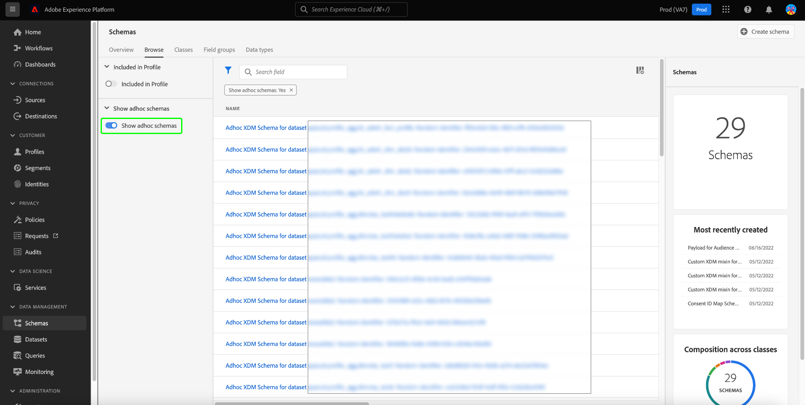

# Unterstützung der attributbasierten Zugriffskontrolle für ungeplante Schemata

Alle Daten, die in Adobe Experience Platform importiert werden, werden von Experience-Datenmodell (XDM)-Schemas gekapselt und können Nutzungsbeschränkungen unterliegen, die von Ihrem Unternehmen oder durch gesetzliche Bestimmungen festgelegt werden.

Durch Ausführung einer CTAS-Abfrage über Query Service, wenn kein Schema angegeben ist, wird automatisch ein Ad-hoc-Schema generiert. Oft ist es erforderlich, die Verwendung bestimmter Felder oder Datensätze von Ad-hoc-Schemata zu beschränken, um den Zugriff auf vertrauliche personenbezogene Daten und persönlich identifizierbare Informationen zu steuern. Adobe Experience Platform erleichtert diese Zugriffskontrolle, indem es Ihnen ermöglicht, Schemafelder über die Platform-Benutzeroberfläche mithilfe der attributbasierten Zugriffssteuerungsfunktion zu beschriften.

Beschriftungen können jederzeit angewendet werden, was eine flexible Handhabung der Daten ermöglicht. Es empfiehlt sich jedoch, Daten zu kennzeichnen, sobald sie in Platform erfasst oder verfügbar sind.

Die schemabasierte Beschriftung ist eine wichtige Komponente der attributbasierten Zugriffskontrolle, um den Zugriff für Benutzer oder Benutzergruppen besser zu verwalten. Mit Adobe Experience Platform können Sie den Zugriff auf ein beliebiges Feld eines Ad-hoc-Schemas einschränken, indem Sie Bezeichnungen erstellen und anwenden.

Dieses Dokument bietet eine Anleitung zum Verwalten des Zugriffs auf vertrauliche Daten, indem Beschriftungen auf Datenfelder von Ad-hoc-Schemas angewendet werden, die über Query Service generiert wurden.

## Erste Schritte

Dieses Handbuch setzt ein Verständnis der folgenden Komponenten von Adobe Experience Platform voraus:

* [Experience-Datenmodell (XDM)-System](../../xdm/home.md): Das standardisierte Framework, mit dem Experience Platform Kundenerlebnisdaten organisiert.
   * [[!DNL Schema Editor]](../../xdm/ui/overview.md): Erfahren Sie, wie Sie Schemas und andere Ressourcen in der Platform-Benutzeroberfläche erstellen und verwalten.
* [[!DNL Data Governance]](../../data-governance/home.md): Erfahren Sie, wie Sie [!DNL Data Governance] ermöglicht Ihnen, Kundendaten zu verwalten und die Einhaltung von Vorschriften, Einschränkungen und Richtlinien für die Datennutzung sicherzustellen.
* [Attributbasierte Zugriffssteuerung](../../access-control/abac/overview.md): Die attributbasierte Zugriffssteuerung ist eine Funktion von Adobe Experience Platform, mit der Administratoren den Zugriff auf bestimmte Objekte und/oder Funktionen anhand von Attributen steuern können. Attribute können einem Objekt Metadaten hinzugefügt werden, z. B. eine Bezeichnung, die einem Ad-hoc- oder regulären Schemafeld hinzugefügt wird. Administrierende definieren Zugriffsrichtlinien, die Attribute zur Verwaltung von Benutzerzugriffsberechtigungen enthalten.

## Erstellen eines Ad-hoc-Schemas

Nachdem Ihre Abfrage ausgeführt und Ergebnisse generiert wurden, wird automatisch ein Ad-hoc-Schema generiert und zum Schema-Inventar hinzugefügt.

Navigieren Sie zum Hinzufügen einer Datenbeschriftung zu [!UICONTROL Schemas] Registerkarte zum Durchsuchen von Dashboards durch Auswahl [!UICONTROL Schemas] in der linken Leiste der Platform-Benutzeroberfläche. Das Schema-Inventar wird angezeigt.

>[!NOTE]
>
>Ad-hoc-Schemata werden nicht standardmäßig im Schema-Inventar angezeigt.

## Entdecken Sie Ad-hoc-Schemas im Schema-Inventar der Platform-Benutzeroberfläche. {#discover-ad-hoc-schemas}

Um die Anzeige von Ad-hoc-Schemata in der Platform-Benutzeroberfläche zu aktivieren, wählen Sie das Filtersymbol () links neben dem Suchfeld und wählen Sie dann ** aus.[!UICONTROL Anzeigen von Ad-hoc-Schemata] in der linken Leiste angezeigt.

Wählen Sie den Namen des kürzlich erstellten Ad-hoc-Schemas aus der verfügbaren Liste aus. Eine Visualisierung der Ad-hoc-Schemastruktur wird angezeigt.

## Governance-Kennzeichnungen bearbeiten

Um Datenbezeichnungen für Ihr Ad-hoc-Schema zu bearbeiten, wählen Sie die [!UICONTROL Bezeichnungen] Registerkarte. Im Arbeitsbereich &quot;Beschriftungen&quot;können Sie Beschriftungen auf Ihre Ad-hoc-Schemafelder anwenden, erstellen und bearbeiten und Zugriffsberechtigungen über die Benutzeroberfläche steuern. Alle Felder im Ad-hoc-Schema werden hier dargestellt.

## Bearbeiten von Bezeichnungen für das Schema oder Feld

Um die Beschriftungen für das gesamte Schema zu bearbeiten, wählen Sie das Stiftsymbol () neben dem Namen des Schemas unter dem [!UICONTROL Bezeichnungen] Registerkarte.

Um eine Beschriftung auf ein vorhandenes Feld anzuwenden, wählen Sie ein oder mehrere Felder aus der Liste aus, gefolgt von [!UICONTROL Bearbeiten von Governance-Titeln] in der rechten Seitenleiste.

## Popover &quot;Bezeichnungen bearbeiten&quot;

Die [!UICONTROL Bearbeiten von Bezeichnungen] Popover angezeigt. In dieser Ansicht können Sie vorhandene Governance-Beschriftungen über die Benutzeroberfläche erstellen oder bearbeiten.

Anleitungen zum [Erstellen oder Bearbeiten von Beschriftungen für das ausgewählte Schema oder Feld](../../xdm/tutorials/labels.md#edit-the-labels-for-the-schema-or-field).

>[!NOTE]
>
>Für das Erstellen einer neuen Bezeichnung oder Bearbeiten einer vorhandenen Bezeichnung sind Administratorberechtigungen für Ihr Unternehmen erforderlich. Wenn Sie keine Administratorrechte haben, wenden Sie sich an Ihren Systemadministrator, um den Zugriff zu arrangieren.

Beschriftungen können auch über den Arbeitsbereich &quot;Berechtigungen&quot;erstellt werden. Siehe [Handbuch zum Erstellen von Bezeichnungen im Arbeitsbereich &quot;Berechtigungen&quot;](../../access-control/abac/ui/labels.md) für Anweisungen.

Sobald die entsprechende Ebene der attributbasierten Zugriffssteuerung angewendet wurde, gilt das folgende Systemverhalten für alle Abfragen, die über Query Service ausgeführt werden, wenn ein Benutzer versucht, auf nicht zugängliche Daten zuzugreifen:

1. Wenn einem Benutzer der Zugriff auf eines der Felder innerhalb eines Schemas verweigert wird, kann er das eingeschränkte Feld nicht lesen oder schreiben. Dies gilt für die folgenden gängigen Szenarien:

   * Wenn ein Benutzer versucht, eine Abfrage nur mit einer eingeschränkten Spalte auszuführen, gibt das System einen Fehler aus, dass die Spalte nicht vorhanden ist.
   * Wenn ein Benutzer versucht, eine Abfrage mit mehreren Spalten auszuführen, die eine eingeschränkte Spalte enthalten, gibt das System nur die Ausgabe für alle nicht eingeschränkten Spalten zurück.

1. Wenn ein Benutzer Zugriff auf ein berechnetes Feld anfordert, muss er Zugriff auf alle in der Komposition verwendeten Felder haben. Andernfalls verweigert das System den Zugriff auf das berechnete Feld.

Wenn eine Identität oder primäre Identität für ein Ad-hoc-Schema festgelegt wird, berücksichtigt das System automatisch alle zugehörigen Datenhygieneprüfungen und löscht die Daten in den Datensätzen, die mit der Identitätsspalte verknüpft sind.

## Nächste Schritte

Nachdem Sie dieses Dokument gelesen haben, können Sie besser verstehen, wie Sie Ad-hoc-Schemas, die über CTAS-Abfragen von Query Service erstellt wurden, Datennutzungsbezeichnungen hinzufügen. Wenn Sie dies noch nicht getan haben, sind die folgenden Dokumente nützlich, um Ihr Verständnis von Data Governance in Query Service zu verbessern:

* [Ad-hoc-Schemaidentitäten](./ad-hoc-schema-identities.md)
* [Data Governance](../../data-governance/home.md)
