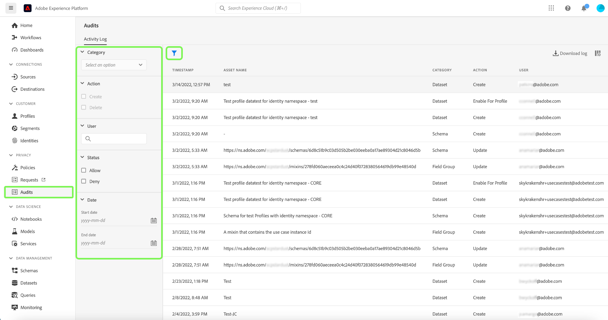

# Integration [!DNL Query Service] Auditprotokolls

Die Integration des Administratorprotokolls in Adobe Experience Platform [!DNL Query Service] stellt Datensätze zu abfragebezogenen Benutzeraktionen bereit. Audit-Protokolle sind ein wichtiges Tool zur Fehlerbehebung und zur Einhaltung von Unternehmensrichtlinien für die Datenverwaltung und gesetzlichen Anforderungen. Mit der Funktion können Sie ein Aktionsprotokoll für viele Ereignistypen zurückgeben und die Datensätze filtern und exportieren. Auf die Protokolle kann entweder über die Experience Platform-Benutzeroberfläche oder die [Audit-Abfrage-API](https://www.adobe.io/experience-platform-apis/references/audit-query/) zugegriffen und sie in CSV- oder JSON-Dateiformaten heruntergeladen werden.

Weitere Informationen zur Benutzeroberfläche für Auditprotokolle finden Sie im Dokument [Übersicht über Auditprotokolle](../../landing/governance-privacy-security/audit-logs/overview.md). Weitere Informationen zum Aufrufen von Experience Platform-APIs finden Sie im [Handbuch zur Audit-Protokoll-API](../../landing/api-guide.md).

>[!NOTE]
>
>Aktionen zum Verwerfen von Sitzungen werden protokolliert. Informationen zu Benutzeroberflächen-Workflows finden Sie unter [Verwalten von Query Service-Sitzungen](../ui/session-management.md).

## Voraussetzungen

Die Berechtigung [!DNL Data Governance] [!UICONTROL View User Activity Log] muss aktiviert sein, damit das Administratorprotokoll-Dashboard in der Experience Platform-Benutzeroberfläche angezeigt werden kann. Die Berechtigung wird über die Adobe [Admin Console](https://adminconsole.adobe.com/) aktiviert. Bitte wenden Sie sich an den Admin Ihrer Organisation, wenn Sie keine Administratorberechtigungen haben, um diese Berechtigung zu aktivieren. In der Dokumentation zur Zugriffskontrolle finden Sie [vollständige Anweisungen zum Hinzufügen von Berechtigungen über die Admin Console](../../access-control/home.md).

## [!DNL Query Service] Auditprotokollkategorien {#audit-log-categories}

Die von [!DNL Query Service] bereitgestellten Auditprotokollkategorien lauten wie folgt.

| Kategorie | Beschreibung |
|---|---|
| [!UICONTROL Query] | Mit dieser Kategorie können Sie Abfrageausführungen überprüfen. |
| [!UICONTROL Query template] | In dieser Kategorie können Sie die verschiedenen Aktionen (Erstellen, Aktualisieren und Löschen) prüfen, die bei einer Abfragevorlage durchgeführt wurden. |
| [!UICONTROL Scheduled query] | Mit dieser Kategorie können Sie die Zeitpläne prüfen, die in [!DNL Query Service] erstellt, aktualisiert oder gelöscht wurden. |

## Durchführen eines [!DNL Query Service] Auditprotokolls {#perform-an-audit-log}

Um eine Prüfung auf [!DNL Query Service] Aktivitäten durchzuführen, wählen Sie im linken Navigationsbereich die Option **[!UICONTROL Audits]** und dann das funnel-Symbol (), um eine Liste von Filterfeldern anzuzeigen, mit denen die Ergebnisse eingegrenzt werden können.

Auf der Registerkarte [!UICONTROL Audits]-Dashboard-[!UICONTROL Activity log] können Sie alle aufgezeichneten Experience Platform-Aktionen nach einer der [!DNL Query Service] Kategorien filtern. Die Protokollergebnisse können weiter gefiltert werden, basierend auf dem Zeitraum, in dem sie ausgeführt wurden, der durchgeführten Aktion/Funktion oder dem Benutzer, der die Abfrage durchgeführt hat. Siehe die Dokumentation zum Auditprotokoll für [vollständige Anweisungen zum Filtern der Protokolle nach Kategorie, Aktion, Benutzer und Status](../../landing/governance-privacy-security/audit-logs/overview.md#managing-audit-logs-in-the-ui).

Die zurückgegebenen Auditprotokolldaten enthalten die folgenden Informationen zu allen Abfragen, die Ihren ausgewählten Filterkriterien entsprechen.

| Spaltenname | Beschreibung |
|---|---|
| [!UICONTROL Timestamp] | Das genaue Datum und die genaue Uhrzeit der Aktion, die in einem `month/day/year hour:minute AM/PM` Format ausgeführt wird. |
| [!UICONTROL Asset Name] | Der Wert für das Feld [!UICONTROL Asset Name] hängt von der als Filter ausgewählten Kategorie ab. Bei Verwendung der [!UICONTROL Scheduled query] ist dies der **Name des Zeitplans**. Bei Verwendung der Kategorie [!UICONTROL Query template] ist dies der **Vorlagenname**. Bei Verwendung der Kategorie &quot;[!UICONTROL Query]&quot; ist dies die **Sitzungs-ID** |
| [!UICONTROL Category] | Dieses Feld entspricht der Kategorie, die Sie im Filter-Dropdown-Menü ausgewählt haben. |
| [!UICONTROL Action] | Dies kann entweder erstellt, gelöscht, aktualisiert oder ausgeführt werden. Die verfügbaren Aktionen hängen von der als Filter ausgewählten Kategorie ab. |
| [!UICONTROL User] | Dieses Feld gibt die Benutzer-ID an, die die Abfrage ausgeführt hat. |

>[!NOTE]
>
>Durch Herunterladen der Protokollergebnisse in CSV- oder JSON-Dateiformaten werden mehr Abfragedetails bereitgestellt, als standardmäßig im Administratorprotokoll-Dashboard angezeigt werden.

## Detailfenster

Wählen Sie eine beliebige Zeile mit Auditprotokollergebnissen aus, um einen Detailbereich rechts neben dem Bildschirm zu öffnen.

Das Detailbedienfeld kann verwendet werden, um die [!UICONTROL Asset ID] und die [!UICONTROL Event status] zu finden.

Der Wert der [!UICONTROL Asset ID] ändert sich je nach der beim Audit verwendeten Kategorie.

* Bei Verwendung der Kategorie &quot;[!UICONTROL Query]&quot; ist der [!UICONTROL Asset ID] die **Sitzungs-ID**.
* Bei Verwendung der Kategorie [!UICONTROL Query template] ist der [!UICONTROL Asset ID] die **Vorlagen-ID** und mit dem Präfix `[!UICONTROL templateID:]`.
* Bei Verwendung der Kategorie [!UICONTROL Scheduled query] ist der [!UICONTROL Asset ID] die **Zeitplan-ID** und mit dem Präfix `[!UICONTROL scheduleID:]`.

Der Wert der [!UICONTROL Event status] ändert sich je nach der beim Audit verwendeten Kategorie.

* Bei Verwendung der Kategorie &quot;[!UICONTROL Query]&quot; bietet das Feld &quot;[!UICONTROL Event status]&quot; eine Liste aller **Abfrage-IDs**, die vom Benutzer innerhalb dieser Sitzung ausgeführt wurden.
* Bei Verwendung der Kategorie [!UICONTROL Query template] stellt das Feld [!UICONTROL Event status] den **Vorlagennamen** als Präfix für den Ereignisstatus bereit.
* Bei Verwendung der Kategorie [!UICONTROL Query schedule] stellt das Feld [!UICONTROL Event status] den **Plannamen** als Präfix für den Ereignisstatus bereit.

## Verfügbare Filter für [!DNL Query Service] Administratorprotokoll-Kategorien {#available-filters}

Die verfügbaren Filter variieren je nach der im Dropdown-Menü ausgewählten Kategorie. In der folgenden Tabelle sind die Filter aufgeführt, die für [[!DNL Query Service] Auditprotokollkategorien“ verfügbar &#x200B;](#audit-log-categories).

| Filter | Beschreibung |
|---|---|
| Kategorie | Eine vollständige Liste [[!DNL Query Service]  verfügbaren Kategorien finden Sie &#x200B;](#audit-log-categories) Abschnitt „Auditprotokollkategorien“. |
| Aktion | Wenn Sie sich auf [!DNL Query Service] Auditkategorien beziehen, handelt es sich bei der Aktualisierung um **Änderung am vorhandenen Formular**, beim Löschen **Entfernen des Zeitplans oder der**), beim Erstellen **Erstellen eines neuen Zeitplans oder einer neuen Vorlage** und beim Ausführen **eine Abfrage**. |
| Benutzerin bzw. Benutzer | Geben Sie die vollständige Benutzer-ID ein (z. B. johndoe@acme.com), um nach Benutzer zu filtern. |
| Status | Die Optionen [!UICONTROL Allow], [!UICONTROL Success] und [!UICONTROL Failure] filtern die Protokolle auf der Grundlage des „Status“ oder „Ereignisstatus“, während die Option [!UICONTROL Deny] &quot;**&quot;**. |
| Datum | Wählen Sie ein Startdatum und/oder ein Enddatum aus, um einen Datumsbereich zu definieren, nach dem die Ergebnisse gefiltert werden sollen. |

## Nächste Schritte

Durch dieses Dokument erhalten Sie ein besseres Verständnis der Funktion des [!DNL Query Service]-Administratorprotokolls und dessen Verwendung zum Filtern Ihrer [!DNL Query Service] Benutzeraktionen.

Wenn Sie die [!DNL Query Service] Auditprotokollfunktion zur Fehlerbehebung verwenden, wird empfohlen, das [Handbuch zur Fehlerbehebung](../troubleshooting-guide.md) zu lesen.
