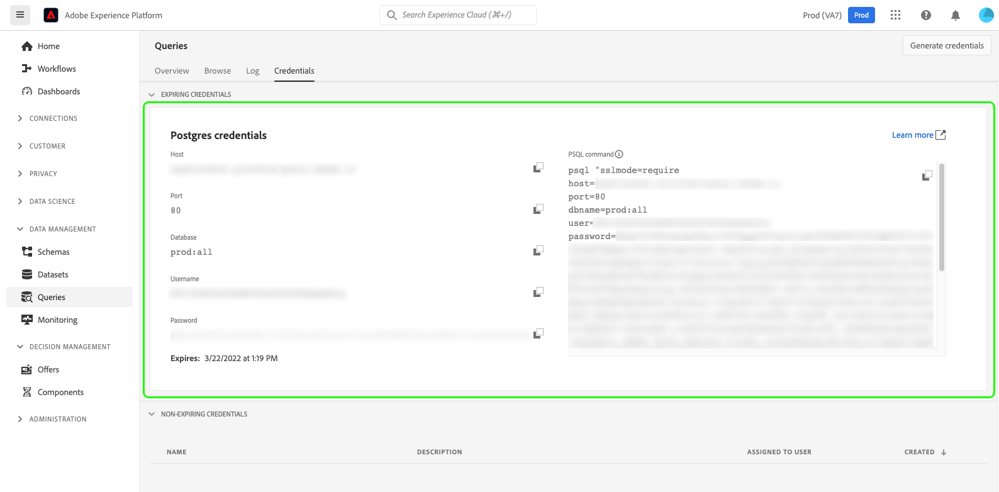
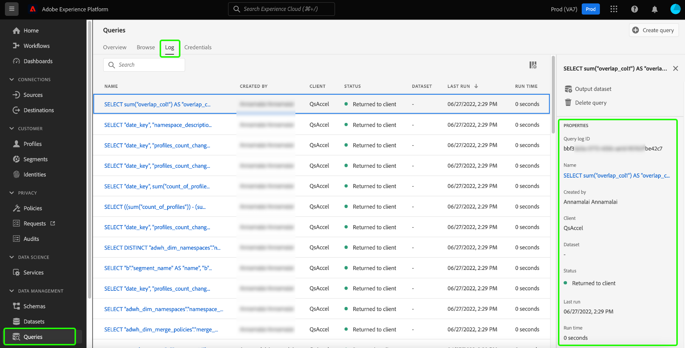

# Data governance in Query Service

Adobe Experience Platform brings data from multiple enterprise systems together and allows you to clean, shape, manipulate and enrich the data through Query Service according to your needs. This allows marketers to identify, understand, and engage customers in a better way. Ensuring adequate data governance is a critical aspect of handling personal information as certain data may be subject to usage restrictions based on organizational policies and legal regulations. It is critical to ensure that your ingested data and its related operations are compliant with the defined data usage policies.

Data governance within Query Service allows you to manage customer data and ensure compliance with regulations, restrictions, and policies applicable to data usage. This plays a key role when ensuring the usage policies have been applied according to the regulations defined by your business.

Organizations that routinely conduct data processing are recommended to outline, practice, and enforce these guidelines to create a privacy-conscious environment for all users.

The following categories are instrumental in adhering to data compliance regulations when using Query Service:

1. Sicherheit
1. Verfolgung
1. Data usage
1. Datenschutz
1. Datenhygiene

This document examines each of the different areas of governance and demonstrates how to facilitate data compliance when using Query Service. See the [governance, privacy, and security overview](../../landing/governance-privacy-security/overview.md) for broader information on how Experience Platform allows you to manage customer data and ensure compliance.

## Sicherheit {#security}

Data security is the process of protecting data from unauthorized access and ensuring secure access throughout its lifecycle. Secure access is maintained in Experience Platform through the application of roles and permissions by capabilities such as role-based access control and attribute-based access control. Credentials, SSL, and data encryption are also used to ensure data protection across Experience Platform.

Security in regard to Query Service is divided into the following categories:

* [Access control](#access-control): Access is controlled through roles and permissions including dataset and column-level permissions.
* Securing data through [connectivity](#connectivity): Data is secured through Experience Platform and external clients by achieving a limited connection with expiring credentials, or non-expiring credentials.
* Securing data through [encryption and customer-managed keys (CMK)](#encryption-and-customer-managed-keys): Access controlled through encryption when data is at rest.

### Zugriffssteuerung {#access-control}

Access control in Adobe Experience Platform is managed by role-based permissions that determine which users can use Query Service features. Similarly, you can control access to specific data attributes through label management on schemas and data fields.

This section outlines the required access control permissions that a user must have in order to fully utilize Query Service features. See the documents on [managing permissions](../../access-control/ui/permissions.md) and [managing users](../../access-control/ui/users.md) for detailed instructions on assigning access to a product profile.

#### Relevante Berechtigungen

Die entsprechenden Zugriffssteuerungsberechtigungen werden in den folgenden Tabellen entsprechend ihrem Umfang definiert.

**Berechtigungen zum Ausführen von Abfragen**

Um Abfragen im Abfrage-Service auszuführen, muss einem Benutzer eine Rolle mit der folgenden Berechtigung zugewiesen werden:

| Berechtigung | Beschreibung |
|---|---|
| [!UICONTROL Manage Queries] | Mit dieser Berechtigung können Benutzer Datenexploration und Batch-Abfragen ausführen, die entweder einen vorhandenen Datensatz lesen oder Daten in Datensätze schreiben können. Dazu gehören sowohl `CREATE TABLE AS SELECT` (`CTAS`) als auch `INSERT INTO AS SELECT` (`ITAS`) Abfragen. |

**Datensatzberechtigungen**

Dieser Abschnitt dient als Anleitung für den ressourcenbasierten Zugriff, der für den Zugriff auf Datensätze beim Abfragen von Daten über den Abfrage-Service erforderlich ist.

Über die Benutzeroberfläche Berechtigungen können Sie eine ressourcenbasierte Zugriffssteuerung für einen Datensatz und ein Schema mit den folgenden Berechtigungen definieren:

| Berechtigung | Beschreibung |
|---|---|
| [!UICONTROL Manage Datasets] | Diese Berechtigung bietet schreibgeschützten Zugriff für Schemata und ermöglicht den Zugriff auf das Lesen, Erstellen, Bearbeiten und Löschen von Datensätzen zur Verwendung mit dem Abfrage-Service. |
| [!UICONTROL View Datasets] | Diese Berechtigung ermöglicht schreibgeschützten Zugriff für Datensätze und Schemata zur Verwendung mit dem Abfrage-Service. |

#### Zugriffssteuerung für Spalten/Felder

Die attributbasierte Zugriffssteuerungsfunktion ermöglicht es Benutzern von Query Service, den Zugriff auf kritische Benutzerdaten zu beschränken. Der Zugriff kann basierend auf den einer Rolle zugewiesenen Berechtigungen gewährt oder eingeschränkt werden. Der Benutzerzugriff auf einzelne Spalten wird durch die entsprechenden Datennutzungskennzeichnungen und die Berechtigungssätze gesteuert, die auf die den Benutzern zugewiesenen Rollen angewendet werden.

Durch das Tagging von Schemafeldgruppen und -klassen mit Datennutzungskennzeichnungen werden Datennutzungsbeschränkungen auf alle Schemata mit denselben Feldergruppen und -klassen angewendet. Umfassende Informationen zu [&#x200B; Funktion finden Sie in der Übersicht &#x200B;](../../access-control/abac/overview.md) (attributbasierte Zugriffssteuerung) .

Mit dieser Funktion können Sie den Benutzergruppen Ihrer Wahl Zugriffsrechte auf vertrauliche Spalten gewähren. Die Zugriffssteuerung für eine Spalte kann die Lese- und Schreibfunktionen für einen bestimmten Benutzertyp einschränken.

Die Zugriffssteuerung für Spalten kann sowohl für Standard- als auch für Ad-hoc-Schemata auf Schemaebene angewendet werden. Wenden Sie Datennutzungskennzeichnungen auf XDM-Schemata an, um den Zugriff auf eine oder mehrere Spalten zu beschränken. Die Datenkennzeichnung wird konsistent angewendet, auch für Datensätze, die über den Abfrage-Service mit einem vordefinierten Schema oder einem Ad-hoc-Schema erstellt wurden, das im Rahmen des CTAS-Vorgangs generiert wurde.

Nachdem die entsprechende Zugriffsebene mithilfe von Kennzeichnungen und Rollen angewendet wurde, tritt das folgende Systemverhalten auf, wenn ein Benutzer versucht, auf die nicht zugänglichen Daten zuzugreifen:

1. Wenn einem Benutzer der Zugriff auf eine der Spalten innerhalb eines Schemas verweigert wurde, wird dem Benutzer auch die Berechtigung zum Lesen oder Schreiben für die eingeschränkte Spalte verweigert. Dies gilt für die folgenden gängigen Szenarien:

   * **Fall 1**: Wenn ein(e) Benutzende(r) versucht, eine Abfrage auszuführen, die nur eine eingeschränkte Spalte betrifft, gibt das System den Fehler aus, dass die Spalte nicht vorhanden ist.
   * **Fall 2**: Wenn ein(e) Benutzende(r) versucht, eine Abfrage mit mehreren Spalten auszuführen, die eine eingeschränkte Spalte enthalten, gibt das System nur die Ausgabe für alle nicht eingeschränkten Spalten zurück.

1. Wenn ein(e) Benutzende(r) versucht, auf ein berechnetes Feld zuzugreifen, muss er/sie Zugriff auf alle in der Komposition verwendeten Felder haben, oder das System verweigert auch den Zugriff auf das berechnete Feld.

#### Zugriffssteuerungen für Ansichten

Query Service bietet die Möglichkeit, standardmäßige ANSI-SQL für [`CREATE VIEW`](../sql/syntax.md#create-view)-Anweisungen zu verwenden. Bei hochsensiblen Daten-Workflows müssen Sie beim Erstellen von Ansichten entsprechende Steuerelemente durchsetzen.

Das Keyword `CREATE VIEW` definiert eine Ansicht einer Abfrage, die Ansicht ist jedoch nicht physisch materialisiert. Stattdessen wird die Abfrage jedes Mal ausgeführt, wenn in einer Abfrage auf die Ansicht verwiesen wird. Wenn ein(e) Benutzende(r) eine Ansicht aus einem Datensatz erstellt, werden die rollen- und attributbasierten Zugriffssteuerungsregeln für den übergeordneten Datensatz **nicht** hierarchisch angewendet. Daher müssen Sie beim Erstellen einer Ansicht explizit Berechtigungen für jede der Spalten festlegen.

#### Erstellen von feldbasierten Zugriffsbeschränkungen für beschleunigte Datensätze {#create-field-based-access-restrictions-on-accelerated-datasets}

Mit der [attributbasierten Zugriffssteuerungsfunktion](../../access-control/abac/overview.md) können Sie Organisations- oder Datennutzungsbereiche für Fakten- und Dimensionsdatensätze im [beschleunigten Speicher](../data-distiller/sql-insights/send-accelerated-queries.md) definieren. Dadurch können Admins den Zugriff auf bestimmte Segmente verwalten und den Zugriff für Benutzende oder Benutzergruppen besser verwalten.

Um feldbasierte Zugriffsbeschränkungen für beschleunigte Datensätze zu erstellen, können Sie CTAS-Abfragen des Abfrage-Service verwenden, um beschleunigte Datensätze zu erstellen und diese Datensätze auf der Grundlage vorhandener XDM-Schemata oder Ad-hoc-Schemata zu strukturieren. Admins können dann [Datennutzungsbeschriftungen für das Schema hinzufügen und bearbeiten](../../xdm/tutorials/labels.md#edit-the-labels-for-the-schema-or-field) oder [Ad-hoc-Schema](./ad-hoc-schema-labels.md#edit-governance-labels). Sie können Kennzeichnungen auf Ihre Schemata über den Arbeitsbereich [!UICONTROL Labels] in der [!UICONTROL Schemas]-Benutzeroberfläche anwenden, erstellen und bearbeiten.

Datennutzungsbeschriftungen können auch über die Benutzeroberfläche Datensätze [angewendet oder direkt auf den Datensatz angewendet](../../data-governance/labels/user-guide.md#add-labels) oder über den Arbeitsbereich Zugriffssteuerung [!UICONTROL Labels] erstellt werden. Weitere Informationen finden Sie in der Anleitung zum [Erstellen einer neuen &#x200B;](../../access-control/abac/ui/labels.md)&quot;.

Der Benutzerzugriff auf einzelne Spalten kann dann durch die angehängten Datennutzungskennzeichnungen und die Berechtigungssätze gesteuert werden, die auf die Rollen angewendet werden, die den Benutzern zugewiesen sind.

### Konnektivität {#connectivity}

Auf den Abfrage-Service kann über die Benutzeroberfläche von Experience Platform oder durch Herstellen einer Verbindung mit externen kompatiblen Clients zugegriffen werden. Der Zugriff auf alle verfügbaren Fronts wird durch einen Satz von Anmeldeinformationen gesteuert.

#### Konnektivität über externe Clients

Für den Zugriff auf den Abfrage-Service mit einem Drittanbieter-Client sind Anmeldeinformationen für die Autorisierung erforderlich. Diese Anmeldeinformationen sind obligatorisch, um mit einem der kompatiblen externen Clients auf den Abfrage-Service zuzugreifen. Sie können eine Verbindung zu externen Clients herstellen, indem Sie entweder [ablaufende Anmeldeinformationen](#expiring-credentials) oder [nicht ablaufende Anmeldeinformationen](#non-expiring-credentials) verwenden.

#### Begrenzte Verbindungszeit über ablaufende Anmeldedaten {#expiring-credentials}

[Ablaufende Anmeldeinformationen](../ui/credentials.md) ermöglichen es Benutzern, eine temporäre Verbindung mit einem externen Client herzustellen. Dieser Satz von Anmeldeinformationen ist nur 24 Stunden lang gültig. Der Ablauf dieser Arten von Anmeldeinformationen wird zusammen mit der Registerkarte Anmeldeinformationen im Dashboard des Abfrage-Services angezeigt.

#### Unbefristete Anmeldedaten {#non-expiring-credentials}

[Nicht ablaufende Anmeldeinformationen](../ui/credentials.md#non-expiring-credentials) ermöglichen es Ihnen, eine permanente Verbindung mit einem externen Client herzustellen, was die Verbindung zum Abfrage-Service erleichtert, ohne dass ein manuelles Kennwort erforderlich ist.

Um die Option zum Generieren nicht ablaufender Zugangsdaten zu aktivieren, müssen Sie den beschriebenen [vorausgesetzte Workflow“ &#x200B;](../ui/credentials.md#prerequisites). Im Rahmen dieses Prozesses muss Ihr Organisationsadministrator Berechtigungen für das Produktprofil konfigurieren, sodass der Administrator steuern kann, welche Konten Zugriff auf die Verwendung nicht ablaufender Anmeldeinformationen haben.

Technische Benutzerkonten mit unbefristeten Anmeldeinformationen können Rollen zugewiesen werden, um eine angemessene Data Governance sicherzustellen, indem der Umfang ihres Lese- und Schreibzugriffs auf der Grundlage ihrer Zuständigkeiten und Anforderungen definiert wird. Siehe vorherigen Abschnitt unter [Verwenden rollenbasierter Berechtigungen durch Zugriffssteuerung](#access-control) zum Verwalten des Zugriffs auf den Abfrage-Service.

Sobald der vorausgesetzte Workflow abgeschlossen ist, können autorisierte Benutzer jetzt [die erforderlichen Verbindungsanmeldeinformationen generieren](../ui/credentials.md#generate-credentials).

#### SSL-Datenverschlüsselung

Zur Erhöhung der Sicherheit bietet der Abfrage-Service native Unterstützung für SSL-Verbindungen zur Verschlüsselung der Client/Server-Kommunikation. Experience Platform unterstützt verschiedene SSL-Optionen, um Ihre Datensicherheitsanforderungen zu erfüllen und den Verarbeitungsaufwand für Verschlüsselung und Schlüsselaustausch auszugleichen.

Weitere Informationen, einschließlich der Verwendung [&#x200B; SSL-Parameterwerts `verify-full`, finden Sie im Handbuch zu verfügbaren SSL](../clients/ssl-modes.md)Optionen für Clientverbindungen von Drittanbietern zum Abfrage-Service .

### Verschlüsselung und kundenverwaltete Schlüssel (CMK) {#encryption-and-customer-managed-keys}

Verschlüsselung ist die Verwendung eines algorithmischen Prozesses, um Daten in verschlüsselten und unlesbaren Text umzuwandeln, um sicherzustellen, dass die Informationen geschützt sind und ohne einen Entschlüsselungsschlüssel nicht zugänglich sind.

Die Datenkonformität des Abfrage-Service stellt sicher, dass Daten immer verschlüsselt werden. Daten während der Übertragung sind immer HTTPS-kompatibel und Daten im Ruhezustand werden in einem Azure Data Lake-Speicher mithilfe von Schlüsseln auf Systemebene verschlüsselt. Weitere Informationen finden Sie in der Dokumentation [So werden Daten in Adobe Experience Platform &#x200B;](../../landing/governance-privacy-security/encryption.md). Einzelheiten dazu, wie Data-at-Rest im Data-Lake-Speicher von Azure verschlüsselt werden, finden Sie in der [offiziellen Azure-Dokumentation](https://docs.microsoft.com/de-de/azure/data-lake-store/data-lake-store-encryption).

Daten in Übertragung sind immer HTTPS-kompatibel. Wenn sich die Daten im Data Lake im Ruhezustand befinden, erfolgt die Verschlüsselung mit dem Customer Management Key (CMK), der bereits von Data Lake Management unterstützt wird. Die derzeit unterstützte Version ist TLS1.2. In der [Dokumentation Kundenverwaltete Schlüssel (CMK) &#x200B;](../../landing/governance-privacy-security/customer-managed-keys/overview.md) Sie, wie Sie Ihre eigenen Verschlüsselungsschlüssel für in Adobe Experience Platform gespeicherte Daten einrichten.

## Verfolgung {#audit}

Der Abfrage-Service zeichnet Benutzeraktivitäten auf und kategorisiert diese Aktivitäten in verschiedene Protokolltypen. Die Protokolle geben Informationen darüber **wer** welche **ausgeführt** wann **.**. Jede in einem Protokoll aufgezeichnete Aktion enthält Metadaten, die den Aktionstyp, das Datum und die Uhrzeit, die E-Mail-ID der oder des Benutzenden, die oder der die Aktion durchgeführt hat, und weitere für den Aktionstyp relevante Attribute angeben.

Jede der Protokollkategorien kann von einem Experience Platform-Benutzer nach Bedarf angefordert werden. Dieser Abschnitt enthält Details zum Typ der für den Abfrage-Service erfassten Informationen und dazu, wo auf diese Informationen zugegriffen werden kann.

### Abfrageprotokolle {#query-logs}

Die Benutzeroberfläche für Abfrageprotokolle ermöglicht es Ihnen, Ausführungsdetails für alle Abfragen zu überwachen und zu überprüfen, die entweder über den Abfrage-Editor oder die Abfrage-Service-API ausgeführt wurden. Dies bringt Transparenz in die Aktivitäten des Abfrage-Service, sodass Sie die Metadaten auf (**)** Abfragen überprüfen können, die im gesamten Abfrage-Service ausgeführt wurden. Sie enthält alle Arten von Abfragen, unabhängig davon, ob es sich um eine explorative, Batch- oder geplante Abfrage handelt.

Auf Abfrageprotokolle kann entweder über die Experience Platform-Benutzeroberfläche auf der Registerkarte [!UICONTROL Logs] des Arbeitsbereichs [!UICONTROL Queries] zugegriffen werden.

### Auditprotokolle {#audit-logs}

Auditprotokolle enthalten detailliertere Informationen als Abfrageprotokolle und ermöglichen es Ihnen, Protokolle nach Attributen wie Benutzer, Datum, Art der Abfrage usw. zu filtern. Über die in der Benutzeroberfläche des Abfrageprotokolls verfügbaren Details hinaus werden in Audit-Protokollen Details zu einzelnen Benutzern sowie deren Sitzungsdaten oder Konnektivität zu einem Drittanbieter-Client gespeichert.

Durch die Bereitstellung einer genauen Aufzeichnung von Benutzeraktionen kann ein Audit-Protokoll bei der Fehlerbehebung helfen und Ihrem Unternehmen helfen, die Richtlinien zur Unternehmensdatenverwaltung und die gesetzlichen Anforderungen effektiv zu erfüllen. Auditprotokolle zeichnen alle Experience Platform-Aktivitäten auf. Mithilfe von Auditprotokollen können Sie Benutzeraktionen in Bezug auf die Ausführung von Abfragen, Vorlagen und geplante Abfragen überprüfen, um die Transparenz und Sichtbarkeit der von Benutzern in Query Service durchgeführten Aktionen zu erhöhen.

Die folgende Tabelle zeigt die von Audit-Protokollen erfassten Abfragekategorien und die aufgezeichneten Aktionstypen:

| Kategorie | Aktionstyp |
|---|---|
| Abfrage | Execute |
| Abfragevorlage | Erstellen, Löschen, Aktualisieren |
| Geplante Abfrage | Erstellen, Löschen, Aktualisieren |

Nachfolgend finden Sie eine Liste mit drei erweiterten Server-Protokollen, die mehr Details enthalten als die in den Abfrageprotokollen enthaltenen. Die erweiterten Protokolle befinden sich in den Abfragekategorien der Auditprotokolle:

1. **Meta-Abfrageprotokolle**: Wenn eine Abfrage ausgeführt wird, werden verschiedene zugehörige Backend-Unterabfragen (z. B. Parsing) ausgeführt. Diese Arten von Abfragen werden als „Metadatenabfragen“ bezeichnet. Ihre relevanten Details finden Sie in den Auditprotokollen.
1. **Sitzungsprotokolle**: Das System erstellt ein Sitzungseintragsprotokoll für einen Benutzer, wenn er sich beim Abfrage-Service anmeldet, unabhängig davon, ob er eine Abfrage ausführt.
1. **Verbindungsprotokolle von Drittanbietern**: Ein Verbindungsprüfprotokoll wird generiert, wenn ein Benutzer den Abfrage-Service erfolgreich mit einem Client eines Drittanbieters verbindet.

Weitere Informationen darüber[&#x200B; wie Auditprotokolle Ihrem Unternehmen helfen können, die Einhaltung von Datenvorschriften zu gewährleisten, finden Sie &#x200B;](../../landing/governance-privacy-security/audit-logs/overview.md) „Übersicht über Auditprotokolle“.

## Datennutzung {#data-usage}

Das Data Governance-Framework in Experience Platform bietet eine einheitliche Möglichkeit, Daten in allen Adobe-Lösungen, -Services und -Plattformen verantwortungsvoll zu verwenden. Sie koordiniert den systemischen Ansatz zur Erfassung, Kommunikation und Verwendung von Metadaten in Adobe Experience Cloud. Dies wiederum hilft Datenverantwortlichen dabei, Daten entsprechend den erforderlichen Marketing-Aktionen und den Einschränkungen zu kennzeichnen, die für diese Daten aus diesen beabsichtigten Marketing-Aktionen gelten. In der Übersicht zu [Datennutzungskennzeichnungen](../../data-governance/labels/overview.md) finden Sie weitere Informationen darüber, wie Sie mit Data Governance Datennutzungskennzeichnungen auf Datensätze und Felder anwenden können.

Es ist Best Practice, in jeder Phase des Journey der Daten auf die Einhaltung der Datenrichtlinien hinzuarbeiten. Zu diesem Zweck sollten abgeleitete Datensätze, die Ad-hoc-Schemata verwenden, im Rahmen des Data Governance-Frameworks entsprechend gekennzeichnet werden. Es gibt zwei Arten von abgeleiteten Datensätzen, die vom Abfrage-Service gebildet werden: Datensätze, die ein Standardschema verwenden, und Datensätze, die ein Ad-hoc-Schema verwenden.

>[!NOTE]
>
>Datensätze, die mit dem Abfrage-Service erstellt werden, werden als „abgeleitete Datensätze“ bezeichnet.

Da Ad-hoc-Schemata von einem einzelnen Benutzer für einen bestimmten Zweck erstellt werden, werden die XDM-Schemafelder für diesen bestimmten Datensatz mit einem Namespace versehen und sind nicht für die Verwendung in verschiedenen Datensätzen vorgesehen. Daher sind Ad-hoc-Schemata in der Experience Platform-Benutzeroberfläche standardmäßig nicht sichtbar. Obwohl es bei der Anwendung von Datennutzungskennzeichnungen keinen Unterschied zwischen Standard- und Ad-hoc-Schemata gibt, müssen Ad-hoc-Schemata, die vom Abfrage-Service zum Zweck der Kennzeichnung erstellt wurden, zunächst in der Experience Platform-Benutzeroberfläche sichtbar gemacht werden. Weitere Informationen finden Sie im Handbuch [Erkennen von Ad-hoc-Schemata in &#x200B;](./ad-hoc-schema-labels.md#discover-ad-hoc-schemas) Experience Platform-Benutzeroberfläche“.

Nachdem Sie auf das Schema zugegriffen haben, können Sie [Kennzeichnungen auf einzelne Felder anwenden](../../xdm/tutorials/labels.md). Sobald ein Schema gekennzeichnet wurde, erben alle Datensätze, die von diesem Schema abgeleitet sind, diese Kennzeichnungen. Von hier aus können Sie Datennutzungsrichtlinien einrichten, die verhindern können, dass Daten mit bestimmten Beschriftungen für bestimmte Ziele aktiviert werden. Weitere Informationen finden Sie in der Übersicht zu [Datennutzungsrichtlinien](../../data-governance/policies/overview.md).

## Datenschutz {#privacy}

[Privacy Service](../../privacy-service/home.md) unterstützt Sie bei der Verwaltung von Kundenanfragen zum Zugriff auf und zur Löschung ihrer Daten gemäß den gesetzlichen Datenschutzbestimmungen. Dies erfolgt, indem nach bereits vorhandenen Kennungen gesucht wird und je nach angefordertem Datenschutzauftrag entweder auf diese Daten zugreift oder sie löscht. Die Daten müssen ordnungsgemäß gekennzeichnet werden, damit der Service feststellen kann, welche Felder während der Datenschutzaufträge aufgerufen oder gelöscht werden sollen. Daten, die Gegenstand von Datenschutzanfragen sind, müssen Informationen zur Kundenidentität enthalten, um die unterschiedlichen Datenelemente mit der Person zu verknüpfen, für die die Datenschutzanfrage gilt. Query Service kann die von ihm verwendeten Daten mit einer eindeutigen Kennung anreichern, um Datenschutzaufträge zu erfüllen.

Datenschutzanfragen können an den Data Lake oder den Profildatenspeicher gesendet werden. Aus dem Data Lake gelöschte Datensätze führen nicht zum Löschen von Profilen, die aus diesen Datensätzen erstellt wurden. Ein Datenschutzauftrag zum Löschen personenbezogener Daten aus dem Data Lake löscht auch nicht sein Profil, sodass alle Informationen (die diese Profil-ID enthalten), die nach Abschluss des Datenschutzauftrags aufgenommen werden, dieses Profil wie gewohnt aktualisieren. Dies bekräftigt die Notwendigkeit, in Ad-hoc-Schemata verwendete Daten ordnungsgemäß zu identifizieren.

See the Privacy Service documentation for more information on [identity data for privacy requests](../../privacy-service/identity-data.md) and how to configure your data operations and leverage Adobe technologies to effectively retrieve the appropriate identity information for customer privacy requests.

Query Service features for data governance simplify and streamline the process of data categorization and adherence to data usage regulations. Once the data has been identified, Query Service enables you to allocate the primary identity on all output datasets. You **must** add identities into the dataset to facilitate data privacy requests and work towards data compliance.

Schema data fields can be set as an identity field through the Experience Platform UI and Query Service also allows you to [mark the primary identities by using the SQL command &#39;ALTER TABLE&#39;](../sql/syntax.md#alter-table). Setting an identity using the `ALTER TABLE` command is especially useful when datasets are created using SQL rather than directly from a schema through the Experience Platform UI. See the documentation for instructions on how to [define identity fields in the UI](../../xdm/ui/fields/identity.md) when using standard schemas.

## Datenhygiene {#data-hygiene}

&quot;Data hygiene&quot; refers to the process of repairing or removing data that may be outdated, inaccurate, incorrectly formatted, duplicated, or incomplete. These processes make sure that datasets are accurate and consistent across all systems. It is important to ensure adequate data hygiene along every step of the data&#39;s journey and even from the initial data storage location. In Experience Platform Query Service, this is either the data lake or the accelerated store.

You can assign an identity to a derived dataset to allow their data management following Experience Platform&#39;s centralized data hygiene services.

Conversely, when you create an aggregated dataset on the accelerated store, the aggregated data cannot be used to derive the original data. As a result of this data aggregation, the need to raise data hygiene requests is eliminated.

An exception to this scenario is the case of deletion. If a data hygiene deletion is requested on a dataset and before the deletion is completed, another derived dataset query is executed, then the derived dataset will capture information from the original dataset. In this case, you must be mindful that if a request to delete a dataset has been sent, you must not execute any newly derived dataset queries using the same dataset source.

See the [data hygiene overview](../../hygiene/home.md) for more information on data hygiene in Adobe Experience Platform.
