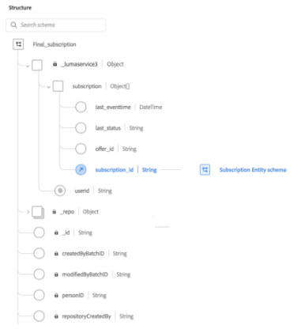

# Arbeiten mit verschachtelten Datenstrukturen in Query Service

Adobe Experience Platform Query Service unterstützt die Verwendung verschachtelter Datenfelder. Die Komplexität der Datenstrukturen eines Unternehmens kann die Transformation oder Verarbeitung dieser Daten erschweren. Dieses Dokument enthält Beispiele zum Erstellen, Verarbeiten oder Transformieren von Datensätzen mit komplexen Datentypen, einschließlich verschachtelter Datenstrukturen.

Query Service stellt eine [!DNL PostgreSQL]-Schnittstelle zum Ausführen von SQL-Abfragen für alle von Experience Platform verwalteten Datensätze bereit. Platform unterstützt die Verwendung von primitiven oder komplexen Datentypen in Tabellenspalten wie Struct, Arrays, Karten und tief verschachtelten Struct, Arrays und Zuordnungen. Datensätze können auch verschachtelte Strukturen enthalten, bei denen der Spaltendatentyp so komplex sein kann wie ein Array verschachtelter Strukturen oder eine Zuordnung von Karten, wobei der Wert eines Schlüssel-Wert-Paares eine Struktur mit mehreren Verschachtelungsebenen sein kann.

## Erste Schritte

Für dieses Tutorial ist die Verwendung eines PSQL-Clients eines Drittanbieters oder des Abfrage-Editors erforderlich, um Abfragen in der Experience Platform-Benutzeroberfläche (User Interface, UI) zu schreiben, zu überprüfen und auszuführen. Ausführliche Informationen zum Ausführen von Abfragen über die Benutzeroberfläche finden Sie im [Handbuch zur Benutzeroberfläche des Abfrage-Editors](../ui/user-guide.md). Eine detaillierte Liste der Desktop-Clients von Drittanbietern, die eine Verbindung zu Query Service herstellen können, finden Sie unter [Client-Verbindungen – Übersicht](../clients/overview.md).

Sie sollten sich auch gut mit der Syntax von `INSERT INTO` und `CTAS` auskennen. Spezifische Informationen zu deren Verwendung finden Sie in den Abschnitten der [SQL-Syntax-Referenzdokumentation](../sql/syntax.md) zu [`INSERT INTO`](../sql/syntax.md#insert-into) und [`CTAS`](../sql/syntax.md#create-table-as-select).

## Erstellen eines Datensatzes

Query Service bietet die Funktion Create Table As Select (`CTAS`), um eine Tabelle basierend auf der Ausgabe einer `SELECT`-Anweisung oder, wie in diesem Fall, durch Verwendung eines Verweises auf ein vorhandenes XDM-Schema in Adobe Experience Platform zu erstellen. Im Folgenden wird das für dieses Beispiel erstellte XDM-Schema für `Final_subscription` angezeigt.



Das folgende Beispiel zeigt die zum Erstellen des Datensatzes `final_subscription_test2` verwendete SQL. `final_subscription_test2` wird mithilfe des Schemas `Final_subscription` erstellt. Die Daten werden mithilfe einer `SELECT`-Klausel extrahiert, um einige Zeilen aufzufüllen.

```sql
CREATE TABLE final_subscription_test2 with(schema='Final_subscription') AS (
        SELECT struct(userid, collect_set(subscription) AS subscription) AS _lumaservices3 FROM(
            SELECT user AS userid,
                   struct( last(eventtime) AS last_eventtime,
                           last(status) AS last_status,
                           offer_id, 
                           subsid AS subscription_id)
                   AS subscription
             FROM (
                   SELECT _lumaservices3.msftidentities.userid user
                        , _lumaservices3.subscription.subscription_id subsid
                        , _lumaservices3.subscription.subscription_status status
                        , _lumaservices3.subscription.offer_id offer_id
                        , TIMESTAMP eventtime
 
                   FROM
                        xbox_subscription_event
                   UNION   
                   SELECT _lumaservices3.msftidentities.userid user
                        , _lumaservices3.subscription.subscription_id subsid
                        , _lumaservices3.subscription.subscription_status status
                        , _lumaservices3.subscription.offer_id offer_id
                        , TIMESTAMP eventtime
                   FROM
                        office365_subscription_event
             ) 
             GROUP BY user,subsid,offer_id
             ORDER BY user ASC
       ) GROUP BY userid)
```

Im ursprünglichen Datensatz `final_subscription_test2` wird der Datentyp Struct verwendet, um das Feld `subscription` und die jeweils für die Person eindeutige `userid` einzuschließen. Das Feld `subscription` beschreibt die Produktabonnements für eine Person. Es kann mehrere Abonnements geben, eine Tabelle kann jedoch nur die Informationen für ein Abonnement pro Zeile enthalten.

## Verwenden von INSERT INTO zur Aktualisierung verschachtelter Datenfelder

Nachdem der Datensatz `final_subscription_test2` erstellt wurde, wird die Anweisung `INSERT INTO` verwendet, um zusätzliche Daten an die Tabelle anzuhängen. Beim Kopieren von Daten müssen die Datentypen in Quelle und Ziel übereinstimmen. Alternativ muss der Quelldatentyp per `CAST` zum Zieldatentyp übertragen werden. Die inkrementellen Daten werden dann mithilfe der folgenden SQL zum Zieldatensatz hinzugefügt.

```sql
INSERT INTO final_subscription_test
      SELECT struct(userid, collect_set(subscription) AS subscription) AS _lumaservices3 FROM(
            SELECT user AS userid,
                   struct( last(eventtime) AS last_eventtime,
                           last(status) AS last_status,
                           offer_id, 
                           subsid AS subscription_id)
                   AS subscription
             FROM  SELECT _lumaservices3.msftidentities.userid user
                        , _lumaservices3.subscription.subscription_id subsid
                        , _lumaservices3.subscription.subscription_status status
                        , _lumaservices3.subscription.offer_id offer_id
                        , TIMESTAMP eventtime
 
                   FROM
                        xbox_subscription_event
                   UNION   
                   SELECT _lumaservices3.msftidentities.userid user
                        , _lumaservices3.subscription.subscription_id subsid
                        , _lumaservices3.subscription.subscription_status status
                        , _lumaservices3.subscription.offer_id offer_id
                        , timestamp eventtime
                   FROM
                        office365_subscription_event
             ) 
             GROUP BY user,subsid,offer_id
             ORDER BY user ASC
       ) GROUP BY userid)
```

## Verarbeiten von Daten aus einem verschachtelten Datensatz

Um die Liste der aktiven Abonnements von Benutzenden aus einem Datensatz zu ermitteln, müssen Sie eine Abfrage schreiben, die die Elemente eines Arrays in mehrere Zeilen und Spalten aufteilt. Dazu müssen Sie zunächst die Form des Datenmodells verstehen, da die Abonnementinformationen in einem innerhalb des Datensatzes verschachtelten Array aufbewahrt werden.

Der PSQL-Befehl `\d` wird verwendet, um von Ebene zu Ebene zu den erforderlichen Abonnementdaten zu navigieren. Die Tabellen veranschaulichen die Struktur des Datensatzes `final_subscription_test2`. Komplexe Datentypen können auf einen Blick erkannt werden, da es sich nicht um typische Typwerte wie Text, boolescher Wert, Zeitstempel usw. handelt.

| Spalte | Typ |
|--------|-------|
| `_lumaservices3` | final_subscription_test2__lumaservices3 |

Die Felder der nächsten Spalte werden mithilfe des Befehls `\d final_subscription_test2__lumaservices3` angezeigt

| Spalte | Typ |
|---------|-------|
| `userid` | Text |
| `subscription` | _lumaservices3_subscription_e[] |

`subscription` ist ein Array von Struct-Elementen. Die zugehörigen Felder werden mithilfe des Befehls `\d _lumaservices3_subscription_e[]` angezeigt.

| Spalte | Typ |
|---------|-------|
| `last_eventtime` | Zeitstempel |
| `last_status` | Text |
| `offer_id` | Text |
| `subscription_id` | Text |

Um die verschachtelten Felder des Abonnements abzufragen, müssen Sie zunächst die Elemente des `subscription`-Arrays in mehrere Zeilen aufteilen und die Ergebnisse mithilfe der Auflösefunktion zurückgeben. Das folgende SQL-Beispiel gibt das aktive Abonnement für eine Benutzerin oder einen Benutzer basierend auf `userid` zurück.

```sql
SELECT userid, subs AS active_subscription FROM (
    SELECT _lumaservices3.userid AS userid, explode(_lumaservices3.subscription) AS subs 
    FROM final_subscription_test2
)
WHERE subs.last_status='Active';
```

Diese vereinfachte Beispiellösung lässt nur ein aktives Benutzerabonnement zu. Realistisch betrachtet kann es viele aktive Abonnements für eine einzelne Person geben. Im folgenden Beispiel wird die vorherige Abfrage für mehrere gleichzeitige aktive Abonnements geändert.

```sql
SELECT userid, collect_list(subs) AS active_subscriptions FROM (
     SELECT
          _lumaservices3.userid AS userid,
          explode(_lumaservices3.subscription) AS subs
     FROM final_subscription_test2
     )
WHERE subs.last_status='Active' 
GROUP BY userid ;
```

Trotz der zunehmenden Komplexität dieses SQL-Beispiels ist mit `collect_list` für aktive Abonnements nicht garantiert, dass die Ausgabe in derselben Reihenfolge wie die Quelle erfolgt. Um eine Liste aktiver Abonnements für eine Person zu erstellen, müssen Sie GROUP BY oder Shuffling verwenden, um die Ergebnisse der Liste zu aggregieren.

## Nächste Schritte

Durch Lesen dieses Dokuments wissen Sie jetzt, wie Sie Datensätze verarbeiten oder transformieren können, die komplexe Datentypen in Adobe Experience Platform Query Service verwenden. Weitere Informationen zum Ausführen von SQL-Abfragen für Datensätze im Data Lake finden Sie im [Leitfaden zum Ausführen von Abfragen](../best-practices/writing-queries.md).
