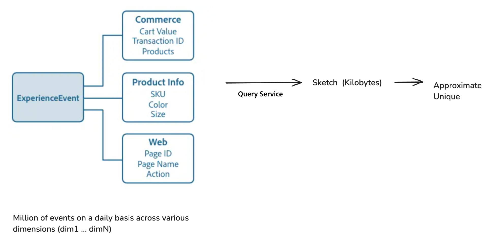

# Effiziente Big-Data-Analyse mit Hyperwürfen

>[!AVAILABILITY]
>
>Diese Funktion steht nur Benutzern zur Verfügung, die die [Data Distiller SKU](../data-distiller/overview.md) erworben haben. Wenden Sie sich für weitere Informationen an Ihren Adobe-Support-Mitarbeiter.

Erfahren Sie, wie Sie Hyperwürfel im Experience Query Service von Adobe Experience Platform verwenden können, um erweiterte Datenanalysen mit verbesserter Effizienz durchzuführen. In diesem Dokument wird beschrieben, wie Sie erweiterte Funktionen aus der [[!DNL Apache Datasketches] Bibliothek](https://datasketches.apache.org/) verwenden, um bestimmte Zählungen und komplexe Berechnungen schrittweise zu handhaben, ohne historische Daten jedes Mal erneut verarbeiten zu müssen.

Bei der Big-Data-Analyse umfasst das Generieren von Metriken wie Distinct Count, Quantiles, am häufigsten vorkommende Elemente, Joins und Diagrammanalysen häufig eine nicht additive Zählung (bei der die Ergebnisse nicht einfach aus Untergruppen zusammengefasst werden können). Herkömmliche Methoden erfordern die erneute Verarbeitung aller historischen Daten, die ressourcenintensiv und zeitaufwendig sein können. Verwenden Sie Zeichnungen, bei denen es sich um kompakte Zusammenfassungen handelt, die Wahrscheinlichkeiten für die Darstellung großer Datensätze verwenden, und erweiterte Query Service-Funktionen, um diesen Prozess zu optimieren, indem die Notwendigkeit einer Neuberechnung verringert wird.

## Schlüsselfunktionen von Hyperwürfeln {#key-functions}

Hyperwürfel bieten mehrere leistungsstarke Funktionen zur Steigerung der Effizienz und Flexibilität der Datenanalyse.

1. **Unique Users oder eindeutige Abfragen zählen**: Verwenden Sie SQL-Funktionen, um eindeutige Zählungen von Benutzern zu generieren, die mit verschiedenen Datendimensionen interagieren, z. B. Produktansichten, Site-Besuche oder Commerce-Aktivitäten, ohne die Rohdaten wiederholt zu analysieren.
2. **Inkrementelle Verarbeitung**: Führen Sie inkrementelle Aktualisierungen durch, um Datenpunkte über Dimensionen und Zeit hinweg zu falten und zusammenzuführen, ohne alles von Grund auf neu zu berechnen.
3. **Mehrdimensionale Analyse**: Hyperwürfel ermöglichen mehrdimensionales Filtern und Neuanordnen von Daten, um Zusammenfassungszeilen zu erstellen, die Kombinationen von Dimensionen darstellen. Diese Zusammenfassungen können dann verwendet werden, um Einblicke mit minimalem Rechenaufwand zu generieren.

## Anwendungsbeispiele für Hyperkuben {#use-cases}

Verwenden Sie Hyperwürfel, um effizient eindeutige Werte für verschiedene Benutzerinteraktionen zu generieren, ohne die Daten jedes Mal vollständig neu zu berechnen. Im Folgenden finden Sie einige praktische Szenarien für ihre Verwendung:

- Analysieren Sie Unique Visitors, die bestimmte Produkte während eines bestimmten Zeitraums anzeigen.
- Identifizieren Sie Benutzer, die in einem bestimmten Zeitraum mit mehreren Produkten interagieren, um die Cross-Sell-Analyse zu verbessern.
- Unterscheiden Sie Benutzer, die sich im Laufe der Zeit mit einem Produkt, aber nicht mit einem anderen beschäftigen, um Präferenzmuster zu erkennen.
- Kombinieren Sie Online- und Offline-Interaktionsdaten, um einen umfassenden Überblick über das Benutzerverhalten in einem bestimmten Zeitraum zu erhalten.
- Verfolgen Sie Benutzerbewegungen über verschiedene Aktivitäten innerhalb eines Ereignisses hinweg, um das Layout und die Dienste zu optimieren.

## Vorteile der Verwendung von Hyperkuben

In diesen Situationen können Sie grundlegende Informationen für bestimmte Kategorien vorberechnen. Bei der Analyse von Daten über mehrere Dimensionen und Zeiträume hinweg müssen Sie jedoch entweder alles aus Rohdaten neu berechnen oder einen Abfragedienst-Hyperwürfel verwenden. Hyperwürfel optimieren den Prozess, indem Daten effizient organisiert werden, was eine flexible Filterung und mehrdimensionale Analyse ohne Wiederaufbereitung ermöglicht. Sie nutzen erweiterte Funktionen, um die Ergebnisse schnell und präzise abzuschätzen und wichtige Vorteile wie verbesserte Verarbeitungseffizienz, Skalierbarkeit und Anpassungsfähigkeit für komplexe analytische Aufgaben zu bieten.

### Datengrößeneffizienz für die Abfrageverarbeitung

Query Service kann Millionen oder Milliarden von Datenpunkten (z. B. Benutzer-IDs) in eine kompakte Form komprimieren, die als Zeichnung bezeichnet wird. Diese Skizze hat eine deutlich reduzierte Datengröße für die Abfrageverarbeitung, was die Skalierbarkeit gewährleistet und die Arbeit mit dem Tool viel einfacher und schneller macht. Unabhängig davon, wie groß die ursprünglichen Daten sind, bleibt die Größe der Zeichnung klein, was die Analyse großer Daten viel besser handhabbar und effizienter macht.

Das folgende Diagramm zeigt, wie die ExperienceEvents-Dimensionen für Commerce, Produktinfo und Web zu Zeichnungen verarbeitet werden, die dann zur Ermittlung der eindeutigen Zählungen verwendet werden.



### Zusammenführen von Zeichnungen zur schnelleren und einfacheren Datenanalyse

Um eine Neuberechnung zu vermeiden und die Verarbeitungsgeschwindigkeit zu erhöhen, können Sie Zeichnungen aus verschiedenen Kategorien oder Gruppen zusammenführen. Query Service vereinfacht außerdem das Design, indem Ihre Daten in einem Hyperwürfel organisiert werden, wobei jede Zeile neben der Zeichenspalte zu einer Zusammenfassung ihrer Partition (einer Sammlung von Dimensionen) wird. Jede Zeile des Hyperwürfels enthält die Dimensionskombination, jedoch keine Rohdaten. Geben Sie beim Ausführen einer Abfrage die Dimensionsspalten an, die Sie zum Erstellen von additiven Metriken verwenden möchten, und führen Sie die Zeichnungen für diese Zeilen zusammen.


### Kostenwirksamkeit {#cost-effectiveness}

Kundendaten sind häufig in großem Maßstab, aber Sie können die Notwendigkeit einer erneuten Verarbeitung historischer Daten durch eine inkrementelle Verarbeitung vermeiden. Zeichnungen sind viel kleiner und ermöglichen schnellere Echtzeit-Ergebnisse bei gleichzeitiger Einsparung von Rechenressourcen und Kosten. Diese Datenumwandlung macht interaktive Abfragen leichter durchführbar und effizienter.

## Funktionsübersicht

In diesem Abschnitt wird erläutert, wie jede Funktion die Datenverarbeitung optimiert und die Analysefunktionen durch den effizienten Einsatz von Zeichnungen und Hyperwürfeln verbessert. Sie beschreibt den Zweck, die Beispielsyntax, die Parameter und die erwartete Ausgabe.

### Erstellen einzigartiger Zählerschätzungen mit HLL-Skizzen

`hll_build_agg` ist eine Aggregatfunktion, die eine HLL-Zeichnung (HyperLogLog) erstellt. Diese Funktion ist eine kompakte, probabilistische Methode zur Schätzung der Anzahl eindeutiger Werte innerhalb einer Spalte oder eines Ausdrucks in einem gruppierten Datensatz.

#### Funktionsdefinition

```sql
hll_build_agg(column [, lgConfigK])
```

**Nutzung:**

Das folgende Beispiel zeigt, wie die Funktion in einer Abfrage strukturiert sein kann.

```sql
SELECT
   [dim1, dim2 ... ,] hll_build_agg(coalesce(col1, col2, col3)) AS sketch_col
FROM fact_sketch_table
  [GROUP BY dimension1, dimension2 ...]
```

#### Parameter

| Parameter | Beschreibung |
|---------------------------|---------------------------------------|
| `column` | Der Spaltenname, für den eine Zeichnung erstellt werden soll. |
| `lgConfigK` | *Int* (Optional) Die log-base-2 von K, wobei K die Anzahl der Buckets oder Slots für die HLL Sketch ist. Mindestwert: 4. Max. Wert: 12. Standardwert: 12. |

#### Ausgabe

| Ausgabespalte | Beschreibung |
|---------------------------|---------------------------------------|
| `sketch_res` | Eine Spalte des Typs Zeichenfolge, die die zeichenbehaftete HLL-Zeichnung enthält. |

#### SQL-Beispiel

Im folgenden Beispiel wird eine Aggregatskizze für die Spalte `customer_id` erstellt:

```sql
SELECT
  country,
  hll_build_agg(customer_id, 10) AS sketch
FROM
  EXPLODE(
    ARRAY<STRUCT<country STRING, customer_id STRING, invoice_id STRING>>[
      ('UA', 'customer_id_1', 'invoice_id_11'),
      ('CZ', 'customer_id_2', 'invoice_id_22'),
      ('CZ', 'customer_id_2', 'invoice_id_23'),
      ('BR', 'customer_id_3', 'invoice_id_31'),
      ('UA', 'customer_id_2', 'invoice_id_24')
    ])
GROUP BY country;
```

**SQL-Beispielausgabe:**

| Land | Zeichnung |
|---------|------------------------------------------------------------|
| UA | AgEHBAMAAgCR9mUEulKKCQAAAAAAAAAAAAAAAAAAAAAAAAAAAAAAAAAAAA== |
| CZ | AgEHBAMAAQC6UooJAAAAAAAAAAAAAAAAAAAAAAAAAAAAAAAAAAAAAAAAAA== |
| BR | AgEHBAMAAQCcmH0HAAAAAAAAAAAAAAAAAAAAAAAAAAAAAAAAAAAAAAAAAA== |

### Geschätzte eindeutige Zählungen mit HLL-Zeichnungen

`hll_estimate` ist eine skalare Funktion, die eine Schätzung der eindeutigen Anzahl innerhalb jeder Zeile eines Datensatzes liefert. Im Gegensatz zu Aggregatfunktionen operiert `hll_estimate` im Zeilenmodus und wird zur Schätzung der Distinct Count von einer Zeichnung in einzelnen Zeilen verwendet.

>[!NOTE]
>
>Diese Funktion kann nicht als aggregierte Funktion verwendet werden. Verwenden Sie für aggregierte Zählungen `sketch_count`.

#### Funktionsdefinition

```sql
hll_estimate(sketch_col)
```

**Nutzung:**

Das folgende Beispiel zeigt, wie die Funktion in einer Abfrage strukturiert sein kann.

```sql
SELECT
   [col1, col2 ... ,] hll_estimate(sketch_column) AS estimate
FROM fact_sketch_table
```

#### Parameter

| Parameter | Beschreibung |
|---------------------------|---------------------------------------|
| `sketch_column` | Spalte mit einer stringierten HLL-Zeichnung. Sie schätzt die eindeutige Anzahl für die Zeichnung in jeder Zeile. |

#### Ausgabe

| Ausgabespalte | Beschreibung |
|---------------------------|---------------------------------------|
| `estimate` | Eine Spalte vom Typ double , die die Schätzung der Zeichnung liefert und auf zwei Dezimalstellen gerundet ist. |

#### SQL-Beispiel

Im folgenden Beispiel wird die unterschiedliche Anzahl von Kunden nach Ländern mithilfe der Funktion `hll_estimate` in einer HLL-Zeichnung geschätzt:

```sql
SELECT
  country,
  hll_estimate(hll_build_agg(customer_id, 10)) AS distinct_customers_by_country
FROM
  (
    SELECT
      country,
      hll_build_agg(customer_id, 10) AS sketch
    FROM 
      EXPLODE(
        ARRAY<STRUCT<country STRING, customer_id STRING, invoice_id STRING>>[
          ('UA', 'customer_id_1', 'invoice_id_11'),
          ('CZ', 'customer_id_2', 'invoice_id_22'),
          ('CZ', 'customer_id_2', 'invoice_id_23'),
          ('BR', 'customer_id_3', 'invoice_id_31'),
          ('UA', 'customer_id_2', 'invoice_id_24')
        ])
    GROUP BY country
  );
```

**SQL-Beispielausgabe:**

| Land | distinct_Customers_by_country |
|---------|-------------------------------|
| UA | 2,00 |
| CZ | 1,00 |
| BR | 1,00 |

### Zusammenführen mehrerer HLL-Zeichnungen mit `hll_merge_agg`

`hll_merge_agg` ist eine Aggregatfunktion, die mehrere HLL-Zeichnungen innerhalb einer Gruppe zusammenführt und eine neue Zeichnung als Ausgabe erzeugt. Dies ermöglicht die Kombination von Zeichnungen über Partitionen oder Dimensionen hinweg und erhöht die Flexibilität der Datenanalyse.

#### Funktionsdefinition

```sql
hll_merge_agg(sketch_col [, allowDifferentLgConfigK])
```

**Nutzung:**

Das folgende Beispiel zeigt, wie die Funktion in einer Abfrage strukturiert sein kann.

```sql
SELECT
   [dim1, dim2 ... ,] hll_merge_agg(sketch_column.sketch) AS estimate
FROM fact_sketch_table
  [GROUP BY dimension1, dimension2 ...]
```

#### Parameter

| Parameter | Beschreibung |
|---------------------------|---------------------------------------|
| `sketch_column` | Spalte mit der stringifizierten HLL-Zeichnung. |
| `allowDifferentLgConfigK` | *Boolean* (Optional) Wenn auf &quot;true&quot;gesetzt, ermöglicht das Zusammenführen von Zeichnungen mit verschiedenen `lgConfigK` -Werten. Der Standardwert ist false. Eine Ausnahme wird ausgelöst, wenn der Wert &quot;false&quot;ist und Zeichnungen unterschiedliche `lgConfigK` -Werte aufweisen. |

>[!NOTE]
>
>Wenn `allowDifferentLgConfigK` auf &quot;false&quot;gesetzt ist, führt das Zusammenführen von Zeichnungen mit verschiedenen `lgConfigK` -Werten zu einem `UnsupportedOperationException`.

#### Ausgabe

| Ausgabespalte | Beschreibung |
|----------------|-------------------------------------------------|
| `sketch_res` | Eine Spalte vom Typ HLL-Zeichnung, die die zeichenbehaftete zusammengeführte HLL-Zeichnung enthält. |

#### SQL-Beispiel

Im folgenden Beispiel werden mehrere HLL-Zeichnungen in der Spalte `customer_id` zusammengeführt:

```sql
SELECT
   hll_merge_agg(hll_sketch) AS uniq_customers_with_invoice
FROM
  (
    SELECT
      country,
      hll_build_agg(customer_id) AS hll_sketch
    FROM
      EXPLODE(
        ARRAY<STRUCT<country STRING, customer_id STRING, invoice_id STRING>>[
          ('UA', 'customer_id_1', 'invoice_id_11'),
          ('BR', 'customer_id_3', 'invoice_id_31'),
          ('CZ', 'customer_id_2', 'invoice_id_22'),
          ('CZ', 'customer_id_2', 'invoice_id_23'),
          ('BR', 'customer_id_3', 'invoice_id_31'),
          ('UA', 'customer_id_2', 'invoice_id_24')
        ])
    GROUP BY country
    UNION
    SELECT
      country,
      hll_build_agg(customer_id) AS hll_sketch
    FROM
      EXPLODE(
        ARRAY<STRUCT<country STRING, customer_id STRING, invoice_id STRING>>[
          ('UA', 'customer_id_1', 'invoice_id_21'),
          ('MX', 'customer_id_3', 'invoice_id_31'),
          ('MX', 'customer_id_2', 'invoice_id_21')
        ])
    GROUP BY country
  )
GROUP BY customer_id;
```

**SQL-Beispielausgabe:**

| Land | hll_merge_agg(sketch, true) |
|---------|--------------------------------------------|
| UA | AgEHDAMAAwiR9mUEulKKCQAAAAAAAAAAAAAA== |
| CZ | AgEHDAMAAQi6UooJAAAAAAAAAAAAAAAAAAAAAAAA== |
| BR | AgEHDAMAAQicmH0HAAAAAAAAAAAAAAAAAAAAAAAA== |
| MX | AgEHFQMAAgiGL/kNdAAAAAAAAAAAAAAAAAAAAAAAAAAA== |

### Geschätzte Kardinalität mit `hll_merge_count_agg`

`hll_merge_count_agg` ist eine Aggregatfunktion, die die Kardinalität (Anzahl eindeutiger Elemente) aus einer oder mehreren Zeichnungen innerhalb einer Spalte schätzt. Es wird eine einzelne Schätzung für alle Zeichnungen zurückgegeben, die innerhalb der Gruppierung gefunden wurden. Diese Funktion wird zum Aggregieren von Zeichnungen verwendet und kann nicht als Zeilenumbruch verwendet werden. Verwenden Sie für row-weise Schätzungen `sketch_estimate`.

#### Funktionsdefinition

```sql
hll_merge_count_agg(sketch_col [, allowDifferentLgConfigK])
```

**Nutzung:**

Das folgende Beispiel zeigt, wie die Funktion in einer Abfrage strukturiert sein kann.

```sql
SELECT
   [dim1, dim2 ... ,] hll_merge_count_agg(sketch_column) AS estimate
FROM fact_sketch_table
  [GROUP BY dimension1, dimension2 ...]
```

#### Parameter

| Parameter | Beschreibung |
|-------------------------|----------------------------------------------|
| `sketch_column` | Eine Spalte mit der stringifizierten HLL-Zeichnung. |
| `allowDifferentLgConfigK` | *Boolean* (Optional) Der Standardwert ist &quot;false&quot;. Wenn der Wert auf &quot;true&quot;gesetzt ist, ermöglicht dies das Zusammenführen von Zeichnungen mit verschiedenen `lgConfigK` -Werten. Andernfalls wird ein `UnsupportedOperationException` ausgegeben. |

#### Ausgabe

| Ausgabespalte | Beschreibung |
|---------------|----------------------------------------------------------|
| `estimate` | Eine Spalte des Typs &quot;Double&quot;zur Schätzung der Zeichnung. |

#### SQL-Beispiel

Im folgenden Beispiel wird die Anzahl der Unique Customers mit Rechnungen mithilfe der Funktion `hll_merge_count_agg` geschätzt:

```sql
SELECT
   hll_merge_count_agg(hll_sketch) AS uniq_customers_with_invoice
FROM
  (
    SELECT
      country,
      hll_build_agg(customer_id) AS hll_sketch
    FROM
      EXPLODE(
        ARRAY<STRUCT<country STRING, customer_id STRING, invoice_id STRING>>[
          ('UA', 'customer_id_1', 'invoice_id_11'),
          ('BR', 'customer_id_3', 'invoice_id_31'),
          ('CZ', 'customer_id_2', 'invoice_id_22'),
          ('CZ', 'customer_id_2', 'invoice_id_23'),
          ('BR', 'customer_id_3', 'invoice_id_31'),
          ('UA', 'customer_id_2', 'invoice_id_24')
        ])
    GROUP BY country
    UNION
    SELECT
      country,
      hll_build_agg(customer_id) AS hll_sketch
    FROM
      EXPLODE(
        ARRAY<STRUCT<country STRING, customer_id STRING, invoice_id STRING>>[
          ('UA', 'customer_id_1', 'invoice_id_21'),
          ('MX', 'customer_id_3', 'invoice_id_31'),
          ('MX', 'customer_id_2', 'invoice_id_21')
        ])
    GROUP BY country
  )
GROUP BY customer_id;
```

**SQL-Beispielausgabe:**

| Land | hll_merge_count_agg(sketch, true) |
|---------|----------------------------------|
| UA | 2.0 |
| CZ | 1,0 |
| BR | 1,0 |
| MX | 2.0 |

## Einschränkungen

Derzeit können Zeichnungen nicht aktualisiert werden, nachdem sie erstellt wurden. Zukünftige Aktualisierungen werden die Möglichkeit bieten, Zeichnungen zu aktualisieren. Mit dieser Funktion können Sie verpasste Läufe und verspätete Daten effektiver handhaben.

## Nächste Schritte

Durch Lesen dieses Dokuments wissen Sie jetzt, wie Sie Hyperwürfel und zugehörige Zeichenfunktionen verwenden können, um eine effiziente Datenverarbeitung für komplexe, multidimensionale Analysen durchzuführen, ohne dass historische Daten erneut verarbeitet werden müssen. Dieser Ansatz spart Zeit, senkt Kosten und bietet die Flexibilität, die für interaktive Echtzeitabfragen erforderlich ist. Dadurch wird er zu einem wertvollen Werkzeug für die Big-Data-Analyse in Adobe Experience Platform.

Erkunden Sie als Nächstes andere Schlüsselkonzepte wie das [inkrementelle Laden](../key-concepts/incremental-load.md) und die [Datendeduplizierung](../key-concepts/deduplication.md), um Ihr Verständnis dafür zu vertiefen, wie Sie diese Funktionen effektiv für Ihre spezifischen Datenanforderungen verwenden können.


