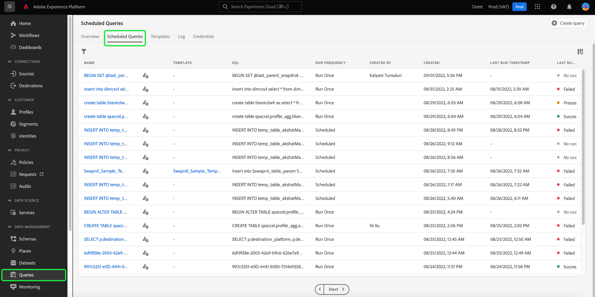
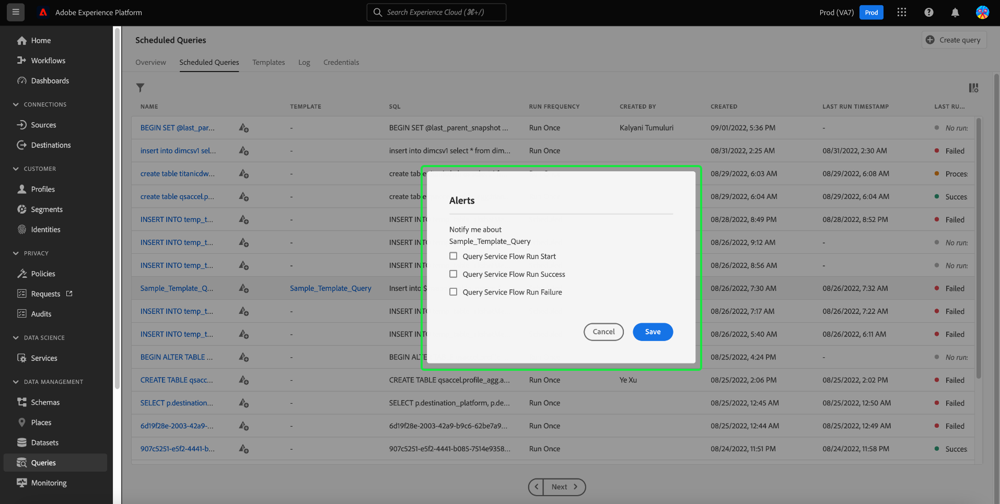

# Abfragen überwachen

Adobe Experience Platform bietet über die Benutzeroberfläche eine verbesserte Sichtbarkeit für den Status aller Abfrageaufträge. Von [!UICONTROL Geplante Abfragen] -Registerkarte finden Sie jetzt wichtige Informationen zu Ihren Abfrageausführungen, die den Status, die Planungsdetails und Fehlermeldungen/Codes für den Fall eines Fehlschlagens enthalten. Sie können Warnhinweise für Abfragen auf Grundlage ihres Status auch über die Benutzeroberfläche für diese Abfragen abonnieren. [!UICONTROL Geplante Abfragen] Registerkarte.

## [!UICONTROL Geplante Abfragen]

Die [!UICONTROL Geplante Abfragen] bietet einen Überblick über die ausgeführten und geplanten Abfragen. Der Arbeitsbereich enthält alle CTAS- und ITAS-Abfragen, die entweder ausgeführt werden sollen oder mindestens einmal ausgeführt wurden. Ausführungsdetails finden Sie für alle geplanten Abfragen sowie Fehlercodes und Meldungen für fehlgeschlagene Abfragen.

So navigieren Sie zum [!UICONTROL Geplante Abfragen] Registerkarte, wählen Sie **[!UICONTROL Abfragen]** aus der linken Navigationsleiste, gefolgt von **[!UICONTROL Geplante Abfragen]**

In der folgenden Tabelle werden die einzelnen verfügbaren Spalten beschrieben.

>[!NOTE]
>
>Das Abonnementsymbol für Warnhinweise ist in jeder Zeile einer Spalte ohne Titel enthalten. Siehe [Warnhinweis-Abonnements](#alert-subscription) für weitere Informationen.

| Spalte | Beschreibung |
|---|---|
| Name | Das Namensfeld ist entweder der Vorlagenname oder die ersten Zeichen Ihrer SQL-Abfrage. Jede Abfrage, die über die Benutzeroberfläche mit dem Abfrage-Editor erstellt wurde, wird zu Beginn benannt. Wenn die Abfrage über die API erstellt wurde, ist der Name der Abfrage ein Snippet der ursprünglichen SQL, die zur Erstellung der Abfrage verwendet wurde. |
| Vorlage | Der Vorlagenname der Abfrage. Wählen Sie einen Vorlagennamen aus, um zum Abfrage-Editor zu navigieren. Die Abfragevorlage wird aus praktischen Gründen im Abfrage-Editor angezeigt. Wenn kein Vorlagenname vorhanden ist, wird die Zeile mit einem Bindestrich markiert und es ist nicht möglich, zum Abfrage-Editor umzuleiten, um die Abfrage anzuzeigen. |
| SQL | Ein Ausschnitt der SQL-Abfrage. |
| Ausführungsfrequenz | Dies ist die Kadenz, in der Ihre Abfrage ausgeführt werden soll. Die verfügbaren Werte sind `Run once` und `Scheduled`. Abfragen können entsprechend ihrer Ausführungsfrequenz gefiltert werden. |
| Erstellt von | Der Name des Benutzers, der die Abfrage erstellt hat. |
| Erstellt | Der Zeitstempel der Erstellung der Abfrage im UTC-Format. |
| Zeitstempel der letzten Ausführung | Der letzte Zeitstempel, mit dem die Abfrage ausgeführt wurde. Diese Spalte zeigt, ob eine Abfrage gemäß ihrem aktuellen Zeitplan ausgeführt wurde. |
| Letzter Ausführungsstatus | Der Status der letzten Abfrageausführung. Die drei Statuswerte sind: `successful` `failed` oder `in progress`. |

>[!TIP]
>
>Wenn Sie zum Abfrage-Editor navigieren, können Sie **[!UICONTROL Abfragen]** , um zur [!UICONTROL Vorlagen] Registerkarte.

### Anpassen von Tabelleneinstellungen für geplante Abfragen

Sie können die Spalten im [!UICONTROL Geplante Abfragen] nach Ihren Anforderungen. Wählen Sie das Einstellungssymbol (), um die [!UICONTROL Tabelle anpassen] Dialogfeld &quot;Einstellungen&quot;öffnen und verfügbare Spalten bearbeiten.

Schalten Sie die entsprechenden Kontrollkästchen um, um eine Tabellenspalte zu entfernen oder hinzuzufügen. Wählen Sie als Nächstes **[!UICONTROL Anwenden]** um Ihre Auswahl zu bestätigen.

>[!NOTE]
>
>Jede Abfrage, die über die Benutzeroberfläche erstellt wurde, wird als Teil des Erstellungsprozesses zu einer benannten Vorlage. Der Vorlagenname wird in der Vorlagenspalte angezeigt. Wenn die Abfrage über die API erstellt wurde, ist die Vorlagenspalte leer.

### Warnhinweise abonnieren {#alert-subscription}

Sie können Warnhinweise über [!UICONTROL Geplante Abfragen] Registerkarte. Wählen Sie das Warnhinweissymbol () neben dem Namen einer Abfrage klicken, um die [!UICONTROL Warnhinweise] angezeigt. Die [!UICONTROL Warnhinweise] -Dialogfeld abonniert sowohl Benutzeroberflächenbenachrichtigungen als auch E-Mail-Warnungen. Warnhinweise basieren auf dem Status der Abfrage. Es stehen drei Optionen zur Verfügung: `start`, `success`und `failure`. Aktivieren Sie die entsprechenden Kontrollkästchen und wählen Sie **[!UICONTROL Speichern]** abonnieren.

<!-- This dialog will be updated before release. THe image below will need to be updated inline with these changes. -->

<!-- Link to alert subscriptions doc when available -->

### Abfragen filtern

Sie können Abfragen nach der Ausführungsfrequenz filtern. Aus dem [!UICONTROL Geplante Abfragen] Wählen Sie das Filtersymbol (), um die Filterseitenleiste zu öffnen.

Wählen Sie entweder **[!UICONTROL Geplant]** oder **[!UICONTROL Einmal ausführen]** Checkboxes für Frequenzfilter zum Filtern der Abfrageliste.

>[!NOTE]
>
>Jede Abfrage, die ausgeführt, aber nicht geplant wurde, qualifiziert sich als [!UICONTROL Einmal ausführen].

Nachdem Sie die Filterkriterien aktiviert haben, wählen Sie **[!UICONTROL Filter ausblenden]** , um den Filterbereich zu schließen.

## Details zum Zeitplan für Abfragen

Wählen Sie einen Abfragenamen aus, um zur Seite mit den Zeitplandetails zu navigieren. Diese Ansicht enthält eine Liste aller ausgeführten Vorgänge im Rahmen dieser geplanten Abfrage. Die bereitgestellten Informationen umfassen die Anfangs- und Endzeit, den Status und den verwendeten Datensatz.

Diese Informationen werden in einer fünfspaltigen Tabelle bereitgestellt. Jede Zeile bezeichnet die Ausführung einer Abfrage.

| Spaltenname | Beschreibung |
|---|---|
| Abfragelaufkennung | Die Kennung der täglichen Ausführung der Abfrage. |
| Start der Abfrage | Der Zeitstempel, zu dem die Abfrage ausgeführt wurde. Dies liegt im UTC-Format vor. |
| Abschluss der Abfrage | Der Zeitstempel, zu dem die Abfrage abgeschlossen wurde. Dies liegt im UTC-Format vor. |
| Status | Der Status der letzten Abfrageausführung. Die drei Statuswerte sind: `successful` `failed` oder `in progress`. |
| Datensatz | Der an der Ausführung beteiligte Datensatz. |

Details zur geplanten Abfrage finden Sie im Abschnitt [!UICONTROL Eigenschaften] Bereich. Dieses Bedienfeld enthält die anfängliche Abfrage-ID, den Client-Typ, den Vorlagennamen, die Abfrage-SQL und die Gültigkeit des Zeitplans.

### Ausführungsdetails

Wählen Sie eine ID für die Abfrageausführung aus, um zur Seite mit den Ausführungsdetails zu navigieren und Abfrageinformationen anzuzeigen.

Diese Ansicht enthält Informationen zu den einzelnen Ausführungen für diese geplante Abfrage sowie eine detailliertere Aufschlüsselung des Ausführungsstatus. Auf dieser Seite finden Sie außerdem die Client-Informationen und Details zu Fehlern, die zum Fehlschlagen der Abfrage geführt haben.

Der Abschnitt &quot;Abfragestatus&quot;enthält den Fehlercode und die Fehlermeldung, falls die Abfrage fehlschlägt.

Sie können die Abfrage-SQL aus dieser Ansicht in die Zwischenablage kopieren. Wählen Sie das Kopiersymbol oben rechts im SQL-Snippet aus, um die Abfrage zu kopieren. Eine Popup-Meldung bestätigt, dass der Code kopiert wurde.

Auswählen **[!UICONTROL Abfrage]** , um zum Bildschirm mit den Zeitplandetails zurückzukehren, oder **[!UICONTROL Geplante Abfragen]** , um zur [!UICONTROL Geplante Abfragen] Registerkarte.

