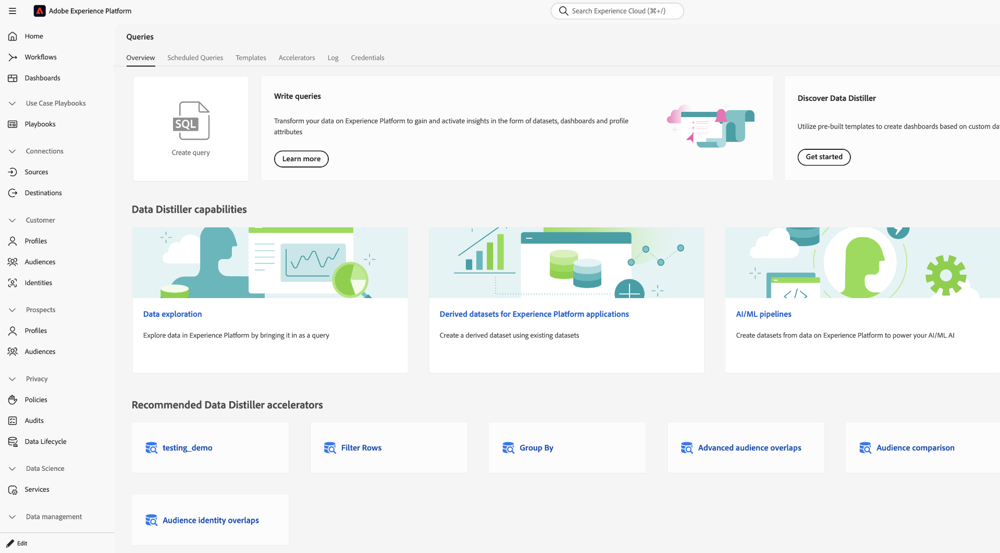
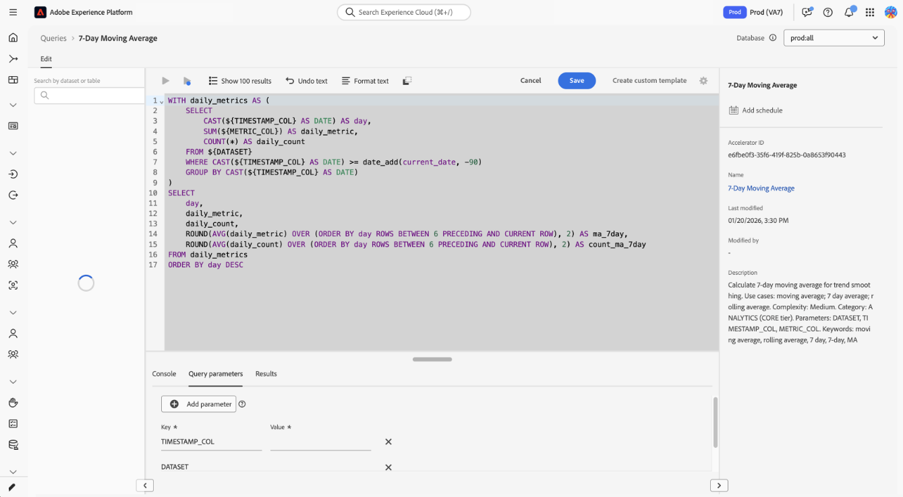

# Daten-Distiller-Beschleuniger {#data-distiller-accelerators}

Data Distiller Accelerators sind von Adobe erstellte, parametrisierte SQL-Vorlagen, die für gängige Analyseszenarien entwickelt wurden. Verwenden Sie Accelerators, um gängige Analysen auszuführen, ohne SQL von Grund auf neu zu schreiben. Die Beschleuniger sind schreibgeschützt und werden von Adobe gepflegt, um die Konsistenz in Ihrer gesamten Organisation sicherzustellen. Wenn Sie eine Vorlage ändern müssen, können Sie sie als benutzerdefinierte Vorlage klonen.

Lesen Sie dieses Handbuch, um zu erfahren, wie Sie im [!UICONTROL Queries]-Arbeitsbereich Beschleuniger ausführen, planen und klonen können.

>[!AVAILABILITY]
>
>Data Distiller Accelerators sind nur für Unternehmen mit einer Data Distiller SKU verfügbar. Für die Registerkarte &quot;[!UICONTROL Accelerators]&quot; und zugehörige Workflows ist das Add-on Data Distiller erforderlich. Weitere Informationen finden Sie [Übersicht zu Data &#x200B;](../data-distiller/overview.md) oder wenden Sie sich an Ihren Adobe-Support-Mitarbeiter.

## Voraussetzungen {#prerequisites}

Bevor Sie beginnen, stellen Sie sicher, dass Sie die folgenden Anforderungen erfüllen:

* Sie haben Zugriff auf den [!UICONTROL Queries] Arbeitsbereich in Experience Platform.
* Sie wissen[&#x200B; wie Sie den Abfrage-Editor verwenden und Abfragen ausführen](./user-guide.md).
* Sie kennen [parametrisierte Abfragen](./parameterized-queries.md) (Platzhalter in SQL zur Laufzeit ersetzt).

## Verwendung von -Beschleunigern {#when-to-use}

Verwenden Sie Accelerators, wenn Sie vorgefertigte SQL-Abfragen für gängige Analysemuster wie funnel-Analysen, angepasste Durchschnittswerte oder Zielgruppenüberschneidungen benötigen. Wenn für Ihren Anwendungsfall kein Beschleuniger geeignet ist, [&#x200B; Sie eine benutzerdefinierte Abfrage im Abfrage-Editor &#x200B;](./user-guide.md#query-authoring) oder fordern Sie einen neuen Beschleuniger an (siehe [Neuen Beschleuniger anfordern](#request-accelerator)).

Eine kleine Gruppe von Beschleunigern wird als Dashboard für die sofortige Analyse geöffnet, während andere im Abfrage-Editor geöffnet werden, in dem Sie die Logik ausführen, planen oder anpassen können. Im Abschnitt [Dashboard-verknüpfte &#x200B;](#dashboard-accelerators)&quot; erfahren Sie, wie diese vorkonfigurierten Visualisierungen Einblicke in Ihre Zielgruppendaten bieten.

Um mit der Verwendung von Beschleunigern zu beginnen, navigieren Sie zum Arbeitsbereich **[!UICONTROL Queries]** und öffnen Sie die Registerkarte **[!UICONTROL Accelerators]** oder die Registerkarte **[!UICONTROL Overview]** .

## Pfade zur Beschleunigererkennung {#discovery-paths}

Sie können über den Arbeitsbereich „Abfragen“ auf zwei Arten auf die Beschleunigerfunktion zugreifen, je nachdem, ob Sie den vollständigen Katalog oder die empfohlenen Vorlagen verwenden möchten.

### Verwenden der Registerkarte „Beschleuniger“

Verwenden Sie diesen Pfad, wenn Sie alle verfügbaren Beschleuniger durchsuchen möchten. Um den Katalog mit den vollständigen Beschleunigern zu öffnen, klicken Sie im linken Navigationsbereich auf **[!UICONTROL Queries]** und wählen Sie dann die Registerkarte **[!UICONTROL Accelerators]** aus.

Der Arbeitsbereich zeigt eine Tabelle mit Beschleunigern mit Namen, SQL-Vorschauen und Zeitstempeln an. Wählen Sie einen Namen für einen Beschleuniger aus, um ihn im Abfrage-Editor zu öffnen.

>[!NOTE]
>
>Alle auf der Registerkarte **[!UICONTROL Accelerators]** ausgewählten Beschleuniger werden im Abfrage-Editor geöffnet.

### Verwenden der Registerkarte „Übersicht“

Verwenden Sie diesen Pfad, wenn Sie schnellen Zugriff auf dringend empfohlene Beschleuniger benötigen. Navigieren Sie zu **[!UICONTROL Queries]** und wählen Sie dann die Registerkarte **[!UICONTROL Overview]** aus. Wählen Sie als Nächstes eine Karte aus dem Abschnitt **[!UICONTROL Recommended Data Distiller accelerators]** aus.

Die meisten Beschleuniger werden im Abfrage-Editor geöffnet. Eine kleine Gruppe von Beschleunigern wird als Dashboards mit vordefinierten Visualisierungen geöffnet. Wenn die Karte ein Dashboard anstelle des Abfrage-Editors öffnet, finden Sie weitere Informationen unter [Dashboard-verknüpfte Beschleuniger](#dashboard-accelerators).

## Öffnen eines Beschleunigers im Abfrage-Editor {#open-accelerator}

In diesem Abschnitt wird erläutert, was beim Öffnen eines Beschleunigers im Abfrage-Editor geschieht und welche Aktionen Sie als Nächstes ausführen können, z. B. Ausführen des Beschleunigers, Planen des Beschleunigers oder Erstellen einer benutzerdefinierten Vorlage.

Nach dem Öffnen eines Beschleunigers können **den** ausführen, um Ergebnisse anzuzeigen **den** automatisch auszuführen oder **eine benutzerdefinierte Vorlage erstellen**, um die SQL zu ändern.

>[!NOTE]
>
>Wenn Sie einen Beschleuniger im Abfrage-Editor öffnen, wird die SQL vorab in einem schreibgeschützten Status geladen und Symbolleistenaktionen wie [!UICONTROL Show results], [!UICONTROL Undo text] [!UICONTROL Format text] deaktiviert.

Das rechte Bedienfeld zeigt Metadaten wie **[!UICONTROL Accelerator ID]**, **[!UICONTROL Name]** und Änderungsdetails an und bietet über **[!UICONTROL Add schedule]** Zugriff auf die Zeitplanung.

### Parameter angeben und einen Beschleuniger ausführen {#provide-parameters-execute}

Um den Beschleuniger auszuführen, müssen Sie zunächst Werte für alle erforderlichen Parameter angeben. Parameter verwenden die `${PARAMETER_NAME}` Syntax und werden auf der Registerkarte **[!UICONTROL Query parameters]** unter dem Editor angezeigt. `${START_DATE}` erfordert beispielsweise einen Datumswert im `YYYY-MM-DD`-Format (z. B. `2024-01-01`) und `${AUDIENCE_ID}` eine bestimmte Zielgruppenkennung.

So führen Sie einen Beschleuniger aus:

1. Wählen Sie **[!UICONTROL Query parameters]** aus und geben Sie für jeden Parameter einen Wert ein.
2. Wählen Sie das Wiedergabesymbol () In der Symbolleiste.

Der Beschleuniger wird ausgeführt und zeigt die Ergebnisse auf der Registerkarte **[!UICONTROL Results]** an. Diese Ergebnisse werden nur dann in einem Datensatz beibehalten, wenn Sie **[!UICONTROL Run as CTAS]** oder den Beschleuniger planen.

Weitere Informationen zu parametrisierten Abfragen finden Sie unter [Parametrisierte Abfragen im Abfrage-Editor](./parameterized-queries.md).

## Beibehalten von Ergebnissen aus einem Accelerator {#persist-results}

Nachdem Sie einen Beschleuniger ausgeführt und die Ergebnisse bestätigt haben, können Sie die Ausgabe in einem Datensatz beibehalten.

Um einen Datensatz aus den Ergebnissen zu erstellen, wählen Sie **[!UICONTROL Save]** aus, um den Accelerator als Vorlage zu speichern, und wählen Sie dann **[!UICONTROL Run as CTAS]** aus. Das Dialogfeld **[!UICONTROL Enter output dataset details]** wird angezeigt. Geben Sie einen Datensatznamen und eine optionale Beschreibung ein und bestätigen Sie dann, dass Sie den Datensatz erstellen möchten. Diese Aktion erstellt einen neuen Datensatz und schreibt die Ergebnisse in ihn.

![Das Dialogfeld &quot;[!UICONTROL Enter output dataset details]&quot; mit ausgefülltem Datensatznamen und Beschreibung.](../images/ui/accelerators/output-dataset-details-dialog.png)

## Planen eines Beschleunigers {#schedule-accelerator}

Um die Ausführung eines Beschleunigers mit festen Parameterwerten zu planen, wählen Sie im rechten Bedienfeld **[!UICONTROL Add schedule]** aus.

>[!TIP]
>
>Bevor Sie einen Zeitplan festlegen, sollten Sie sich mit den erforderlichen Parameterwerten vertraut machen. Führen Sie zuerst den -Beschleuniger aus, um die Ergebnisse zu überprüfen.

Das Dialogfeld für die Zeitplankonfiguration wird angezeigt.

Im Dialogfeld für die Zeitplankonfiguration müssen Sie erneut eine Häufigkeit, einen Zeitrahmen, einen Ausgabedatensatz und Parameterwerte angeben. Im Abfrage-Editor eingegebene Parameterwerte werden nicht in die Zeitplankonfiguration übernommen. Im Abschnitt **[!UICONTROL Dataset details]** können Sie zwischen **[!UICONTROL Append into existing dataset]** und **[!UICONTROL Create and append into new dataset]** wählen. Nach der Konfiguration des Zeitplans wird der Beschleuniger automatisch auf der Grundlage Ihrer Einstellungen ausgeführt und schreibt die Ergebnisse in den ausgewählten Datensatz.

Vollständige schrittweise Anweisungen finden Sie im Handbuch [Erstellen eines &#x200B;](./query-schedules.md#create-schedule)&quot;.

## Erstellen einer benutzerdefinierten Vorlage aus einem Accelerator {#create-custom-template}

Wenn Sie die SQL ändern oder die Logik unter Ihrer eigenen Konfiguration wiederverwenden müssen, können Sie eine benutzerdefinierte Vorlage aus einem Accelerator erstellen. Öffnen Sie zunächst einen Beschleuniger im Abfrage-Editor und wählen Sie dann **[!UICONTROL Create custom template]** aus. Ändern Sie die SQL und die Details nach Bedarf und wählen Sie **[!UICONTROL Save]** oder **[!UICONTROL Save and close]** aus, um die Vorlage zu speichern.

Nach dem Speichern kann die Vorlage bearbeitet und ausgeführt, geplant oder mit CTAS verwendet werden. Die Vorlage wird auf der Registerkarte **[!UICONTROL Templates]** gespeichert, wo Sie sie wie jede andere Vorlage verwalten können. Weitere Informationen finden Sie unter [Abfragevorlagen](./query-templates.md).

### Was sich beim Erstellen einer benutzerdefinierten Vorlage ändert {#custom-template-differences}

Die geklonte Vorlage unterscheidet sich vom ursprünglichen Beschleuniger, da die SQL bearbeitbar ist. Sie können Änderungen speichern, die Vorlage löschen und planen. Das Feld **[!UICONTROL Modified by]** zeigt Ihren Namen an. Die Vorlage befindet sich auf der Registerkarte **[!UICONTROL Templates]** anstelle von **[!UICONTROL Accelerators]**.

## Dashboard-verknüpfte Beschleuniger {#dashboard-accelerators}

Einige Beschleuniger auf der Registerkarte **[!UICONTROL Overview]** werden als Dashboards anstelle von SQL-Abfragen geöffnet. Diese Beschleuniger bieten vorgefertigte Visualisierungen zur Analyse von Zielgruppendaten und erfordern keine Parametereingabe oder manuelle Ausführung.

Die folgenden Accelerators werden im Arbeitsbereich &quot;**[!UICONTROL Dashboards]**&quot; geöffnet:

**[!UICONTROL Advanced Audience Overlaps]** analysiert Schnittpunkte zwischen ausgewählten Zielgruppen oder in Ihrem gesamten Zielgruppensatz, um Überschneidungsmuster zu identifizieren. Verwenden Sie diese Einblicke, um die Segmentierung zu verfeinern und redundantes Targeting zu reduzieren.

**[!UICONTROL Audience Comparison]** vergleicht Schlüsselmetriken zwischen zwei Zielgruppen nebeneinander, einschließlich Größe, Identitätszusammensetzung und Änderungen im Laufe der Zeit. Verwenden Sie diese Ansicht, um Leistungsunterschiede auszuwerten und Entscheidungen über die Zielgruppenbestimmung zu treffen.

**[!UICONTROL Audience Trends]** verfolgt, wie sich Zielgruppenmetriken im Laufe der Zeit ändern, einschließlich der Größe der Zielgruppe und der Anzahl der Identitäten. Verwenden Sie diese Trends, um das Wachstum zu überwachen und die Auswirkungen von Segmentierungsstrategien zu bewerten.

**[!UICONTROL Audience Identity Overlaps]** untersucht, wie sich Identitätstypen in ausgewählten Zielgruppen überschneiden, um Identitätsbeziehungen zu verstehen. Verwenden Sie diese Analyse, um die Identitätszuordnung und die Segmentierungsgenauigkeit zu verbessern.

Nachdem sich das Dashboard geöffnet hat, können Sie die verfügbaren Steuerelemente und Filter verwenden, um Zielgruppendaten zu untersuchen und zu vergleichen. Weitere Informationen finden Sie unter [Dashboard-Vorlagen](../../dashboards/sql-insights-query-pro-mode/templates/overview.md).

## Einen neuen Beschleuniger anfordern {#request-accelerator}

Wenn Sie einen wiederkehrenden Anwendungsfall haben, der nicht von den vorhandenen Accelerators abgedeckt wird, senden Sie eine Anfrage über Ihren Adobe-Support-Kanal. Adobe bewertet Anfragen anhand gängiger Nutzungsmuster und branchenüblicher Anwendbarkeit.

## Nächste Schritte {#next-steps}

Sie können jetzt Accelerators verwenden, um gängige analytische Abfragen auszuführen und zu automatisieren.

Um Ihre Workflows zu erweitern, erstellen und durchsuchen Sie [Abfragevorlagen](./query-templates.md#browse), erstellen [parametrisierte Abfragen](./parameterized-queries.md) planen [Abfragen](./query-schedules.md) oder erkunden Sie [Abfrage-Service-Workflows](./user-guide.md).
