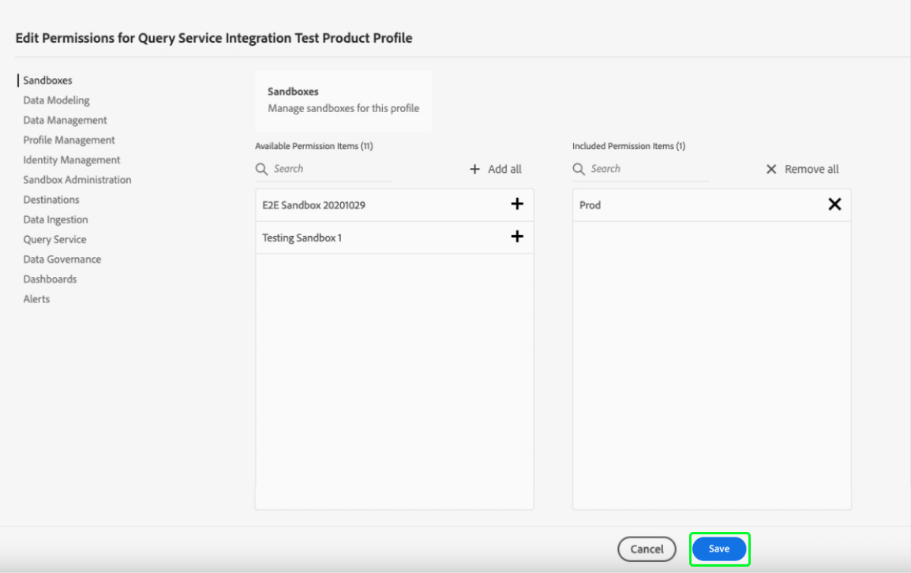

# Handbuch zu Anmeldeinformationen

Mit Adobe Experience Platform Query Service können Sie eine Verbindung mit externen Clients herstellen. Sie können eine Verbindung zu diesen externen Clients herstellen, indem Sie entweder ablaufende oder nicht ablaufende Anmeldeinformationen verwenden.

## Ablaufberechtigungen

Sie können ablaufende Anmeldedaten verwenden, um schnell eine Verbindung zu einem externen Client herzustellen.


Der Abschnitt **[!UICONTROL Ablaufende Anmeldedaten]** enthält die folgenden Informationen:

- **[!UICONTROL Host]**: Der Name des Hosts, mit dem Sie eine Verbindung herstellen möchten. Für die Verbindung mit Query Service enthält dies den Namen der IMS-Organisation, die Sie derzeit verwenden.
- **[!UICONTROL Port]**: Die Anschlussnummer des Hosts, mit dem Sie eine Verbindung herstellen möchten.
- **[!UICONTROL Datenbank]**: Der Name der Datenbank, mit der Sie eine Verbindung herstellen möchten.
- **[!UICONTROL Benutzername]**: Der Benutzername, mit dem Sie eine Verbindung zu Query Service herstellen.
- **[!UICONTROL Kennwort]**: Das Kennwort, mit dem Sie eine Verbindung zu Query Service herstellen.
- **[!UICONTROL PSQL-Befehl]**: Ein Befehl, der automatisch alle relevanten Informationen eingefügt hat, damit Sie über PSQL über die Befehlszeile eine Verbindung zu Query Service herstellen können.
- **[!UICONTROL Läuft ab]**: Das Ablaufdatum für die ablaufenden Anmeldeinformationen. Die Anmeldeinformationen laufen 24 Stunden nach ihrer Erstellung ab.

## Nicht ablaufende Anmeldeinformationen

Sie können nicht ablaufende Anmeldedaten verwenden, um eine permanentere Verbindung zu einem externen Client einzurichten.

Bevor Sie nicht ablaufende Anmeldeinformationen erstellen können, müssen Sie sowohl die Berechtigungen **Sandboxes** als auch die Berechtigungen **Query Service-Integration verwalten** für Ihre Organisation in der Adobe Admin Console konfigurieren.

Melden Sie sich bei [Adobe Admin Console](https://adminconsole.adobe.com/) an und wählen Sie in der oberen Navigationsleiste die entsprechende Organisation aus.

Wählen Sie im Abschnitt [!UICONTROL Produkte und Dienste] von [!UICONTROL Übersicht] die Option **Adobe Experience Platform**.


Die Seite &quot;Adobe Experience Platform-Details&quot;wird angezeigt. Erstellen Sie anschließend ein neues Profil. Wählen Sie [!UICONTROL **Neues Profil**] aus.


Ein Dialogfeld zur Profilerstellung wird angezeigt. Geben Sie einen beschreibenden Namen für das neue Profil ein und wählen Sie [!UICONTROL **Speichern**] aus. Die Seite [!UICONTROL Einstellungen] für Ihr neues Profil wird angezeigt. Wählen Sie die Registerkarte [!UICONTROL **Berechtigungen**] aus den verfügbaren Optionen aus.

### Aktivieren von Query Service-Berechtigungen

Um sicherzustellen, dass die richtigen Query Service-Berechtigungen für Ihre Organisation aktiviert sind, suchen und wählen Sie die Kategorie [!UICONTROL **Query Service**] aus der Liste aus.


Der Arbeitsbereich [!UICONTROL Berechtigungen bearbeiten] für Query Service wird angezeigt. Wählen Sie das Pluszeichen (**+**) für [!UICONTROL **Abfragen verwalten**] und [!UICONTROL **Integration von Query Service verwalten**] aus, um sie zur Spalte [!UICONTROL Eingeschlossene Berechtigungselemente] hinzuzufügen. Wählen Sie als Nächstes [!UICONTROL **Speichern**] aus, um Ihre Änderungen zu bestätigen.


Hierdurch werden Sie zur Registerkarte Einstellungen > Berechtigungen zurückgeleitet.

### Aktivieren von Sandbox-Berechtigungen

Um sicherzustellen, dass die richtige Sandbox für Ihre Organisation ausgewählt ist, suchen Sie die Kategorie [!UICONTROL **Sandboxes**] und wählen Sie sie aus der Liste aus.


Der Arbeitsbereich Sandboxes wird angezeigt. Suchen Sie in [!UICONTROL Verfügbare Berechtigungselemente] die entsprechende Sandbox, in diesem Bild ist es die Produkt-Sandbox. Wählen Sie das Pluszeichen (**+**) aus, um es zum [!UICONTROL Einbezogene Berechtigungselemente] hinzuzufügen. Wählen Sie als Nächstes [!UICONTROL **Speichern**] aus, um Ihre Änderungen zu bestätigen.



Hierdurch werden Sie zur Registerkarte Einstellungen > Berechtigungen zurückgeleitet.

Es sind drei weitere Schritte erforderlich, um einem Benutzer Zugriff auf die Funktion für nicht ablaufende Konten zu gewähren.

- Fügen Sie einen neuen Benutzer hinzu, dem die neu erstellten Berechtigungen erteilt werden sollen. Wählen Sie die Registerkarte [!UICONTROL **Benutzer**] und danach [!UICONTROL **Benutzer hinzufügen**].


Das Dialogfeld &quot;Benutzer erstellen&quot;wird angezeigt. Geben Sie einen Namen und eine E-Mail für den neuen Benutzer ein und wählen Sie [!UICONTROL **Speichern**] aus.

- Der Benutzer muss dann als Administrator hinzugefügt werden, um die Erstellung eines Kontos für jedes aktive Produktprofil zu ermöglichen. So fügen Sie den neu erstellten Benutzer als Administrator hinzu. Wählen Sie die Registerkarte [!UICONTROL **Admins**], gefolgt von [!UICONTROL **Admins hinzufügen**].


Das Dialogfeld &quot;Admin hinzufügen&quot;wird angezeigt. Geben Sie die Details des neuen Administrators in die Textfelder ein und wählen Sie [!UICONTROL **Save**] aus.

- Der Benutzer muss dann als Entwickler hinzugefügt werden, damit eine Integration erstellt werden kann. Wählen Sie die Registerkarte **Entwickler**, gefolgt von **Entwickler hinzufügen**.


Das Dialogfeld &quot;Entwickler hinzufügen&quot;wird angezeigt. Geben Sie die Details des neuen Entwicklers in die Textfelder ein und wählen Sie **Save** aus.

Weitere Informationen zum Zuweisen von Berechtigungen finden Sie in der Dokumentation unter [Zugriffssteuerung](../../access-control/home.md).

Alle erforderlichen Berechtigungen werden jetzt in der Adobe Developer Console konfiguriert, damit der Benutzer die Funktion für ablaufende Anmeldedaten verwenden kann.

Um einen Satz von nicht ablaufenden Anmeldeinformationen zu erstellen, wählen Sie im Arbeitsbereich &quot;Abfrage-Anmeldeinformationen&quot;die Option **[!UICONTROL Anmeldeinformationen generieren]** aus.


Das Modal zum Generieren von Anmeldeinformationen wird angezeigt. Um nicht ablaufende Anmeldedaten zu erstellen, müssen Sie die folgenden Details angeben:

- **[!UICONTROL Name]**: Der Name der Anmeldeinformationen, die Sie generieren.
- **[!UICONTROL Beschreibung]**: (Optional) Eine Beschreibung für die Anmeldeinformationen, die Sie generieren.
- **[!UICONTROL Zugeordnet zu]**: Der Benutzer, dem die Anmeldeinformationen zugewiesen werden. Dieser Wert sollte die E-Mail-Adresse des Benutzers sein, der die Anmeldeinformationen erstellt.
- **[!UICONTROL Kennwort]**  (Optional) Ein optionales Kennwort für Ihre Anmeldedaten. Wenn das Kennwort nicht festgelegt ist, generiert Adobe automatisch ein Kennwort für Sie.

Nachdem Sie alle erforderlichen Details angegeben haben, wählen Sie **[!UICONTROL Anmeldeinformationen generieren]** aus, um Ihre Anmeldeinformationen zu generieren.


>[!IMPORTANT]
>
>Sobald die Schaltfläche **[!UICONTROL Anmeldeinformationen generieren]** ausgewählt ist, wird eine JSON-Konfigurationsdatei auf Ihren lokalen Computer heruntergeladen. Da in Adobe **nicht** die generierten Anmeldedaten aufgezeichnet werden, müssen Sie **die heruntergeladene Datei sicher speichern und die Anmeldedaten speichern.**
>
>Wenn die Anmeldeinformationen 90 Tage lang nicht verwendet werden, werden die Anmeldeinformationen ebenfalls aktualisiert.

Die JSON-Konfigurationsdatei enthält Informationen wie den Namen des technischen Kontos, die technische Konto-ID und die Anmeldedaten. Sie wird im folgenden Format bereitgestellt.

```json
{"technicalAccountName":"9F0A21EE-B8F3-4165-9871-846D3C8BC49E@TECHACCT.ADOBE.COM","credential":"3d184fa9e0b94f33a7781905c05203ee","technicalAccountId":"4F2611B8613AA3670A495E55"}
```

Nachdem Sie die generierten Anmeldeinformationen gespeichert haben, wählen Sie **[!UICONTROL Close]** aus. Sie können jetzt eine Liste aller nicht ablaufenden Anmeldedaten anzeigen.


Sie können Ihre nicht ablaufenden Anmeldedaten entweder bearbeiten oder löschen. Um eine nicht ablaufende Berechtigung zu bearbeiten, wählen Sie das Stiftsymbol () aus. Um eine nicht ablaufende Berechtigung zu löschen, wählen Sie das Löschsymbol () aus.

Beim Bearbeiten einer nicht ablaufenden Berechtigung wird ein Modal angezeigt. Sie können die folgenden Details zur Aktualisierung angeben:

- **[!UICONTROL Name]**: Der Name der Anmeldeinformationen, die Sie generieren.
- **[!UICONTROL Beschreibung]**: (Optional) Eine Beschreibung für die Anmeldeinformationen, die Sie generieren.
- **[!UICONTROL Zugeordnet zu]**: Der Benutzer, dem die Anmeldeinformationen zugewiesen werden. Dieser Wert sollte die E-Mail-Adresse des Benutzers sein, der die Anmeldeinformationen erstellt.


Nachdem Sie alle erforderlichen Details angegeben haben, wählen Sie **[!UICONTROL Konto aktualisieren]** aus, um die Aktualisierung Ihrer Anmeldedaten abzuschließen.

## Verwenden von Anmeldeinformationen zum Herstellen einer Verbindung zu externen Clients

Sie können die ablaufenden oder nicht ablaufenden Anmeldedaten verwenden, um eine Verbindung mit externen Clients wie Aqua Data Studio, Looker oder Power BI herzustellen.

Die nachstehende Tabelle enthält die Liste der Parameter und ihre Beschreibung, die normalerweise für die Verbindung mit externen Clients erforderlich sind.

>[!NOTE]
>
>Beim Herstellen einer Verbindung zu einem Host mit nicht ablaufenden Anmeldeinformationen müssen weiterhin alle im Abschnitt [!UICONTROL EXPIRING CREDENTIALS] aufgeführten Parameter verwendet werden, mit Ausnahme des Kennworts.

| Parameter | Beschreibung |
|---|---|
| **Server/Host** | Der Name des Servers/Hosts, mit dem Sie eine Verbindung herstellen. Dieser Wert hat die Form `server.adobe.io` und kann unter **[!UICONTROL Host]** gefunden werden. |
| **Port** | Der Anschluss für den Server/Host, mit dem Sie eine Verbindung herstellen. Dieser Wert befindet sich unter **[!UICONTROL Port]**. Ein Beispielwert für den Port wäre `80`. |
| **Datenbank** | Die Datenbank, mit der Sie eine Verbindung herstellen. Dieser Wert befindet sich unter **[!UICONTROL Database]**. Ein Beispielwert für die Datenbank wäre `prod:all`. |
| **Benutzername** | Der Benutzername für den Benutzer, der eine Verbindung zum externen Client herstellt. Dies hat die Form einer alphanumerischen Zeichenfolge vor `@AdobeOrg`. Dieser Wert befindet sich unter **[!UICONTROL Benutzername]**. |
| **Passwort** | Das Kennwort für den Benutzer, der eine Verbindung zum externen Client herstellt. <ul><li>Wenn Sie ablaufende Anmeldeinformationen verwenden, finden Sie diese unter **[!UICONTROL Kennwort]** im Abschnitt für ablaufende Anmeldeinformationen.</li><li>Wenn Sie nicht ablaufende Anmeldeinformationen verwenden, besteht dieser Wert aus den Argumenten der technicalAccountID und der Berechtigung, die aus der JSON-Konfigurationsdatei übernommen wurden. Der Kennwortwert hat folgende Form: `{technicalAccountId}:{credential}`.</li></ul> |

## Nächste Schritte

Nachdem Sie nun wissen, wie ablaufende und nicht ablaufende Anmeldeinformationen funktionieren, können Sie diese Anmeldeinformationen verwenden, um eine Verbindung zu externen Clients herzustellen. Weitere Informationen zu externen Clients finden Sie im Handbuch [Clients mit Query Service verbinden](../clients/overview.md).
