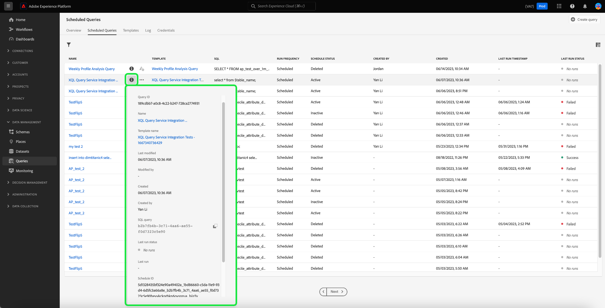

# Überwachen von geplanten Abfragen 

Adobe Experience Platform bietet über die Benutzeroberfläche eine verbesserte Sichtbarkeit für den Status aller Abfrageaufträge. Aus dem [!UICONTROL Geplante Abfragen] -Registerkarte finden Sie jetzt wichtige Informationen zu Ihren Abfrageausführungen, die den Status, die Planungsdetails und Fehlermeldungen/Codes für den Fall eines Fehlschlagens enthalten. Sie können über die Benutzeroberfläche auf der Registerkarte [!UICONTROL Geplante Abfragen] für jede dieser Abfragen auch Benachrichtigungen für Abfragen basierend auf ihrem Status abonnieren.

## [!UICONTROL Geplante Abfragen]

Die [!UICONTROL Geplante Abfragen] bietet einen Überblick über alle geplanten CTAS- und ITAS-Abfragen. Ausführungsdetails finden Sie für alle geplanten Abfragen sowie Fehlercodes und Meldungen für fehlgeschlagene Abfragen.

Um zur Registerkarte [!UICONTROL Geplante Abfragen] zu navigieren, wählen Sie **[!UICONTROL Abfragen]** in der linken Navigationsleiste und anschließend **[!UICONTROL Geplante Abfragen]**

In der folgenden Tabelle werden die einzelnen verfügbaren Spalten beschrieben.

>[!NOTE]
>
>Das Symbol für Abonnements von Warnhinweisen befindet sich in jeder Zeile in einer unbenannten Spalte. Weitere Informationen finden Sie im Abschnitt [Abonnements von Warnhinweisen](#alert-subscription).

| Spalte | Beschreibung |
|---|---|
| **[!UICONTROL Name]** | Das Namensfeld enthält entweder den Namen der Vorlage oder die ersten Zeichen Ihrer SQL-Abfrage. Jede Abfrage, die über die Benutzeroberfläche mit dem Abfrage-Editor erstellt wurde, wird zu Beginn benannt. Wenn die Abfrage über die API erstellt wurde, wird ihr Name zu einem Snippet der ursprünglichen SQL, die zur Erstellung der Abfrage verwendet wurde. Um eine Liste aller mit der Abfrage verknüpften Ausführungen anzuzeigen, wählen Sie ein Element aus der [!UICONTROL Name] Spalte. Weitere Informationen finden Sie unter [Abfragenausführungen Planungsdetails](#query-runs) Abschnitt. |
| **[!UICONTROL Vorlage]** | Der Name der Abfragevorlage. Klicken Sie auf einen Vorlagennamen, um zum Abfrage-Editor zu navigieren. Die Abfragevorlage wird aus praktischen Gründen im Abfrage-Editor angezeigt. Wenn kein Vorlagenname vorhanden ist, wird die Zeile mit einem Bindestrich markiert und es ist nicht möglich, zum Abfrage-Editor umzuleiten, um die Abfrage anzuzeigen. |
| **[!UICONTROL SQL]** | Ein Ausschnitt der SQL-Abfrage. |
| **[!UICONTROL Ausführungshäufigkeit]** | Die Häufigkeit, mit der Ihre Abfrage ausgeführt werden soll. Die unterstützten Werte sind `Run once` und `Scheduled`. Abfragen können entsprechend ihrer Ausführungshäufigkeit gefiltert werden. |
| **[!UICONTROL Erstellt von]** | Der Name der Person, die die Abfrage erstellt hat. |
| **[!UICONTROL Erstellt]** | Der Zeitstempel der Erstellung der Abfrage im UTC-Format. |
| **[!UICONTROL Zeitstempel der letzten Ausführung]** | Der Zeitstempel der letzten Ausführung der Abfrage. Diese Spalte zeigt, ob eine Abfrage gemäß ihrem aktuellen Zeitplan ausgeführt wurde. |
| **[!UICONTROL Status der letzten Ausführung]** | Der Status der letzten Abfrageausführung. Die Statuswerte sind: `Success`, `Failed`, `In progress`, und `No runs`. |
| **[!UICONTROL Planstatus]** | Der aktuelle Status der geplanten Abfrage. Es gibt fünf potenzielle Werte. [!UICONTROL Registrieren], [!UICONTROL Aktiv], [!UICONTROL Inaaktiv], [!UICONTROL Gelöscht]und einen Bindestrich. <ul><li>Der Bindestrich zeigt an, dass es sich bei der geplanten Abfrage um eine einmalige, nicht wiederkehrende Abfrage handelt.</li><li>Die [!UICONTROL Registrieren] Der Status gibt an, dass das System die Erstellung des neuen Zeitplans für die Abfrage noch verarbeitet. Beachten Sie, dass Sie eine geplante Abfrage während der Registrierung nicht deaktivieren oder löschen können.</li><li>Die [!UICONTROL Aktiv] Der Status zeigt an, dass die geplante Abfrage **noch nicht bestanden** Datum und Uhrzeit der Fertigstellung.</li><li>Die [!UICONTROL Inaaktiv] Der Status zeigt an, dass die geplante Abfrage **sent** Datum und Uhrzeit der Fertigstellung.</li><li>Die [!UICONTROL Gelöscht] status gibt an, dass der Abfrageplan gelöscht wurde.</li></ul> |

>[!TIP]
>
>Wenn Sie zum Abfrage-Editor navigieren, können Sie **[!UICONTROL Abfragen]** auswählen, um zur Registerkarte [!UICONTROL Vorlagen] zurückzukehren.

## Anpassen von Tabelleneinstellungen für geplante Abfragen {#customize-table}

Sie können die Spalten auf der Registerkarte [!UICONTROL Geplante Abfragen] gemäß Ihren Anforderungen anpassen. So öffnen Sie die [!UICONTROL Tabelle anpassen] Dialogfeld &quot;Einstellungen&quot;öffnen und verfügbare Spalten bearbeiten, das Einstellungssymbol () oben rechts im Bildschirm.

>[!NOTE]
>
>Die [!UICONTROL Erstellt] -Spalte, die sich auf das Datum der Erstellung des Zeitplans bezieht, ist standardmäßig ausgeblendet.

Aktivieren bzw. deaktivieren Sie die entsprechenden Kontrollkästchen, um eine Tabellenspalte zu entfernen oder hinzuzufügen. Klicken Sie dann auf **[!UICONTROL Übernehmen]**, um Ihre Auswahl zu bestätigen.

>[!NOTE]
>
>Jede Abfrage, die über die Benutzeroberfläche erstellt wurde, wird als Teil des Erstellungsprozesses zu einer benannten Vorlage. Der Vorlagenname wird in der Vorlagenspalte angezeigt. Wenn die Abfrage über die API erstellt wurde, ist die Vorlagenspalte leer.

## Geplante Abfragen mit Inline-Aktionen verwalten {#inline-actions}

Die [!UICONTROL Geplante Abfragen] -Ansicht bietet verschiedene Inline-Aktionen zur Verwaltung aller Ihrer geplanten Abfragen von einem Ort aus. Inline-Aktionen werden in jeder Zeile mit Auslassungspunkten angezeigt. Wählen Sie die Auslassungspunkte einer geplanten Abfrage aus, die Sie verwalten möchten, um die verfügbaren Optionen in einem Popup-Menü anzuzeigen. Zu den verfügbaren Optionen gehören [[!UICONTROL Zeitplan deaktivieren]](#disable) oder [!UICONTROL Zeitplan aktivieren], [[!UICONTROL Zeitplan löschen]](#delete), und [[!UICONTROL Abonnieren]](#alert-subscription) , um Warnhinweise abzufragen.

### Geplante Abfrage deaktivieren oder aktivieren {#disable}

Um eine geplante Abfrage zu deaktivieren, wählen Sie die Auslassungspunkte einer geplanten Abfrage aus, die Sie verwalten möchten, und wählen Sie dann **[!UICONTROL Zeitplan deaktivieren]** aus den Optionen im Popup-Menü. Es wird ein Dialogfeld angezeigt, in dem Sie Ihre Aktion bestätigen können. Auswählen **[!UICONTROL Deaktivieren]** , um Ihre Einstellung zu bestätigen.

Nachdem eine geplante Abfrage deaktiviert wurde, können Sie den Zeitplan über denselben Prozess aktivieren. Wählen Sie die Auslassungspunkte aus und wählen Sie **[!UICONTROL Zeitplan aktivieren]** aus den verfügbaren Optionen.

### Geplante Abfrage löschen {#delete}

Um eine geplante Abfrage zu löschen, wählen Sie die Auslassungspunkte einer geplanten Abfrage aus, die Sie verwalten möchten, und klicken Sie dann auf **[!UICONTROL Zeitplan löschen]** aus den Optionen im Popup-Menü. Es wird ein Dialogfeld angezeigt, in dem Sie Ihre Aktion bestätigen können. Auswählen **[!UICONTROL Löschen]** , um Ihre Einstellung zu bestätigen.

Nachdem eine geplante Abfrage gelöscht wurde, wird sie **not** aus der Liste der geplanten Abfragen entfernt. Die von den Ellipsen bereitgestellten Inline-Aktionen werden entfernt und durch das grau ausgeblendete Symbol Warnhinweis hinzufügen ersetzt. Sie können keine Warnungen für den gelöschten Zeitplan abonnieren. Die Zeile verbleibt in der Benutzeroberfläche, um Informationen über die im Rahmen der geplanten Abfrage durchgeführten Ausführungen bereitzustellen.

Wenn Sie die Ausführung dieser Abfragevorlage planen möchten, wählen Sie den Vorlagennamen aus der entsprechenden Zeile aus, um zum Abfrage-Editor zu navigieren, und folgen Sie dann dem [Anweisungen zum Hinzufügen eines Zeitplans zu einer Abfrage](./query-schedules.md#create-schedule) wie in der Dokumentation beschrieben.

### Warnhinweise abonnieren {#alert-subscription}

Um Warnhinweise für geplante Abfrageausführungen zu abonnieren, wählen Sie die Auslassungspunkte einer geplanten Abfrage aus, die Sie verwalten möchten, und wählen Sie dann **[!UICONTROL Abonnieren]** aus den Optionen im Popup-Menü.

Die [!UICONTROL Warnhinweise] wird geöffnet. Die [!UICONTROL Warnhinweise] -Dialogfeld abonniert sowohl Benachrichtigungen über die Benutzeroberfläche als auch E-Mail-Warnungen. Warnhinweise basieren auf dem Status der Abfrage. Dabei stehen drei Optionen zur Verfügung: `start`, `success` und `failure`. Aktivieren Sie die entsprechenden Kontrollkästchen und klicken Sie auf **[!UICONTROL Speichern]**, um zu abonnieren. Sie können Warnhinweise abonnieren, solange sie keine [!UICONTROL Zeitstempel der letzten Ausführung] -Wert.

Siehe [Dokumentation zur API für Warnhinweise](../api/alert-subscriptions.md) für weitere Informationen.

### Anzeigen der Abfragedetails {#query-details}

Wählen Sie das Informationssymbol (), um das Detailbedienfeld für die Abfrage anzuzeigen. Das Bedienfeld &quot;Details&quot;enthält alle relevanten Informationen über die Abfrage, die über die in der Tabelle der geplanten Abfragen enthaltenen Informationen hinausgehen. Zu den zusätzlichen Informationen gehören die Abfrage-ID, das Datum der letzten Änderung, die SQL der Abfrage, die Zeitplan-ID und der aktuelle Zeitplan.

## Filtern von Abfragen {#filter}

Sie können Abfragen nach der Ausführungsfrequenz filtern. Wählen Sie dazu über die Registerkarte [!UICONTROL Geplante Abfragen] das Filtersymbol () aus, um die Filter-Seitenleiste zu öffnen.

Um die Liste der Abfragen nach ihrer Ausführungsfrequenz zu filtern, wählen Sie entweder die **[!UICONTROL Geplant]** oder **[!UICONTROL Einmal ausführen]** Filter-Kontrollkästchen.

>[!NOTE]
>
>Jede Abfrage, die ausgeführt, aber nicht geplant wurde, gilt als [!UICONTROL Einmal ausgeführt].

Nachdem Sie Ihre Filterkriterien aktiviert haben, wählen Sie **[!UICONTROL Filter ausblenden]** aus, um den Filterbereich zu schließen.

## Zeitplandetails für Abfragen {#query-runs}

Um die Seite mit den Zeitplandetails zu öffnen, wählen Sie einen Abfragenamen aus dem [!UICONTROL Geplante Abfragen] Registerkarte. Diese Ansicht enthält eine Liste aller im Rahmen dieser geplanten Abfrage ausgeführten Durchläufe. Die bereitgestellten Informationen umfassen die Anfangs- und Endzeit, den Status und den verwendeten Datensatz.

Diese Informationen werden in einer fünfspaltigen Tabelle bereitgestellt. Jede Zeile bezeichnet die Ausführung einer Abfrage.

| Spaltenname | Beschreibung |
|---|---|
| **[!UICONTROL ID der Abfrageausführung]** | Die ID der Abfrageausführung für die tägliche Ausführung. Wählen Sie die **[!UICONTROL Kennung der Abfrageausführung]** , um zur [!UICONTROL Übersicht über die Ausführung von Abfragen]. |
| **[!UICONTROL Start der Abfrageausführung]** | Der Zeitstempel, wann die Abfrage ausgeführt wurde. Der Zeitstempel hat das UTC-Format. |
| **[!UICONTROL Abfrageausführung abgeschlossen]** | Der Zeitstempel, wann die Abfrage abgeschlossen wurde. Der Zeitstempel hat das UTC-Format. |
| **[!UICONTROL Status]** | Der Status der letzten Abfrageausführung. Die drei Statuswerte sind `successful`, `failed` oder `in progress`. |
| **[!UICONTROL Datensatz]** | Der an der Ausführung beteiligte Datensatz. |

Details zur geplanten Abfrage finden Sie im Bedienfeld [!UICONTROL Eigenschaften]. Dieses Bedienfeld enthält die anfängliche Abfrage-ID, den Client-Typ, den Vorlagennamen, die Abfrage-SQL und die Kadenz des Zeitplans.

Wählen Sie eine ID für die Abfrageausführung aus, um zur Seite mit den Ausführungsdetails zu navigieren und Abfrageinformationen anzuzeigen.

## Übersicht über die Ausführung von Abfragen {#query-run-overview}

Die [!UICONTROL Übersicht über die Ausführung von Abfragen] enthält Informationen zu einzelnen Ausführungen für diese geplante Abfrage und eine detailliertere Aufschlüsselung des Ausführungsstatus. Auf dieser Seite finden Sie außerdem die Client-Informationen und Details zu Fehlern, die dazu geführt haben, dass die Abfrage fehlschlägt.

Der Abschnitt „Abfragestatus“ enthält den Fehler-Code und die Fehlermeldung, falls die Abfrage fehlschlägt.

Sie können die Abfrage-SQL aus dieser Ansicht in die Zwischenablage kopieren. Um die Abfrage zu kopieren, wählen Sie das Kopiersymbol oben rechts im SQL-Snippet aus. Eine Popup-Meldung bestätigt, dass der Code kopiert wurde.

### Ausführliche Informationen zu Abfragen mit anonymen Bausteinen {#anonymous-block-queries}

Abfragen, die anonyme Bausteine verwenden, um ihre SQL-Anweisungen zu enthalten, werden in ihre einzelnen Unterabfragen unterteilt. Durch die Trennung in Unterabfragen können Sie die Ausführungsdetails für jeden Abfrageblock einzeln überprüfen.

>[!NOTE]
>
>Die Ausführungsdetails eines anonymen Bausteins, der den Befehl DROP verwendet, werden **not** als separate Unterabfrage gemeldet werden. Separate Ausführungsdetails sind für CTAS-Abfragen, ITAS-Abfragen und COPY-Anweisungen verfügbar, die als anonyme Block-Subabfragen verwendet werden. Ausführungsdetails für den DROP-Befehl werden derzeit nicht unterstützt.

Anonyme Bausteine werden mithilfe eines `$$` -Präfix vor der Abfrage. Weitere Informationen zu anonymen Bausteinen im Abfragedienst finden Sie im Abschnitt [Anonym-Blockdokument](../essential-concepts/anonymous-block.md).

Unterabfragen anonymer Bausteine verfügen über Registerkarten links neben dem Ausführungsstatus. Wählen Sie eine Registerkarte aus, um die Ausführungsdetails anzuzeigen.

Wenn eine anonyme Blockabfrage fehlschlägt, können Sie über diese Benutzeroberfläche den Fehlercode für diesen Baustein finden.

Wählen Sie **[!UICONTROL Abfrage]** aus, um zum Bildschirm mit den Zeitplandetails zurückzukehren, oder wählen Sie **[!UICONTROL Geplante Abfragen]** aus, um zur Registerkarte [!UICONTROL Geplante Abfragen] zurückzukehren.

<!-- Details required to complete this section below:
### Run details for queries with parameterized queries {#parameterized-queries}

Queries that use parameterized values to make up the SQL statement are ... 
-->
