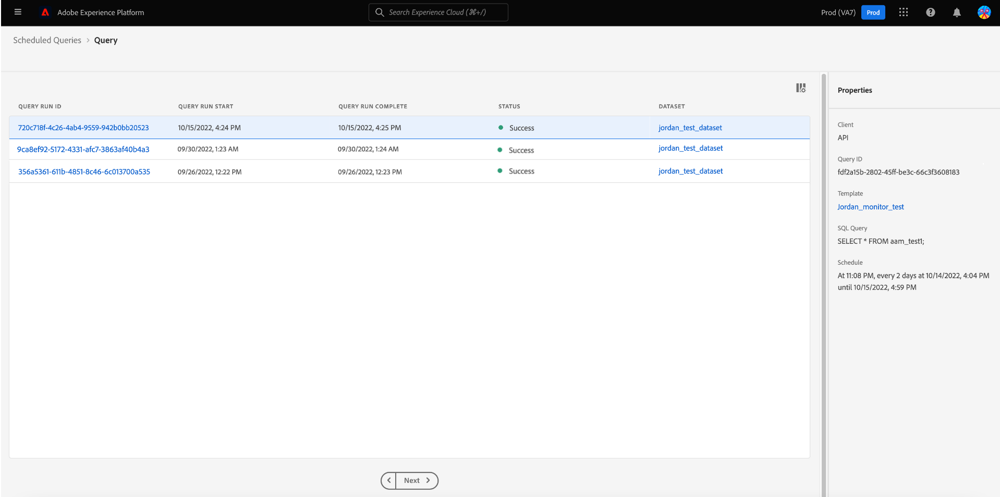

# Geplante Abfragen überwachen

Adobe Experience Platform bietet über die Benutzeroberfläche eine verbesserte Sichtbarkeit für den Status aller Abfrageaufträge. Auf der Registerkarte [!UICONTROL Geplante Abfragen] finden Sie jetzt wichtige Informationen zur Ausführung Ihrer Abfragen, darunter den Status, Details zum Zeitplan sowie Fehlermeldungen und -Codes, falls eine Abfrage fehlschlägt. Sie können über die Benutzeroberfläche auf der Registerkarte [!UICONTROL Geplante Abfragen] für jede dieser Abfragen auch Benachrichtigungen für Abfragen basierend auf ihrem Status abonnieren.

## [!UICONTROL Geplante Abfragen]

Die Registerkarte [!UICONTROL Geplante Abfragen] bietet einen Überblick über die ausgeführten und geplanten Abfragen. Der Arbeitsbereich enthält alle CTAS- und ITAS-Abfragen, die entweder ausgeführt werden sollen oder mindestens einmal ausgeführt wurden. Sie finden Ausführungsdetails für alle geplanten Abfragen sowie Fehler-Codes und Meldungen für fehlgeschlagene Abfragen.

Um zur Registerkarte [!UICONTROL Geplante Abfragen] zu navigieren, wählen Sie **[!UICONTROL Abfragen]** in der linken Navigationsleiste und anschließend **[!UICONTROL Geplante Abfragen]**

In der folgenden Tabelle werden die einzelnen verfügbaren Spalten beschrieben.

>[!NOTE]
>
>Das Symbol für Abonnements von Warnhinweisen befindet sich in jeder Zeile in einer unbenannten Spalte. Weitere Informationen finden Sie im Abschnitt [Abonnements von Warnhinweisen](#alert-subscription).

| Spalte | Beschreibung |
|---|---|
| Name | Das Namensfeld enthält entweder den Namen der Vorlage oder die ersten Zeichen Ihrer SQL-Abfrage. Jede Abfrage, die über die Benutzeroberfläche mit dem Abfrage-Editor erstellt wurde, wird zu Beginn benannt. Wenn die Abfrage über die API erstellt wurde, ist der Name der Abfrage ein Ausschnitt des ursprünglichen SQL-Codes, der zum Erstellen der Abfrage verwendet wurde. |
| Vorlage | Der Name der Abfragevorlage. Klicken Sie auf einen Vorlagennamen, um zum Abfrage-Editor zu navigieren. Die Abfragevorlage wird aus praktischen Gründen im Abfrage-Editor angezeigt. Wenn kein Vorlagenname vorhanden ist, wird die Zeile mit einem Bindestrich markiert und es ist nicht möglich, zum Abfrage-Editor umzuleiten, um die Abfrage anzuzeigen. |
| SQL | Ein Ausschnitt der SQL-Abfrage. |
| Ausführungshäufigkeit | Dies ist die Kadenz, in der Ihre Abfrage ausgeführt werden soll. Die unterstützten Werte sind `Run once` und `Scheduled`. Abfragen können entsprechend ihrer Ausführungshäufigkeit gefiltert werden. |
| Erstellt von | Der Name der Person, die die Abfrage erstellt hat. |
| Erstellt | Der Zeitstempel der Erstellung der Abfrage im UTC-Format. |
| Zeitstempel der letzten Ausführung | Der Zeitstempel der letzten Ausführung der Abfrage. Diese Spalte zeigt, ob eine Abfrage gemäß ihrem aktuellen Zeitplan ausgeführt wurde. |
| Status der letzten Ausführung | Der Status der letzten Abfrageausführung. Die drei Statuswerte sind `successful`, `failed` oder `in progress`. |

>[!TIP]
>
>Wenn Sie zum Abfrage-Editor navigieren, können Sie **[!UICONTROL Abfragen]** auswählen, um zur Registerkarte [!UICONTROL Vorlagen] zurückzukehren.

### Anpassen von Tabelleneinstellungen für geplante Abfragen

Sie können die Spalten auf der Registerkarte [!UICONTROL Geplante Abfragen] gemäß Ihren Anforderungen anpassen. Wählen Sie das Einstellungssymbol (), um den Dialog [!UICONTROL Tabelleneinstellungen anpassen] zu öffnen und verfügbare Spalten zu bearbeiten.

Aktivieren bzw. deaktivieren Sie die entsprechenden Kontrollkästchen, um eine Tabellenspalte zu entfernen oder hinzuzufügen. Klicken Sie dann auf **[!UICONTROL Übernehmen]**, um Ihre Auswahl zu bestätigen.

>[!NOTE]
>
>Jede Abfrage, die über die Benutzeroberfläche erstellt wurde, wird als Teil des Erstellungsprozesses zu einer benannten Vorlage. Der Vorlagenname wird in der Vorlagenspalte angezeigt. Wenn die Abfrage über die API erstellt wurde, ist die Vorlagenspalte leer.

### Warnhinweise abonnieren {#alert-subscription}

Sie können Warnhinweise über die Registerkarte [!UICONTROL Geplante Abfragen] abonnieren. Wählen Sie das Benachrichtigungssymbol für Warnhinweise () neben dem Namen einer Abfrage aus, um den Dialog [!UICONTROL Warnhinweise] zu öffnen. Durch den Dialog [!UICONTROL Warnhinweise] werden sowohl Warnhinweise in der Benutzeroberfläche als auch über E-Mail abonniert. Warnhinweise basieren auf dem Status der Abfrage. Dabei stehen drei Optionen zur Verfügung: `start`, `success` und `failure`. Aktivieren Sie die entsprechenden Kontrollkästchen und klicken Sie auf **[!UICONTROL Speichern]**, um zu abonnieren.

Siehe [Dokumentation zur API für Warnhinweise](../api/alert-subscriptions.md) für weitere Informationen.

### Filtern von Abfragen

Sie können Abfragen nach der Ausführungsfrequenz filtern. Wählen Sie dazu über die Registerkarte [!UICONTROL Geplante Abfragen] das Filtersymbol () aus, um die Filter-Seitenleiste zu öffnen.

Wählen Sie für die Ausführungshäufigkeit entweder das Kontrollkästchen **[!UICONTROL Geplant]** oder **[!UICONTROL Einmal ausgeführt]** zum Filtern der Abfrageliste aus.

>[!NOTE]
>
>Jede Abfrage, die ausgeführt, aber nicht geplant wurde, gilt als [!UICONTROL Einmal ausgeführt].

Nachdem Sie Ihre Filterkriterien aktiviert haben, wählen Sie **[!UICONTROL Filter ausblenden]** aus, um den Filterbereich zu schließen.

## Zeitplandetails für Abfragendurchläufe

Klicken Sie auf einen Abfragenamen, um zur Seite mit den Zeitplandetails zu navigieren. Diese Ansicht enthält eine Liste aller im Rahmen dieser geplanten Abfrage ausgeführten Durchläufe. Die bereitgestellten Informationen umfassen die Anfangs- und Endzeit, den Status und den verwendeten Datensatz.

Diese Informationen werden in einer fünfspaltigen Tabelle bereitgestellt. Jede Zeile bezeichnet die Ausführung einer Abfrage.

| Spaltenname | Beschreibung |
|---|---|
| ID der Abfrageausführung | Die ID der Abfrageausführung für die tägliche Ausführung. |
| Start der Abfrageausführung | Der Zeitstempel, wann die Abfrage ausgeführt wurde. Dieser liegt im UTC-Format vor. |
| Abfrageausführung abgeschlossen | Der Zeitstempel, wann die Abfrage abgeschlossen wurde. Dieser liegt im UTC-Format vor. |
| Status | Der Status der letzten Abfrageausführung. Die drei Statuswerte sind: `successful`, `failed` oder `in progress`. |
| Datensatz | Der an der Ausführung beteiligte Datensatz. |

Details zur geplanten Abfrage finden Sie im Bedienfeld [!UICONTROL Eigenschaften]. Dieses Bedienfeld enthält die anfängliche Abfrage-ID, den Client-Typ, den Vorlagennamen, die Abfrage-SQL und die Kadenz des Zeitplans.

### Ausführungsdetails

Wählen Sie eine ID für die Abfrageausführung aus, um zur Seite mit den Ausführungsdetails zu navigieren und Abfrageinformationen anzuzeigen.

Diese Ansicht enthält Informationen zu den einzelnen Ausführungen für diese geplante Abfrage sowie eine detailliertere Aufschlüsselung des Ausführungsstatus. Auf dieser Seite finden Sie außerdem die Client-Informationen und Details zu Fehlern, die zum Fehlschlagen der Abfrage geführt haben.

Der Abschnitt „Abfragestatus“ enthält den Fehler-Code und die Fehlermeldung, falls die Abfrage fehlschlägt.

Sie können die Abfrage-SQL aus dieser Ansicht in die Zwischenablage kopieren. Wählen Sie das Kopiersymbol oben rechts im SQL-Snippet aus, um die Abfrage zu kopieren. Eine Popup-Meldung bestätigt, dass der Code kopiert wurde.

Wählen Sie **[!UICONTROL Abfrage]** aus, um zum Bildschirm mit den Zeitplandetails zurückzukehren, oder wählen Sie **[!UICONTROL Geplante Abfragen]** aus, um zur Registerkarte [!UICONTROL Geplante Abfragen] zurückzukehren.

