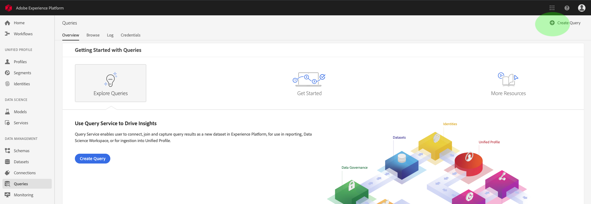

# Handbuch zum Abfrage-Dienst

Der Adobe Experience Platform Abfrage Service stellt eine Benutzeroberfläche bereit, die zum Schreiben und Ausführen von Abfragen, zur Ansicht zuvor ausgeführter Abfragen und zum Zugriff auf Abfragen verwendet werden kann, die von Benutzern in Ihrem IMS-Unternehmen gespeichert wurden. Um auf die Benutzeroberfläche in [Adobe Experience Platform][platform-ui]zuzugreifen, wählen Sie im linken Navigationsbereich die Option &quot; **Abfragen** &quot;aus.

## Abfragen-Editor

Mit dem Abfragen-Editor können Sie Abfragen schreiben und ausführen, ohne einen externen Client zu verwenden. Klicken Sie auf Abfrage **** erstellen, um den Abfragen-Editor zu öffnen und eine neue Abfrage zu erstellen. Sie können auch auf den Abfragen-Editor zugreifen, indem Sie auf den Registerkarten &quot; *Protokoll* &quot;oder &quot; *Durchsuchen* &quot;eine Abfrage auswählen. Wenn Sie eine zuvor ausgeführte oder gespeicherte Abfrage auswählen, wird der Abfrage-Editor geöffnet und die SQL-Datei für die ausgewählte Abfrage angezeigt.

Abfrage Editor bietet Bearbeitungsbereich, in dem Sie mit der Eingabe einer Abfrage beginnen können. Während der Eingabe vervollständigt der Editor automatisch SQL-reservierte Wörter, Tabellen und Feldnamen in Tabellen. Wenn Sie die Abfrage fertig geschrieben haben, klicken Sie auf **Abspielen** , um die Abfrage auszuführen. Auf der Registerkarte &quot; *Konsole* &quot;unter dem Editor wird angezeigt, was der Dienst &quot;Abfrage&quot;derzeit tut, und es wird angezeigt, wann eine Abfrage zurückgegeben wurde. Auf der Registerkarte &quot; *Ergebnis* &quot;neben der Konsole werden die Ergebnisse der Abfrage angezeigt. Weitere Informationen zur Verwendung des Abfrage-Editors finden Sie im Handbuch [zum][query-editor] Abfrage-Editor.

## Durchsuchen

Auf der Registerkarte &quot; *Durchsuchen* &quot;werden Abfragen angezeigt, die von Benutzern in Ihrem Unternehmen gespeichert wurden. Es ist sinnvoll, diese als Abfragen zu betrachten, da die hier gespeicherten Abfragen möglicherweise noch im Bau sind. Abfragen, die auf der Registerkarte &quot; *Durchsuchen* &quot;angezeigt werden, werden auch auf der Registerkarte &quot; *Protokoll* &quot;als ausgeführte Abfragen angezeigt, wenn sie zuvor vom Abfrage Service ausgeführt wurden.

| Spalte | Beschreibung |
| --- | --- |
| Name | Der vom Benutzer erstellte Abfragen-Name. Sie können auf den Namen klicken, um die Abfrage im Abfragen-Editor zu öffnen. Sie können auch die Suchleiste verwenden, um nach dem Namen einer Abfrage zu suchen. Bei Suchvorgängen wird zwischen Groß- und Kleinschreibung unterschieden. |
| SQL | Die ersten Zeichen der SQL-Abfrage. Wenn Sie den Mauszeiger über den Code bewegen, wird die vollständige Abfrage angezeigt. |
| Geändert von | Der letzte Benutzer, der die Abfrage geändert hat. Jeder Benutzer in Ihrem Unternehmen, der Zugriff auf Abfrage Service hat, kann Abfragen ändern. |
| Zuletzt geändert | Datum und Uhrzeit der letzten Änderung der Abfrage in der Zeitzone des Browsers. |

## Protokoll

Auf der Registerkarte &quot; *Protokoll* &quot;finden Sie eine Liste der Abfragen, die zuvor ausgeführt wurden. Standardmäßig werden die Abfragen im Protokoll in umgekehrter Chronologie Liste.

| Spalte | Beschreibung |
| --- | --- |
| Name | Der Name der Abfrage, bestehend aus den ersten Zeichen der SQL-Abfrage. Durch Klicken auf den Namen wird der Abfrage-Editor geöffnet, in dem Sie die Abfrage bearbeiten können. In der Suchleiste können Sie nach dem Namen einer Abfrage suchen. Bei Suchvorgängen wird zwischen Groß- und Kleinschreibung unterschieden. |
| Erstellt von | Der Name der Person, die die Abfrage erstellt hat. |
| Client | Der für die Abfrage verwendete Client. |
| Datenbestand | Der von der Abfrage verwendete Eingabedatensatz. Klicken Sie auf den Datensatz, um zum Anzeigebereich &quot;Eingabedatensetdetails&quot;zu gelangen. |
| Status | Der aktuelle Status der Abfrage. |
| Letzte Ausführung | Als die Abfrage zuletzt ausgeführt wurde. Sie können die Liste in auf- oder absteigender Reihenfolge sortieren, indem Sie auf den Pfeil über dieser Spalte klicken. |
| Laufzeit | Die Zeitdauer, die zum Ausführen der Abfrage erforderlich war. |

## Berechtigungen

Auf der Registerkarte &quot; *Anmeldeinformationen* &quot;werden Ihre Postgres-Anmeldeinformationen angezeigt. Klicken Sie auf das Symbol &quot; **Kopieren** &quot;neben einem Feld, um dessen Inhalt in Ihrem Tastaturpuffer zu speichern. Weitere Informationen zur Verwendung dieser Anmeldedaten für die Verbindung mit externen Clients finden Sie im [Verbindungshandbuch][connect-clients].

## Nächste Schritte

Nachdem Sie sich mit der Benutzeroberfläche des Abfrage Service auf der Plattform vertraut gemacht haben, können Sie auf den Abfrage Editor zugreifen, um Ihre eigenen Abfragen zu erstellen und sie für andere Benutzer in Ihrem Unternehmen freizugeben. Weitere Informationen zum Erstellen und Ausführen von Abfragen im Abfrage Editor finden Sie im [Abfrage Editor-Benutzerhandbuch][query-editor].

[platform-ui]: https://platform.adobe.com
[query-editor]: user-guide.md
[connect-clients]: ../clients/overview.md
