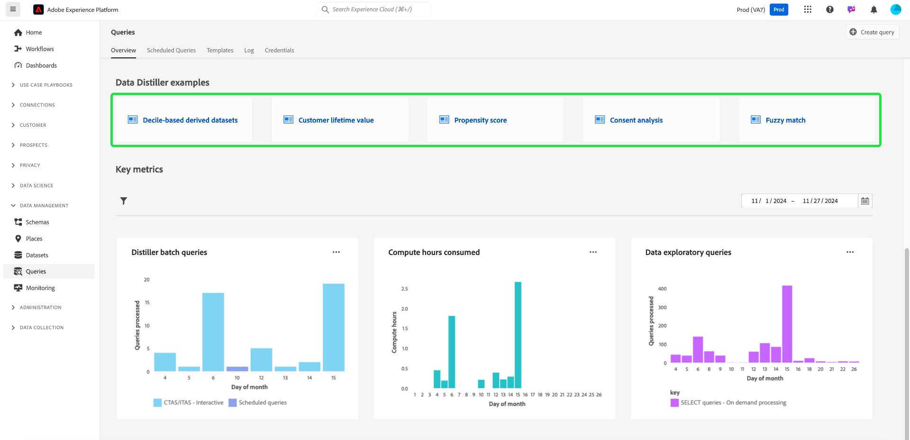

# Handbuch zur Benutzeroberfläche von Query Service

Der Adobe Experience Platform-Abfragedienst bietet eine Benutzeroberfläche, über die Abfragen geschrieben und ausgeführt, zuvor ausgeführte Abfragen angezeigt und auf Abfragen zugegriffen werden kann, die von Benutzern in Ihrem Unternehmen gespeichert wurden. Um in [Adobe Experience Platform](https://platform.adobe.com) auf die Benutzeroberfläche zuzugreifen, wählen Sie im linken Navigationsbereich die Option **[!UICONTROL Abfragen]** aus. Die [!UICONTROL Abfragen] [!UICONTROL Übersicht] wird angezeigt.

## Übersicht {#overview}

Die Registerkarte [!UICONTROL Übersicht] bietet einen optimierten Einstiegspunkt für die Arbeit mit Abfragen und Data Distiller-Vorlagen. Hier können Sie auf alle Funktionen zugreifen, die zum Schreiben von Abfragen, zum Erkunden von Datensätzen und zum Analysieren von Zielgruppendaten erforderlich sind, um einen reibungslosen Workflow für Ihre Datenanalyse und Zielgruppeneinblicke zu gewährleisten. In diesem Überblick erfahren Sie, was Sie mit Data Distiller erreichen können, und lernen Sie die wichtigsten Metriken zur Nutzung von Query Service kennen.

### Hauptfenster {#main-panels}

Die Seite [!UICONTROL Überblick] enthält mehrere Hauptabschnitte, die Ihnen bei den ersten Schritten helfen:

1. Wählen Sie **[!UICONTROL Abfrage erstellen]** aus, um schnell zum Abfrage-Editor zu navigieren, um neue Abfragen zu schreiben und auszuführen.
2. Wählen Sie **[!UICONTROL Mehr erfahren]** aus, um eine detaillierte Dokumentation zum Schreiben von Abfragen **[!UICONTROL 3} anzuzeigen.]**
3. Wählen Sie im Abschnitt **[!UICONTROL Discover Data Distiller]** die Option **[!UICONTROL Erste Schritte]** aus, um die Übersicht zu Data Distiller zu öffnen und mehr über die verfügbaren Funktionen zu erfahren.

### Funktionen von Data Distiller {#data-distiller-capabilities}

Der Abschnitt [!UICONTROL Data Distiller-Funktionen] enthält Dokumentationslinks zu erweiterten Data Distiller-Funktionen:

- **[[!UICONTROL Datenexploration]](../use-cases/data-exploration.md)**: Erfahren Sie, wie Sie erfasste Batch-Daten mit SQL untersuchen, beheben und überprüfen können.
- **[[!UICONTROL Abgeleitete Datensätze für Experience Platform-Anwendungen]](../data-distiller/derived-datasets/overview.md)**: Erfahren Sie, wie Sie abgeleitete Datensätze erstellen, um komplexe und vielfältige Anwendungsfälle zu unterstützen, die Ihr Datendienstprogramm maximieren.
- **[[!UICONTROL KI/ML-Pipelines]](../data-distiller/ml-feature-pipelines/overview.md)**: Erfahren Sie mehr über wichtige Konzepte hinter Ihren bevorzugten Tools für das maschinelle Lernen und wie Sie benutzerdefinierte Modelle erstellen, die Ihre Marketing-Anwendungsfälle unterstützen. In dieser Reihe von Handbüchern werden die erforderlichen Schritte zum Erstellen von Funktions-Pipelines beschrieben, die Daten von Experience Platform vorbereiten, um benutzerdefinierte Modelle in Ihrer maschinellen Lernumgebung zu speisen.
- **[[!UICONTROL SQL-Einblicke]](../data-distiller/sql-insights/overview.md)**: Erfahren Sie mehr über die wichtigsten Funktionen und erforderlichen Schritte zum Entwickeln eines Einblicke-Dashboards aus SQL mit Data Distiller.

### Empfohlene Data Distiller-Beschleuniger {#recommended-accelerators}

Wählen Sie einen Schnelllink aus, um zu den entsprechenden Data Distiller-Dashboards [!UICONTROL Vorlagen] zu navigieren. Jeder Beschleuniger bietet leistungsstarke Tools und Visualisierungen, mit denen Sie Zielgruppendaten analysieren, die Segmentierung optimieren und Zielgruppenstrategien verbessern können.

- **[[!UICONTROL Erweiterte Zielgruppenküberschneidungen]](../../dashboards/sql-insights-query-pro-mode/templates/overlaps.md)**: In diesem Dashboard können Sie Zielgruppenschnittstellen zwischen mehreren Zielgruppensegmenten analysieren, um wertvolle Einblicke zu erhalten und Segmentierungsstrategien zu optimieren. Sie können Ihre Einblicke auch für weitere Offline-Analysen oder Berichte exportieren.
- **[[!UICONTROL Zielgruppenvergleich]](../../dashboards/sql-insights-query-pro-mode/templates/comparison.md)**: In diesem Dashboard können Sie wichtige Zielgruppenmetriken nebeneinander vergleichen und gegenüberstellen, um zwei Zielgruppen detailliert zu analysieren. Diese Einblicke helfen Ihnen dabei, die Größe, das Wachstum und andere wichtige Leistungsindikatoren der Zielgruppe zu verstehen, sodass Sie die Segmentierung verfeinern und Zielgruppenstrategien mit datengesteuerten Entscheidungen optimieren können.
- **[[!UICONTROL Zielgruppentrends]](../../dashboards/sql-insights-query-pro-mode/templates/trends.md)**: Verwenden Sie das Dashboard [!UICONTROL Zielgruppentrends], um zu visualisieren, wie sich Ihre Zielgruppen im Laufe der Zeit durch Schlüsselmetriken wie Zielgruppenwachstum, Identitätszahlen und einzelne Identitätsprofile entwickeln. Verfolgen Sie Trends, um wertvolle Einblicke in das Zielgruppenverhalten zu erhalten, sodass Sie die Segmentierung verfeinern, die Interaktion steigern und Targeting-Strategien für effektivere Kampagnen optimieren können.
Verfolgen Sie Zielgruppenmetriken im Zeitverlauf, um Änderungen an der Zielgruppengröße, dem Identitätswachstum und der Interaktion insgesamt zu überwachen.
- **[[!UICONTROL Überschneidungen der Zielgruppenidentität]](../../dashboards/sql-insights-query-pro-mode/templates/identity-overlaps.md)**: Verwenden Sie das Dashboard &quot;Zielgruppenidentitätsüberschneidungen&quot;, um Identitätsüberschneidungen innerhalb ausgewählter Zielgruppen zu analysieren. Visualisierungen und tabellarische Daten bieten Einblicke zur Optimierung der Identitätszuordnung, zur Reduzierung der Redundanz und zur Verbesserung der Segmentierung. Diese Einblicke ermöglichen ein effektiveres Targeting, eine verbesserte Personalisierung und optimierte Kundeninteraktionen.

### Beispiele für Data Distiller {#data-distiller-examples}

Wählen Sie eine Karte aus, um Dokumentationsleitfäden und Beispiele zu öffnen, damit Sie Data Distiller optimal nutzen können:

- **[[!UICONTROL Decile-basierte abgeleitete Datensätze]](../use-cases/deciles-use-case.md)**: Erfahren Sie, wie Sie dezimalbasierte abgeleitete Datensätze für die Segmentierung und Zielgruppenerstellung in Adobe Experience Platform erstellen. Mithilfe eines Loyalitätsszenarios werden Schema-Design, Dezimalberechnungen und Abfragebeispiele für die Rangordnung und Aggregation von Daten behandelt.
- **[[!UICONTROL Kundenlebenszeitwert]](../use-cases/customer-lifetime-value.md)**: Erfahren Sie, wie Sie den Kundenlebenszeitwert mit Real-Time CDP und benutzerdefinierten Dashboards verfolgen und visualisieren. Nutzen Sie diese Einblicke, um Strategien für die Akquise neuer Kunden zu entwickeln, bestehende zu behalten und Gewinnspannen zu maximieren.
- **[[!UICONTROL Propensity Score]](../use-cases/propensity-score.md)**: Erfahren Sie, wie Sie mithilfe von Prognosemodellen für maschinelles Lernen Tendenzwerte bestimmen. Dieses Handbuch behandelt das Senden von Daten für Schulungen, das Anwenden trainierter Modelle mit SQL und die Vorhersage der Kaufwahrscheinlichkeit von Kunden.
- **[[!UICONTROL Einverständnisanalyse]](../../dashboards/insights-use-cases/consent-analysis.md)**: Erfahren Sie, wie Sie die Kundenzustimmung mit Real-Time CDP, Query Service und Data Distiller analysieren und verfolgen. In diesem Handbuch werden die Erstellung von Einwilligungs-Dashboards, die Feinabstimmung der Segmentierung, das Tracking von Trends und die Gewährleistung der Compliance behandelt. Außerdem erhalten Sie Unterstützung beim Aufbau von Vertrauen und bei der Bereitstellung personalisierter Erlebnisse.
- **[[!UICONTROL Fuzzy match]](../use-cases/fuzzy-match.md)**: Erfahren Sie, wie Sie eine &quot;unscharfe&quot;Übereinstimmung Ihrer Experience Platform-Daten durchführen, um ungefähre Übereinstimmungen zu finden und die Zeichenfolgenähnlichkeit über Datensätze hinweg zu analysieren. Befolgen Sie dieses Handbuch, um Zeit zu sparen und Ihre Daten leichter zugänglich zu machen. Das Beispiel zeigt, wie die Attribute des Hotelzimmers zwischen zwei Reisebüro-Datensätzen abgeglichen werden, und zeigt, wie große, komplexe Datensätze effizient zugeordnet, verglichen und abgestimmt werden können, um Konsistenz und Genauigkeit zu gewährleisten.

### Schlüsselmetriken {#key-metrics}

Im Abschnitt &quot;Schlüsselmetriken&quot;werden Visualisierungen wichtiger Daten angezeigt, mit denen Sie die Nutzung von Query Service überwachen können. Für jedes Diagramm können Sie die Auslassungspunkte (`...`) oben rechts und danach [!UICONTROL Mehr anzeigen] auswählen, um entweder eine Tabellenform der Ergebnisse anzuzeigen oder die Daten als CSV-Datei herunterzuladen, um sie in einer Tabelle anzuzeigen. Weitere Informationen finden Sie im Handbuch [Mehr anzeigen](../../dashboards/sql-insights-query-pro-mode/view-more.md) .

#### Datumsfilter festlegen {#set-date-filter}

Um einen globalen Datumsfilter für diese Visualisierungen anzuwenden, wählen Sie das Filtersymbol () und passen Sie den Datumsbereich im Dialogfeld **[!UICONTROL Filter]** an. Wenden Sie diesen Filter an, um die angezeigten Metriken auf einen bestimmten Zeitraum anzupassen und die Relevanz Ihrer Analyse zu verbessern.

#### [!UICONTROL Distiller-Batch-Abfragen] {#distiller-batch-queries}

Das Diagramm [!UICONTROL Distiller-Batch-Abfragen] enthält eine Aufschlüsselung der Abfrageaktivität nach Tag und zeigt die Anzahl der verarbeiteten CTAS- und ITAS-Abfragen (interaktiv und terminiert) an. In der Grafik werden Muster hervorgehoben, z. B. Spitzen in interaktiven Abfragen an bestimmten Tagen und die seltene Verwendung geplanter Abfragen. Nutzen Sie diese Einblicke, um die Leistung zu optimieren, indem Sie Spitzenaktivitätszeiträume identifizieren, Planungsstrategien verfeinern und die Abfragenausführung so ausrichten, dass die Workflow-Effizienz und Ressourcenauslastung verbessert werden.

#### [!UICONTROL Verbrauchte Berechnungsstunden] {#compute-hours-consumed}

Das Diagramm [!UICONTROL Verbrauchte Berechnungsstunden] bietet eine tägliche Visualisierung der Berechnungsstunden, die zur Verarbeitung von Query Service-Vorgängen verwendet werden. Verwenden Sie diese Trends für die Berechnungsstunde, um den Ressourcenverbrauch zu überwachen, Bedarfszeiträume zu ermitteln und die Ausführung von Abfragen zu optimieren, um eine effiziente Ressourcenzuordnung und -leistung sicherzustellen.

#### [!UICONTROL Datenexploratorabfragen]

Das Diagramm [!UICONTROL Datenexplorationsabfragen] zeigt die Anzahl der bei Bedarf verarbeiteten SELECT-Abfragen pro Tag an. Diese Visualisierung hebt die Trends der Abfrageaktivität hervor, z. B. Spitzen bei der Nutzung an bestimmten Tagen, um Ihnen zu helfen, zu verstehen, wann Ihre Datenexploration am aktivsten ist. Verwenden Sie diese Einblicke, um die Nutzungsmuster der Abfrage zu überwachen, Workloads auszugleichen und die Ressourcenzuordnung für die Analyse von Explorationsdaten zu optimieren. Diese Analyse sorgt für eine effizientere Nutzung von Query Service und eine verbesserte Planung für Zeiträume mit hoher Nachfrage.

## Abfrage-Tool

Verwenden Sie den Abfrage-Editor, um Abfragen zu schreiben und auszuführen, ohne einen externen Client zu verwenden. Wählen Sie **[!UICONTROL Abfrage erstellen]** aus, um den Abfrage-Editor zu öffnen und eine neue Abfrage zu erstellen. Sie können auch auf den Abfrage-Editor zugreifen, indem Sie eine Abfrage auf den Registerkarten **[!UICONTROL Protokoll]** oder **[!UICONTROL Vorlagen]** auswählen. Wenn Sie eine zuvor ausgeführte oder gespeicherte Abfrage auswählen, wird der Abfrage-Editor geöffnet und zeigt die SQL für die ausgewählte Abfrage an.

Bei der Eingabe im Abfrage-Editor füllt der Editor automatisch SQL-reservierte Wörter, Tabellen und Feldnamen in Tabellen aus. Wenn Sie mit dem Schreiben Ihrer Abfrage fertig sind, wählen Sie das Wiedergabesymbol (), um die Abfrage auszuführen. Die Registerkarte **[!UICONTROL Konsole]** unter dem Editor zeigt an, was Query Service gerade tut, und zeigt an, wann eine Abfrage zurückgegeben wurde. Auf der Registerkarte **[!UICONTROL Ergebnis]** neben [!UICONTROL Konsole] werden die Abfrageergebnisse angezeigt. Weitere Informationen zur Verwendung des Abfrage-Editors finden Sie im [Handbuch zum Abfrage-Editor](./user-guide.md) .

## Geplante Abfragen {#scheduled-queries}

Abfragen, die bereits als Vorlage gespeichert wurden, können so geplant werden, dass sie regelmäßig ausgeführt werden. Bei der Planung einer Abfrage können Sie die Ausführungsfrequenz, das Start- und Enddatum, den Wochentag der geplanten Abfrage sowie den Datensatz auswählen, in den die Abfrage exportiert werden soll. Abfragezeitpläne werden mit dem Abfrage-Editor festgelegt.

Informationen zum Planen einer Abfrage über die Benutzeroberfläche finden Sie im [Handbuch zu geplanten Abfragen](./user-guide.md#scheduled-queries). Informationen zum Hinzufügen von Zeitplänen mithilfe der API finden Sie im [Handbuch zu Endpunkten für geplante Abfragen](../api/scheduled-queries.md).

Nachdem eine Abfrage geplant wurde, wird sie auf der Registerkarte [!UICONTROL Geplante Abfragen] in der Liste der geplanten Abfragen angezeigt. Umfassende Informationen zu Abfrage, Ausführungen, Ersteller und Timings finden Sie, indem Sie eine geplante Abfrage aus der Liste auswählen.

<!--  -->

| Spalte | Beschreibung |
| --- | --- |
| **[!UICONTROL Name]** | Das Namensfeld enthält entweder den Namen der Vorlage oder die ersten Zeichen Ihrer SQL-Abfrage. Jede Abfrage, die über die Benutzeroberfläche mit dem Abfrage-Editor erstellt wurde, wird zu Beginn benannt. Wenn die Abfrage über die API erstellt wurde, ist der Name der Abfrage ein Snippet der ursprünglichen SQL, die zur Erstellung der Abfrage verwendet wurde. |
| **[!UICONTROL Vorlage]** | Der Name der Abfragevorlage. Klicken Sie auf einen Vorlagennamen, um zum Abfrage-Editor zu navigieren. Die Abfragevorlage wird aus praktischen Gründen im Abfrage-Editor angezeigt. Wenn kein Vorlagenname vorhanden ist, wird die Zeile mit einem Bindestrich markiert und es ist nicht möglich, zum Abfrage-Editor umzuleiten, um die Abfrage anzuzeigen. |
| **[!UICONTROL SQL]** | Ein Ausschnitt der SQL-Abfrage. |
| **[!UICONTROL Ausführungsfrequenz]** | Diese Spalte gibt die Kadenz an, in der Ihre Abfrage ausgeführt werden soll. Die unterstützten Werte sind `Run once` und `Scheduled`. Abfragen können entsprechend ihrer Ausführungshäufigkeit gefiltert werden. |
| **[!UICONTROL Erstellt von]** | Der Name der Person, die die Abfrage erstellt hat. |
| **[!UICONTROL Erstellt]** | Der Zeitstempel der Erstellung der Abfrage im UTC-Format. |
| **[!UICONTROL Zeitstempel der letzten Ausführung]** | Der Zeitstempel der letzten Ausführung der Abfrage. Diese Spalte zeigt, ob eine Abfrage gemäß ihrem aktuellen Zeitplan ausgeführt wurde. |
| **[!UICONTROL Letzter Ausführungsstatus]** | Der Status der letzten Abfrageausführung. Die drei Statuswerte sind `successful`, `failed` oder `in progress`. |

Weitere Informationen zum Überwachen von Abfragen über die Query Service-Benutzeroberfläche finden Sie in der Dokumentation[.](./monitor-queries.md)

## Vorlagen {#browse}

Die Registerkarte **[!UICONTROL Vorlagen]** enthält Abfragen, die von Benutzenden in Ihrer Organisation gespeichert wurden. Es ist nützlich, sie als Abfrageprojekte zu betrachten, da die hier gespeicherten Abfragen noch im Aufbau begriffen sein können. Auf der Registerkarte **[!UICONTROL Vorlagen]** angezeigte Abfragen werden auch als Ausführungsabfragen auf der Registerkarte **[!UICONTROL Protokoll]** angezeigt, wenn sie zuvor von Query Service ausgeführt wurden.

| Spalte | Beschreibung |
| --- | --- |
| **[!UICONTROL Name]** | Das Namensfeld enthält entweder den vom Benutzer erstellten Abfragenamen oder die ersten Zeichen Ihrer SQL-Abfrage. Jede Abfrage, die über die Benutzeroberfläche mit dem Abfrage-Editor erstellt wurde, wird zu Beginn benannt. Wenn die Abfrage über die API erstellt wurde, ist der Name der Abfrage ein Ausschnitt des ursprünglichen SQL-Codes, der zum Erstellen der Abfrage verwendet wurde. Sie können den Namen der Abfrage auswählen, um die Abfrage im Abfrage-Editor zu öffnen. Sie können auch die Suchleiste verwenden, um nach dem [!UICONTROL Namen] einer Abfrage zu suchen. Bei Suchen wird zwischen Groß- und Kleinschreibung unterschieden. |
| **[!UICONTROL SQL]** | Die ersten Zeichen der SQL-Abfrage. Wenn Sie den Mauszeiger über den Code bewegen, wird die vollständige Abfrage angezeigt. |
| **[!UICONTROL Geändert von]** | Der letzte Benutzer, der die Abfrage geändert hat. Jeder Benutzer in Ihrer Organisation, der Zugriff auf Query Service hat, kann Abfragen ändern. |
| **[!UICONTROL Zuletzt geändert]** | Datum und Uhrzeit der letzten Änderung der Abfrage in der Zeitzone des Browsers. |

Weitere Informationen zu Vorlagen in der Platform-Benutzeroberfläche finden Sie in der Dokumentation zu [Abfragevorlagen](./query-templates.md) .

## Protokoll {#log}

Die Registerkarte **[!UICONTROL Protokoll]** enthält eine Liste der Abfragen, die bereits ausgeführt wurden. Standardmäßig werden die Abfragen im Protokoll in umgekehrter chronologischer Reihenfolge aufgelistet.

| Spalte | Beschreibung |
| --- | --- |
| **[!UICONTROL Name]** | Der Abfragename, der aus den ersten Zeichen der SQL-Abfrage besteht. Wählen Sie den Vorlagennamen aus, um die Ansicht [!UICONTROL Details des Abfrageprotokolls] für diesen Lauf zu öffnen. Sie können die Suchleiste verwenden, um nach dem Namen einer Abfrage zu suchen. Bei Suchen wird zwischen Groß- und Kleinschreibung unterschieden. |
| **[!UICONTROL Startzeit]** | Der Zeitpunkt der Ausführung der Abfrage. |
| **[!UICONTROL Abschlusszeit]** | Die Zeit, zu der die Abfrage ausgeführt wurde. |
| **[!UICONTROL Status]** | Der aktuelle Status der Abfrage. |
| **[!UICONTROL Datensatz]** | Der von der Abfrage verwendete Eingabedatensatz. Wählen Sie den Datensatz aus, um zum Bildschirm mit den Details des Eingabedatensatzes zu gelangen. |
| **[!UICONTROL Client]** | Der für die Abfrage verwendete Client. |
| **[!UICONTROL Erstellt von]** | Der Name der Person, die die Abfrage erstellt hat. |

>
>
>Wählen Sie das Stiftsymbol () aus einer beliebigen Zeile des Abfrageprotokolls, um zum Abfrage-Editor zu navigieren. Die Abfrage wird vorab ausgefüllt, um die Bearbeitung zu erleichtern.

Weitere Informationen zu den Protokolldateien, die automatisch von einem Abfrageereignis generiert werden, finden Sie in der Dokumentation zu [Abfrageprotokollen](./query-logs.md) .

## Anmeldedaten

Die Registerkarte **[!UICONTROL Anmeldedaten]** zeigt sowohl Ihre ablaufenden als auch Ihre nicht ablaufenden Anmeldedaten an. Weitere Informationen zur Verwendung dieser Anmeldedaten für die Verbindung mit externen Clients finden Sie im [Handbuch zu Anmeldedaten](../clients/overview.md).

## Nächste Schritte

Nachdem Sie sich mit der Query Service-Benutzeroberfläche für [!DNL Platform] vertraut gemacht haben, können Sie auf den Abfrage-Editor zugreifen, um Ihre eigenen Abfrageprojekte zu erstellen, die für andere Benutzer in Ihrer Organisation freigegeben werden können. Weitere Informationen zum Erstellen und Ausführen von Abfragen im Abfrage-Editor finden Sie im [Benutzerhandbuch für den Abfrage-Editor](./user-guide.md).
