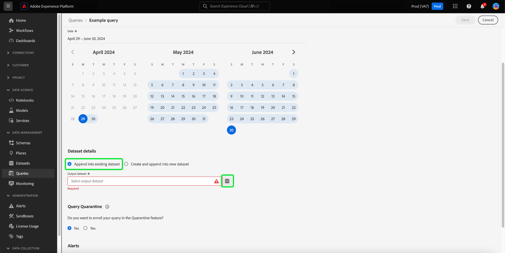
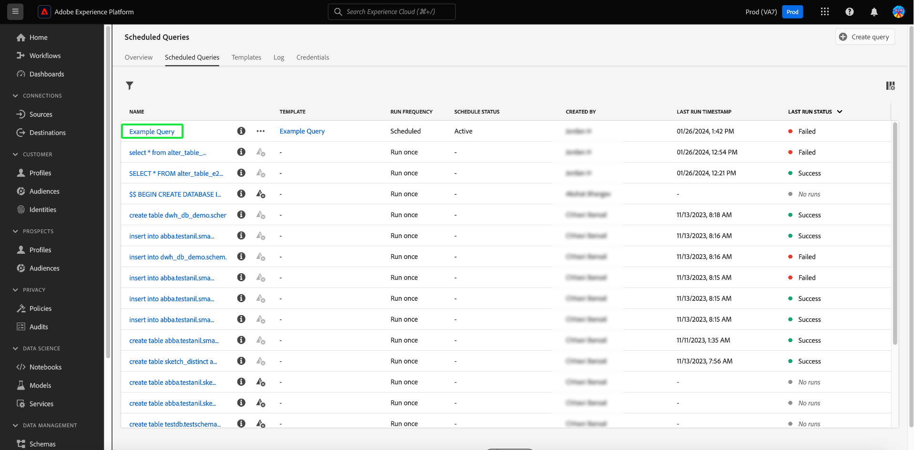

# Abfragepläne

Sie können die Ausführung von Abfragen automatisieren, indem Sie Abfragepläne erstellen. Geplante Abfragen werden in einer benutzerdefinierten Platzierung ausgeführt, um Ihre Daten basierend auf Häufigkeit, Datum und Uhrzeit zu verwalten. Sie können bei Bedarf auch einen Ausgabedatensatz für Ihre Ergebnisse auswählen. Abfragen, die als Vorlage gespeichert wurden, können im Abfrage-Editor geplant werden.

>[!IMPORTANT]
>
>Sie können einen Zeitplan nur zu einer Abfrage hinzufügen, die bereits erstellt, gespeichert und ausgeführt wurde.

Alle geplanten Abfragen werden der Liste im [!UICONTROL Geplante Abfragen] Registerkarte. Von diesem Arbeitsbereich aus können Sie den Status aller geplanten Abfrageaufträge über die Benutzeroberfläche überwachen. Im [!UICONTROL Geplante Abfragen] finden Sie wichtige Informationen zu Ihren Abfrageausführungen und abonnieren Warnungen. Zu den verfügbaren Informationen gehören Status, Planungsdetails und Fehlermeldungen/Codes für den Fall, dass eine Ausführung fehlschlägt. Siehe [Dokument zur Überwachung geplanter Abfragen](./monitor-queries.md) für weitere Informationen.

Dieser Workflow behandelt den Planungsprozess in der Benutzeroberfläche von Query Service. Informationen zum Hinzufügen von Zeitplänen mithilfe der API finden Sie im [Handbuch zu Endpunkten für geplante Abfragen](../api/scheduled-queries.md).

## Erstellen eines Abfragezeitplans {#create-schedule}

Um eine Abfrage zu planen, wählen Sie eine Abfragevorlage aus dem [!UICONTROL Vorlagen] oder [!UICONTROL Vorlage] Spalte [!UICONTROL Geplante Abfragen] Registerkarte. Durch Auswahl des Vorlagennamen gelangen Sie zum Abfrage-Editor.

Wenn Sie über den Abfrage-Editor auf eine gespeicherte Abfrage zugreifen, können Sie einen Zeitplan für die Abfrage erstellen oder den Zeitplan der Abfrage im Detailbereich anzeigen.

>[!TIP]
>
>Auswählen **[!UICONTROL Zeitplan anzeigen]** um zum Arbeitsbereich &quot;Zeitpläne&quot;zu navigieren und geplante Abfragen auf einen Blick anzuzeigen.

![Der Abfrage-Editor mit [!UICONTROL Zeitplan anzeigen] und [!UICONTROL Zeitplan hinzufügen] hervorgehoben.](../images/ui/query-schedules/view-add-schedule.png)

Auswählen **[!UICONTROL Zeitplan hinzufügen]** , um zur [Seite mit Zeitplandetails](#schedule-details).

Alternativ können Sie die **[!UICONTROL Zeitpläne]** unter dem Namen der Abfrage klicken.

Der Arbeitsbereich für Zeitpläne wird angezeigt. Die Benutzeroberfläche zeigt eine Liste aller geplanten Ausführungen an, mit denen die Vorlage verknüpft ist. Wählen Sie **[!UICONTROL Zeitplan hinzufügen]** aus, um einen Zeitplan zu erstellen.

### Hinzufügen von Planungsdetails {#schedule-details}

Die Seite mit den Zeitplandetails wird angezeigt. Auf dieser Seite können Sie verschiedene Details für die geplante Abfrage bearbeiten. Zu den Details gehören: [Häufigkeit und Wochentag der geplanten Abfrage](#scheduled-query-frequency) Ausführen, Start- und Enddatum, Datensatz, in den die Ergebnisse exportiert werden sollen, und [Warnungen zum Abfragestatus](#alerts-for-query-status).

#### Geplante Abfragefrequenz {#scheduled-query-frequency}

Für **[!UICONTROL Häufigkeit]** können Sie die folgenden Optionen auswählen:

- **[!UICONTROL Stündlich]**: Die geplante Abfrage wird im ausgewählten Datumsbereich stündlich ausgeführt.
- **[!UICONTROL Täglich]**: Die geplante Abfrage wird alle X Tage zum ausgewählten Zeitpunkt und im ausgewählten Zeitraum ausgeführt. Beachten Sie, dass die ausgewählte Zeit in **UTC** angegeben ist, nicht in Ihrer lokalen Zeitzone.
- **[!UICONTROL Wöchentlich]**: Die ausgewählte Abfrage wird an den ausgewählten Wochentagen, zur ausgewählten Uhrzeit und im ausgewählten Datumsbereich ausgeführt. Beachten Sie, dass die ausgewählte Zeit in **UTC** angegeben ist, nicht in Ihrer lokalen Zeitzone.
- **[!UICONTROL Monatlich]**: Die ausgewählte Abfrage wird jeden Monat am ausgewählten Tag, zur ausgewählten Uhrzeit und im ausgewählten Datumsbereich ausgeführt. Beachten Sie, dass die ausgewählte Zeit in **UTC** angegeben ist, nicht in Ihrer lokalen Zeitzone.
- **[!UICONTROL Jährlich]**: Die ausgewählte Abfrage wird jedes Jahr am ausgewählten Tag, im ausgewählten Monat, zur ausgewählten Uhrzeit und im ausgewählten Datumsbereich ausgeführt. Beachten Sie, dass die ausgewählte Zeit in **UTC** angegeben ist, nicht in Ihrer lokalen Zeitzone.

### Bereitstellen von Datensatzdetails {#dataset-details}

Verwalten Sie die Abfrageergebnisse, indem Sie entweder die Daten an einen vorhandenen Datensatz anhängen oder einen neuen Datensatz erstellen und die Daten daran anhängen.

Auswählen **[!UICONTROL Erstellen und Anhängen an einen neuen Datensatz]** , um einen Datensatz zu erstellen, wenn Sie eine Abfrage zum ersten Mal ausführen. Nachfolgende Ausführungen fügen weiterhin Daten in diesen Datensatz ein. Geben Sie abschließend einen Namen und eine Beschreibung für den Datensatz an.

>[!IMPORTANT]
>
> Da Sie entweder einen vorhandenen Datensatz verwenden oder einen neuen Datensatz erstellen, müssen Sie **weder** `INSERT INTO` noch `CREATE TABLE AS SELECT` als Teil die Abfrage einbeziehen, da die Datensätze bereits festgelegt sind. Das Einbeziehen von `INSERT INTO` oder `CREATE TABLE AS SELECT` als Teil Ihrer geplanten Abfragen führt zu einem Fehler.

![Das Bedienfeld &quot;Zeitplandetails&quot;mit Datensatzdetails und dem [!UICONTROL Erstellen und Anhängen an einen neuen Datensatz] hervorgehobene Optionen.](../images/ui/query-schedules/dataset-details-create-and-append.png)

Wählen Sie alternativ **[!UICONTROL An vorhandenen Datensatz anhängen]** gefolgt vom Datensatzsymbol ().

Die **[!UICONTROL Ausgabedatensatz auswählen]** angezeigt.

Navigieren Sie anschließend entweder zu den vorhandenen Datensätzen oder verwenden Sie das Suchfeld, um die Optionen zu filtern. Wählen Sie die Zeile des Datensatzes aus, die Sie verwenden möchten. Die Datensatzdetails werden im Bereich auf der rechten Seite angezeigt. Auswählen **[!UICONTROL Fertig]** um Ihre Wahl zu bestätigen.

### Abfragen in Quarantäne stellen, wenn sie ständig fehlschlagen {#quarantine}

Bei der Erstellung eines Zeitplans können Sie Ihre Abfrage in der Quarantänefunktion registrieren, um Systemressourcen zu schützen und potenzielle Unterbrechungen zu vermeiden. Die Quarantänefunktion identifiziert und isoliert Abfragen, die wiederholt fehlschlagen, automatisch, indem sie sie in einer [!UICONTROL In Quarantäne] state. Durch Quarantäne von Abfragen nach zehn aufeinander folgenden Fehlern können Sie Probleme eingreifen, überprüfen und beheben, bevor Sie weitere Ausführungen zulassen. Dies hilft Ihnen bei der Aufrechterhaltung Ihrer betrieblichen Effizienz und Datenintegrität.

![Der Arbeitsbereich &quot;Zeitpläne für Abfragen&quot;mit [!UICONTROL Abfrage-Quarantäne] markiert und Ja ausgewählt ist.](../images/ui/query-schedules/quarantine-enroll.png)

Nachdem eine Abfrage für die Quarantänefunktion registriert wurde, können Sie Warnhinweise für diese Änderung des Abfragestatus abonnieren. Wenn eine geplante Abfrage nicht unter Quarantäne gestellt wird, wird sie nicht als Option für [das Dialogfeld &quot;Warnungen&quot;](./monitor-queries.md#alert-subscription).

Sie können auch eine geplante Abfrage über die Inline-Aktionen der Funktion [!UICONTROL Geplante Abfragen] Registerkarte. Siehe [Dokumentation zu Überwachungsabfragen](./monitor-queries.md#alert-subscription) für weitere Details.

### Warnhinweise für den Status einer geplanten Abfrage festlegen {#alerts-for-query-status}

Sie können im Rahmen Ihrer geplanten Abfrageeinstellungen auch Abfragewarnungen abonnieren. Das bedeutet, dass Sie Benachrichtigungen über eine Statusänderung Ihrer Abfrage erhalten. Warnhinweise können entweder als Popup-Benachrichtigungen oder als E-Mails empfangen werden. Zu den verfügbaren Warnungsoptionen für den Abfragestatus gehören Start, Erfolg und Fehler. Aktivieren Sie das Kontrollkästchen, um Warnhinweise für diesen Status der geplanten Abfrage zu abonnieren.

Einen Überblick über Warnhinweise in Adobe Experience Platform, einschließlich der Struktur der Definition von Warnregeln, finden Sie im Abschnitt [Warnungen - Übersicht](../../observability/alerts/overview.md). Eine Anleitung zum Verwalten von Warnhinweisen und Warnregeln in der Adobe Experience Platform-Benutzeroberfläche finden Sie im Abschnitt [Handbuch zur Warnhinweis-Benutzeroberfläche](../../observability/alerts/ui.md).

### Festlegen von Parametern für eine geplante parametrisierte Abfrage {#set-parameters}

>[!IMPORTANT]
>
>Die Funktion der parametrisierten Abfragebenutzeroberfläche ist derzeit in einer **Nur begrenzte Version** und ist nicht für alle Kunden verfügbar. Wenn Sie keinen Zugriff auf parametrierte Abfragen haben, fahren Sie mit dem [Zeitplan löschen oder deaktivieren](#delete-schedule) Abschnitt.

Wenn Sie eine geplante Abfrage für eine parametrisierte Abfrage erstellen, müssen Sie jetzt die Parameterwerte für diese Abfrageausführungen festlegen.

Wählen Sie nach Bestätigung Ihrer Planungsdetails **[!UICONTROL Speichern]** um einen Zeitplan zu erstellen. Sie werden zum Tab Zeitpläne Ihrer Vorlage zurückgeleitet. In diesem Arbeitsbereich werden Details zum neu erstellten Zeitplan angezeigt, einschließlich der Zeitplan-ID, des Zeitplans selbst und des Ausgabedatensatzes des Zeitplans.

## Geplante Abfrageausführungen anzeigen {#scheduled-query-runs}

Aus der Vorlage [!UICONTROL Zeitpläne] wählen Sie die Zeitplan-ID aus, um zur Liste der Abfrageausführungen für Ihre neu geplante Abfrage zu navigieren.

Sie haben auch die Möglichkeit, eine Liste der geplanten Ausführungen einer Abfragevorlage anzuzeigen, indem Sie zur **[!UICONTROL Geplante Abfragen]** und wählen Sie einen Vorlagennamen aus der verfügbaren Liste aus.

Die Liste der ausgeführten Abfragen für diese geplante Abfrage wird angezeigt.

Siehe [Handbuch zur Überwachung geplanter Abfragen](./monitor-queries.md#inline-actions) für vollständige Informationen zur Überwachung des Status aller Abfrageaufträge über die Benutzeroberfläche.

Wählen Sie eine **[!UICONTROL Kennung der Abfrageausführung]** aus der Liste, um zur Übersicht über die Abfrageausführung zu navigieren. Für eine vollständige Aufschlüsselung der verfügbaren Informationen über [Abfragenlaufübersicht](./monitor-queries.md#query-run-overview)finden Sie Informationen in der Dokumentation zur Überwachung geplanter Abfragen .

Informationen zum Überwachen geplanter Abfragen mithilfe der Query Service-API finden Sie in der [Handbuch zu geplanten Abfrage-Run-Endpunkten](../api/runs-scheduled-queries.md).

## Zeitplan aktivieren, deaktivieren oder löschen {#delete-schedule}

Sie können einen Zeitplan im Arbeitsbereich Zeitpläne einer bestimmten Abfrage oder im [!UICONTROL Geplante Abfragen] Arbeitsbereich, der alle geplanten Abfragen auflistet.

So greifen Sie auf die [!UICONTROL Zeitpläne] im Tab der von Ihnen ausgewählten Abfrage den Namen einer Abfragevorlage aus dem [!UICONTROL Vorlagen] oder [!UICONTROL Geplante Abfragen] Registerkarte. Dadurch wird zum Abfrage-Editor für diese Abfrage navigiert. Wählen Sie im Abfrage-Editor **[!UICONTROL Zeitpläne]** , um auf den Arbeitsbereich Zeitpläne zuzugreifen.

Wählen Sie einen Zeitplan aus den Zeilen der verfügbaren Zeitpläne aus, um den Detailbereich zu füllen. Verwenden Sie den Umschalter, um die geplante Abfrage zu deaktivieren (oder zu aktivieren).

### Löschen deaktivierter Abfragen

>[!IMPORTANT]
>
>Sie müssen einen Zeitplan deaktivieren, bevor Sie ihn für eine Abfrage löschen können.

Ein Bestätigungsdialogfeld wird angezeigt. Auswählen **[!UICONTROL Deaktivieren]** , um die Aktion zu bestätigen.

Wählen Sie **[!UICONTROL Zeitplan löschen]** aus, um den deaktivierten Zeitplan zu löschen.

Alternativ kann die Variable [!UICONTROL Geplante Abfragen] bietet eine Sammlung von Inline-Aktionen für jede geplante Abfrage. Zu den verfügbaren Inline-Aktionen gehören [!UICONTROL Zeitplan deaktivieren] oder [!UICONTROL Zeitplan aktivieren], [!UICONTROL Zeitplan löschen], und [!UICONTROL Abonnieren] auf Warnhinweise für die geplante Abfrage. Vollständige Anweisungen zum Löschen oder Deaktivieren einer geplanten Abfrage über die Registerkarte &quot;Geplante Abfragen&quot;finden Sie in der [Handbuch zur Überwachung geplanter Abfragen](./monitor-queries.md#inline-actions).
