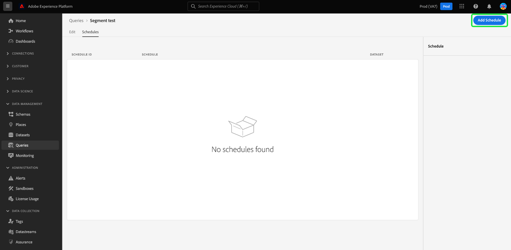

# Abfragepläne

Sie können die Ausführung von Abfragen automatisieren, indem Sie Abfragepläne erstellen. Geplante Abfragen werden in einem benutzerdefinierten Ordner ausgeführt, um Ihre Daten basierend auf Häufigkeit, Datum und Uhrzeit zu verwalten. Sie können bei Bedarf auch einen Ausgabedatensatz für Ihre Ergebnisse auswählen. Abfragen, die als Vorlage gespeichert wurden, können im Abfrage-Editor geplant werden.

>[!IMPORTANT]
>
>Im Folgenden finden Sie eine Liste der Einschränkungen für geplante Abfragen bei Verwendung des Abfrage-Editors. Sie gelten nicht für die [!DNL Query Service]-API: Sie können einen Zeitplan nur zu einer Abfrage hinzufügen, die bereits erstellt, gespeichert und ausgeführt wurde. Sie können **keinen** Zeitplan zu einer parametrisierten Abfrage hinzufügen. Geplante Abfragen können **keinen** anonymen Block enthalten.

Alle geplanten Abfragen werden der Liste im [!UICONTROL Geplante Abfragen] Registerkarte. Von diesem Arbeitsbereich aus können Sie den Status aller geplanten Abfrageaufträge über die Benutzeroberfläche überwachen. Im [!UICONTROL Geplante Abfragen] finden Sie wichtige Informationen zu Ihren Abfrageausführungen und abonnieren Warnungen. Zu den verfügbaren Informationen gehören Status, Planungsdetails und Fehlermeldungen/Codes für den Fall, dass eine Ausführung fehlschlägt. Siehe [Dokument zur Überwachung geplanter Abfragen](./monitor-queries.md) für weitere Informationen.

## Erstellen von Abfrageplänen {#create-schedule}

Um einer Abfrage einen Zeitplan hinzuzufügen, wählen Sie eine Abfragevorlage auf der Registerkarte [!UICONTROL Vorlagen] oder der Registerkarte [!UICONTROL Geplante Abfragen] aus, um zum Abfrage-Editor zu navigieren.

Informationen zum Hinzufügen von Zeitplänen mithilfe der API finden Sie im [Handbuch zu Endpunkten für geplante Abfragen](../api/scheduled-queries.md).

Wenn über den Abfrage-Editor auf eine gespeicherte Abfrage zugegriffen wird, wird die Registerkarte [!UICONTROL Zeitpläne] unterhalb des Abfragenamens angezeigt. Wählen Sie **[!UICONTROL Zeitpläne]** aus.

Der Arbeitsbereich für Zeitpläne wird angezeigt. Wählen Sie **[!UICONTROL Zeitplan hinzufügen]** aus, um einen Zeitplan zu erstellen.

Die Seite mit den Zeitplandetails wird angezeigt. Auf dieser Seite können Sie die Häufigkeit der geplanten Abfrage, das Start- und Enddatum, den Wochentag, an dem die geplante Abfrage ausgeführt wird, sowie den zu exportierenden Datensatz auswählen.

Für **[!UICONTROL Häufigkeit]** können Sie die folgenden Optionen auswählen:

- **[!UICONTROL Stündlich]**: Die geplante Abfrage wird im ausgewählten Datumsbereich stündlich ausgeführt.
- **[!UICONTROL Täglich]**: Die geplante Abfrage wird alle X Tage zum ausgewählten Zeitpunkt und im ausgewählten Zeitraum ausgeführt. Beachten Sie, dass die ausgewählte Zeit in **UTC** angegeben ist, nicht in Ihrer lokalen Zeitzone.
- **[!UICONTROL Wöchentlich]**: Die ausgewählte Abfrage wird an den ausgewählten Wochentagen, zur ausgewählten Uhrzeit und im ausgewählten Datumsbereich ausgeführt. Beachten Sie, dass die ausgewählte Zeit in **UTC** angegeben ist, nicht in Ihrer lokalen Zeitzone.
- **[!UICONTROL Monatlich]**: Die ausgewählte Abfrage wird jeden Monat am ausgewählten Tag, zur ausgewählten Uhrzeit und im ausgewählten Datumsbereich ausgeführt. Beachten Sie, dass die ausgewählte Zeit in **UTC** angegeben ist, nicht in Ihrer lokalen Zeitzone.
- **[!UICONTROL Jährlich]**: Die ausgewählte Abfrage wird jedes Jahr am ausgewählten Tag, im ausgewählten Monat, zur ausgewählten Uhrzeit und im ausgewählten Datumsbereich ausgeführt. Beachten Sie, dass die ausgewählte Zeit in **UTC** angegeben ist, nicht in Ihrer lokalen Zeitzone.

Für den Ausgabedatensatz können Sie entweder einen vorhandenen Datensatz verwenden oder einen neuen Datensatz erstellen.

>[!IMPORTANT]
>
> Da Sie entweder einen vorhandenen Datensatz verwenden oder einen neuen Datensatz erstellen, müssen Sie **weder** `INSERT INTO` noch `CREATE TABLE AS SELECT` als Teil die Abfrage einbeziehen, da die Datensätze bereits festgelegt sind. Das Einbeziehen von `INSERT INTO` oder `CREATE TABLE AS SELECT` als Teil Ihrer geplanten Abfragen führt zu einem Fehler.

Nachdem Sie alle diese Details geprüft haben, wählen Sie **[!UICONTROL Speichern]** aus, um einen Zeitplan zu erstellen. Sie werden zum Arbeitsbereich für Zeitpläne zurückgeleitet, der Details zum neu erstellten Zeitplan anzeigt, darunter die Zeitplan-ID, den Zeitplan selbst und den Ausgabedatensatz des Zeitplans. Sie können die Zeitplan-ID verwenden, um weitere Informationen zu den Ausführungen der geplanten Abfrage selbst zu erhalten. Weitere Informationen finden Sie im [Handbuch zu Endpunkten für die Ausführung geplanter Abfragen](../api/runs-scheduled-queries.md).

## Löschen oder Deaktivieren eines Zeitplans {#delete-schedule}

Sie können einen Zeitplan im Arbeitsbereich für Zeitpläne löschen oder deaktivieren. Wählen Sie eine Abfragevorlage auf der Registerkarte [!UICONTROL Vorlagen] oder der Registerkarte [!UICONTROL Geplante Abfragen] aus, um zum Abfrage-Editor zu navigieren. Wählen Sie dann **[!UICONTROL Zeitplan]** aus, um auf den Arbeitsbereich für Zeitpläne zuzugreifen.

Wählen Sie einen Zeitplan aus den Zeilen der verfügbaren Zeitpläne aus. Sie können den Umschalter verwenden, um die geplante Abfrage zu deaktivieren oder zu aktivieren.

>[!IMPORTANT]
>
>Sie müssen einen Zeitplan deaktivieren, bevor Sie ihn für eine Abfrage löschen können.

Wählen Sie **[!UICONTROL Zeitplan löschen]** aus, um den deaktivierten Zeitplan zu löschen.

