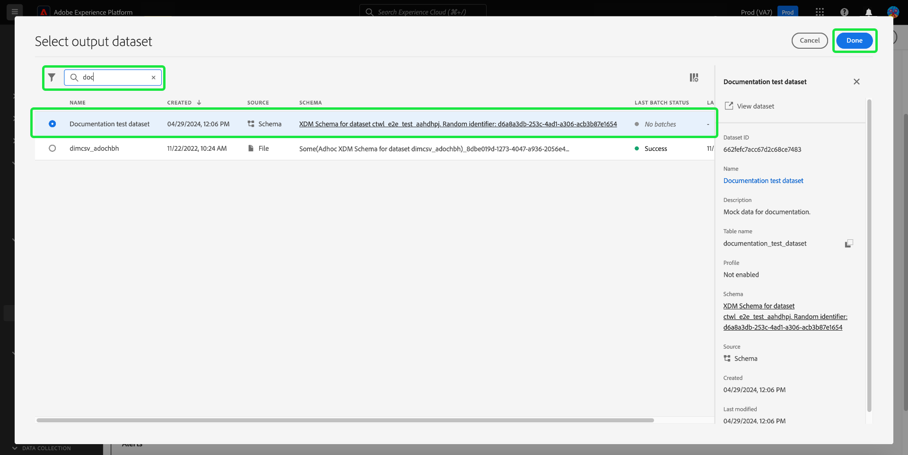

# Abfragepläne

Sie können die Ausführung von Abfragen automatisieren, indem Sie Abfragezeitpläne erstellen. Geplante Abfragen werden mit einer benutzerdefinierten Kadenz ausgeführt, um Ihre Daten basierend auf Häufigkeit, Datum und Uhrzeit zu verwalten. Bei Bedarf können Sie auch einen Ausgabedatensatz für Ihre Ergebnisse auswählen. Abfragen, die als Vorlage gespeichert wurden, können über den Abfrage-Editor geplant werden.

>[!IMPORTANT]
>
>Sie können einen Zeitplan nur zu einer Abfrage hinzufügen, die bereits erstellt und gespeichert wurde.

Alle geplanten Abfragen werden der Liste auf der Registerkarte [!UICONTROL Geplante Abfragen] hinzugefügt. Von diesem Arbeitsbereich aus können Sie den Status aller geplanten Abfrageaufträge über die Benutzeroberfläche überwachen. Auf der Registerkarte [!UICONTROL Geplante Abfragen] finden Sie wichtige Informationen zur Ausführung Ihrer Abfragen und können Warnhinweise abonnieren. Zu den verfügbaren Informationen gehören der Status, Zeitplandetails und Fehlermeldungen/-codes, falls eine Ausführung fehlschlägt. Weitere Informationen finden [ im Dokument ](./monitor-queries.md) Abfragen überwachen .

Dieser Workflow behandelt den Zeitplanungsprozess in der Benutzeroberfläche des Abfrage-Service. Informationen zum Hinzufügen von Zeitplänen mithilfe der API finden Sie im [Handbuch zu Endpunkten für geplante Abfragen](../api/scheduled-queries.md).

## Abfragezeitplan erstellen {#create-schedule}

Um eine Abfrage zu planen, wählen Sie eine Abfragevorlage auf der Registerkarte [!UICONTROL Vorlagen] oder der Spalte [!UICONTROL Vorlage] der Registerkarte [!UICONTROL Geplante Abfragen] aus. Wenn Sie den Vorlagennamen auswählen, gelangen Sie zum Abfrage-Editor.

Wenn Sie über den Abfrage-Editor auf eine gespeicherte Abfrage zugreifen, können Sie einen Zeitplan für die Abfrage erstellen oder den Zeitplan der Abfrage im Detailbereich anzeigen.

>[!TIP]
>
>Wählen Sie **[!UICONTROL Zeitplan anzeigen]** aus, um zum Arbeitsbereich für Zeitpläne zu navigieren und geplante Abfrageausführungen auf einen Blick zu sehen.

![Der Abfrage-Editor mit [!UICONTROL Zeitplan anzeigen] und [!UICONTROL Zeitplan hinzufügen] hervorgehoben.](../images/ui/query-schedules/view-add-schedule.png)

Wählen Sie **[!UICONTROL Zeitplan hinzufügen]** aus, um zur Seite [Zeitplandetails“ ](#schedule-details).

Alternativ können Sie die **[!UICONTROL Zeitpläne]** unter dem Namen der Abfrage auswählen.

Der Arbeitsbereich für Zeitpläne wird angezeigt. Die Benutzeroberfläche zeigt eine Liste aller geplanten Ausführungen an, mit denen die Vorlage verknüpft ist. Wählen Sie **[!UICONTROL Zeitplan hinzufügen]** aus, um einen Zeitplan zu erstellen.

### Zeitplandetails hinzufügen {#schedule-details}

Die Seite mit den Zeitplandetails wird angezeigt. Auf dieser Seite können Sie eine Vielzahl von Details für die geplante Abfrage bearbeiten. Zu den Details gehören [Häufigkeit und Wochentag der geplanten Abfrage](#scheduled-query-frequency) Ausführung, das Start- und Enddatum, der Datensatz, in den die Ergebnisse exportiert werden sollen, und [Abfragestatus-Warnhinweise](#alerts-for-query-status).

>[!IMPORTANT]
>
>Die Benutzeroberfläche der Abfrageplanung unterstützt keine unbegrenzte oder dauerhafte Planung. Ein Enddatum muss angegeben werden. Für das Enddatum gibt es keine Obergrenze.

#### Geplante Abfragefrequenz {#scheduled-query-frequency}

Für **[!UICONTROL Häufigkeit]** können Sie die folgenden Optionen auswählen:

- **[!UICONTROL Stündlich]**: Die geplante Abfrage wird im ausgewählten Datumsbereich stündlich ausgeführt.
- **[!UICONTROL Täglich]**: Die geplante Abfrage wird alle X Tage zum ausgewählten Zeitpunkt und im ausgewählten Zeitraum ausgeführt. Beachten Sie, dass die ausgewählte Zeit in **UTC** angegeben ist, nicht in Ihrer lokalen Zeitzone.
- **[!UICONTROL Wöchentlich]**: Die ausgewählte Abfrage wird an den ausgewählten Wochentagen, zur ausgewählten Uhrzeit und im ausgewählten Datumsbereich ausgeführt. Beachten Sie, dass die ausgewählte Zeit in **UTC** angegeben ist, nicht in Ihrer lokalen Zeitzone.
- **[!UICONTROL Monatlich]**: Die ausgewählte Abfrage wird jeden Monat am ausgewählten Tag, zur ausgewählten Uhrzeit und im ausgewählten Datumsbereich ausgeführt. Beachten Sie, dass die ausgewählte Zeit in **UTC** angegeben ist, nicht in Ihrer lokalen Zeitzone.
- **[!UICONTROL Jährlich]**: Die ausgewählte Abfrage wird jedes Jahr am ausgewählten Tag, im ausgewählten Monat, zur ausgewählten Uhrzeit und im ausgewählten Datumsbereich ausgeführt. Beachten Sie, dass die ausgewählte Zeit in **UTC** angegeben ist, nicht in Ihrer lokalen Zeitzone.

### Angeben von Datensatzdetails {#dataset-details}

Verwalten Sie die Abfrageergebnisse, indem Sie entweder die Daten an einen vorhandenen Datensatz anhängen oder einen neuen Datensatz erstellen und die Daten an ihn anhängen.

Wählen Sie **[!UICONTROL Erstellen und an neuen Datensatz anhängen]** aus, um einen Datensatz zu erstellen, wenn Sie eine Abfrage zum ersten Mal ausführen. Bei nachfolgenden Ausführungen werden weiterhin Daten in diesen Datensatz eingefügt. Geben Sie abschließend einen Namen und eine Beschreibung für den Datensatz an.

>[!IMPORTANT]
>
> Da Sie entweder einen vorhandenen Datensatz verwenden oder einen neuen Datensatz erstellen, müssen Sie **weder** `INSERT INTO` noch `CREATE TABLE AS SELECT` als Teil die Abfrage einbeziehen, da die Datensätze bereits festgelegt sind. Das Einbeziehen von `INSERT INTO` oder `CREATE TABLE AS SELECT` als Teil Ihrer geplanten Abfragen führt zu einem Fehler.

![Das Bedienfeld mit den Zeitplandetails mit Datensatzdetails und den hervorgehobenen [!UICONTROL Erstellen und an neuen Datensatz anhängen]-Optionen.](../images/ui/query-schedules/dataset-details-create-and-append.png)

Wählen Sie alternativ **[!UICONTROL An vorhandenen Datensatz anhängen]** gefolgt vom Datensatzsymbol ().

Das **[!UICONTROL Ausgabedatensatz auswählen]** wird angezeigt.

Durchsuchen Sie als Nächstes entweder die vorhandenen Datensätze oder verwenden Sie das Suchfeld, um die Optionen zu filtern. Wählen Sie die Zeile des Datensatzes aus, den Sie verwenden möchten. Die Datensatzdetails werden im Bedienfeld auf der rechten Seite angezeigt. Wählen **[!UICONTROL Fertig]** aus, um Ihre Auswahl zu bestätigen.

### Abfragen in Quarantäne verschieben, wenn sie kontinuierlich fehlschlagen {#quarantine}

Bei der Erstellung eines Zeitplans können Sie Ihre Abfrage in der Quarantänefunktion registrieren, um Systemressourcen zu schützen und potenzielle Unterbrechungen zu vermeiden. Die Quarantänefunktion identifiziert und isoliert Abfragen, die wiederholt fehlschlagen, automatisch, indem sie in einen [!UICONTROL Quarantänestatus] versetzt wird. Indem Sie Abfragen nach zehn aufeinander folgenden Fehlern unter Quarantäne stellen, können Sie eingreifen, Probleme überprüfen und korrigieren, bevor Sie weitere Ausführungen zulassen. Dies hilft, Ihre betriebliche Effizienz und Datenintegrität zu erhalten.

![Der Arbeitsbereich „Zeitpläne für Abfragen“ mit [!UICONTROL  hervorgehobenen ] „Quarantäne für Abfragen“ und der ausgewählten Option „Ja“.](../images/ui/query-schedules/quarantine-enroll.png)

Sobald eine Abfrage für die Quarantänefunktion registriert ist, können Sie Warnhinweise für diese Änderung des Abfragestatus abonnieren. Wenn eine geplante Abfrage nicht unter Quarantäne gestellt wird, wird sie nicht als Option im [Dialogfeld Warnhinweise“ ](./monitor-queries.md#alert-subscription).

Sie können eine geplante Abfrage auch über die Inline-Aktionen auf der Registerkarte [!UICONTROL Geplante Abfragen“ für ] Quarantänefunktion registrieren. Weitere Informationen finden [ in der ](./monitor-queries.md#alert-subscription) zum Überwachen von Abfragen .

### Festlegen von Warnhinweisen für den Status geplanter Abfragen {#alerts-for-query-status}

Sie können im Rahmen Ihrer Einstellungen für geplante Abfragen auch Abfrage-Warnhinweise abonnieren. Sie können Ihre Einstellungen so konfigurieren, dass Benachrichtigungen für verschiedene Situationen empfangen werden. Warnhinweise können für einen Quarantänestatus, Verzögerungen bei der Abfrageverarbeitung oder eine Änderung des Status Ihrer Abfrage festgelegt werden. Zu den verfügbaren Warnoptionen für den Abfragestatus gehören „Start“, „Erfolg“ und „Fehler“. Warnhinweise können entweder in Form von eingeblendeten Benachrichtigungen oder per E-Mail empfangen werden. Aktivieren Sie das Kontrollkästchen, um Warnhinweise für diesen Status der geplanten Abfrage zu abonnieren.

In der folgenden Tabelle werden die unterstützten Warnhinweistypen für Abfragen erläutert:

| Warnhinweistyp | Beschreibung |
|---|---|
| `start` | Dieser Warnhinweis informiert Sie, wenn eine geplante Abfrageausführung initiiert wird oder mit der Verarbeitung beginnt. |
| `success` | Dieser Warnhinweis informiert Sie, wenn eine geplante Abfrage erfolgreich ausgeführt wurde, und gibt an, dass die Abfrage fehlerfrei ausgeführt wurde. |
| `failed` | Dieser Warnhinweis Trigger, wenn bei der Ausführung einer geplanten Abfrage ein Fehler auftritt oder sie nicht erfolgreich ausgeführt werden kann. So können Sie Probleme schnell identifizieren und beheben. |
| `quarantine` | Dieser Warnhinweis wird aktiviert, wenn eine geplante Abfrageausführung in den Quarantänestatus versetzt wird. Sobald eine Abfrage [in der Quarantänefunktion registriert) ](#quarantine), wird jede geplante Abfrage, die zehn aufeinander folgende Ausführungen fehlschlägt, automatisch in einen [!UICONTROL Quarantänestatus] versetzt. Eine unter Quarantäne gestellte Abfrage erfordert dann Ihr Eingreifen, bevor weitere Ausführungen stattfinden können. Hinweis: Abfragen müssen für die Quarantänefunktion registriert sein, damit Sie Quarantänewarnungen abonnieren können. |
| `delay` | Dieser Warnhinweis benachrichtigt Sie, wenn das [ einer geplanten Abfrageausführung einen bestimmten Schwellenwert ](./monitor-queries.md#query-run-delay). Sie können einen benutzerdefinierten Zeitpunkt festlegen, zu dem der Warnhinweis Trigger wird, wenn die Abfrage für diesen Zeitraum ausgeführt wird, ohne dass entweder der Abschluss erfolgt oder ein Fehler auftritt. Das Standardverhalten legt einen Warnhinweis für 150 Minuten fest, nachdem die Verarbeitung der Abfrage begonnen hat. |

>[!NOTE]
>
>Wenn Sie einen Warnhinweis [!UICONTROL Verzögerung bei der Abfrageausführung] festlegen, müssen Sie Ihre gewünschte Verzögerungszeit in der Platform-Benutzeroberfläche in Minuten festlegen. Geben Sie die Dauer in Minuten ein. Die maximale Verzögerung beträgt 24 Stunden (1440 Minuten).

Einen Überblick über Warnhinweise in Adobe Experience Platform, einschließlich der Struktur der Definition von Warnhinweisregeln, finden Sie unter [Warnhinweise - Übersicht](../../observability/alerts/overview.md). Anleitungen zum Verwalten von Warnhinweisen und Warnhinweisregeln in der Adobe Experience Platform-Benutzeroberfläche finden Sie im [Handbuch zur Benutzeroberfläche von Warnhinweisen](../../observability/alerts/ui.md).

### Festlegen von Parametern für eine geplante parametrisierte Abfrage {#set-parameters}

>[!IMPORTANT]
>
>Die Funktion der parametrisierten Abfrage-Benutzeroberfläche ist derzeit nur in einer **Version verfügbar** nicht für alle Kundinnen und Kunden. Wenn Sie keinen Zugriff auf parametrisierte Abfragen haben, fahren Sie mit dem Abschnitt [Löschen oder Deaktivieren eines ](#delete-schedule)) fort.

Wenn Sie eine geplante Abfrage für eine parametrisierte Abfrage erstellen, müssen Sie jetzt die Parameterwerte für diese Abfrageausführungen festlegen.

Nachdem Sie Ihre Zeitplandetails geprüft haben, klicken Sie auf **[!UICONTROL Speichern]**, um einen Zeitplan zu erstellen. Sie kehren zur Registerkarte Zeitpläne Ihrer Vorlage zurück. Dieser Arbeitsbereich zeigt Details zum neu erstellten Zeitplan an, einschließlich der Zeitplan-ID, des Zeitplans selbst und des Ausgabedatensatzes des Zeitplans.

## Geplante Abfrageausführungen anzeigen {#scheduled-query-runs}

Wählen Sie auf der Registerkarte [!UICONTROL Zeitpläne] der Vorlage die Zeitplan-ID aus, um zur Liste der Abfrageausführungen für Ihre neu geplante Abfrage zu navigieren.

Alternativ können Sie eine Liste der geplanten Ausführungen einer Abfragevorlage anzeigen, indem Sie zur Registerkarte **[!UICONTROL Geplante Abfragen]** navigieren und einen Vorlagennamen aus der verfügbaren Liste auswählen.

Die Liste der Abfrageausführungen für diese geplante Abfrage wird angezeigt.

### Stunden auf Auftragsebene berechnen {#compute-hours}

Verfolgen Sie die auf der Abfrageausführungsebene verbrauchten Rechenstunden für Ihre CTAS/ITAS-Batch-Abfragen. Diese Funktion bietet Einblicke in die Computernutzung und hilft Ihnen, die Ressourcenzuweisung zu optimieren und die Abfrageleistung zu verbessern.

>[!AVAILABILITY]
>
>Die Funktion „Stunden berechnen“ ist nur für Benutzer verfügbar, die die [Data Distiller SKU](../data-distiller/overview.md) erworben haben. Weitere Informationen erhalten Sie von Ihrem Adobe-Support-Mitarbeiter.

Die folgende Tabelle enthält Beschreibungen der einzelnen Spalten, die im Detailabschnitt verfügbar sind und geplante Abfrageausführungen auflisten.

| Spaltentitel | Beschreibung |
|---------------------|----------------------------------|
| [!UICONTROL ID der Abfrageausführung] | Zeigt für jede ausgeführte Abfrage eine eindeutige Kennung an, mit der Sie einzelne Ausführungen Ihrer geplanten Abfragen verfolgen und referenzieren können. |
| [!UICONTROL Start der Abfrageausführung] | Gibt das Startdatum und die Uhrzeit der Abfrageausführung an, damit Sie überwachen können, wann jede Ausführung begann. |
| [!UICONTROL Abfrageausführung abgeschlossen] | Zeigt das Abschlussdatum und die Uhrzeit der Abfrageausführung an, um Einblicke in die Ausführungsdauer und den Status zu geben. |
| [!UICONTROL Status] | Zeigt den aktuellen Status der Abfrageausführung an, z. B. `Completed,` `Running,` oder `Failed,`, um das Ergebnis schnell zu bewerten. |
| [!UICONTROL Datensätze] | Listet die bei der Abfrageausführung verwendeten Datensätze auf, um anzuzeigen, welche Datenquellen an der Ausführung beteiligt waren. |
| [!UICONTROL Stunden berechnen] | Zeigt die für jede Abfrageausführung verwendete Berechnungszeit in Stunden. Dies hilft bei der Verfolgung der Ressourcennutzung und der Optimierung der Abfrageleistung. |

{style="table-layout:auto"}

>[!NOTE]
>
>Die Daten zur Stundenberechnung sind ab 08/15/2024 verfügbar. Daten vor diesem Datum werden als „Nicht verfügbar“ angezeigt.

Vollständige Informationen [ Überwachen des Status aller Abfrageaufträge über die Benutzeroberfläche finden ](./monitor-queries.md#inline-actions) im Handbuch zur Überwachung geplanter Abfragen .

Wählen Sie eine **[!UICONTROL ID der Abfrageausführung]** aus der Liste aus, um zur Übersicht der Abfrageausführung zu navigieren. Eine vollständige Aufschlüsselung der in der (Übersicht über die [) verfügbaren Informationen ](./monitor-queries.md#query-run-overview) Sie in der Dokumentation Überwachen geplanter Abfragen .

Informationen zum Überwachen geplanter Abfragen mithilfe der Abfrage-Service-API finden Sie [Handbuch zu Endpunkten für die Ausführung geplanter Abfragen](../api/runs-scheduled-queries.md).

## Zeitplan aktivieren, deaktivieren oder löschen {#delete-schedule}

Sie können einen Zeitplan im Arbeitsbereich für Zeitpläne einer bestimmten Abfrage oder im Arbeitsbereich „Geplante Abfragen“, der alle geplanten Abfragen auflistet[!UICONTROL  aktivieren, deaktivieren ] löschen.

Um auf die Registerkarte [!UICONTROL Zeitpläne] der ausgewählten Abfrage zuzugreifen, müssen Sie den Namen einer Abfragevorlage entweder auf der Registerkarte [!UICONTROL Vorlagen] oder der Registerkarte [!UICONTROL Geplante Abfragen] auswählen. Dadurch wird zum Abfrage-Editor für diese Abfrage navigiert. Wählen Sie im Abfrage-Editor die Option **[!UICONTROL Zeitpläne]**, um auf den Arbeitsbereich für Zeitpläne zuzugreifen.

Wählen Sie einen Zeitplan aus den Zeilen der verfügbaren Zeitpläne aus, um den Detailbereich auszufüllen. Verwenden Sie den Umschalter, um die geplante Abfrage zu deaktivieren (oder zu aktivieren).

### Deaktivierte Abfragen löschen

>[!IMPORTANT]
>
>Sie müssen einen Zeitplan deaktivieren, bevor Sie ihn für eine Abfrage löschen können.

Ein Bestätigungsdialogfeld wird angezeigt. Klicken Sie **[!UICONTROL Deaktivieren]**, um die Aktion zu bestätigen.

Wählen Sie **[!UICONTROL Zeitplan löschen]** aus, um den deaktivierten Zeitplan zu löschen.

Alternativ dazu bietet [!UICONTROL  Registerkarte „Geplante Abfragen] eine Sammlung von Inline-Aktionen für jede geplante Abfrage. Zu den verfügbaren Inline-Aktionen gehören [!UICONTROL Zeitplan deaktivieren] oder [!UICONTROL Zeitplan aktivieren], [!UICONTROL Zeitplan löschen] und [!UICONTROL Abonnieren] Warnhinweise für die geplante Abfrage. Vollständige Anweisungen zum Löschen oder Deaktivieren einer geplanten Abfrage über die Registerkarte Geplante Abfragen finden Sie im [Handbuch zu geplanten Abfragen überwachen](./monitor-queries.md#inline-actions).
