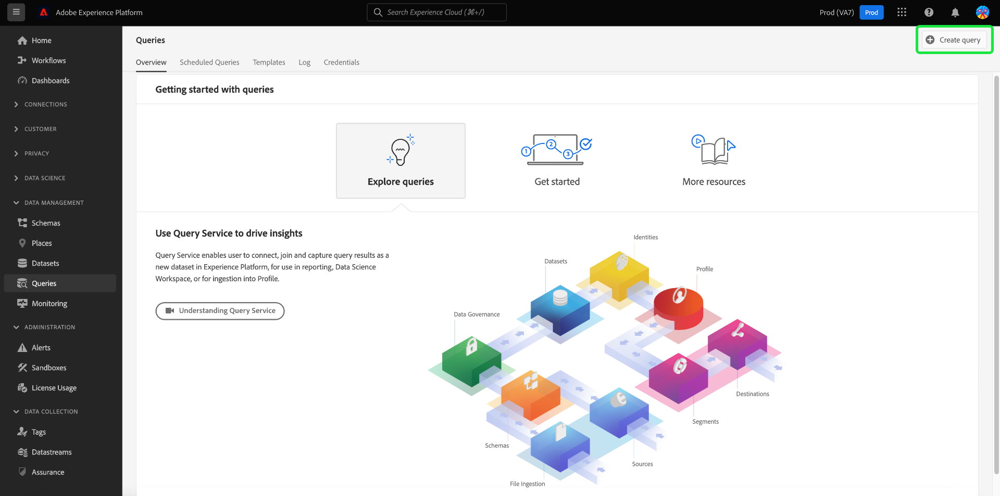

# Handbuch für die [!DNL Query Editor]-Benutzeroberfläche

[!DNL Query Editor] ist ein interaktives Tool, das von Adobe Experience Platform bereitgestellt wird [!DNL Query Service], mit dem Sie Abfragen für Kundenerlebnisdaten in der [!DNL Experience Platform] -Benutzeroberfläche. [!DNL Query Editor] unterstützt die Entwicklung von Abfragen für die Analyse und Datenexploration und ermöglicht Ihnen das Ausführen interaktiver Abfragen zu Entwicklungszwecken sowie nicht interaktiver Abfragen zum Füllen von Datensätzen in [!DNL Experience Platform].

Weitere Informationen zu Konzepten und Funktionen von [!DNL Query Service], siehe [Query Service - Übersicht](../home.md). Weitere Informationen zum Navigieren in der Benutzeroberfläche von Query Service finden Sie unter [!DNL Platform], siehe [Übersicht über die Benutzeroberfläche von Query Service](./overview.md).

## Erste Schritte {#getting-started}

[!DNL Query Editor] bietet flexible Ausführung von Abfragen durch Verbinden mit [!DNL Query Service], und Abfragen werden nur ausgeführt, während diese Verbindung aktiv ist.

### Herstellen einer Verbindung zu [!DNL Query Service] {#connecting-to-query-service}

[!DNL Query Editor] Initialisierung und Verbindung dauert einige Sekunden [!DNL Query Service] beim Öffnen. Die Konsole teilt Ihnen mit, wann eine Verbindung besteht, wie unten dargestellt. Wenn Sie versuchen, eine Abfrage auszuführen, bevor der Editor eine Verbindung hergestellt hat, wird die Ausführung verzögert, bis die Verbindung hergestellt ist.

### Ausführen von Abfragen [!DNL Query Editor] {#run-a-query}

Von [!DNL Query Editor] interaktiv ausführen. Das bedeutet, dass die Abfrage abgebrochen wird, wenn Sie den Browser schließen oder wegnavigieren. Dies gilt auch für Abfragen, die zum Generieren von Datensätzen aus Abfrageausgaben vorgenommen werden.

## Abfragebearbeitung mit [!DNL Query Editor] {#query-authoring}

Verwenden [!DNL Query Editor], können Sie Abfragen für Kundenerlebnisdaten schreiben, ausführen und speichern. Alle Abfragen, die ausgeführt oder in gespeichert werden [!DNL Query Editor] stehen allen Benutzern in Ihrer Organisation mit Zugriff auf [!DNL Query Service].

### Zugreifen auf [!DNL Query Editor] {#accessing-query-editor}

Im [!DNL Experience Platform] Benutzeroberfläche, auswählen **[!UICONTROL Abfragen]** im linken Navigationsmenü, um die [!DNL Query Service] Arbeitsbereich. Wählen Sie als Nächstes **[!UICONTROL Abfrage erstellen]** oben rechts im Bildschirm, um mit dem Schreiben von Abfragen zu beginnen. Dieser Link ist auf jeder der Seiten im [!DNL Query Service] Arbeitsbereich.

### Schreiben von Abfragen {#writing-queries}

[!UICONTROL Der Abfrage-Editor ist so organisiert, dass das Schreiben von Abfragen so einfach wie möglich ist.] Der folgende Screenshot zeigt, wie der Editor in der Benutzeroberfläche angezeigt wird, wobei die Schaltfläche **Abspielen** und das SQL-Eingabefeld hervorgehoben sind.

Um Ihre Entwicklungszeit zu minimieren, sollten Sie Ihre Abfragen mit Begrenzungen für die zurückgegebenen Zeilen entwickeln. Beispiel: `SELECT fields FROM table WHERE conditions LIMIT number_of_rows`. Nachdem Sie überprüft haben, ob Ihre Abfrage die erwartete Ausgabe erzeugt, entfernen Sie die Begrenzungen und führen Sie die Abfrage mit `CREATE TABLE tablename AS SELECT` aus, um einen Datensatz mit der Ausgabe zu generieren.

### Schreibwerkzeuge in [!DNL Query Editor] {#writing-tools}

- **Automatische Syntaxhervorhebung:** Erleichtert das Lesen und Organisieren von SQL.

- **Automatische Vervollständigung von SQL-Suchbegriffen:** Geben Sie Ihre Abfrage ein und verwenden Sie dann die Pfeiltasten, um zum gewünschten Begriff zu navigieren, und drücken Sie die **Eingabe**.

- **Tabelle und Felder automatisch vervollständigen:** Beginnen Sie mit der Eingabe des Tabellennamens für den `SELECT`-Vorgang, navigieren Sie mit den Pfeiltasten zur gewünschten Tabelle und drücken Sie die **Eingabetaste**. Sobald eine Tabelle ausgewählt ist, erkennt das automatische Vervollständigung die Felder in dieser Tabelle.

### Fehlererkennung {#error-detection}

[!DNL Query Editor] validiert eine Abfrage beim Schreiben automatisch, wobei eine allgemeine SQL-Validierung und eine spezifische Ausführungsvalidierung bereitgestellt werden. Wenn eine rote Unterstreichung unter der Abfrage angezeigt wird (wie in der Abbildung unten dargestellt), handelt es sich um einen Fehler in der Abfrage.

Wenn Fehler erkannt werden, können Sie die spezifischen Fehlermeldungen anzeigen, indem Sie den Mauszeiger über den SQL-Code bewegen.

### Details zur Abfrage {#query-details}

Beim Anzeigen einer Abfrage in [!DNL Query Editor], die **[!UICONTROL Details zur Abfrage]** bietet Tools zum Verwalten der ausgewählten Abfrage.

In diesem Bedienfeld können Sie einen Ausgabedatensatz direkt über die Benutzeroberfläche generieren, die angezeigte Abfrage löschen oder benennen und der Abfrage einen Zeitplan hinzufügen.

In diesem Bedienfeld werden außerdem nützliche Metadaten angezeigt, z. B. das letzte Mal, dass die Abfrage geändert wurde und wer sie ggf. geändert hat. Um einen Datensatz zu generieren, wählen Sie **[!UICONTROL Ausgabedatensatz]**. Das Dialogfeld **[!UICONTROL Ausgabedatensatz]** wird angezeigt. Geben Sie einen Namen und eine Beschreibung ein und wählen Sie **[!UICONTROL Abfrage ausführen]**. Der neue Datensatz wird im **[!UICONTROL Datensätze]** auf der Registerkarte [!DNL Query Service] Benutzeroberfläche auf [!DNL Platform].

### Geplante Abfragen {#scheduled-queries}

>[!IMPORTANT]
>
>Im Folgenden finden Sie eine Liste der Einschränkungen für geplante Abfragen bei Verwendung des Abfrage-Editors. Sie gelten nicht für die [!DNL Query Service] API: Sie können einen Zeitplan nur zu einer Abfrage hinzufügen, die bereits erstellt, gespeichert und ausgeführt wurde. You **cannot** einen Zeitplan zu einer parametrisierten Abfrage hinzufügen. Geplante Abfragen **cannot** einen anonymen Block enthalten.

Um einen Zeitplan zu einer Abfrage hinzuzufügen, wählen Sie **[!UICONTROL Zeitplan hinzufügen]**.

Die **[!UICONTROL Details planen]** angezeigt. Auf dieser Seite können Sie die Häufigkeit der geplanten Abfrage, das Datum der Ausführung der geplanten Abfrage sowie den Datensatz auswählen, in den die Abfrage exportiert werden soll.

Sie können die folgenden Optionen für **[!UICONTROL Häufigkeit]**:

- **[!UICONTROL Stündlich]**: Die geplante Abfrage wird für den ausgewählten Datumsbereich stündlich ausgeführt.
- **[!UICONTROL Täglich]**: Die geplante Abfrage wird alle X Tage zum ausgewählten Zeitpunkt und zum ausgewählten Zeitraum ausgeführt. Bitte beachten Sie, dass die ausgewählte Zeit in **UTC** und nicht Ihre lokale Zeitzone.
- **[!UICONTROL Wöchentlich]**: Die ausgewählte Abfrage wird an den Wochentagen, zur Uhrzeit und zum ausgewählten Datumsbereich ausgeführt. Bitte beachten Sie, dass die ausgewählte Zeit in **UTC** und nicht Ihre lokale Zeitzone.
- **[!UICONTROL Monatlich]**: Die ausgewählte Abfrage wird jeden Monat am Tag, zur Uhrzeit und zum ausgewählten Datumsbereich ausgeführt. Bitte beachten Sie, dass die ausgewählte Zeit in **UTC** und nicht Ihre lokale Zeitzone.
- **[!UICONTROL Jährlich]**: Die ausgewählte Abfrage wird jedes Jahr an dem von Ihnen ausgewählten Tag, Monat, Uhrzeit und Zeitraum ausgeführt. Bitte beachten Sie, dass die ausgewählte Zeit in **UTC** und nicht Ihre lokale Zeitzone.

Für den Datensatz haben Sie die Möglichkeit, entweder einen vorhandenen Datensatz zu verwenden oder einen neuen Datensatz zu erstellen.

>[!IMPORTANT]
>
> Da Sie entweder einen vorhandenen Datensatz verwenden oder einen neuen Datensatz erstellen, tun Sie Folgendes: **not** entweder `INSERT INTO` oder `CREATE TABLE AS SELECT` als Teil der Abfrage, da die Datensätze bereits festgelegt sind. Einschließen von `INSERT INTO` oder `CREATE TABLE AS SELECT` als Teil Ihrer geplanten Abfragen zu einem Fehler führen.

Nachdem Sie alle diese Details bestätigt haben, wählen Sie **[!UICONTROL Speichern]** um einen Zeitplan zu erstellen.

Die Seite mit den Abfragedetails wird erneut angezeigt und zeigt nun die Details des neu erstellten Zeitplans, einschließlich der Zeitplan-ID, des Zeitplans selbst und des Ausgabedatensatzes des Zeitplans. Sie können die Zeitplan-ID verwenden, um weitere Informationen zu den Ausführungen der geplanten Abfrage selbst zu erhalten. Weitere Informationen finden Sie im [Handbuch zu geplanten Abfrage-Run-Endpunkten](../api/runs-scheduled-queries.md).

>[!NOTE]
>
> Sie können **one** Abfragevorlage, die die Benutzeroberfläche verwendet. Wenn Sie einer Abfragevorlage zusätzliche Zeitpläne hinzufügen möchten, müssen Sie die API verwenden. Wenn ein Zeitplan bereits mit der API hinzugefügt wurde, werden Sie **not** über die Benutzeroberfläche zusätzliche Zeitpläne hinzufügen können. Wenn bereits mehrere Zeitpläne an eine Abfragevorlage angehängt sind, wird nur der älteste Zeitplan angezeigt. Informationen zum Hinzufügen von Zeitplänen mithilfe der API finden Sie im Abschnitt [Endpunktleitfaden für geplante Abfragen](../api/scheduled-queries.md).
>
> Darüber hinaus sollten Sie die Seite aktualisieren, wenn Sie sicherstellen möchten, dass Sie über den neuesten Status für den Zeitplan verfügen, den Sie anzeigen.

#### Zeitplan löschen {#delete-schedule}

Sie können einen Zeitplan löschen, indem Sie **[!UICONTROL Zeitplan löschen]**.

>[!IMPORTANT]
>
> Wenn Sie einen Zeitplan für eine Abfrage löschen möchten, müssen Sie den Zeitplan zuerst deaktivieren.

### Speichern von Abfragen {#saving-queries}

[!DNL Query Editor] bietet eine Speicherfunktion, mit der Sie eine Abfrage speichern und später daran arbeiten können. Um eine Abfrage zu speichern, wählen Sie **[!UICONTROL Speichern]** in der oberen rechten Ecke von [!DNL Query Editor]. Bevor eine Abfrage gespeichert werden kann, muss über das Bedienfeld **[!UICONTROL Details zur Abfrage]** ein Name für die Abfrage angegeben werden.

>[!NOTE]
>
>Mit dem Abfrage-Editor in benannte und gespeicherte Abfragen sind als Vorlagen im Abfrage-Dashboard verfügbar. [!UICONTROL Durchsuchen] Registerkarte. Siehe [Vorlagendokumentation](./query-templates.md) für weitere Informationen.

### Auffinden früherer Abfragen {#previous-queries}

Alle Abfragen, die ausgeführt werden von [!DNL Query Editor] werden in der Log-Tabelle erfasst. Sie können die Suchfunktion auf der Registerkarte **[!UICONTROL Protokoll]** verwenden, um Abfrageausführungen zu finden. Gespeicherte Abfragen werden auf der Registerkarte **[!UICONTROL Durchsuchen]** angezeigt.

Weitere Informationen finden Sie in der [Übersicht über die Query Service-Benutzeroberfläche](./overview.md).

>[!NOTE]
>
> Nicht ausgeführte Abfragen werden nicht im Protokoll gespeichert. Damit die Abfrage verfügbar ist in [!DNL Query Service], muss sie ausgeführt oder in gespeichert werden. [!DNL Query Editor].

## Ausführen von Abfragen mit dem Abfrage-Editor {#executing-queries}

So führen Sie eine Abfrage in aus [!DNL Query Editor]können Sie SQL im Editor eingeben oder eine frühere Abfrage aus dem **[!UICONTROL Protokoll]** oder **[!UICONTROL Durchsuchen]** und wählen Sie **Play**. Der Ausführungsstatus der Abfrage wird auf der Registerkarte **[!UICONTROL Konsole]** angezeigt und die Ausgabedaten werden auf der Registerkarte **[!UICONTROL Ergebnisse]** angezeigt.

### Konsole {#console}

Die Konsole bietet Informationen zum Status und zum Betrieb von [!DNL Query Service]. Die Konsole zeigt den Verbindungsstatus an [!DNL Query Service], und alle Fehlermeldungen, die aus diesen Abfragen resultieren.

>[!NOTE]
>
> Die Konsole zeigt nur Fehler an, die beim Ausführen einer Abfrage aufgetreten sind. Es werden keine Fehler bei der Abfragevalidierung angezeigt, bevor eine Abfrage ausgeführt wird.

### Abfrageergebnisse {#query-results}

Nach Abschluss einer Abfrage werden die Ergebnisse im **[!UICONTROL Ergebnisse]** neben dem **[!UICONTROL Konsole]** Registerkarte. Diese Ansicht zeigt die tabellarische Ausgabe Ihrer Abfrage mit bis zu 100 Zeilen an. Mit dieser Ansicht können Sie überprüfen, ob Ihre Abfrage die erwartete Ausgabe erzeugt. Um einen Datensatz mit Ihrer Abfrage zu generieren, entfernen Sie Begrenzungen für zurückgegebene Zeilen und führen Sie die Abfrage mit `CREATE TABLE tablename AS SELECT` aus, um einen Datensatz mit der Ausgabe zu generieren. Siehe [Tutorial zum Generieren von Datensätzen](./create-datasets.md) Anweisungen zum Generieren eines Datensatzes aus Abfrageergebnissen finden Sie unter [!DNL Query Editor].

## Ausführen von Abfragen mit [!DNL Query Service] Tutorial-Video {#query-tutorial-video}

Im folgenden Video erfahren Sie, wie Sie Abfragen in der Adobe Experience Platform-Benutzeroberfläche und in einem PSQL-Client ausführen. Darüber hinaus wird die Verwendung einzelner Eigenschaften in einem XDM-Objekt, die Verwendung von Adobe-definierten Funktionen und die Verwendung von CREATE TABLE AS SELECT (CTAS) demonstriert.

>[!VIDEO](https://video.tv.adobe.com/v/29796?quality=12&learn=on)

## Nächste Schritte

Jetzt wissen Sie, welche Funktionen in verfügbar sind [!DNL Query Editor] und wie Sie in der Anwendung navigieren, können Sie Ihre eigenen Abfragen direkt in [!DNL Platform]. Weitere Informationen zum Ausführen von SQL-Abfragen für Datensätze finden Sie unter [!DNL Data Lake], siehe Handbuch zu [Ausführen von Abfragen](../best-practices/writing-queries.md).
