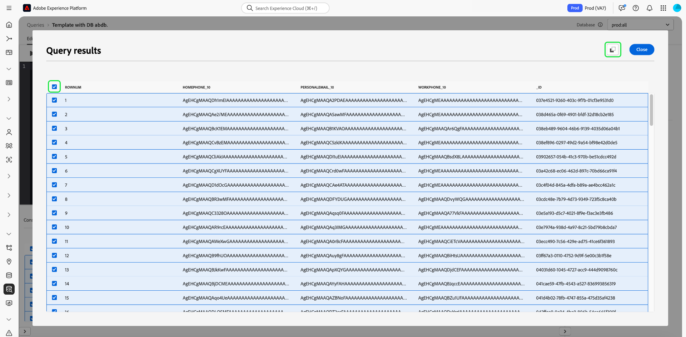
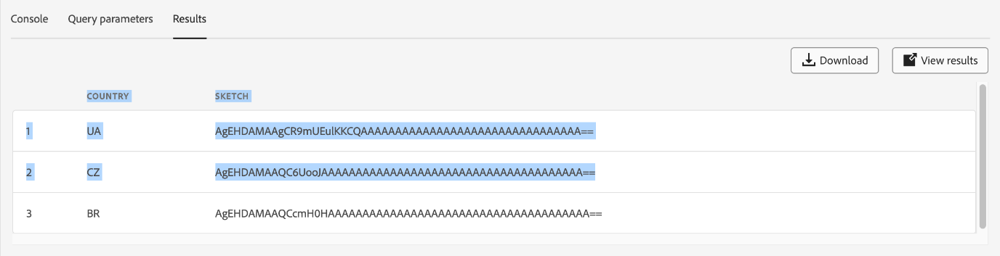

# Handbuch zur Benutzeroberfläche des Abfrage-Editors

Abfrage-Editor ist ein interaktives Tool von Adobe Experience Platform Query Service, mit dem Sie Abfragen für Kundenerlebnisdaten in der [!DNL Experience Platform]-Benutzeroberfläche schreiben, validieren und ausführen können. Der Abfrage-Editor unterstützt die Entwicklung von Abfragen für die Analyse und Datenexploration und ermöglicht das Ausführen interaktiver Abfragen für Entwicklungszwecke sowie nicht interaktiver Abfragen zum Auffüllen von Datensätzen in [!DNL Experience Platform].

Weitere Informationen zu Konzepten und Funktionen von Query Service finden Sie in der [Query Service – Übersicht](../home.md). Weitere Informationen zum Navigieren in der Benutzeroberfläche von Query Service von [!DNL Experience Platform] finden Sie in der [Übersicht über die Query Service-Benutzeroberfläche](./overview.md).

## Erste Schritte {#getting-started}

Der Abfrage-Editor bietet eine flexible Ausführung von Abfragen durch Herstellen einer Verbindung mit dem Abfrage-Service. Abfragen werden nur ausgeführt, solange diese Verbindung aktiv ist.

## Aufrufen des Abfrage-Editors {#accessing-query-editor}

Wählen Sie in der [!DNL Experience Platform]-Benutzeroberfläche **[!UICONTROL Abfragen]** im linken Navigationsmenü aus, um den Arbeitsbereich Abfrage-Service zu öffnen. Wählen Sie als Nächstes oben rechts **[!UICONTROL Bildschirm „Abfrage erstellen]** aus, um Abfragen zu erstellen. Dieser Link ist auf allen Seiten des Arbeitsbereichs „Query Service“ verfügbar.

### Herstellen einer Verbindung zu Query Service {#connecting-to-query-service}

Der Abfrage-Editor benötigt beim Öffnen einige Sekunden, um zu initialisieren und eine Verbindung zum Abfrage-Service herzustellen. Die Konsole gibt an, ob eine Verbindung besteht (siehe unten). Wenn Sie versuchen, eine Abfrage auszuführen, bevor der Editor eine Verbindung hergestellt hat, wird die Ausführung verzögert, bis die Verbindung hergestellt ist.

### Ausführen von Abfragen im Abfrage-Editor {#run-a-query}

Vom Abfrage-Editor ausgeführte Abfragen werden interaktiv ausgeführt. Das bedeutet, dass die Abfrage abgebrochen wird, wenn Sie den Browser schließen oder die Seite verlassen. Dasselbe gilt für Abfragen, die zum Generieren von Datensätzen aus Abfrageausgaben durchgeführt werden.

## Abfrageerstellung mit dem erweiterten Abfrage-Editor {#query-authoring}

Mit dem Abfrage-Editor können Sie Abfragen für Kundenerlebnisdaten schreiben, ausführen und speichern. Alle im Abfrage-Editor ausgeführten oder gespeicherten Abfragen stehen allen Benutzenden in Ihrer Organisation mit Zugriff auf den Abfrage-Service zur Verfügung.

### Datenbankauswahl {#database-selector}

Wählen Sie eine abzufragende Datenbank aus dem Dropdown-Menü oben rechts im Abfrage-Editor. Die ausgewählte Datenbank wird in der Dropdown-Liste angezeigt.

### Einstellungen {#settings}

Ein Einstellungssymbol über dem Eingabefeld des Abfrage-Editors enthält Optionen zum Aktivieren/Deaktivieren des dunklen Designs oder zum Deaktivieren/Aktivieren der automatischen Vervollständigung.

>[!TIP]
>
>Sie können [!UICONTROL Automatische Syntaxvervollständigung deaktivieren] während Sie eine Abfrage erstellen, ohne Ihren Fortschritt zu verlieren.

Um dunkle oder helle Designs zu aktivieren, wählen Sie das Einstellungssymbol (), gefolgt von der Option im angezeigten Dropdown-Menü.

#### Automatisch vervollständigen {#auto-complete}

Der Abfrage-Editor schlägt automatisch potenzielle SQL-Schlüsselwörter zusammen mit Tabellen- oder Spaltendetails für die Abfrage vor, während Sie sie schreiben. Die Funktion zur automatischen Vervollständigung ist standardmäßig aktiviert und kann jederzeit in den Einstellungen des Abfrage-Editors deaktiviert oder aktiviert werden.

Die Konfigurationseinstellung für die automatische Vervollständigung erfolgt pro Benutzer und wird für die aufeinander folgenden Anmeldungen dieses Benutzers gespeichert. Die Deaktivierung dieser Funktion verhindert, dass mehrere Metadatenbefehle verarbeitet werden, und bietet Empfehlungen, die in der Regel die Bearbeitung von Abfragen durch den Autor beschleunigt.

### Ausführen mehrerer sequenzieller Abfragen {#execute-multiple-sequential-queries}

Verwenden Sie den erweiterten Abfrage-Editor, um mehr als eine Abfrage zu schreiben und alle Abfragen nacheinander auszuführen. Die Ausführung mehrerer Abfragen in einer Sequenz erzeugt jeweils einen Protokolleintrag. In der Abfrage-Editor-Konsole werden jedoch nur die Ergebnisse der ersten Abfrage angezeigt. Überprüfen Sie das Abfrageprotokoll, wenn Sie die ausgeführten Abfragen beheben oder bestätigen müssen. Weitere Informationen finden [ in der ](./query-logs.md) zu Abfrageprotokollen .

>[!NOTE]
> 
>Wenn eine CTAS-Abfrage nach der ersten Abfrage im Abfrage-Editor ausgeführt wird, wird weiterhin eine Tabelle erstellt, es gibt jedoch keine Ausgabe in der Abfrage-Editor-Konsole.

### Ausgewählte Abfrage ausführen {#execute-selected-query}

Wenn Sie mehrere Abfragen geschrieben haben, aber nur eine Abfrage ausführen müssen, können Sie die ausgewählte Abfrage markieren und auswählen.
[!UICONTROL &#x200B; Symbol „Ausgewählte Abfrage ausführen]. Dieses Symbol ist standardmäßig deaktiviert, bis Sie im Editor Abfragesyntax auswählen.

![Der Abfrage-Editor mit dem hervorgehobenen Symbol [!UICONTROL Ausgewählte Abfrage ausführen].](../images/ui/query-editor/run-selected-query.png)

### Abbrechen der Sitzung des Abfrage-Editors {#cancel-query}

Übernehmen Sie die Kontrolle über die Ausführung von Abfragen und verbessern Sie Ihre Produktivität, indem Sie langwierige Abfragen abbrechen. Diese Aktion löscht den Abfrage-Editor während einer Abfrageausführung. Beachten Sie, dass die Abfrage weiterhin im Hintergrund ausgeführt wird. Wenn es sich um eine CTAS-Abfrage handelt, wird dennoch ein Ausgabedatensatz generiert. Um die Ausführung im Editor abzubrechen und mit dem Erstellen einer SQL-Anweisung fortzufahren, wählen Sie **[!UICONTROL Abfrage abbrechen]** nach dem Ausführen einer Abfrage aus.

![Der Abfrage-Editor mit [!UICONTROL &#x200B; hervorgehobenen Option „Abfrage &#x200B;]&quot;.](../images/ui/query-editor/cancel-query-run.png)

Ein Bestätigungsdialogfeld wird angezeigt. Wählen Sie **[!UICONTROL Bestätigen]**, um die Ausführung der Abfrage abzubrechen.

### Ergebniszähler {#result-count}

Der Abfrage-Editor verfügt über eine Ausgabe von maximal 50.000 Zeilen. Sie können die Anzahl der Zeilen auswählen, die gleichzeitig in der Abfrage-Editor-Konsole angezeigt werden. Um die Anzahl der in der Konsole angezeigten Zeilen zu ändern, wählen Sie die Dropdown-Liste **[!UICONTROL Ergebnisanzahl]** und aus den Optionen 50, 100, 150, 300, 500 und 1000 aus.

>[!NOTE]
>
>Da die Experience Platform-Benutzeroberfläche bis zu 1.000 Zeilen unterstützen kann, wird die Übergabe eines LIMIT-Werts über 1.000 ignoriert.

## Schreiben von Abfragen {#writing-queries}

Der [!UICONTROL Abfrage-Editor] ist so organisiert, dass das Schreiben von Abfragen so einfach wie möglich ist. Der folgende Screenshot zeigt, wie der Editor in der Benutzeroberfläche angezeigt wird, wobei das SQL-Eingabefeld und **Abspielen** hervorgehoben sind.

Um die Entwicklungszeit zu minimieren, wird empfohlen, die Abfragen mit Beschränkungen für die Anzahl der zurückgegebenen Zeilen zu entwickeln. Beispiel: `SELECT fields FROM table WHERE conditions LIMIT number_of_rows`. Nachdem Sie überprüft haben, ob Ihre Abfrage die erwartete Ausgabe erzeugt, entfernen Sie die Begrenzungen und führen Sie die Abfrage mit `CREATE TABLE tablename AS SELECT` aus, um einen Datensatz mit der Ausgabe zu generieren.

## Schreibwerkzeuge im Abfrage-Editor {#writing-tools}

Verwenden Sie die Schreibwerkzeuge des Abfrage-Editors, um den Prozess zum Erstellen von Abfragen zu verbessern. Zu den Funktionen gehören Optionen zum Formatieren von Text, Kopieren von SQL, Verwalten von Abfragedetails und Speichern oder Planen Ihrer Arbeit während des Fortschritts.

### Text formatieren {#format-text}

Die Funktion [!UICONTROL Text formatieren] macht Ihre Abfrage lesbarer, indem sie einen standardisierten Syntaxstil hinzufügt. Wählen Sie **[!UICONTROL Text formatieren]**, um den gesamten Text im Abfrage-Editor zu standardisieren.

>[!NOTE]
>
>Die Funktion [!UICONTROL Text formatieren] funktioniert nicht bei anonymen Blöcken. Informationen zum Verketten einer oder mehrerer SQL-Anweisungen nacheinander finden Sie in der [Dokumentation zu anonymen Blöcken](../key-concepts/anonymous-block.md).

![Der Abfrage-Editor mit [!UICONTROL Text formatieren] und den hervorgehobenen SQL-Anweisungen.](../images/ui/query-editor/format-text.png)

<!-- ### Undo text {#undo-text}

If you format your SQL in the Query Editor, you can undo the formatting applied by the [!UICONTROL Format text] feature. To return your SQL back to its original form, select **[!UICONTROL Undo text]**.

![The Query Editor with [!UICONTROL Undo text] and the SQL statements highlighted.](../images/ui/query-editor/undo-text.png) -->

### SQL kopieren {#copy-sql}

Wählen Sie das Kopiersymbol aus, um SQL aus dem Abfrage-Editor in die Zwischenablage zu kopieren. Diese Kopierfunktion ist sowohl für Abfragevorlagen als auch für neu erstellte Abfragen im Abfrage-Editor verfügbar.

### Details zur Abfrage {#query-details}

Um eine Abfrage im Abfrage-Editor anzuzeigen, wählen Sie eine gespeicherte Vorlage auf der Registerkarte [!UICONTROL Vorlagen] aus. Das Bedienfeld mit Abfragedetails enthält weitere Informationen und Tools zum Verwalten der ausgewählten Abfrage. Außerdem werden nützliche Metadaten angezeigt, z. B. wann die Abfrage zuletzt geändert wurde und wer sie gegebenenfalls geändert hat.

>[!NOTE]
>
>Die Optionen [!UICONTROL Zeitplan anzeigen], [!UICONTROL Zeitplan hinzufügen] und [!UICONTROL Abfrage löschen] sind erst verfügbar, nachdem die Abfrage als Vorlage gespeichert wurde. Die [!UICONTROL Zeitplan hinzufügen] Option führt Sie direkt zum Zeitplan-Builder im Abfrage-Editor. Die [!UICONTROL Zeitplan anzeigen] Option führt Sie direkt zum Zeitplan-Inventar für diese Abfrage. Weitere Informationen zum Erstellen von Abfragezeitplänen in der Benutzeroberfläche finden [ in der Dokumentation zu Abfragezeitplänen ](./query-schedules.md#create-schedule).

Im Bedienfeld Details können Sie einen Ausgabedatensatz direkt über die Benutzeroberfläche generieren, die angezeigte Abfrage löschen oder benennen, den Zeitplan für die Ausführung der Abfrage anzeigen und die Abfrage einem Zeitplan hinzufügen.

Um einen Ausgabedatensatz zu generieren, wählen Sie **[!UICONTROL Als CTAS ausführen]** aus. Das **[!UICONTROL Ausgabedatensatzdetails eingeben]** wird angezeigt. Geben Sie einen Namen und eine Beschreibung ein und wählen Sie dann **[!UICONTROL Als CTAS ausführen]** aus. Der neue Datensatz wird auf der Registerkarte **[!UICONTROL Datensätze]** Durchsuchen angezeigt. Weitere [ zu den für Ihre Organisation verfügbaren Datensätzen finden ](../../catalog/datasets/user-guide.md#view-datasets) in der Dokumentation zum Anzeigen von Datensätzen .

>[!NOTE]
>
>Die Option [!UICONTROL Als CTAS ausführen] ist nur verfügbar, wenn die Abfrage **geplant**.

![Dialogfeld [!UICONTROL Ausgabedatensatzdetails eingeben].](../images/ui/query-editor/output-dataset-details.png)

Nachdem Sie die Aktion **[!UICONTROL Als CTAS ausführen]** ausgeführt haben, wird eine Bestätigungsmeldung angezeigt, die Sie über die erfolgreiche Aktion informiert. Diese Popup-Nachricht enthält einen Link, der eine praktische Möglichkeit bietet, zum Arbeitsbereich für Abfrageprotokolle zu navigieren. Weitere Informationen zu Abfrageprotokollen finden [ in ](./query-logs.md) Dokumentation zu Abfrageprotokollen .

### Speichern von Abfragen {#saving-queries}

Der Abfrage-Editor bietet eine Speicherfunktion, mit der Sie eine Abfrage speichern und später daran arbeiten können. Um eine Abfrage zu speichern **[!UICONTROL wählen Sie]** oben rechts im Abfrage-Editor. Bevor eine Abfrage gespeichert werden kann, muss über das Bedienfeld **[!UICONTROL Details zur Abfrage]** ein Name für die Abfrage angegeben werden.

>[!NOTE]
>
>Mit dem Abfrage-Editor benannte und gespeicherte Abfragen sind als Vorlagen in der Registerkarte [!UICONTROL Vorlagen] im Abfrage-Dashboard verfügbar. Weitere Informationen finden Sie in der [Dokumentation zu Vorlagen](./query-templates.md).

Wenn Sie eine Abfrage im Abfrage-Editor speichern, wird eine Bestätigungsmeldung angezeigt, die Sie über die erfolgreiche Aktion informiert. Diese Popup-Nachricht enthält einen Link, der eine einfache Möglichkeit bietet, zum Arbeitsbereich Planung von Abfragen zu navigieren. Weitere Informationen zum Ausführen von [ mit benutzerdefinierter Kadenz finden ](./query-schedules.md) in der Dokumentation zum Planen von Abfragen .

### Geplante Abfragen {#scheduled-queries}

Abfragen, die als Vorlage gespeichert wurden, können über den Abfrage-Editor geplant werden. Mit der Planung von Abfragen können Sie die Ausführung von Abfragen in einer benutzerdefinierten Kadenz automatisieren. Sie können Abfragen basierend auf Häufigkeit, Datum und Uhrzeit planen und bei Bedarf auch einen Ausgabedatensatz für Ihre Ergebnisse auswählen. Abfragezeitpläne können auch über die Benutzeroberfläche deaktiviert oder gelöscht werden.

Zeitpläne werden im Abfrage-Editor festgelegt. Bei Verwendung des Abfrage-Editors können Sie einen Zeitplan nur zu einer Abfrage hinzufügen, die bereits erstellt und gespeichert wurde. Dieselbe Einschränkung gilt nicht für die Abfrage-Service-API.

>[!NOTE]
>
>Geplante Abfragen, die zehn aufeinander folgende Durchläufe nicht bestehen, werden automatisch in den Status [!UICONTROL Quarantäne] versetzt. Eine Abfrage mit diesem Status erfordert Ihr Eingreifen, bevor weitere Ausführungen stattfinden können. Weitere Informationen finden [ in der ](./monitor-queries.md#quarantined-queries) zu „Quarantäneabfragen“.

Weitere Informationen zum Erstellen von Abfragezeitplänen in der Benutzeroberfläche finden [ in der Dokumentation zu Abfragezeitplänen ](./query-schedules.md). Informationen zum Hinzufügen von Zeitplänen mithilfe der API finden Sie alternativ im [Handbuch zu Endpunkten für geplante Abfragen](../api/scheduled-queries.md).

Alle geplanten Abfragen werden der Liste auf der Registerkarte [!UICONTROL Geplante Abfragen] hinzugefügt. Von diesem Arbeitsbereich aus können Sie den Status aller geplanten Abfrageaufträge über die Benutzeroberfläche überwachen. Auf der Registerkarte [!UICONTROL Geplante Abfragen] finden Sie wichtige Informationen zur Ausführung Ihrer Abfragen und können Warnhinweise abonnieren. Zu den verfügbaren Informationen gehören der Status, Details zum Zeitplan und Fehlermeldungen/-codes, wenn ein Durchlauf fehlgeschlagen ist. Weitere Informationen finden [ im Dokument ](./monitor-queries.md) Abfragen überwachen .

### Auffinden früherer Abfragen {#previous-queries}

Alle vom Abfrage-Editor ausgeführten Abfragen werden in der Tabelle „Protokoll“ erfasst. Sie können die Suchfunktion auf der Registerkarte **[!UICONTROL Protokoll]** verwenden, um Abfrageausführungen zu finden. Gespeicherte Abfragen werden auf der Registerkarte **[!UICONTROL Vorlagen]** angezeigt.

Wenn eine Abfrage geplant wurde, bietet die Registerkarte [!UICONTROL Geplante Abfragen] über die Benutzeroberfläche eine verbesserte Sichtbarkeit für diese Abfrageaufträge. Weitere Informationen finden Sie in der [Dokumention zur Abfrageüberwachung](./monitor-queries.md).

>[!NOTE]
>
>Nicht ausgeführte Abfragen werden nicht im Protokoll gespeichert. Damit die Abfrage in Query Service verfügbar ist, muss sie im Abfrage-Editor ausgeführt oder gespeichert werden.

### Objektbrowser {#object-browser}

Verwenden Sie den Objekt-Browser, um Datensätze einfach zu suchen und zu filtern. Der Objekt-Browser reduziert die Zeit, die mit der Suche nach Tabellen und Datensätzen in großen Umgebungen mit zahlreichen Datensätzen verbracht wird. Durch den optimierten Zugriff auf relevante Daten und Metadaten können Sie sich mehr auf die Erstellung von Abfragen konzentrieren und weniger auf die Navigation.

Um in Ihrer Datenbank mit dem Objektbrowser zu navigieren, geben Sie einen Tabellennamen in das Suchfeld ein oder wählen Sie **[!UICONTROL Tabellen]**, um die Liste der verfügbaren Datensätze und Tabellen zu erweitern. Wenn Sie das Suchfeld verwenden, wird die Liste der verfügbaren Tabellen basierend auf Ihrer Eingabe dynamisch gefiltert.

Jeder Datensatz, der in [ausgewählten Datenbank](#database-dropdown) enthalten ist, wird in einer Navigationsleiste links neben dem Abfrage-Editor aufgeführt.

Das im Objekt-Browser angezeigte Schema ist ein beobachtbares Schema. Das bedeutet, dass Sie damit Änderungen und Aktualisierungen in Echtzeit überwachen können, da Änderungen sofort sichtbar sind. Die beobachtbaren Schemata helfen, die Datensynchronisation sicherzustellen, und unterstützen bei Debugging- oder Analyseaufgaben.

#### Strombegrenzung {#current-limitation}

Das System verarbeitet Abfragen sequenziell, d. h., es kann jeweils nur eine Abfrage ausgeführt werden. Während eine Abfrage ausgeführt wird, können im linken Navigationsbereich keine zusätzlichen Tabellen aufgerufen werden.

#### Zugriff auf Tabellenmetadaten {#table-metadata}

Zusätzlich zu den Schnellsuchen können Sie jetzt auch einfach auf die Metadaten einer beliebigen Tabelle zugreifen, indem Sie auf das Symbol „i“ neben dem Tabellennamen klicken. Dadurch erhalten Sie detaillierte Informationen zur ausgewählten Tabelle, die Ihnen helfen, beim Schreiben von Abfragen fundierte Entscheidungen zu treffen.

#### Untergeordnete Tabellen durchsuchen

Um untergeordnete oder verknüpfte Tabellen zu untersuchen, klicken Sie in der Liste auf den Dropdown-Pfeil neben einem Tabellennamen. Dadurch wird die Tabelle erweitert, sodass alle verknüpften untergeordneten Tabellen angezeigt werden. Außerdem erhalten Sie eine klare Übersicht über die Datenstruktur und können komplexere Abfragekonstruktionen erstellen. Das Symbol neben dem Feldnamen gibt den Datentyp der Spalte an, damit Sie sie bei komplexen Abfragen identifizieren können.

## Ausführen von Abfragen mit dem Abfrage-Editor {#executing-queries}

Um eine Abfrage im Abfrage-Editor auszuführen, können Sie SQL im Editor eingeben oder eine frühere Abfrage über die Registerkarte **[!UICONTROL Protokoll]** oder **[!UICONTROL Vorlagen]** laden und **Abspielen** auswählen. Der Ausführungsstatus der Abfrage wird auf der Registerkarte **[!UICONTROL Konsole]** angezeigt und die Ausgabedaten werden auf der Registerkarte **[!UICONTROL Ergebnisse]** angezeigt.

### Konsole {#console}

Die Konsole bietet Informationen zum Status und zum Betrieb von Query Service. Die Konsole zeigt den Verbindungsstatus zu Query Service, die ausgeführten Abfragen und alle Fehlermeldungen an, die sich aus diesen Abfragen ergeben.

>[!NOTE]
>
>Die Konsole zeigt nur Fehler an, die bei der Ausführung einer Abfrage aufgetreten sind. Es werden keine Fehler bei der Abfragevalidierung angezeigt, die vor der Ausführung einer Abfrage auftreten.

## Abfrageergebnisse {#query-results}

Nach Abschluss einer Abfrage werden die Ergebnisse auf der Registerkarte **[!UICONTROL Ergebnisse]** neben der Registerkarte **[!UICONTROL Konsole]** angezeigt. Diese Ansicht zeigt die tabellarische Ausgabe Ihrer Abfrage an, wobei je nach ausgewählter ([) Ergebnisanzahl zwischen 50 und 1000 Ergebniszeilen angezeigt ](#result-count). Mit dieser Ansicht können Sie überprüfen, ob Ihre Abfrage die erwartete Ausgabe erzeugt. Um einen Datensatz mit Ihrer Abfrage zu generieren, entfernen Sie Begrenzungen für zurückgegebene Zeilen und führen Sie die Abfrage mit `CREATE TABLE tablename AS SELECT` aus, um einen Datensatz mit der Ausgabe zu generieren. Anweisungen zum Generieren eines Datensatzes aus Abfragen im Abfrage-Editor finden Sie im [Tutorial zum Generieren von Datensätzen](./create-datasets.md).

### Abfrageergebnisse herunterladen {#download-query-results}

>[!AVAILABILITY]
>
>Download-Funktionen stehen nur Kunden mit dem Add-on Data Distiller zur Verfügung. Weitere Informationen zu Data Distiller erhalten Sie von Ihrem Adobe-Support-Mitarbeiter.

Laden Sie nach dem Ausführen einer erfolgreichen Abfrage die Ergebnisse im CSV-, XLSX- oder JSON-Format herunter, um sie in Offline-Analysen, Berichten oder Tabellen-Workflows zu verwenden. Diese Funktion optimiert die Workflows für Marketing- und Analyse-Teams, indem sie den sofortigen Zugriff auf Abfrageergebnisse für Offline-Analysen, Berichte und Excel-basierte Prozesse ermöglicht.

Um Ihre Abfrageergebnisse herunterzuladen, wählen Sie **[!UICONTROL Herunterladen]** in der rechten oberen Ecke der Registerkarte Abfrage-Editor **[!UICONTROL Ergebnis]** aus. Wählen Sie dann **[!UICONTROL CSV]**, **[!UICONTROL XLSX]** oder **[!UICONTROL JSON]** aus dem Dropdown-Menü aus. Die Datei wird automatisch auf Ihren lokalen Computer heruntergeladen. Wählen Sie das Format aus, das zu Ihrem Anwendungsfall passt, CSV für einfache Exporte, XLSX für formatierte Kalkulationstabellen oder JSON für die strukturierte Datenverarbeitung.

>[!NOTE]
>
>Wenn die Schaltfläche **[!UICONTROL Herunterladen]** fehlt, überprüfen Sie die Abfrageergebnisse. Die Schaltfläche wird nur angezeigt, wenn Datensätze zurückgegeben werden. Wenn keine Datensätze zurückgegeben werden, wird auf der **[!UICONTROL Ergebnis]**-Registerkarte die Meldung „Keine Ergebnisse“ angezeigt und die Download-Option ist deaktiviert.

>[!NOTE]
>
>Beim Öffnen einer CSV-Datei in Excel wird möglicherweise der folgende Warnhinweis angezeigt:  Möglicher Datenverlust. Einige Funktionen gehen möglicherweise verloren, wenn Sie diese Arbeitsmappe im kommagetrennten CSV-Format speichern. Um diese Funktionen beizubehalten, speichern Sie sie in einem Excel-Dateiformat.“ Beachten Sie außerdem, dass die Formatierung von Datum und Uhrzeit je nach Dateityp variieren kann. CSV-Dateien behalten das in den Abfrageergebnissen angezeigte Format bei, während XLSX-Dateien in Excel möglicherweise automatisch lokalisierte Formatierungen anwenden. Wenn diese Warnung angezeigt wird, können Sie sicher fortfahren. Um die Excel-spezifische Formatierung beizubehalten, speichern Sie die Datei stattdessen als XLSX.

### Ergebnisse im Vollbildmodus anzeigen {#view-results}

Wählen Sie nach dem Ausführen einer erfolgreichen Abfrage **[!UICONTROL Ergebnisse anzeigen]** auf der Registerkarte **[!UICONTROL Ergebnis]** aus, um eine tabellarische Vollbildansicht Ihrer Ergebnisse zu öffnen.

Verwenden Sie die Vollbildvorschau, um große Tabellen einfach zu scannen und Details auf Zeilenebene ohne horizontales Scrollen zu überprüfen. Die Vollbildansicht zeigt die Ausgabe in einem in der Größe veränderbaren Raster an, was die Überprüfung großer Datensätze und das spaltenübergreifende Scannen erleichtert.

>[!NOTE]
>
>Die Vorschau ist schreibgeschützt und ändert weder Ihre Abfrage noch Ihren Datensatz.

### Ergebnisse kopieren {#copy-results}

Verwenden Sie die erweiterte Kopierfunktion im Abfrage-Editor, um Abfrageergebnisse als kommagetrennte Werte (CSV) zu kopieren und in Tabellenwerkzeuge wie Excel zur sofortigen Validierung oder Berichterstellung einzufügen. Diese Funktion verbessert die Lesbarkeit, behält die Formatierung bei und optimiert Workflows, ohne auf Tools von Drittanbietern angewiesen zu sein.

Sie können Abfrageergebnisse entweder über die Registerkarte [!UICONTROL Ergebnis] oder über die Vollbildergebnisvorschau kopieren. Wählen Sie auf der **[!UICONTROL Ergebnis]**-Registerkarte das Kopiersymbol (), um alle Abfrageergebnisse in die Zwischenablage zu kopieren. Um das Kopiersymbol zu aktivieren, wählen Sie zunächst eine Zeile aus. Sie können einzelne Zeilen auswählen oder das Kontrollkästchen oben verwenden, um alle Zeilen gleichzeitig auszuwählen.

Wählen Sie alternativ **[!UICONTROL Ergebnisse anzeigen]** aus, um die Vollbildvorschau zu öffnen. Wählen Sie in diesem Dialogfeld einzelne Zeilen aus oder verwenden Sie das Kontrollkästchen in der oberen linken Ecke, um alle Zeilen auszuwählen, und klicken Sie dann auf das Symbol „Kopieren“ (), um die ausgewählten Daten zu kopieren.

### Alte Ergebnistabelle (begrenzte Verfügbarkeit) {#legacy-results-table}

>[!AVAILABILITY]
>
>Die veraltete Ergebnistabelle ist nur für ausgewählte Benutzer über eine Feature Flag verfügbar und wird möglicherweise nicht in Ihrem aktuellen Abfrage-Editor angezeigt. Wenn Ihr Team Drag-to-Select-Workflows verwendet, wenden Sie sich an den Adobe-Support, um den Zugriff zu beantragen.

Die alte Version des Abfrage-Editors ist für Benutzer gedacht, die auf flexible, manuelle Daten-Workflows wie QS oder tabellenbasierte Überprüfung angewiesen sind.

Es unterstützt native Browser-basierte Drag-Auswahl, sodass Sie jeden Teil der Ausgabe - einschließlich einzelner Zellen oder Blöcke - mithilfe des standardmäßigen Auswahlverhaltens markieren und kopieren können. Dies steht im Gegensatz zur erweiterten Tabelle, die die strukturierte Zeilenauswahl und dedizierte Kopieraktionen verwendet.

Kopierte Daten sind tabulatorgetrennt. Wenn Sie sie also in Tools wie Excel einfügen, bleiben die Spalten ausgerichtet und lesbar. Spaltenüberschriften sind auch enthalten, wenn Sie sie per Drag-and-Drop über die Kopfzeile ziehen.

## Beispiele {#examples}

Query Service bietet Lösungen für eine Vielzahl von Anwendungsfällen für verschiedene Branchen und Geschäftsszenarien. Diese Beispiele zeigen die Flexibilität und die Wirkung des Service bei der Erfüllung unterschiedlicher Anforderungen. Um [zu erfahren, wie Query Service Ihren spezifischen Geschäftsanforderungen einen Mehrwert bieten kann](../use-cases/overview.md) sollten Sie sich die umfassende Sammlung von Anwendungsfalldokumenten ansehen. Erfahren Sie, wie Sie mit Query Service Erkenntnisse und Lösungen für eine verbesserte betriebliche Effizienz und einen Geschäftserfolg bereitstellen können.

<!-- This video is from 2019. The logic is sounds but the workflow is too outdated. -->

## Tutorial-Video zum Ausführen von Abfragen mit Query Service {#query-tutorial-video}

Im folgenden Video erfahren Sie, wie Sie Abfragen in der Adobe Experience Platform-Benutzeroberfläche und in einem PSQL-Client ausführen. Das Video zeigt auch die Verwendung einzelner Eigenschaften in einem XDM-Objekt, Adobe-definierte Funktionen und die Verwendung von CREATE TABLE AS SELECT (CTAS)-Abfragen.

>[!NOTE]
>
>Die im Video dargestellte Benutzeroberfläche ist veraltet, aber die im Workflow verwendete Logik bleibt gleich.

>[!VIDEO](https://video.tv.adobe.com/v/29796?quality=12&learn=on)

## Nächste Schritte

Nachdem Sie nun wissen, welche Funktionen im Abfrage-Editor verfügbar sind und wie Sie in der Anwendung navigieren, können Sie damit beginnen, Ihre eigenen Abfragen direkt in [!DNL Experience Platform] zu erstellen. Weitere Informationen zum Ausführen von SQL-Abfragen für Datensätze im [!DNL Data Lake] finden Sie im Handbuch zum [Ausführen von Abfragen](../best-practices/writing-queries.md).
