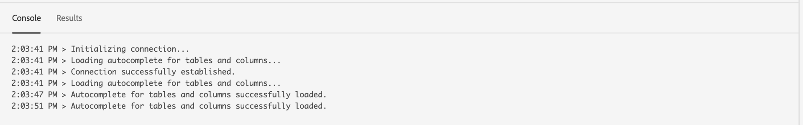
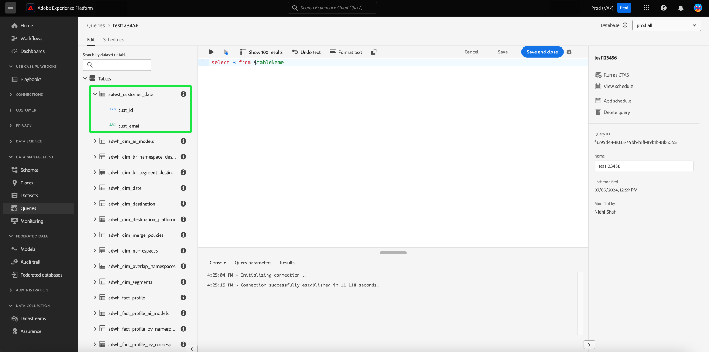

# Anleitung zur Benutzeroberfläche des Abfrage-Editors

>[!NOTE]
>
>Der alte Editor wurde am 24. Mai 2024 eingestellt. Es ist nicht mehr verfügbar. Sie können jetzt den [erweiterten Abfrage-Editor](#enhanced-editor-toggle) verwenden, um Ihre Abfragen zu schreiben, zu validieren und auszuführen

Der Abfrage-Editor ist ein interaktives Tool von Adobe Experience Platform Query Service, mit dem Sie Abfragen für Kundenerlebnisdaten in der [!DNL Experience Platform] -Benutzeroberfläche schreiben, validieren und ausführen können. Der Abfrage-Editor unterstützt die Entwicklung von Abfragen für die Analyse und Datenexploration und ermöglicht Ihnen das Ausführen interaktiver Abfragen zu Entwicklungszwecken sowie nicht-interaktiver Abfragen zum Ausfüllen von Datensätzen in [!DNL Experience Platform].

Weitere Informationen zu Konzepten und Funktionen von Query Service finden Sie in der [Query Service – Übersicht](../home.md). Weitere Informationen zum Navigieren in der Benutzeroberfläche von Query Service von [!DNL Platform] finden Sie in der [Übersicht über die Query Service-Benutzeroberfläche](./overview.md).

## Erste Schritte {#getting-started}

Der Abfrage-Editor bietet eine flexible Ausführung von Abfragen durch Herstellen einer Verbindung zu Query Service. Abfragen werden nur ausgeführt, wenn diese Verbindung aktiv ist.

## Aufrufen des Abfrage-Editors {#accessing-query-editor}

Wählen Sie in der Benutzeroberfläche von [!DNL Experience Platform] im linken Navigationsmenü die Option **[!UICONTROL Abfragen]** aus, um den Arbeitsbereich &quot;Query Service&quot;zu öffnen. Wählen Sie dann oben rechts im Bildschirm die Option **[!UICONTROL Abfrage erstellen]** aus, um Abfragen zu schreiben. Dieser Link ist auf allen Seiten des Arbeitsbereichs „Query Service“ verfügbar.

### Herstellen einer Verbindung zu Query Service {#connecting-to-query-service}

Der Abfrage-Editor benötigt beim Öffnen einige Sekunden, um Query Service zu initialisieren und eine Verbindung herzustellen. Die Konsole gibt an, ob eine Verbindung besteht (siehe unten). Wenn Sie versuchen, eine Abfrage auszuführen, bevor der Editor eine Verbindung hergestellt hat, wird die Ausführung verzögert, bis die Verbindung hergestellt ist.

### Ausführen von Abfragen im Abfrage-Editor {#run-a-query}

Im Abfrage-Editor ausgeführte Abfragen werden interaktiv ausgeführt. Das bedeutet, dass die Abfrage abgebrochen wird, wenn Sie den Browser schließen oder wegnavigieren. Dasselbe gilt für Abfragen, die zum Generieren von Datensätzen aus Abfrageausgaben durchgeführt werden.

## Abfragebearbeitung mit dem erweiterten Abfrage-Editor {#query-authoring}

>[!NOTE]
>
>Der alte Editor wurde am 24. Mai 2024 eingestellt. Es ist nicht mehr verfügbar. Sie können jetzt den erweiterten Abfrage-Editor verwenden, um Ihre Abfragen zu schreiben, zu validieren und auszuführen.

Mit dem Abfrage-Editor können Sie Abfragen für Kundenerlebnisdaten schreiben, ausführen und speichern. Alle Abfragen, die ausgeführt oder im Abfrage-Editor gespeichert werden, stehen allen Benutzern in Ihrer Organisation mit Zugriff auf Query Service zur Verfügung.

### Datenbankauswahl {#database-selector}

Wählen Sie im Dropdown-Menü oben rechts im Abfrage-Editor eine Datenbank aus, die abgefragt werden soll. Die ausgewählte Datenbank wird im Dropdown-Menü angezeigt.

### Einstellungen        {#settings}

Ein Einstellungssymbol über dem Eingabefeld Abfrage-Editor enthält Optionen zum Aktivieren/Deaktivieren des Dunklen Designs oder Deaktivieren/Aktivieren der automatischen Vervollständigung.

>[!TIP]
>
>Sie können [!UICONTROL die automatische Syntaxbeendigung deaktivieren], während Sie eine Abfrage erstellen, ohne den Fortschritt zu verlieren.

Um dunkle oder helle Designs zu aktivieren, wählen Sie das Einstellungssymbol () gefolgt von der Option im angezeigten Dropdown-Menü.

#### Automatische Vervollständigung {#auto-complete}

Der Abfrage-Editor schlägt bei der Erstellung der Abfrage automatisch potenzielle SQL-Schlüsselwörter zusammen mit Tabellen- oder Spaltendetails vor. Die Funktion zur automatischen Vervollständigung ist standardmäßig aktiviert und kann jederzeit über die Einstellungen des Abfrage-Editors deaktiviert oder aktiviert werden.

Die Konfigurationseinstellung für die automatische Vervollständigung erfolgt pro Benutzer und wird für die aufeinander folgenden Anmeldungen für diesen Benutzer gespeichert. Die Deaktivierung dieser Funktion verhindert, dass mehrere Metadatenbefehle verarbeitet werden, und bietet Empfehlungen, die in der Regel die Bearbeitung von Abfragen durch den Autor beschleunigt.

### Mehrere sequenzielle Abfragen ausführen {#execute-multiple-sequential-queries}

Verwenden Sie den erweiterten Abfrage-Editor, um mehr als eine Abfrage zu schreiben und alle Abfragen sequenziell auszuführen. Die Ausführung mehrerer Abfragen in einer Sequenz generiert jeweils einen Protokolleintrag. In der Konsole &quot;Abfrage-Editor&quot;werden jedoch nur die Ergebnisse der ersten Abfrage angezeigt. Überprüfen Sie das Abfrageprotokoll, ob Sie eine Fehlerbehebung durchführen oder die ausgeführten Abfragen bestätigen müssen. Weitere Informationen finden Sie in der Dokumentation zu [Abfrageprotokollen](./query-logs.md) .

>[!NOTE]
> 
>Wenn nach der ersten Abfrage im Abfrage-Editor eine CTAS-Abfrage ausgeführt wird, wird weiterhin eine Tabelle erstellt, jedoch keine Ausgabe in der Abfrage-Editor-Konsole.

### Ausgewählte Abfrage ausführen {#execute-selected-query}

Wenn Sie mehrere Abfragen geschrieben haben, aber nur eine Abfrage ausführen müssen, können Sie Ihre ausgewählte Abfrage markieren und die
Symbol [!UICONTROL Ausgewählte Abfrage ausführen] . Dieses Symbol ist standardmäßig deaktiviert, bis Sie im Editor die Abfragesyntax auswählen.

![Der Abfrage-Editor mit dem Symbol [!UICONTROL Ausgewählte Abfrage ausführen] wurde hervorgehoben.](../images/ui/query-editor/run-selected-query.png)

### Sitzung des Abfrage-Editors abbrechen {#cancel-query}

Übernehmen Sie die Kontrolle über die Ausführung von Abfragen und verbessern Sie Ihre Produktivität, indem Sie langwierige Abfragen abbrechen. Durch diese Aktion wird der Abfrage-Editor während einer Abfrageausführung gelöscht. Beachten Sie, dass die Abfrage weiterhin im Hintergrund ausgeführt wird. Wenn es sich um eine CTAS-Abfrage handelt, wird weiterhin ein Ausgabedatensatz generiert. Um die Ausführung im Editor abzubrechen und mit dem Erstellen einer SQL-Anweisung fortzufahren, wählen Sie **[!UICONTROL Abfrage abbrechen]** aus, nachdem Sie eine Abfrage ausgeführt haben.

![Der Abfrage-Editor mit der Markierung [!UICONTROL Abfrage abbrechen].](../images/ui/query-editor/cancel-query-run.png)

Ein Bestätigungsdialogfeld wird angezeigt. Wählen Sie **[!UICONTROL Bestätigen]** aus, um die Ausführung der Abfrage abzubrechen.

### Ergebniszähler {#result-count}

Der Abfrage-Editor verfügt über eine Ausgabe von maximal 50.000 Zeilen. Sie können die Anzahl der Zeilen auswählen, die gleichzeitig in der Konsole &quot;Abfrage-Editor&quot;angezeigt werden. Um die Anzahl der in der Konsole angezeigten Zeilen zu ändern, wählen Sie das Dropdown-Menü **[!UICONTROL Ergebnisanzahl]** aus und wählen Sie aus den Optionen 50, 100, 150, 300 und 500 aus.

>[!NOTE]
>
>Da die Platform-Benutzeroberfläche nur bis zu 500 Zeilen unterstützen kann, wird die Übergabe eines LIMIT-Werts über 500 ignoriert.

## Schreiben von Abfragen {#writing-queries}

Der [!UICONTROL Abfrage-Editor] ist so organisiert, dass das Schreiben von Abfragen so einfach wie möglich ist. Der folgende Screenshot zeigt, wie der Editor in der Benutzeroberfläche angezeigt wird, wobei das SQL-Eingabefeld und **Abspielen** hervorgehoben sind.

Um Ihre Entwicklungszeit zu minimieren, sollten Sie Ihre Abfragen mit Begrenzungen für die Anzahl der zurückgegebenen Zeilen entwickeln. Beispiel: `SELECT fields FROM table WHERE conditions LIMIT number_of_rows`. Nachdem Sie überprüft haben, ob Ihre Abfrage die erwartete Ausgabe erzeugt, entfernen Sie die Begrenzungen und führen Sie die Abfrage mit `CREATE TABLE tablename AS SELECT` aus, um einen Datensatz mit der Ausgabe zu generieren.

## Schreibwerkzeuge im Abfrage-Editor {#writing-tools}

Verwenden Sie die Schreibwerkzeuge des Abfrage-Editors, um Ihren Abfrageerstellungsprozess zu verbessern. Zu den Funktionen gehören Optionen zum Formatieren von Text, Kopieren von SQL, Verwalten von Abfragedetails und Speichern oder Planen Ihrer Arbeit während des Ablaufs.

### Text formatieren {#format-text}

Die Funktion [!UICONTROL Text formatieren] erleichtert die Lesbarkeit Ihrer Abfrage, indem standardisierte Syntaxstile hinzugefügt werden. Wählen Sie **[!UICONTROL Text formatieren]** aus, um den gesamten Text im Abfrage-Editor zu standardisieren.

>[!NOTE]
>
>Die Funktion [!UICONTROL Text formatieren] funktioniert nicht mit anonymen Bausteinen. Informationen zum sequenziellen Verketten einer oder mehrerer SQL-Anweisungen finden Sie in der [Dokumentation zu anonymen Bausteinen](../key-concepts/anonymous-block.md) .

![Der Abfrage-Editor mit [!UICONTROL Text formatieren] und die SQL-Anweisungen hervorgehoben.](../images/ui/query-editor/format-text.png)

<!-- ### Undo text {#undo-text}

If you format your SQL in the Query Editor, you can undo the formatting applied by the [!UICONTROL Format text] feature. To return your SQL back to its original form, select **[!UICONTROL Undo text]**.

![The Query Editor with [!UICONTROL Undo text] and the SQL statements highlighted.](../images/ui/query-editor/undo-text.png) -->

### SQL kopieren {#copy-sql}

Wählen Sie das Kopiersymbol aus, um SQL aus dem Abfrage-Editor in die Zwischenablage zu kopieren. Diese Kopierfunktion ist sowohl für Abfragevorlagen als auch für neu erstellte Abfragen im Abfrage-Editor verfügbar.

### Details zur Abfrage {#query-details}

Um eine Abfrage im Abfrage-Editor anzuzeigen, wählen Sie eine gespeicherte Vorlage auf der Registerkarte [!UICONTROL Vorlagen] aus. Das Bedienfeld &quot;Abfragedetails&quot;enthält weitere Informationen und Tools zur Verwaltung der ausgewählten Abfrage. Außerdem werden nützliche Metadaten angezeigt, z. B. das letzte Mal, dass die Abfrage geändert wurde und wer sie gegebenenfalls geändert hat.

>[!NOTE]
>
>Die Optionen [!UICONTROL Zeitplan anzeigen], [!UICONTROL Zeitplan hinzufügen] und [!UICONTROL Abfrage löschen] sind erst verfügbar, nachdem die Abfrage als Vorlage gespeichert wurde. Mit der Option [!UICONTROL Zeitplan hinzufügen] gelangen Sie direkt vom Abfrage-Editor zum Zeitplan-Builder. Mit der Option [!UICONTROL Zeitplan anzeigen] gelangen Sie direkt zum Planbestand für diese Abfrage. Informationen zum Erstellen von Abfragezeitplänen in der Benutzeroberfläche von ](./query-schedules.md#create-schedule) finden Sie in der Dokumentation zu den Abfrageplänen .[

Im Detailbereich können Sie einen Ausgabedatensatz direkt über die Benutzeroberfläche generieren, die angezeigte Abfrage löschen oder benennen, den Zeitplan für die Ausführung der Abfrage anzeigen und die Abfrage einem Zeitplan hinzufügen.

Um einen Ausgabedatensatz zu generieren, wählen Sie **[!UICONTROL Als CTAS ausführen]**. Das Dialogfeld **[!UICONTROL Enter output dataset details]** wird angezeigt. Geben Sie einen Namen und eine Beschreibung ein und wählen Sie dann **[!UICONTROL Als CTAS ausführen]** aus. Der neue Datensatz wird auf der Registerkarte **[!UICONTROL Datensätze]** Durchsuchen angezeigt. Weitere Informationen zu verfügbaren Datensätzen für Ihr Unternehmen finden Sie in der Dokumentation zum Anzeigen von Datensätzen ](../../catalog/datasets/user-guide.md#view-datasets) .[

>[!NOTE]
>
>Die Option [!UICONTROL Als CTAS ausführen] ist nur verfügbar, wenn die Abfrage **nicht** geplant hat.

![Das Dialogfeld [!UICONTROL Ausgabedatensatzdetails eingeben]](../images/ui/query-editor/output-dataset-details.png)

Nachdem Sie die Aktion **[!UICONTROL Als CTAS ausführen]** ausgeführt haben, wird eine Bestätigungsmeldung angezeigt, die Sie über die erfolgreiche Aktion informiert. Diese Popup-Nachricht enthält einen Link, der eine praktische Möglichkeit bietet, zum Arbeitsbereich &quot;Abfrageprotokolle&quot;zu navigieren. Weitere Informationen zu Abfrageprotokollen finden Sie in der Dokumentation zu [Abfrageprotokollen](./query-logs.md) .

### Speichern von Abfragen {#saving-queries}

Der Abfrage-Editor bietet eine Speicherfunktion, mit der Sie eine Abfrage speichern und später daran arbeiten können. Um eine Abfrage zu speichern, wählen Sie oben rechts im Abfrage-Editor **[!UICONTROL Speichern]** aus. Bevor eine Abfrage gespeichert werden kann, muss über das Bedienfeld **[!UICONTROL Details zur Abfrage]** ein Name für die Abfrage angegeben werden.

>[!NOTE]
>
>Mit dem Abfrage-Editor benannte und gespeicherte Abfragen sind als Vorlagen in der Registerkarte [!UICONTROL Vorlagen] im Abfrage-Dashboard verfügbar. Weitere Informationen finden Sie in der [Dokumentation zu Vorlagen](./query-templates.md).

Wenn Sie eine Abfrage im Abfrage-Editor speichern, wird eine Bestätigungsmeldung angezeigt, die Sie über die erfolgreiche Aktion informiert. Diese Popup-Nachricht enthält einen Link, der eine praktische Möglichkeit bietet, zum Arbeitsbereich &quot;Planung von Abfragen&quot;zu navigieren. Informationen zum Ausführen von Abfragen für eine benutzerdefinierte Cadence finden Sie in der Dokumentation [Planung von Abfragen](./query-schedules.md) .

### Geplante Abfragen {#scheduled-queries}

Abfragen, die als Vorlage gespeichert wurden, können im Abfrage-Editor geplant werden. Mit der Planung von Abfragen können Sie die Ausführung von Abfragen in einem benutzerdefinierten Ordner automatisieren. Sie können Abfragen basierend auf Häufigkeit, Datum und Uhrzeit planen und bei Bedarf auch einen Ausgabedatensatz für Ihre Ergebnisse auswählen. Abfragezeitpläne können auch über die Benutzeroberfläche deaktiviert oder gelöscht werden.

Zeitpläne werden im Abfrage-Editor festgelegt. Bei Verwendung des Abfrage-Editors können Sie einer bereits erstellten und gespeicherten Abfrage nur einen Zeitplan hinzufügen. Dasselbe gilt nicht für die Query Service-API.

>[!NOTE]
>
>Geplante Abfragen, die zehn aufeinander folgende Ausführungen fehlschlagen, werden automatisch in den Status [!UICONTROL In Quarantäne] versetzt. Eine Abfrage mit diesem Status erfordert Ihre Intervention, bevor weitere Ausführungen durchgeführt werden können. Weitere Informationen finden Sie in der Dokumentation zu [in Quarantäne befindlichen Abfragen](./monitor-queries.md#quarantined-queries) .

Informationen zum Erstellen von Abfragezeitplänen in der Benutzeroberfläche von ](./query-schedules.md) finden Sie in der Dokumentation zu den Abfrageplänen . [ Informationen zum Hinzufügen von Zeitplänen mithilfe der API finden Sie auch im [Endpunkthandbuch zu geplanten Abfragen](../api/scheduled-queries.md).

Alle geplanten Abfragen werden der Liste auf der Registerkarte [!UICONTROL Geplante Abfragen] hinzugefügt. Von diesem Arbeitsbereich aus können Sie den Status aller geplanten Abfrageaufträge über die Benutzeroberfläche überwachen. Auf der Registerkarte [!UICONTROL Geplante Abfragen] finden Sie wichtige Informationen zu Ihren Abfrageausführungen und abonnieren Warnhinweise. Zu den verfügbaren Informationen gehören Status, Planungsdetails und Fehlermeldungen/Codes, falls eine Ausführung fehlgeschlagen ist. Weitere Informationen finden Sie im Dokument [Terminierte Abfragen überwachen](./monitor-queries.md) .

### Auffinden früherer Abfragen {#previous-queries}

Alle vom Abfrage-Editor ausgeführten Abfragen werden in der Tabelle „Protokoll“ erfasst. Sie können die Suchfunktion auf der Registerkarte **[!UICONTROL Protokoll]** verwenden, um Abfrageausführungen zu finden. Gespeicherte Abfragen werden auf der Registerkarte **[!UICONTROL Vorlagen]** angezeigt.

Wenn eine Abfrage geplant wurde, bietet die Registerkarte [!UICONTROL Geplante Abfragen] über die Benutzeroberfläche eine verbesserte Sichtbarkeit für diese Abfrageaufträge. Weitere Informationen finden Sie in der [Dokumention zur Abfrageüberwachung](./monitor-queries.md).

>[!NOTE]
>
>Nicht ausgeführte Abfragen werden nicht im Protokoll gespeichert. Damit die Abfrage in Query Service verfügbar ist, muss sie im Abfrage-Editor ausgeführt oder gespeichert werden.

### Objektbrowser {#object-browser}

>[!AVAILABILITY]
>
>Die Navigationsleiste des Datensatzes ist nur für Data Distiller-Kunden verfügbar. Ihre Platform-Benutzeroberfläche enthält möglicherweise nicht die Navigationsleiste des linken Datensatzes.  Andere Bilder in diesem Dokument spiegeln möglicherweise nicht die Navigationsleiste des Datensatzes wider. Wenden Sie sich für weitere Informationen an Ihren Adobe-Support-Mitarbeiter.

Verwenden Sie den Objektbrowser, um Datensätze einfach zu suchen und zu filtern. Der Objektbrowser reduziert die Zeit für die Suche nach Tabellen und Datensätzen in großen Umgebungen mit zahlreichen Datensätzen. Dank des optimierten Zugriffs auf relevante Daten und Metadaten können Sie sich mehr auf die Erstellung von Abfragen und weniger auf die Navigation konzentrieren.

Um mit dem Objektbrowser durch Ihre Datenbank zu navigieren, geben Sie einen Tabellennamen in das Suchfeld ein oder wählen Sie **[!UICONTROL Tabellen]** aus, um die Liste der verfügbaren Datensätze und Tabellen zu erweitern. Bei Verwendung des Suchfelds wird die Liste der verfügbaren Tabellen dynamisch anhand Ihrer Eingabe gefiltert.

>[!NOTE]
>
>Jeder Datensatz, der in [Ihrer ausgewählten Datenbank](#database-dropdown) enthalten ist, wird in einer Navigationsleiste links neben dem Abfrage-Editor aufgeführt.

Das im Objektbrowser angezeigte Schema ist ein beobachtbares Schema. Dies bedeutet, dass Sie damit Änderungen und Aktualisierungen in Echtzeit überwachen können, da Änderungen sofort sichtbar sind. Die beobachtbaren Schemata helfen bei der Sicherstellung der Datensynchronisation und helfen bei Debugging- oder Analyseaufgaben.

#### Aktuelle Einschränkungen {#current-limitations}

Im Folgenden finden Sie eine Liste der aktuellen Einschränkungen:

- Sequenzielle Abfrageausführung: Es kann jeweils nur eine Abfrage ausgeführt werden. Während eine Abfrage ausgeführt wird, können im linken Navigationsbereich keine zusätzlichen Tabellen geöffnet werden, da Abfragen nacheinander verarbeitet werden.
- Zusätzliche Zeilen in Abfragelogs: Möglicherweise treten in den Protokollen irrelevante Abfragen mit der Bezeichnung &quot;TABELLEN ANZEIGEN&quot;auf. Diese werden in zukünftigen Versionen entfernt.

#### Auf Tabellenmetadaten zugreifen {#table-metadata}

Zusätzlich zu den schnellen Suchvorgängen können Sie jetzt problemlos auf Metadaten für jede Tabelle zugreifen, indem Sie das Symbol &quot;i&quot;neben dem Tabellennamen auswählen. Auf diese Weise erhalten Sie detaillierte Informationen über die ausgewählte Tabelle, die Ihnen beim Schreiben von Abfragen helfen, fundierte Entscheidungen zu treffen.

#### Untergeordnete Tabellen durchsuchen

Um untergeordnete oder verknüpfte Tabellen zu untersuchen, wählen Sie den Dropdown-Pfeil neben einem Tabellennamen in der Liste aus. Dadurch wird die Tabelle erweitert, sodass alle zugehörigen untergeordneten Tabellen angezeigt werden. Außerdem erhalten Sie einen klaren Überblick über die Datenstruktur und können komplexere Abfragekonstruktionen erstellen. Das Symbol neben dem Feldnamen zeigt den Datentyp der Spalte an, damit Sie ihn bei komplexen Abfragen identifizieren können.

## Ausführen von Abfragen mit dem Abfrage-Editor {#executing-queries}

Um eine Abfrage im Abfrage-Editor auszuführen, können Sie SQL im Editor eingeben oder eine frühere Abfrage über die Registerkarte **[!UICONTROL Protokoll]** oder **[!UICONTROL Vorlagen]** laden und **Abspielen** auswählen. Der Ausführungsstatus der Abfrage wird auf der Registerkarte **[!UICONTROL Konsole]** angezeigt und die Ausgabedaten werden auf der Registerkarte **[!UICONTROL Ergebnisse]** angezeigt.

### Konsole {#console}

Die Konsole bietet Informationen zum Status und zum Betrieb von Query Service. Die Konsole zeigt den Verbindungsstatus zu Query Service, die ausgeführten Abfragen und alle Fehlermeldungen an, die sich aus diesen Abfragen ergeben.

>[!NOTE]
>
>Die Konsole zeigt nur Fehler an, die bei der Ausführung einer Abfrage aufgetreten sind. Es werden keine Fehler bei der Abfrage-Validierung angezeigt, die vor der Ausführung einer Abfrage auftreten.

### Abfrageergebnisse {#query-results}

Nach Abschluss einer Abfrage werden die Ergebnisse auf der Registerkarte **[!UICONTROL Ergebnisse]** neben der Registerkarte **[!UICONTROL Konsole]** angezeigt. Diese Ansicht zeigt die tabellarische Ausgabe Ihrer Abfrage, die je nach ausgewählter [Ergebnisanzahl](#result-count) zwischen 50 und 500 Zeilen der Ergebnisse anzeigt. Mit dieser Ansicht können Sie überprüfen, ob Ihre Abfrage die erwartete Ausgabe erzeugt. Um einen Datensatz mit Ihrer Abfrage zu generieren, entfernen Sie Begrenzungen für zurückgegebene Zeilen und führen Sie die Abfrage mit `CREATE TABLE tablename AS SELECT` aus, um einen Datensatz mit der Ausgabe zu generieren. Anweisungen zum Generieren eines Datensatzes aus Abfragen im Abfrage-Editor finden Sie im [Tutorial zum Generieren von Datensätzen](./create-datasets.md).

## Beispiele {#examples}

Query Service bietet Lösungen für eine Vielzahl von Anwendungsfällen in verschiedenen Branchen und Geschäftsszenarien. Diese Beispiele belegen die Flexibilität und die Wirkung des Dienstes bei der Bewältigung verschiedener Bedürfnisse. Um [ zu erfahren, wie Query Service Ihren spezifischen Geschäftsanforderungen einen Mehrwert bringen kann, lesen Sie die umfassende Sammlung von Anwendungsfalldokumenten. ](../use-cases/overview.md) Erfahren Sie, wie Sie mithilfe von Query Service Einblicke und Lösungen für eine verbesserte betriebliche Effizienz und Geschäftserfolg erhalten.

<!-- This video is from 2019. The logic is sounds but the workflow is too outdated. -->

## Tutorial zum Ausführen von Abfragen mit Query Service {#query-tutorial-video}

Im folgenden Video erfahren Sie, wie Sie Abfragen in der Adobe Experience Platform-Benutzeroberfläche und in einem PSQL-Client ausführen. Das Video zeigt außerdem die Verwendung einzelner Eigenschaften in einem XDM-Objekt, Adobe-definierte Funktionen und die Verwendung von CREATE TABLE AS SELECT (CTAS)-Abfragen.

>[!NOTE]
>
>Die im Video dargestellte Benutzeroberfläche ist veraltet, die im Workflow verwendete Logik bleibt jedoch unverändert.

>[!VIDEO](https://video.tv.adobe.com/v/29796?quality=12&learn=on)

## Nächste Schritte

Nachdem Sie nun wissen, welche Funktionen im Abfrage-Editor verfügbar sind und wie Sie in der Anwendung navigieren, können Sie Ihre eigenen Abfragen direkt in [!DNL Platform] erstellen. Weitere Informationen zum Ausführen von SQL-Abfragen für Datensätze im [!DNL Data Lake] finden Sie im Handbuch zum [Ausführen von Abfragen](../best-practices/writing-queries.md).
