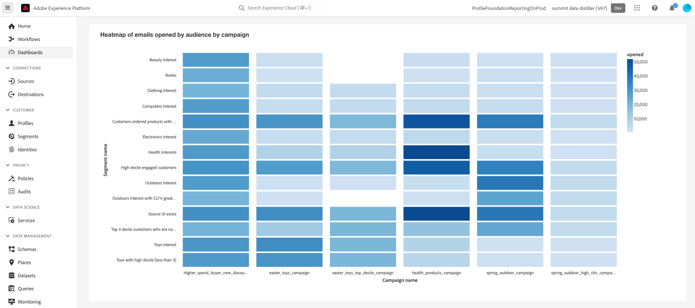

# Tracking von Datensignalen zur Generierung Ihres Kundenlebenszeitwerts

Sie können Real-time Customer Data Platform verwenden, um den Kundenlebenszeitwert (CLV) zu verfolgen und diese Metrik mit benutzerdefinierten Dashboards zu visualisieren. Mithilfe von Data Distiller und benutzerdefinierten Dashboards können Sie messen, wie wertvoll ein Kunde für Ihr Unternehmen in der gesamten Beziehung ist. Die Kenntnis des CLV kann Ihnen dabei helfen, die Strategien Ihres Unternehmens zu entwickeln, um neue Kunden zu gewinnen und gleichzeitig die bestehenden zu behalten und Gewinnspannen zu halten.

Die folgende Infografik zeigt den Zyklus der Datenerfassung, -bearbeitung, -analyse und -nutzung, der leistungsstarke Daten zur Verbesserung Ihrer Marketing-Kampagnen generiert.

Dieser durchgängige Anwendungsfall zeigt, wie Datensignale erfasst und geändert werden können, um das abgeleitete Attribut für den Kundenlebenszeitwert zu berechnen. Diese abgeleiteten Attribute können dann auf Ihre Real-Time CDP-Profildaten angewendet werden und können mit benutzerdefinierten Dashboards verwendet werden, um ein Dashboard für die Insight-Analyse zu erstellen. Über Data Distiller können Sie das Real-Time CDP Insight-Datenmodell erweitern und mithilfe des von CLV abgeleiteten Attributs und der Dashboard-Einblicke ein neues Segment erstellen und es für ein gewünschtes Ziel aktivieren. Diese Segmente können dann verwendet werden, um leistungsstarke Zielgruppen zu erstellen und so Ihre nächste Marketing-Kampagne zu unterstützen.

Dieses Handbuch soll Ihnen dabei helfen, Ihr Kundenerlebnis besser zu verstehen, indem Sie Datensignale über wichtige Touchpoints hinweg messen, die CLV steuern und einen ähnlichen Anwendungsfall in Ihrer Umgebung implementieren. Der gesamte Prozess wird in der Abbildung unten zusammengefasst.

## Erste Schritte {#getting-started}

Dieses Handbuch setzt ein Verständnis der folgenden Komponenten von Adobe Experience Platform voraus:

* [Query Service](../home.md): Bietet eine Benutzeroberfläche und eine RESTful-API, mit der Sie SQL-Abfragen zur Analyse und Anreicherung Ihrer Daten verwenden können.
* [Segmentierungsdienst](../../segmentation/home.md): Ermöglicht Ihnen das Erstellen von Segmenten und Generieren von Zielgruppen aus Ihren Echtzeit-Kundenprofildaten.

## Voraussetzungen

Für dieses Handbuch benötigen Sie die [Data Distiller](../data-distiller/overview.md) SKU als Teil Ihres Paketangebots. Wenden Sie sich an Ihren Adobe-Kundenbetreuer, wenn Sie sich nicht sicher sind, ob Sie über dieses Angebot verfügen.

## abgeleitetes Attribut erstellen {#create-derived-attribute}

Der erste Schritt bei der Einrichtung Ihrer CLV besteht darin, ein abgeleitetes Attribut aus den von Benutzeraktionen erfassten Datensignalen zu erstellen. Dieser besondere Anwendungsfall wird in einem separaten Dokument über ein Treueprogramm für Fluggesellschaften erfasst. Weitere Informationen finden Sie im Handbuch . [Verwenden Sie Query Service , um dezimalbasierte abgeleitete Attribute zur Verwendung mit Ihren Profildaten zu erstellen.](./deciles-use-case.md). Vollständige Beispiele und Erläuterungen zu den folgenden Schritten finden Sie im Dokument:

* Erstellen Sie ein Schema, das die Dezile-Bucketing ermöglicht.
* Verwenden Sie Query Service zum Erstellen von Dezimalstellen.
* Generieren von Dezimaldatensätzen.
* Aktivieren Sie das Schema zur Verwendung im Echtzeit-Kundenprofil.
* Erstellen Sie einen Identitäts-Namespace und markieren Sie ihn als primäre Kennung.
* Erstellen Sie eine Abfrage zur Berechnung der Dezimalzahlen über einen Lookback-Zeitraum.

## Erweitern des Insight-Datenmodells und Planen von Aktualisierungen {#extend-data-model-and-set-refresh-schedule}

Als Nächstes müssen Sie ein benutzerdefiniertes Datenmodell erstellen oder ein vorhandenes Adobe Real-Time CDP-Datenmodell erweitern, um mit Ihren CLV-Berichtseinblicken zu interagieren. Weitere Informationen finden Sie in der Dokumentation . [Erstellen eines Datenmodells mit Berichtseinblicken über Query Service zur Verwendung mit beschleunigten Speicherdaten und benutzerdefinierten Dashboards](../data-distiller/query-accelerated-store/reporting-insights-data-model.md#build-a-reporting-insights-data-model). Das Tutorial umfasst die folgenden Schritte:

* Erstellen eines Modells für Reporting-Insights mit Data Distiller.
* Erstellen von Tabellen und Beziehungen und Auffüllen von Daten.
* Abfrage des Reporting-Insights-Datenmodells.
* Erweitern Ihres Datenmodells mit dem Real-Time CDP Insights-Datenmodell.
* Erstellen von Dimensionstabellen, um Ihr Reporting-Insights-Modell zu erweitern.
* Abfragen Ihres erweiterten Reporting-Insights-Datenmodells mit beschleunigtem Speicher

Siehe die Dokumentation zum Real-time Customer Data Platform Insights-Datenmodell, um zu erfahren, wie Sie [Ihre SQL-Abfragevorlagen anpassen können, um Real-Time CDP-Berichte für Ihre Marketing- und KPI-Anwendungsfälle zu erstellen.](../../dashboards/cdp-insights-data-model.md).

Stellen Sie sicher, dass Sie einen Zeitplan festlegen, um Ihr benutzerdefiniertes Datenmodell in einem normalen Cadence zu aktualisieren. Dadurch wird sichergestellt, dass die Daten bei Bedarf im Rahmen Ihrer Aufnahme-Pipeline zurückgesendet und Ihre benutzerdefinierten Dashboards gefüllt werden. Siehe [Planen von Abfragen](../ui/query-schedules.md#create-schedule) um zu erfahren, wie Sie Ihren Zeitplan einrichten.

## Erstellen eines Dashboards zum Erfassen von Einblicken {#build-a-custom-dashboard}

Nachdem Sie Ihr benutzerdefiniertes Datenmodell erstellt haben, können Sie Ihre Daten mit benutzerdefinierten Abfragen und benutzerdefinierten Dashboards visualisieren. Umfassende Hinweise zur Verwendung finden Sie in der Übersicht über benutzerdefinierte Dashboards . [Erstellen eines benutzerdefinierten Dashboards](../../dashboards/user-defined-dashboards.md). Das UI-Handbuch enthält Details zu:

* So erstellen Sie ein Widget.
* Verwendung des Widget Composers.

Nachfolgend finden Sie Beispiele für benutzerdefinierte CLV-Widgets, die Dezimalgruppen verwenden.

## Erstellen und Aktivieren von Segmenten zum Erstellen von Hochleistungszielgruppen {#create-and-activate-segments}

Der nächste Schritt besteht darin, Segmente zu erstellen und Zielgruppen aus Ihren Echtzeit-Kundenprofildaten zu generieren. Weitere Informationen finden Sie im Handbuch zur Benutzeroberfläche von Segment Builder . [Segmente in Platform erstellen und aktivieren](../../segmentation/ui/segment-builder.md). Das Handbuch enthält Abschnitte zu folgenden Themen:

* Segmentdefinitionen mit einer Kombination aus Attributen, Ereignissen und vorhandenen Zielgruppen als Bausteinen erstellen.
* Die Arbeitsfläche des Regel-Builders und Container verwenden, um die Reihenfolge zu steuern, in der Segmentregeln ausgeführt werden.
* Schätzungen der voraussichtlichen Zielgruppe anzeigen, sodass Sie Ihre Segmentdefinitionen nach Bedarf anpassen können.
* Alle Segmentdefinitionen für geplante Segmentierung aktivieren.
* Spezifische Segmentdefinitionen für Streaming-Segmentierung aktivieren.

Alternativ kann auch eine [Video-Tutorial zum Segment Builder](https://experienceleague.adobe.com/docs/platform-learn/tutorials/segments/create-segments.html) für weitere Informationen.

## Aktivieren Ihres Segments für eine E-Mail-Kampagne {#activate-segment-for-campaign}

Sobald Sie Ihr Segment erstellt haben, können Sie es für ein Ziel aktivieren. Platform unterstützt eine Vielzahl von E-Mail-Dienstanbietern (ESPs), mit denen Sie Ihre E-Mail-Marketing-Aktivitäten verwalten können, z. B. das Senden von Werbe-E-Mail-Kampagnen.

Überprüfen Sie die [Übersicht über E-Mail-Marketing-Ziele](https://experienceleague.adobe.com/docs/experience-platform/destinations/catalog/email-marketing/overview.html?lang=en#connect-destination) für eine Liste der unterstützten Ziele, in die Sie Daten exportieren möchten (z. B. die [Oracle Eloqua](https://experienceleague.adobe.com/docs/experience-platform/destinations/catalog/email-marketing/oracle-eloqua-api.html?lang=en) Seite).

## Anzeigen der zurückgegebenen Analysedaten aus Ihrer Kampagne {#post-campaign-data-analysis}

Die Daten aus Quellen können jetzt [schrittweise verarbeitet](../essential-concepts/incremental-load.md) als Teil einer geplanten Aktualisierung Ihres Datenmodells im beschleunigten Datenspeicher. Alle Antwortereignisse von Kunden können bei ihrem Auftreten oder in Batches in Adobe Experience Platform aufgenommen werden. Ihr Datenmodell kann je nach Einstellungen oder Quell-Connectoren einmal oder mehrmals täglich aktualisiert werden. Siehe [Batch-Aufnahme-API - Übersicht](../../ingestion/batch-ingestion/api-overview.md) oder [Streaming-Erfassung - Übersicht](../../ingestion/streaming-ingestion/overview.md) für weitere Informationen.

Sobald Ihr Datenmodell aktualisiert wurde, stellen Ihre benutzerdefinierten Dashboard-Widgets aussagekräftige Signale bereit, mit denen Sie den Lebenszeitwert von Kunden messen und visualisieren können.

Für Ihre benutzerdefinierte Analyse stehen verschiedene Visualisierungsoptionen zur Verfügung.

Diese Einblicke können Ihnen wiederum bei der Entwicklung Ihrer Geschäftsstrategien für nachfolgende Kampagnen helfen.

## Nächste Schritte

Durch Lesen dieses Dokuments sollten Sie besser verstehen, wie Sie mit Real-time Customer Data Platform die CLV-Metrik (Customer Lifetime Value) verfolgen und visualisieren können. Um mehr über die vielen geschäftlichen Anwendungsfälle zu erfahren, die über Query Service und Experience Platform erfasst werden, sollten Sie die folgenden Dokumente lesen:

* [Ein durchgängiges Beispiel für einen abgebrochenen Browseranwendungsfall, der die Vielseitigkeit und Vorteile von Query Service demonstriert.](./abandoned-browse.md)
* [Verwendung von Query Service und maschinellem Lernen zur Bestimmung und Filterung von Bot-Aktivitäten anhand des echten Besucher-Traffics auf einer Online-Website](./bot-filtering.md)
* [So führen Sie eine Übereinstimmung mit Ihren Platform-Daten durch, bei der Ergebnisse aus mehreren Datensätzen kombiniert werden, indem Sie ungefähr eine Zeichenfolge Ihrer Wahl abgleichen.](./fuzzy-match.md)

<!-- "Data signals are actions taken by consumers while online that offer clues about intent that can be acted upon. This includes anything from visiting a website to filling out a change of address or clicking an ad."  -->

<!-- "Customer touchpoints are your brand's points of customer contact, from start to finish." -->
