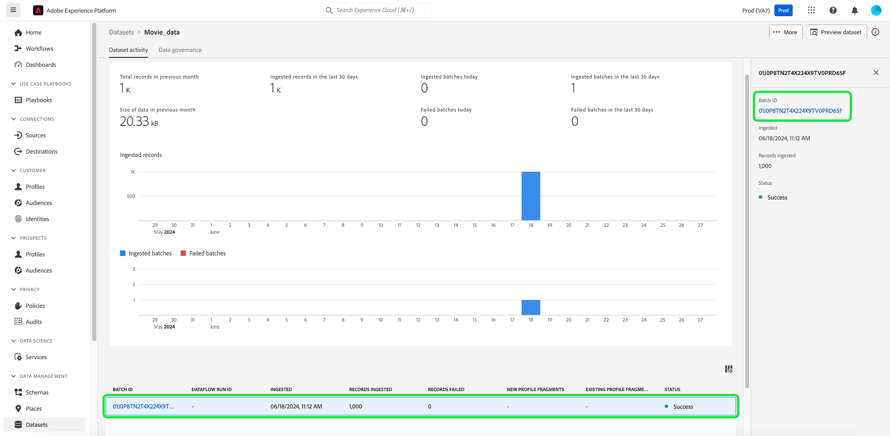

# Explore, troubleshoot, and verify batch ingestion with SQL

This document explains how to verify and validate records in ingested batches with SQL. This document teaches you how to:

- Access dataset batch metadata
- Troubleshoot and ensure data integrity by querying batches

>[!NOTE]
>
>Some screenshots in this guide are taken from [!DNL DBVisualizer]. To learn how to [connect Query Service with DBVisualizer](../clients/dbvisulaizer.md) or other [third-party BI tools](../clients/overview.md), see the linked documentation.

## Voraussetzungen

To help your understanding of the concepts discussed in this document, you should have knowledge of the following topics:

- **Data ingestion**: See the [data ingestion overview](../../ingestion/home.md) to learn the basics of how data is ingested into the Experience Platform, including the different methods and processes involved.
- **Batch ingestion**: See the [batch ingestion API overview](../../ingestion/batch-ingestion/overview.md) to learn the basic concepts of batch ingestion. Specifically, what a &quot;batch&quot; is and how it functions within Experience Platform&#39;s data ingestion process.
- **System metadata in datasets**: See the [Catalog Service overview](../../catalog/home.md) to learn how system metadata fields are used to track and query ingested data.
- **Experience Data Model (XDM)**: See the [schemas UI overview](../../xdm/ui/overview.md) and the [&#39;basics of schema composition&#39;](../../xdm/schema/composition.md) to learn about XDM schemas and how they represent and validate the structure and format of data ingested into Experience Platform.

## Access dataset batch metadata {#access-dataset-batch-metadata}

To ensure that system columns (metadata columns) are included in the query results, use the SQL command `set drop_system_columns=false` in your Query Editor. This configures the behavior of your SQL query session. This input must be repeated if you start a new session.

Next, to view the system fields of the dataset, execute a SELECT all statement to display the results from the dataset, for example `select * from movie_data`. The results include two new columns on the right-hand side `_acp_system_metadata` and `_ACP_BATCHID`. The metadata columns `_acp_system_metadata` and `_ACP_BATCHID` help identify the logical and physical partitions of ingested data.


When data is ingested into Experience Platform, it is assigned a logical partition based on the incoming data. Diese logische Partition wird durch `_acp_system_metadata.acp_sourceBatchId` dargestellt. Diese ID hilft, die Datenstapel logisch zu gruppieren und zu identifizieren, bevor sie verarbeitet und gespeichert werden.

Nachdem die Daten verarbeitet und in den Data Lake aufgenommen wurden, wird ihnen eine physische Partition zugewiesen, die durch `_ACP_BATCHID` dargestellt wird. Diese ID spiegelt die tatsächliche Speicherpartition im Data Lake wider, in dem sich die aufgenommenen Daten befinden.

### SQL verwenden, um logische und physische Partitionen zu verstehen {#understand-partitions}

Um zu verstehen, wie die Daten nach der Aufnahme gruppiert und verteilt werden, verwenden Sie die folgende Abfrage, um die Anzahl der verschiedenen physischen Partitionen (`_ACP_BATCHID`) für jede logische Partition (`_acp_system_metadata.acp_sourceBatchId`) zu zählen.

```SQL
SELECT  _acp_system_metadata, COUNT(DISTINCT _ACP_BATCHID) FROM movie_data
GROUP BY _acp_system_metadata
```

Die Ergebnisse dieser Abfrage werden in der folgenden Abbildung dargestellt.


Diese Ergebnisse zeigen, dass die Anzahl der Eingabestapel nicht unbedingt mit der Anzahl der Ausgabestapel übereinstimmt, da das System festlegt, wie die Daten am effizientesten im Data Lake stapelweise gespeichert werden.

Für dieses Beispiel wird davon ausgegangen, dass Sie eine CSV-Datei in Experience Platform aufgenommen und einen Datensatz mit dem Namen `drug_checkout_data` erstellt haben.

Die `drug_checkout_data`-Datei ist ein tief verschachtelter Satz von 35.000 Datensätzen. Verwenden Sie die SQL-Anweisung `SELECT * FROM drug_orders;`, um eine Vorschau des ersten Satzes von Datensätzen im JSON-basierten `drug_orders`-Datensatz anzuzeigen.

Die folgende Abbildung zeigt eine Vorschau der Datei und ihrer Datensätze.


### SQL verwenden, um Einblicke in den Batch-Erfassungsvorgang zu generieren {#sql-insights-on-batch-ingestion}

Verwenden Sie die unten stehende SQL-Anweisung, um Einblicke in die Gruppierung und Verarbeitung der Eingabedatensätze durch den Datenaufnahmeprozess in Batches zu erhalten.

```sql
SELECT _acp_system_metadata,
       Count(DISTINCT _acp_batchid) AS numoutputbatches,
       Count(_acp_batchid)          AS recordcount
FROM   drug_orders
GROUP  BY _acp_system_metadata 
```

Die Abfrageergebnisse werden in der Abbildung unten angezeigt.


Die Ergebnisse zeigen die Effizienz und das Verhalten des Datenerfassungsprozesses. Obwohl drei Eingabestapel erstellt wurden - jeder mit 2000, 24000 und 9000 Datensätzen -, wenn die Datensätze kombiniert und dedupliziert wurden, blieb nur ein eindeutiger Batch übrig.

>[!NOTE]
>
>Bei allen Datensätzen, die in einem Datensatz sichtbar sind, handelt es sich um diejenigen, die erfolgreich aufgenommen wurden. Eine erfolgreiche Batch-Aufnahme bedeutet nicht, dass alle Datensätze vorhanden sind, die von der Quelleingabe gesendet wurden. Sie müssen nach Fehlern bei der Datenaufnahme suchen, um die Batches/Datensätze zu finden, die es nicht in geschafft haben.

## Validieren eines Batches mit SQL {#validate-a-batch-with-SQL}

Überprüfen Sie anschließend die Datensätze, die in den Datensatz aufgenommen wurden, mit SQL.

>[!TIP]
>
>Um die Batch-ID und die mit dieser Batch-ID verknüpften Abfragedatensätze abzurufen, müssen Sie zunächst einen Batch in Experience Platform erstellen. Wenn Sie den Prozess selbst testen möchten, können Sie CSV-Daten in Experience Platform aufnehmen. Lesen Sie das Handbuch zum [&#x200B; (Zuordnen einer CSV-Datei zu einem vorhandenen XDM-Schema mithilfe von KI-generierten Empfehlungen](../../ingestion/tutorials/map-csv/recommendations.md).

Nachdem Sie einen Batch aufgenommen haben, müssen Sie zum [!UICONTROL Datasets activity tab] für den Datensatz navigieren, in den Sie Daten aufgenommen haben.

Wählen Sie in der Benutzeroberfläche von Experience Platform im linken Navigationsbereich die Option **[!UICONTROL Datasets]** aus, um das [!UICONTROL Datasets]-Dashboard zu öffnen. Wählen Sie als Nächstes auf der Registerkarte [!UICONTROL Browse] den Namen des Datensatzes aus, um auf den Bildschirm [!UICONTROL Dataset activity] zuzugreifen.


Die [!UICONTROL Dataset activity] wird angezeigt. Diese Ansicht enthält Details zum ausgewählten Datensatz. Er umfasst alle aufgenommenen Batches, die im Tabellenformat angezeigt werden.

Wählen Sie einen Stapel aus der Liste der verfügbaren Stapel aus und kopieren Sie den [!UICONTROL Batch ID] aus dem Detailbereich auf der rechten Seite.



Verwenden Sie als Nächstes die folgende Abfrage, um alle Datensätze abzurufen, die im Datensatz als Teil dieses Batches enthalten waren:

```sql
SELECT * FROM movie_data
WHERE  _acp_batchid='01H00BKCTCADYRFACAAKJTVQ8P' 
LIMIT 1;
```

Das Keyword `_ACP_BATCHID` wird zum Filtern der [!UICONTROL Batch ID] verwendet.

>[!TIP]
>
>Die `LIMIT`-Klausel ist hilfreich, wenn Sie die Anzahl der angezeigten Zeilen einschränken möchten, aber eine Filterbedingung ist wünschenswerter.

Beim Ausführen dieser Abfrage im Abfrage-Editor werden die Ergebnisse auf 100 Zeilen gekürzt. Der Abfrage-Editor ist für schnelle Vorschauen und Untersuchungen konzipiert. Zum Abrufen von bis zu 50.000 Zeilen können Sie ein Tool eines Drittanbieters wie DBVisualizer oder DBeaver verwenden.

## Nächste Schritte {#next-steps}

Durch das Lesen dieses Dokuments haben Sie die Grundlagen gelernt, um Datensätze in aufgenommenen Batches im Rahmen der Datenaufnahme zu überprüfen und zu validieren. Sie haben außerdem Einblicke in den Zugriff auf Datensatz-Batch-Metadaten, das Verständnis logischer und physischer Partitionen und das Abfragen bestimmter Batches mithilfe von SQL-Befehlen erhalten. Mit diesem Wissen können Sie die Datenintegrität sicherstellen und die Datenspeicherung in Experience Platform optimieren.

Als Nächstes sollten Sie die Datenaufnahme üben, um die erlernten Konzepte anzuwenden. Nehmen Sie einen Beispieldatensatz mit den bereitgestellten Beispieldateien oder Ihren eigenen Daten in Experience Platform auf. Wenn Sie dies noch nicht getan haben, lesen Sie das Tutorial zum [Aufnehmen von Daten in Adobe Experience Platform](../../ingestion/tutorials/ingest-batch-data.md).

Alternativ können Sie lernen, wie Sie [Query Service mit einer Vielzahl von Desktop-Client-Anwendungen verbinden und überprüfen](../clients/overview.md) um Ihre Datenanalysefunktionen zu verbessern.
