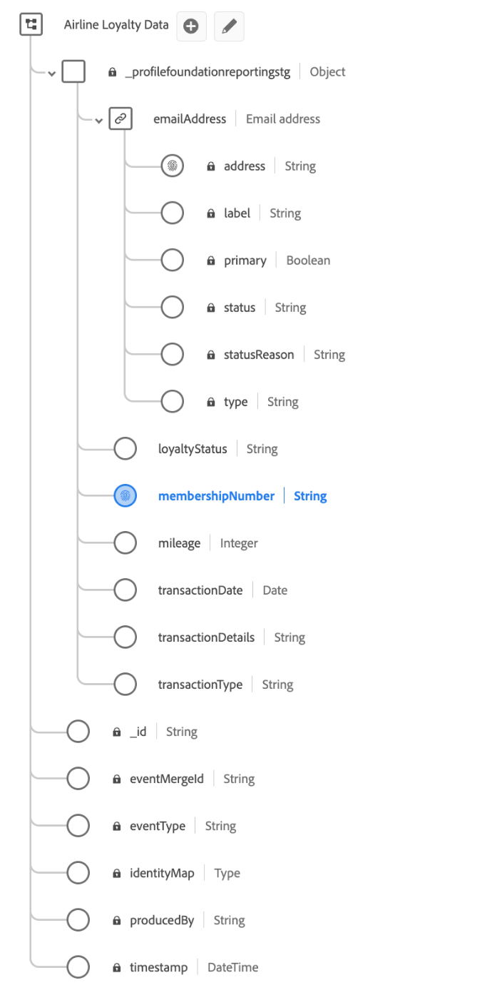

# Anwendungsfall für dezilbasierte abgeleitete Datensätze

Abgeleitete Datensätze ermöglichen komplizierte Anwendungsfälle zur Analyse von Daten aus dem Data Lake, die mit anderen nachgelagerten Experience Platform-Services verwendet oder in Ihren Echtzeit-Kundenprofildaten veröffentlicht werden können.

Dieses Anwendungsbeispiel zeigt, wie dezilbasierte abgeleitete Datensätze für die Verwendung mit Ihren Echtzeit-Kundenprofildaten erstellt werden. Anhand eines Szenarios mit einer Fluggesellschaft als Beispiel wird in diesem Handbuch beschrieben, wie Sie einen Datensatz erstellen, der kategoriale Dezile verwendet, um Zielgruppen basierend auf Rangattributen zu segmentieren und zu erstellen.

Die folgenden Schlüsselkonzepte werden veranschaulicht:

* Schemaerstellung für Dezile-Bucketing.
* Erstellung kategorialer Dezile.
* Erstellung komplexer abgeleiteter Datensätze.
* Berechnung von Dezilen über einen Lookback-Zeitraum.
* Eine Beispielabfrage zum Anzeigen der Aggregation, des Rankings und des Hinzufügens eindeutiger Identitäten, damit Zielgruppen basierend auf diesen Dezilen-Buckets generiert werden können.

## Erste Schritte

Dieses Handbuch setzt Grundkenntnisse der [Abfrageausführung im Abfrage-Service](../best-practices/writing-queries.md) und der folgenden Komponenten von Adobe Experience Platform voraus:

* [Echtzeit-Kundenprofil - Übersicht](../../profile/home.md): Bietet ein einheitliches Echtzeit-Kundenprofil, das auf aggregierten Daten aus verschiedenen Quellen basiert.
* [Grundlagen der Schemakomposition](../../xdm/schema/composition.md): Eine Einführung in Experience-Datenmodell-Schemata (XDM) und die Bausteine, Prinzipien und Best Practices zum Erstellen von Schemata.
* [Aktivieren eines Schemas für das Echtzeit-Kundenprofil](../../profile/tutorials/add-profile-data.md): In diesem Tutorial werden die Schritte beschrieben, die zum Hinzufügen von Daten zum Echtzeit-Kundenprofil erforderlich sind.
* [Definieren eines benutzerdefinierten Datentyps](../../xdm/api/data-types.md): Datentypen werden als Felder vom Typ „Verweis“ in Klassen oder Schemafeldergruppen verwendet und ermöglichen die konsistente Verwendung einer Struktur mit mehreren Feldern, die an beliebiger Stelle im Schema enthalten sein kann.

## Ziele

Das in diesem Dokument dargestellte Beispiel verwendet Dezilen, um abgeleitete Datensätze für die Rangfolge von Daten aus einem Treueschema von Fluggesellschaften zu erstellen. Abgeleitete Datensätze ermöglichen es Ihnen, den Nutzen Ihrer Daten zu maximieren, indem Sie eine Audience identifizieren, die auf dem obersten „n“ % für eine ausgewählte Kategorie basiert.

## Erstellen von dezilbasierten abgeleiteten Datensätzen

Um das Ranking von Dezilen basierend auf einer bestimmten Dimension und einer entsprechenden Metrik zu definieren, muss ein Schema so entworfen werden, dass es Dezilen-Bucketing zulässt.

In diesem Handbuch wird anhand eines Datensatzes zur Treue der Fluggesellschaft gezeigt, wie mit dem Abfrage-Service Dezilen basierend auf den Meilen erstellt werden, die über verschiedene Lookback-Zeiträume geflogen wurden.

## Verwenden des Abfrage-Service zum Erstellen von Dezilen

Mit Query Service können Sie einen Datensatz erstellen, der kategoriale Deziles enthält, die dann segmentiert werden können, um Zielgruppen basierend auf dem Attribut-Ranking zu erstellen. Die in den folgenden Beispielen angezeigten Konzepte können angewendet werden, um andere Dezil-Bucket-Datensätze zu erstellen, sofern eine Kategorie definiert und eine Metrik verfügbar ist.

Die Beispiel-Treuedaten einer Fluggesellschaft verwenden eine [XDM ExperienceEvents-Klasse](../../xdm/classes/experienceevent.md). Jedes Ereignis ist ein Datensatz einer Geschäftstransaktion für Meilen, entweder gutgeschrieben oder abgebucht, und der Mitgliedschaftstreustatus von entweder „Flyer“, „Frequent“, „Silver“ oder „Gold“. Das Feld für die primäre Identität ist `membershipNumber`.

### Beispieldatensätze

Der anfängliche Treueprogramm-Datensatz für dieses Beispiel lautet „Treuedaten der Fluggesellschaft“ und weist das folgende Schema auf. Beachten Sie, dass die primäre Identität für das Schema `_profilefoundationreportingstg.membershipNumber` ist.



**Beispieldaten**

In der folgenden Tabelle sind die Beispieldaten des in diesem Beispiel verwendeten `_profilefoundationreportingstg`-Objekts aufgeführt. Es bietet Kontext für die Verwendung von Dezilen-Buckets zum Erstellen komplexer abgeleiteter Datensätze.

>[!NOTE]
>
>Der Kürze halber wurde die Mandanten-ID `_profilefoundationreportingstg` am Anfang des Namespace in den Spaltentiteln und den nachfolgenden Erwähnungen im gesamten Dokument weggelassen.

| `.membershipNumber` | `.emailAddress.address` | `.transactionDate` | `.transactionType` | `.transactionDetails` | `.mileage` | `.loyaltyStatus` |
|---|---|---|---|---|---|---|
| C435678623 | sfeldmark1vr@studiopress.com | 01.01.2022 | STATUS_MILES | Neues Mitglied | 5.000 | FLIEGER |
| B789279247 | pgalton32n@barnesandnoble.com | 01.02.2022 | AWARD_MILES | JFK-FRA | 7500 | SILBER |
| B789279247 | pgalton32n@barnesandnoble.com | 01.02.2022 | STATUS_MILES | JFK-FRA | 7500 | SILBER |
| B789279247 | pgalton32n@barnesandnoble.com | 10. 2022 | AWARD_MILES | FRA-JFK | 5.000 | SILBER |
| A123487284 | rritson1zn@sciencedaily.com | 07.01.2022 | STATUS_MILES | Neue Kreditkarte | 10000 | FLIEGER |

{style="table-layout:auto"}

## Dezildatensätze generieren

In den oben angezeigten Treuedaten der Fluggesellschaft enthält der `.mileage` die Anzahl der Meilen, die ein Mitglied für jeden einzelnen Flug geflogen hat. Diese Daten werden verwendet, um Dezilen für die Anzahl der Meilen zu erstellen, die über lebenslange Lookbacks und eine Vielzahl von Lookback-Zeiträumen geflogen wurden. Zu diesem Zweck wird ein Datensatz erstellt, der Dezilen in einem Zuordnungsdatentyp für jeden Lookback-Zeitraum und ein entsprechendes Dezilzeichen für jeden Lookback-Zeitraum enthält, der unter `membershipNumber` zugewiesen wird.

Erstellen Sie ein „Dezil-Schema zur Treuedetails der Fluggesellschaft“, um mithilfe des Abfrage-Service einen Dezil-Datensatz zu erstellen.


### Aktivieren des Schemas für das Echtzeit-Kundenprofil

Daten, die in Experience Platform aufgenommen werden und vom Echtzeit-Kundenprofil verwendet werden sollen, müssen einem [Experience-Datenmodell (XDM)-Schema entsprechen, das für Profil aktiviert ist](../../xdm/ui/resources/schemas.md). Damit ein Schema für Profile aktiviert werden kann, muss es entweder die XDM Individual Profile- oder die XDM ExperienceEvent-Klasse implementieren.

[Aktivieren Sie Ihr Schema zur Verwendung im Echtzeit-Kundenprofil mithilfe der Schema Registry-](../../xdm/tutorials/create-schema-api.md) oder der [Benutzeroberfläche des Schema-Editors](../../xdm/tutorials/create-schema-ui.md).  Detaillierte Anweisungen zum Aktivieren eines Schemas für das Profil finden Sie in der entsprechenden Dokumentation.

Erstellen Sie als Nächstes einen Datentyp, der für alle dezilbezogenen Feldergruppen wiederverwendet werden soll. Die Erstellung der Dezilfeldgruppe ist ein einmaliger Schritt pro Sandbox. Sie kann auch für alle dezilbezogenen Schemata wiederverwendet werden.

### Erstellen Sie einen Identity-Namespace und markieren Sie ihn als primäre Kennung {#identity-namespace}

Jedem Schema, das für die Verwendung mit Dezilen erstellt wurde, muss eine primäre Identität zugewiesen sein. Sie können [ein Identitätsfeld in der Benutzeroberfläche &quot;Adobe Experience Platform-](../../xdm/ui/fields/identity.md#define-an-identity-field)&quot; oder über die [Schema Registry-API](../../xdm/api/descriptors.md#create) definieren.

Mit Query Service können Sie auch eine Identität oder eine primäre Identität für Ad-hoc-Schema-Datensatzfelder direkt über SQL festlegen. Weitere Informationen finden Sie in [&#x200B; Dokumentation unter „Festlegen einer sekundären Identität und einer primären Identität in Ad-hoc](../data-governance/ad-hoc-schema-identities.md)Schemaidentitäten“.

### Erstellen einer Abfrage zur Berechnung von Dezilen über einen Lookback-Zeitraum {#create-a-query}

Das folgende Beispiel zeigt die SQL-Abfrage zur Berechnung eines Dezils über einen Lookback-Zeitraum.

Eine Vorlage kann entweder mithilfe des Abfrage-Editors in der Benutzeroberfläche oder über die [Abfrage-Service-API](../api/query-templates.md#create-a-query-template) erstellt werden.

```sql
CREATE TABLE AS airline_loyality_decile 
{  WITH summed_miles_1 AS (
        SELECT _profilefoundationreportingstg.membershipNumber AS membershipNumber,
            _profilefoundationreportingstg.loyaltyStatus AS loyaltyStatus,
            SUM(_profilefoundationreportingstg.mileage) AS totalMiles
        FROM airline_loyalty_data
        WHERE _profilefoundationreportingstg.transactionDate < (MAKE_DATE(YEAR(CURRENT_DATE), MONTH(CURRENT_DATE), 1) - MAKE_YM_INTERVAL(0, 0))
    GROUP BY 1,2
    ),
    summed_miles_3 AS (
        SELECT _profilefoundationreportingstg.membershipNumber AS membershipNumber,
            _profilefoundationreportingstg.loyaltyStatus AS loyaltyStatus,
            SUM(_profilefoundationreportingstg.mileage) AS totalMiles
        FROM airline_loyalty_data
        WHERE _profilefoundationreportingstg.transactionDate < (MAKE_DATE(YEAR(CURRENT_DATE), MONTH(CURRENT_DATE), 1) - MAKE_YM_INTERVAL(0, 1))
    GROUP BY 1,2
    ),
    summed_miles_6 AS (
        SELECT _profilefoundationreportingstg.membershipNumber AS membershipNumber,
            _profilefoundationreportingstg.loyaltyStatus AS loyaltyStatus,
            SUM(_profilefoundationreportingstg.mileage) AS totalMiles
        FROM airline_loyalty_data
        WHERE _profilefoundationreportingstg.transactionDate < (MAKE_DATE(YEAR(CURRENT_DATE), MONTH(CURRENT_DATE), 1) - MAKE_YM_INTERVAL(0, 4))
    GROUP BY 1,2
    ),
    rankings_1 AS (
        SELECT membershipNumber,
            loyaltyStatus,
            totalMiles,
            NTILE(10) OVER (PARTITION BY loyaltyStatus ORDER BY totalMiles DESC) AS decileBucket
        FROM summed_miles_1
    ),
    rankings_3 AS (
        SELECT membershipNumber,
            loyaltyStatus,
            totalMiles,
            NTILE(10) OVER (PARTITION BY loyaltyStatus ORDER BY totalMiles DESC) AS decileBucket
        FROM summed_miles_3
    ),
    rankings_6 AS (
        SELECT membershipNumber,
            loyaltyStatus,
            totalMiles,
            NTILE(10) OVER (PARTITION BY loyaltyStatus ORDER BY totalMiles DESC) AS decileBucket
        FROM summed_miles_6
    ),
    map_1 AS (
        SELECT membershipNumber,
            MAP_FROM_ARRAYS(COLLECT_LIST(loyaltyStatus), COLLECT_LIST(decileBucket)) AS decileMonth1
        FROM rankings_1
        GROUP BY membershipNumber
    ),
    map_3 AS (
        SELECT membershipNumber,
            MAP_FROM_ARRAYS(COLLECT_LIST(loyaltyStatus), COLLECT_LIST(decileBucket)) AS decileMonth3
        FROM rankings_3
        GROUP BY membershipNumber
    ),
    map_6 AS (
        SELECT membershipNumber,
            MAP_FROM_ARRAYS(COLLECT_LIST(loyaltyStatus), COLLECT_LIST(decileBucket)) AS decileMonth6
        FROM rankings_6
        GROUP BY membershipNumber
    ),
    all_memberships AS (
        SELECT DISTINCT _profilefoundationreportingstg.membershipNumber AS membershipNumber FROM airline_loyalty_data
    )
    SELECT STRUCT(
            all_memberships.membershipNumber AS membershipNumber,
            STRUCT(
                    map_1.decileMonth1 AS decileMonth1,
                    map_3.decileMonth3 AS decileMonth3,
                    map_6.decileMonth6 AS decileMonth6
            ) AS decilesMileage
        ) AS _profilefoundationreportingstg
    FROM all_memberships
        LEFT JOIN map_1 ON  (all_memberships.membershipNumber = map_1.membershipNumber)
        LEFT JOIN map_3 ON  (all_memberships.membershipNumber = map_3.membershipNumber)
        LEFT JOIN map_6 ON  (all_memberships.membershipNumber = map_6.membershipNumber)
    }
```

### Abfrageüberprüfung

Abschnitte der Beispielabfrage werden im Folgenden detaillierter untersucht.

#### Lookback-Zeiten

Der Dezil-Datentyp enthält einen Bucket für die Lookbacks 1, 3, 6, 9, 12 und Lebensdauer. Die Abfrage verwendet die Lookback-Zeiträume von 1, 3 und 6 Monaten, sodass jeder Abschnitt einige „wiederholte“ Abfragen enthält, um temporäre Tabellen für jeden Lookback-Zeitraum zu erstellen.

>[!NOTE]
>
>Wenn die Quelldaten keine Spalte haben, mit der ein Lookback-Zeitraum bestimmt werden kann, werden alle Dezilklassen-Rankings unter `decileMonthAll` durchgeführt.

#### Aggregation

Verwenden Sie Common Table Expressions (CTE), um die Kilometerleistung vor der Erstellung von Dezil-Buckets zusammenzufassen. Dies gibt die Gesamtmeilen für einen bestimmten Lookback-Zeitraum an. CTEs sind vorübergehend vorhanden und können nur im Rahmen der größeren Abfrage verwendet werden.

```sql
summed_miles_1 AS (
    SELECT _profilefoundationreportingstg.membershipNumber AS membershipNumber,
           _profilefoundationreportingstg.loyaltyStatus AS loyaltyStatus,
           SUM(_profilefoundationreportingstg.mileage) AS totalMiles
    FROM airline_loyalty_data
    WHERE _profilefoundationreportingstg.transactionDate < (MAKE_DATE(YEAR(CURRENT_DATE), MONTH(CURRENT_DATE), 1) - MAKE_YM_INTERVAL(0, 0))
    GROUP BY 1,2
)
```

Der Block wird in der Vorlage zweimal wiederholt (`summed_miles_3` und `summed_miles_6`), wobei die Datumsberechnung geändert wird, um die Daten für die anderen Lookback-Zeiträume zu generieren.

Beachten Sie die Spalten für Identität, Dimension und Metrik für die Abfrage (`membershipNumber`, `loyaltyStatus` bzw. `totalMiles`).

#### Rangfolge

Mit Dezilen können Sie kategoriale Bucketing-Vorgänge durchführen. Um die Rangfolgenummer zu erstellen, wird die Funktion `NTILE` mit dem Parameter `10` in einem FENSTER verwendet, das nach dem Feld `loyaltyStatus` gruppiert ist. Daraus ergibt sich eine Rangfolge von 1 bis 10. Legen Sie die `ORDER BY`-Klausel der `WINDOW` auf `DESC` fest, um sicherzustellen, dass der (**) Metrik innerhalb der Dimension ein Rangfolgewert von `1` zugewiesen**.

```sql
rankings_1 AS (
    SELECT membershipNumber,
           loyaltyStatus,
           totalMiles,
           NTILE(10) OVER (PARTITION BY loyaltyStatus ORDER BY totalMiles DESC) AS decileBucket
    FROM summed_miles_1
)
```

#### Zuordnungsaggregation

Bei mehreren Lookback-Perioden müssen Sie die Dezile-Bucket-Karten im Voraus mithilfe der `MAP_FROM_ARRAYS`- und `COLLECT_LIST` erstellen. Im Beispielausschnitt erstellt `MAP_FROM_ARRAYS` eine Zuordnung mit einem Schlüssel-Array (`loyaltyStatus`) und einem Wert-Array (`decileBucket`). `COLLECT_LIST` gibt ein Array mit allen Werten in der angegebenen Spalte zurück.

```sql
map_1 AS (
    SELECT membershipNumber,
           MAP_FROM_ARRAYS(COLLECT_LIST(loyaltyStatus), COLLECT_LIST(decileBucket)) AS decileMonth1
    FROM rankings_1
    GROUP BY membershipNumber
)
```

>[!NOTE]
>
>Eine Map-Aggregation ist nicht erforderlich, wenn das Dezilranking nur für einen Lebenszeitraum erforderlich ist.

#### Eindeutige Identitäten

Die Liste der eindeutigen Identitäten (`membershipNumber`) ist erforderlich, um eine eindeutige Liste aller Mitgliedschaften zu erstellen.

```sql
all_memberships AS (
    SELECT DISTINCT _profilefoundationreportingstg.membershipNumber AS membershipNumber FROM airline_loyalty_data
)
```

>[!NOTE]
>
>Wenn das Dezilranking nur für eine Lebensdauer erforderlich ist, kann dieser Schritt ausgelassen und im letzten Schritt nach `membershipNumber` aggregiert werden.

#### Alle temporären Daten zusammenfügen

Der letzte Schritt besteht darin, alle temporären Daten in einem Formular zusammenzufügen, das mit der Struktur der Dezilen in der Feldergruppe identisch ist.

```sql
SELECT STRUCT(
           all_memberships.membershipNumber AS membershipNumber,
           STRUCT(
                map_1.decileMonth1 AS decileMonth1,
                map_3.decileMonth3 AS decileMonth3,
                map_6.decileMonth6 AS decileMonth6
           ) AS decilesMileage
       ) AS _profilefoundationreportingstg
FROM all_memberships
    LEFT JOIN map_1 ON  (all_memberships.membershipNumber = map_1.membershipNumber)
    LEFT JOIN map_3 ON  (all_memberships.membershipNumber = map_3.membershipNumber)
    LEFT JOIN map_6 ON  (all_memberships.membershipNumber = map_6.membershipNumber)
```

Wenn nur Lebensdauerdaten verfügbar sind, würde Ihre Abfrage wie folgt aussehen:

```sql
SELECT STRUCT(
           rankings.membershipNumber AS membershipNumber,
           STRUCT(
                MAP_FROM_ARRAYS(COLLECT_LIST(loyaltyStatus), COLLECT_LIST(decileBucket)) AS decileMonthAll
           ) AS decilesMileage
       ) AS _profilefoundationreportingstg
FROM rankings
GROUP BY rankings.membershipNumber
```

Aufgrund der Verwendung von Dezilen ist in den Abfrageergebnissen eine Korrelation zwischen der Rangfolgenzahl und dem Perzentil gewährleistet. Jeder Rang entspricht 10 %. Daher muss die Identifizierung einer Zielgruppe basierend auf den obersten 30 % nur Ränge 1, 2 und 3 ansprechen.

### Ausführen der Abfragevorlage

Führen Sie die Abfrage aus, um den Dezil-Datensatz zu füllen. Sie können die Abfrage auch als Vorlage speichern und so planen, dass sie in einer Kadenz ausgeführt wird. Wenn die Abfrage als Vorlage gespeichert wird, kann sie auch so aktualisiert werden, dass sie das Muster zum Erstellen und Einfügen verwendet, das auf den `table_exists`-Befehl verweist. Weitere Informationen zur Verwendung des Befehls `table_exists`finden Sie im [SQL-Syntaxhandbuch](../sql/syntax.md#table-exists).

## Nächste Schritte

Im obigen Anwendungsbeispiel werden die Schritte hervorgehoben, mit denen dezilbasierte abgeleitete Datensätze im Echtzeit-Kundenprofil verfügbar gemacht werden. Dies ermöglicht es dem Segmentierungs-Service, entweder über eine Benutzeroberfläche oder eine RESTful-API, Zielgruppen basierend auf diesen Dezilen-Buckets zu generieren. Informationen zum Erstellen[&#x200B; Auswerten und Zugreifen auf Segmente finden &#x200B;](../../segmentation/home.md) in der Übersicht zum Segmentierungs-Service .
