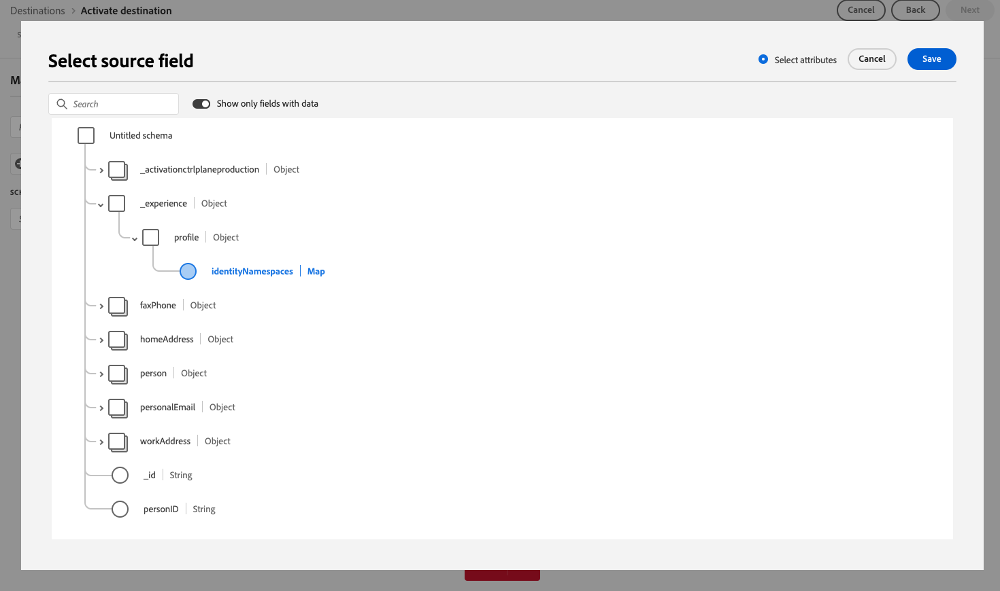

# Adobe Experience Platform – Versionshinweise

**Veröffentlichungsdatum: Donnerstag, 26. März 2025**

Aktualisierungen vorhandener Funktionen und Dokumentationen in Adobe Experience Platform:

- [Adobe Experience Platform – Versionshinweise](#adobe-experience-platform-release-notes)
   - [Dashboards](#dashboards)
   - [Ziele](#destinations)
   - [Komposition föderierter Zielgruppen](#federated-audience-composition)
   - [Segmentierungs-Service](#segmentation-service)
   - [Quellen](#sources)

## Dashboards {#dashboards}

Experience Platform bietet mehrere Dashboards, in denen Sie wichtige Einblicke in die Daten Ihres Unternehmens erhalten, die in täglichen Schnappschüssen erfasst werden.

**Neue oder aktualisierte Funktionen**

| Funktion | Beschreibung |
| ------- | ----------- |
| Dashboard zur metrikbasierten Lizenznutzung | Das Lizenznutzungs-Dashboard enthält jetzt eine optimierte Benutzeroberfläche mit zwei Registerkarten: **Metriken** und **Produkte**. Die neue Registerkarte **Metriken** bietet eine konsolidierte Ansicht aller nachverfolgbaren Lizenzmetriken für Ihre erworbenen Produkte. Jede Metrik enthält ein Inline-Informationssymbol, das Beschreibungen und zugehörige Produkte anzeigt. Benutzer können Produktions- oder Entwicklungs-Sandboxes auswählen, historische Nutzungstrends in interaktiven Diagrammen anzeigen und Sandbox-spezifische Daten als CSV-Dateien exportieren. Diese Aktualisierungen optimieren die Lizenzverfolgung und bieten klarere Einblicke. Weitere Informationen finden Sie im [Handbuch zum Lizenznutzungs](../../dashboards/guides/license-usage.md)Dashboard). |
| Aktualisierte Prognosehäufigkeit | Das Lizenznutzungs-Dashboard bietet jetzt genauere Einblicke in den projizierten Verbrauch, indem die Nutzungsprognosen (**)** monatlich aktualisiert werden. Diese Prognosen zeigen die geschätzte Nutzung für die nächsten sechs Wochen auf der Grundlage der jüngsten Trends. Diese Änderung ermöglicht eine schnellere Entscheidungsfindung, ein früheres Eingreifen und eine verbesserte Lizenzplanung. Weitere Informationen finden [ im Abschnitt ](../../dashboards/guides/license-usage.md#predicted-usage) zum Lizenznutzungs-Dashboard . |
| Aktualisierte Metrikbeschreibungen in der Benutzeroberfläche | Die Metrikdefinitionen im Dashboard zur Lizenznutzung wurden überarbeitet, um Klarheit und Konsistenz zu gewährleisten. Sie können aktualisierte Beschreibungen jetzt direkt im Dashboard anzeigen, indem Sie auf der Registerkarte **Metriken“ Inline** Informationssymbole neben jeder Metrik verwenden. Diese Aktualisierungen erleichtern das Verständnis, wie Metriken verfolgt werden und für welche Produkte sie gelten. Weitere Informationen finden [ im Abschnitt ](../../dashboards/guides/license-usage.md#available-metrics) zum Lizenznutzungs-Dashboard . |

{style="table-layout:auto"}

Weitere Informationen zu Dashboards, einschließlich der Gewährung von Zugriffsberechtigungen und der Erstellung benutzerdefinierter Widgets, finden Sie in der [Übersicht über Dashboards](../../dashboards/home.md).

## Ziele {#destinations}

[!DNL Destinations] sind vorkonfigurierte Integrationen mit Zielplattformen, die eine nahtlose Aktivierung von Daten aus Adobe Experience Platform ermöglichen. Mit Zielen können Sie Ihre bekannten und unbekannten Daten für kanalübergreifende Marketing-Kampagnen, E-Mail-Kampagnen, zielgruppengerechte Werbung und viele andere Anwendungsfälle aktivieren.

**Neue oder aktualisierte Funktionen** {#new-updated-destinations}

| Ziel | Beschreibung |
| --- | --- |
| [Demandbase People-Verbindung](/help/destinations/catalog/advertising/demandbase-people.md) | Verwenden Sie die [!DNL Demandbase People] Verbindung, um Profile für Ihre Demandbase-Kampagnen für Zielgruppen-Targeting, Personalisierung und Unterdrückung zu aktivieren. |
| [Bombora-Kontoverbindung](/help/destinations/catalog/advertising/bombora.md) | Verwenden Sie die [!DNL Bombora] Verbindung, um Profile für Ihre Bombora-Kampagnen zum Zielgruppen-Targeting, zur Personalisierung und zur Unterdrückung zu aktivieren, basierend auf [Account-Zielgruppen](/help/segmentation/types/account-audiences.md). |
| [Airship Attributes](/help/destinations/catalog/mobile-engagement/airship-attributes.md) Upgrade | Ab dem 25. März 2025 werden im Zielkatalog zwei **[!UICONTROL Airship-Attribute]**-Karten nebeneinander angezeigt. Dies ist auf ein internes Upgrade des Ziel-Service zurückzuführen. Der bestehende **[!UICONTROL Airship Attributes]**-Ziel-Connector wurde in **[!UICONTROL (veraltet) Airship Attributes umbenannt]** und Ihnen steht jetzt eine neue Karte mit dem Namen **[!UICONTROL Airship Attributes]** zur Verfügung.   Verwenden Sie die **[!UICONTROL Airship Attributes]**-Verbindung im Katalog für neue Aktivierungsdatenflüsse. Wenn Sie aktive Datenflüsse zum [!DNL (Deprecated) Airship Attributes] Ziel haben, werden diese automatisch aktualisiert, sodass keine Aktion erforderlich ist.   Wenn Sie Datenflüsse über die [Flow Service-API](https://developer.adobe.com/experience-platform-apis/references/destinations/) erstellen, müssen Sie Ihre [!DNL flow spec ID] und [!DNL connection spec ID] auf die folgenden Werte aktualisieren: <ul><li> Flussspezifikations-ID: `a862e0be-966e-4e5a-80d3-1bb566461986`</li><li> Verbindungsspezifikations-ID: `594bc002-4a47-49b7-8a98-ac0d21045502`</li> </ul> |

{style="table-layout:auto"}

**Neue oder aktualisierte Funktionen** {#destinations-new-updated-functionality}

| Funktion | Beschreibung |
| --- | --- |
| [Verbesserungen der Berichtsgenauigkeit für Streaming-Ziele](../../dataflows/ui/monitor-destinations.md) | Ab März 2025 führt Adobe eine Aktualisierung ein, um die Berichtsgenauigkeit für Streaming-Ziele zu erhöhen. Durch diese Verbesserung wird eine bessere Abstimmung zwischen den Berichten in Experience Platform und den Zielplattformen sichergestellt.   Vor diesem Update wurden bei **[!UICONTROL Identitäten fehlgeschlagen]** alle Aktivierungsversuche einbezogen. Nach diesem Update wird nur der letzte Aktivierungsversuch in die Gesamtanzahl einbezogen.   Diese Verbesserung gilt für alle Streaming-Ziele.   Nach dieser Verbesserung kann bei Benutzenden von Streaming-Zielen ein erwarteter Rückgang der Anzahl **[!UICONTROL Identitäten fehlgeschlagen]** auftreten. |
| [Unterstützung für den Export von Feldern vom Typ Zuordnung für Unternehmens- und Edge-Ziele](/help/destinations/ui/export-arrays-maps-objects.md) | Beim Exportieren von Daten an die [Ziele von Amazon Kinesis](/help/destinations/catalog/cloud-storage/amazon-kinesis.md), [HTTP API](/help/destinations/catalog/streaming/http-destination.md) und [Azure Event Hubs](/help/destinations/catalog/cloud-storage/azure-event-hubs.md) können Sie jetzt im Zuordnungsschritt des Aktivierungs-Workflows Felder vom Typ Zuordnung für den Export auswählen.   {width="250" align="center" zoomable="yes"} |

{style="table-layout:auto"}

Lesen Sie für Weitere Informationen den [Überblick über die Ziele](../../destinations/home.md).

## Komposition föderierter Zielgruppen {#federated-audience-composition}

Informationen zu den neuesten Aktualisierungen für die Federated-Audience-Komposition finden Sie [ den ](https://experienceleague.adobe.com/en/docs/federated-audience-composition/using/release-notes) Versionshinweisen hier.

## Segmentierungs-Service {#segmentation-service}

[!DNL Segmentation Service] definiert eine bestimmte Untergruppe von Profilen, indem das Kriterium beschrieben wird, das eine vermarktbare Personengruppe innerhalb Ihres Kundenstamms unterscheidet. Segmente können auf Datensatzdaten (z. B. demografische Daten) oder Zeitreihenereignissen basieren, die Kundeninteraktionen mit Ihrer Marke darstellen.

| Funktion | Beschreibung |
| ------- | ----------- |
| Verbesserungen am Account Audience Builder | In Audience Builder können Sie jetzt Attribute filtern, um nur ausgefüllte Attribute anzuzeigen und Zusammenfassungsdaten für diese ausgefüllten Attribute anzuzeigen. Weitere Informationen zu diesen Verbesserungen finden Sie in der Dokumentation [Audience Builder](../../rtcdp/segmentation/audience-builder.md) . |
| Flexible Zielgruppenbewertung - allgemeine Verfügbarkeit | Eine flexible Zielgruppenauswertung ist jetzt allgemein verfügbar! Sie können die flexible Zielgruppenauswertung verwenden, um bei Bedarf neue Zielgruppen für zeitkritische Kommunikation zu erstellen. Weitere Informationen zur flexiblen Zielgruppenauswertung finden Sie unter [Übersicht über die flexible Zielgruppenauswertung](../../segmentation/methods/flexible-audience-evaluation.md). |

Weitere Informationen zu [!DNL Segmentation Service] finden Sie in der [Übersicht zu Segmentierung](../../segmentation/home.md).

## Quellen {#sources}

Im Rahmen von Experience Platform stehen eine RESTful-API und interaktive Benutzeroberfläche zur Verfügung, mit deren Hilfe Sie auf unkomplizierte Weise Verbindungen zu Datenquellen verschiedener Anbieter einrichten können. Mit diesen Quellverbindungen können Sie sich authentifizieren und eine Verbindung zu externen Datenspeichern und CRM-Diensten herstellen, Zeiten für Erfassungsläufe festlegen und den Durchsatz der Datenerfassung verwalten.

Verwenden Sie Quellen in Experience Platform, um Daten aus einer Adobe-Anwendung oder einer Datenquelle von Drittanbietern aufzunehmen.

**Neue Quellen**

| Funktion | Beschreibung |
| --- | --- |
| [!DNL Bombora Intent] | Die [!DNL Bombora Intent] ist jetzt im Quellkatalog verfügbar. Verwenden Sie diese Quelle für Folgendes: <ul><li>Integrieren Sie die Unternehmensdaten von Bombora zur Zielgruppenaufstockung, um Konten zu identifizieren, die aktiv Ihre Produkte oder Dienstleistungen erforschen.</li><li>Priorisieren Sie Ihre marktinternen Konten, um präzise Segmente zu erstellen, und führen Sie extrem zielgerichtete ABM-Kampagnen aus, um sicherzustellen, dass sich Ihre Marketing-Maßnahmen auf die Konten konzentrieren, die am wahrscheinlichsten konvertieren.</li><li>Nutzen Sie zielorientierte Strategien, um Werbung und Ausgaben zu optimieren, die Interaktion zu steigern und den ROI zu maximieren.</li></ul> Weitere Informationen finden Sie im Handbuch unter [Verbinden Ihres - [!DNL Bombora]  mit Experience Platform](../../sources/tutorials/ui/create/data-partners/bombora.md). |
| [!DNL Demandbase Intent] | Die [!DNL Demandbase Intent] Quelle ist jetzt im Quellkatalog verfügbar. Verwenden Sie diese Quelle für Folgendes: <ul><li>Integrieren Sie die Account Intent-Daten von Demandbase, um Konten mit hohem Interesse auf der Grundlage von Echtzeit-Interaktionen zu identifizieren.</li><li>Indem Sie die Signale mit dem stärksten Intent priorisieren, können Sie präzise Segmente erstellen und extrem zielgerichtete Kampagnen bereitstellen, um sicherzustellen, dass sich Ihre Marketing-Maßnahmen auf Konten konzentrieren, die am wahrscheinlichsten konvertiert werden.</li><li>Aktivieren Sie zielorientierte Strategien, um die Optimierung von Werbeausgaben, mehr Interaktion und einen höheren ROI zu ermöglichen.</li></ul> Weitere Informationen finden Sie im Handbuch unter [Verbinden Ihres - [!DNL Demandbase]  mit Experience Platform](../../sources/tutorials/ui/create/data-partners/demandbase.md). |

{style="table-layout:auto"}

**Aktualisierte Funktionen**

| Funktion | Beschreibung |
| --- | --- |
| Verbesserungen an der [!DNL Google Ads] | Sie können jetzt die [[!DNL Google Ads] Quelle](../../sources/connectors/advertising/ads.md) verwenden, um aggregierte Daten aufzunehmen. Mit dem [!DNL Google Ads Query Builder] können Sie die Attribute, Segmente und Ressourcen angeben, die Sie in Experience Platform aufnehmen möchten. Weitere Informationen finden Sie im Handbuch unter [Verbinden Ihres - [!DNL Google Ads]  mit Experience Platform](../../sources/tutorials/ui/create/advertising/ads.md). |
| Verbesserungen an der [!DNL Microsoft Dynamics] | Sie können jetzt den Primärschlüssel einer bestimmten [!DNL Microsoft Dynamics]-Tabelle angeben, wenn Sie die Inhalte und die Struktur Ihrer Daten untersuchen. Verwenden Sie diese Funktion, um Ihre Abfragen mit der [!DNL Microsoft Dynamics] zu optimieren. Weitere Informationen finden Sie im Handbuch unter [Verbinden Ihrer -Quelle  [!DNL Microsoft Dynamics]  Experience Platform mithilfe der -API](../../sources/tutorials/api/create/crm/ms-dynamics.md). |
| Unterstützung der API-Schlüsselauthentifizierung in Selbstbedienungsquellen (Batch-SDK) | Sie können jetzt die API-Schlüsselauthentifizierung als Authentifizierungstyp verwenden, wenn Sie eine neue Quelle mit Selbstbedienungsquellen (Batch-SDK) integrieren. Weitere Informationen finden Sie im Handbuch unter [Konfigurieren der Authentifizierungsspezifikation in Batch-SDK](../../sources/sources-sdk/config/authspec.md). |
| Unterstützung der attributbasierten Zugriffssteuerung in Quellen | Sie können jetzt attributbasierte Zugriffssteuerungsfunktionen für Ihre Quelldatenflüsse verwenden. Weitere Informationen finden Sie in den folgenden Handbüchern: <ul><li>[Wenden Sie mithilfe der API Kennzeichnungen auf Ihre Quelldatenflüsse an](../../sources/tutorials/api/labels.md)</li><li>[Wenden Sie mithilfe der Benutzeroberfläche Kennzeichnungen auf Ihre Quelldatenflüsse an](../../sources/tutorials/ui/labels.md). |

{style="table-layout:auto"}

Weitere Informationen finden Sie unter [Quelle – Übersicht](../../sources/home.md).
