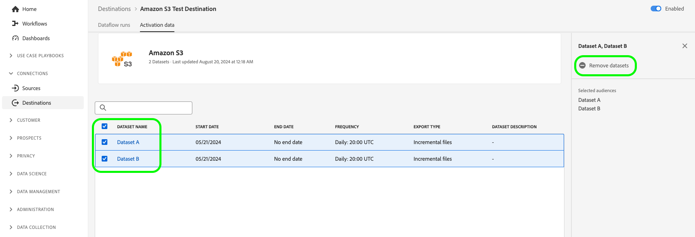

# Adobe Experience Platform – Versionshinweise

**Veröffentlichungsdatum: Mittwoch, 20. August 2024**

>[!TIP]
>
>Sehen Sie sich eine [Übersicht der Beispielanwendungsfalldokumentation](https://experienceleague.adobe.com/en/docs/experience-platform/rtcdp/use-cases/overview) an, um mehr über verschiedene Anwendungsfälle wie Prospektion, Akquise und mehr zu erfahren, die Ihr Unternehmen mit Real-Time CDP erreichen kann.

Aktualisierungen vorhandener Funktionen und Dokumentationen in Experience Platform:

- [Attributbasierte Zugriffssteuerung](#abac)
- [Ziele](#destinations)
- [Experience-Datenmodell (XDM)](#xdm)
- [Identity Service](#identity-service)
- [Segmentierungs-Service](#segmentation)
- [Quellen](#sources)

## Attributbasierte Zugriffssteuerung {#abac}

Die attributbasierte Zugriffskontrolle ist eine Funktion von Adobe Experience Platform, die datenschutzbewussten Marken größere Flexibilität bei der Verwaltung des Benutzerzugriffs gibt. Einzelne Objekte wie Schemafelder und Segmente können Benutzerrollen zugewiesen werden. Mit dieser Funktion können Sie bestimmten Platform-Benutzenden in Ihrer Organisation den Zugriff auf einzelne Objekte gewähren oder sperren.

Mithilfe der attributbasierten Zugriffskontrolle können Administratoren Ihres Unternehmens den Zugriff der Benutzer auf sensible personenbezogene Daten (EPPD), personenbezogene Daten (PII) und andere benutzerdefinierte Datentypen für alle Platform-Workflows und -Ressourcen steuern. Admins können Benutzerrollen definieren, die nur Zugriff auf bestimmte Felder und Daten haben, die diesen Feldern entsprechen.

**Neue Funktion**

| Funktionsaktualisierung | Beschreibung |
| --- | --- |
| Neue Funktion &quot;Berechtigungs-Manager&quot; | Sie können jetzt den [Berechtigungs-Manager](../../access-control/abac/permission-manager/overview.md) verwenden, um Berichte mithilfe einfacher Abfragen zu erstellen. Dies hilft Ihnen, die Zugriffsverwaltung zu verstehen und Zeit zu sparen, indem Sie Zugriffsberechtigungen für mehrere Workflows und Granularitätsebenen überprüfen. Weitere Informationen zum Erstellen von Berichten für Benutzer und Rollen finden Sie im [Benutzerhandbuch für Berechtigungs-Manager](../../access-control/abac/permission-manager/permissions.md). {width="250" align="center" zoomable="yes"} |

{style="table-layout:auto"}

Weitere Informationen zur attributbasierten Zugriffssteuerung finden Sie unter [Attributbasierte Zugriffssteuerung – Übersicht](../../access-control/abac/overview.md). Eine umfassende Anleitung zum attributbasierten Zugriffssteuerungs-Workflow finden Sie im [Handbuch zur attributbasierten Zugriffskontrolle](../../access-control/abac/end-to-end-guide.md).

## Ziele {#destinations}

[!DNL Destinations] sind vorkonfigurierte Integrationen mit Zielplattformen, die eine nahtlose Aktivierung von Daten aus Adobe Experience Platform ermöglichen. Mit Zielen können Sie Ihre bekannten und unbekannten Daten für kanalübergreifende Marketing-Kampagnen, E-Mail-Kampagnen, zielgruppengerechte Werbung und viele andere Anwendungsfälle aktivieren.

**Neue oder aktualisierte Funktion**

| Funktion | Beschreibung |
| ----------- | ----------- |
| Der Export von Dateien On-Demand an Batch-Ziele ist jetzt allgemein verfügbar. | Die Option zum Exportieren von Dateien On-Demand an Batch-Ziele ist jetzt für alle Kunden verfügbar. Weitere Informationen finden Sie in der [dedizierten Dokumentation](../../destinations/ui/export-file-now.md) . |
| Bearbeiten Sie Exportpläne für mehrere exportierte Zielgruppen im Schritt [Planen](../../destinations/ui/activate-batch-profile-destinations.md#scheduling). | Die Option, die Exportpläne für mehrere exportierte Zielgruppen direkt im Planungsschritt des Workflows für die Zielgruppenaktivierung zu bearbeiten, steht nun allen Kunden zur Verfügung. {width="250" align="center" zoomable="yes"} |
| Bearbeiten Sie die Dateinamen für mehrere exportierte Zielgruppen im [Planungsschritt](../../destinations/ui/activate-batch-profile-destinations.md#scheduling). | Die Option, die Namen mehrerer exportierter Dateien direkt im Planungsschritt des Workflows für die Zielgruppenaktivierung zu bearbeiten, ist jetzt für alle Kunden verfügbar. {width="250" align="center" zoomable="yes"} |
| Entfernen Sie mehrere Zielgruppen aus einem Datenfluss aus der Seite [Zieldetails](../../destinations/ui/destination-details-page.md#bulk-remove) . | Die Option zum Entfernen mehrerer Zielgruppen aus vorhandenen Datenflüssen aus der Seite **[!UICONTROL Zieldetails]** ist jetzt für alle Kunden verfügbar. {width="250" align="center" zoomable="yes"} |
| Exportieren Sie mehrere Dateien bei Bedarf von der Seite [Zieldetails](../../destinations/ui/destination-details-page.md#bulk-export) in Batch-Ziele. | Die Option zum Exportieren mehrerer Dateien On-Demand an Batch-Ziele über die Seite **[!UICONTROL Zieldetails]** ist jetzt für alle Kunden verfügbar. {width="250" align="center" zoomable="yes"} |
| Bearbeiten Sie Dateinamen für mehrere exportierte Zielgruppen über die Seite [Zieldetails](../../destinations/ui/destination-details-page.md#bulk-edit-file-names) . | Sie können jetzt die Namen mehrerer exportierter Dateien direkt auf der Seite **[!UICONTROL Zieldetails]** bearbeiten. {width="250" align="center" zoomable="yes"} |
| Entfernen Sie mehrere Datensätze aus einem Datenfluss aus der Seite [Zieldetails](../../destinations/ui/export-datasets.md#remove-dataset) . | Die Option zum Entfernen mehrerer Datensätze aus einem Datenfluss ist jetzt für alle Kunden verfügbar. {width="250" align="center" zoomable="yes"} |

{style="table-layout:auto"}

Weitere Informationen finden Sie in der [Zielübersicht](../../destinations/home.md).

## Experience-Datenmodell (XDM) {#xdm}

XDM ist eine Open-Source-Spezifikation, die allgemeine Strukturen und Definitionen (Schemata) für Daten bereitstellt, die in Adobe Experience Platform importiert werden. Durch die Einhaltung von XDM-Standards können alle Kundenerlebnisdaten in eine gemeinsame Darstellung integriert werden, die Erkenntnisse schneller und besser integriert liefert. Sie können wertvolle Einblicke aus Kundenaktionen gewinnen, Zielgruppen durch Segmente definieren und Kundenattribute für Personalisierungszwecke verwenden.

**Neue Funktionen**

| Funktion | Beschreibung |
| --- | --- |
| Erstellungsfluss von ML-unterstützten Schemas | Verwenden Sie erweiterte Algorithmen des maschinellen Lernens, um Ihre CSV-Musterdatendateien zu analysieren und automatisch optimierte Schemata mithilfe von Standard- und benutzerdefinierten Feldern zu erstellen. Schlüsselfunktionen: <ul><li>Schnellere Schemaerstellung: Generieren Sie Schemas direkt aus Beispieldatendateien mithilfe von ML-empfohlenen und generierten XDM-Feldern.</li><li>Flexible Schemaentwicklung: Einfaches Hinzufügen oder Aktualisieren von Feldern im generierten Schema.</li><li>Nahtlose Integration: Vollständig in den Erstellungsfluss des Kernschemas in der Schema-Benutzeroberfläche integriert, sodass eine reibungslose und einheitliche Benutzererfahrung gewährleistet ist.</li><li>Effiziente Überprüfung und Bearbeitung: Schnelles Anzeigen und Aktualisieren Ihres Schemas mit dem Editor für einfache Ansicht, wodurch der Erstellungsprozess effizienter und benutzerfreundlicher wird.</li></ul> |

{style="table-layout:auto"}

Weitere Informationen finden Sie in der Übersicht zur Erstellung von [ML-unterstützten Schemas](../../xdm/ui/ml-assisted-schema-creation.md) .

Weitere Informationen zu XDM in Platform finden Sie in der [Übersicht zum XDM-System](../../xdm/home.md).

## Identity Service {#identity-service}

Verwenden Sie Adobe Experience Platform Identity Service, um eine umfassende Übersicht über Ihre Kunden und deren Verhalten zu erstellen, indem Sie Identitäten geräteübergreifend zusammenführen und so effektive, persönliche digitale Erlebnisse in Echtzeit bereitstellen.

**Aktualisierte Dokumentation**

| Funktion | Beschreibung |
| --- | --- |
| Handbuch zu Diagrammkonfigurationen | Informationen zu gängigen Diagrammszenarien, auf die Sie beim Arbeiten mit Regeln zur Identitätsdiagrammzuordnung und Identitätsdaten stoßen können, finden Sie im Leitfaden [Diagrammkonfigurationen](../../identity-service/identity-graph-linking-rules/example-configurations.md) . Das Handbuch zu Diagrammkonfigurationen enthält Beispiele für einfache Diagrammszenarien für eine Person bis hin zu komplexen und hierarchischen Diagrammszenarien für mehrere Personen. Sie können das Handbuch auch für Beispiele von Ereignissen und Algorithmuskonfigurationen verwenden, die Sie in die [Benutzeroberfläche für die Diagrammsimulation](../../identity-service/identity-graph-linking-rules/graph-simulation.md) eingeben können, sowie für Aufschlüsselungen dazu, wie primäre Identitäten in bestimmten Diagrammszenarien ausgewählt werden. |

{style="table-layout:auto"}

Weiterführende Informationen zu Identity Service finden Sie in der [Übersicht zu Identity Service](../../identity-service/home.md).

## Segmentierungs-Service {#segmentation}

[!DNL Segmentation Service] ermöglicht es Ihnen, in [!DNL Experience Platform] gespeicherte Daten, die sich auf Einzelpersonen (wie Kundinnen und Kunden, Interessierte, Benutzerinnen und Benutzer oder Organisationen) beziehen, in Zielgruppen zu segmentieren. Sie können Zielgruppen über Segmentdefinitionen oder andere Quellen aus Ihren [!DNL Real-Time Customer Profile]-Daten erstellen. Diese Zielgruppen werden zentral auf [!DNL Platform] konfiguriert und verwaltet und stehen jeder Adobe-Lösung zur Verfügung.

**Aktualisierte Funktionen**

| Funktion | Beschreibung |
| ------- | ----------- |
| Aufnahmedetails | Bei Zielgruppen mit der Quelle Benutzerspezifischer Upload können Sie Details zur Aufnahme der Zielgruppe auf der Seite mit den Zielgruppendetails umfassender anzeigen. Darüber hinaus können Sie Bezeichnungen auf die Payload-Attribute anwenden, indem Sie das Schema auswählen und die gewünschten Attribute zur Beschriftung auswählen. Weitere Informationen zum Abschnitt &quot;Aufnahmedetails&quot;finden Sie im [Audience Portal-Handbuch](../../segmentation/ui/audience-portal.md#ingestion-details). |

{style="table-layout:auto"}

Weitere Informationen zu [!DNL Segmentation Service] finden Sie in der [Übersicht zu Segmentierung](../../segmentation/home.md).

## Quellen

Im Rahmen von Experience Platform stehen eine RESTful-API und interaktive Benutzeroberfläche zur Verfügung, mit deren Hilfe Sie auf unkomplizierte Weise Verbindungen zu Datenquellen verschiedener Anbieter einrichten können. Mit diesen Quellverbindungen können Sie sich authentifizieren und eine Verbindung zu externen Datenspeichern und CRM-Diensten herstellen, Zeiten für Erfassungsläufe festlegen und den Durchsatz der Datenerfassung verwalten.

Verwenden Sie Quellen im Experience Platform, um Daten aus einer Adobe-Anwendung oder einer Datenquelle von Drittanbietern zu erfassen.

**Aktualisierte Dokumentation**

| Aktualisierte Dokumentation | Beschreibung |
| --- | --- |
| Erweiterte Dokumentation zur Aktualisierung von Datenflüssen | Das Handbuch zum [ Aktualisieren vorhandener Datenflüsse für Quellen in der Benutzeroberfläche](../../sources/tutorials/ui/update-dataflows.md) wurde aktualisiert und enthält jetzt weitere Informationen zu den verschiedenen Konfigurationen, die Sie an einem vorhandenen Datenfluss vornehmen können. Das Handbuch wurde auch aktualisiert, um das erwartete Verhalten bei der erneuten Aktivierung eines deaktivierten Datenflusses zu verdeutlichen. |

{style="table-layout:auto"}

Weitere Informationen finden Sie in der [Quellenübersicht](../../sources/home.md).
