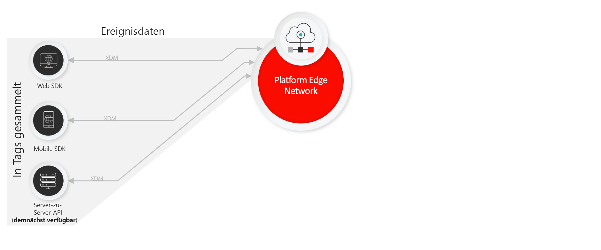
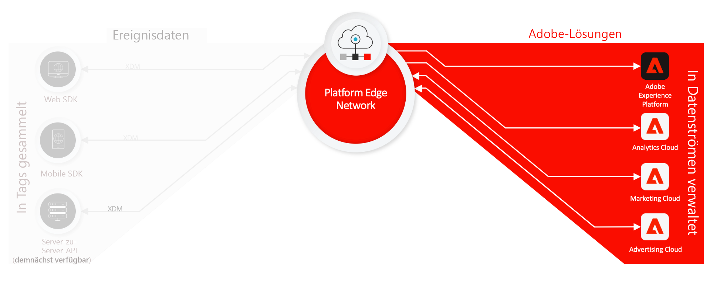
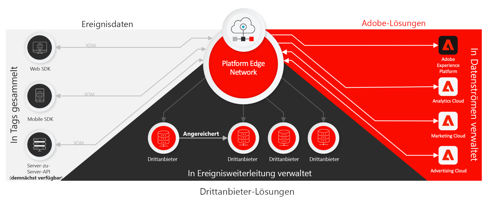

# Übersicht über Real-Time Customer Data Platform Connections

Real-Time Customer Data Platform (RTCDP) Connections bietet eine Reihe von Technologien, mit denen Sie Kundenerlebnisdaten aus Client-seitigen Quellen erfassen und an das Adobe Experience Platform Edge Network senden können, wo sie in Sekundenschnelle an Adobe oder andere Ziele weitergegeben, transformiert und verteilt werden können.

RTCDP Connections wird für die folgenden Client-seitigen Quellen unterstützt:

* Web-basierte Programme
* Native Mobile Apps
* OTT-Programme (Over-the-top)

RTCDP Connections konzentriert sich auf die Auffindbarkeit und Zugänglichkeit erfasster Datensätze und umfasst Folgendes:

* [Adobe Experience Platform Edge Network](https://experienceleague.adobe.com/docs/web-sdk-learn/tutorials/introduction-to-web-sdk-and-edge-network.html?lang=de)
* [Tags](../tags/home.md)
* [Datenströme](../edge/datastreams/overview.md)
* [Ereignisweiterleitung](../tags/ui/event-forwarding/overview.md)
* [Adobe Experience Platform Web SDK](../edge/home.md)
* [Adobe Experience Platform Mobile SDK](https://aep-sdks.gitbook.io/docs/)
* [Adobe Experience Platform Debugger](https://chrome.google.com/webstore/detail/adobe-experience-platform/bfnnokhpnncpkdmbokanobigaccjkpob?hl=de)
* [Experience-Datenmodell (XDM)](../xdm/home.md)
* [Adobe Experience Platform Identity Service](../identity-service/home.md)

Dieses Handbuch bietet eine allgemeine Einführung zu RTCDP Connections und dazu, wie damit Daten über Platform Edge Network an Adobe Experience Cloud-Produkte und nicht von Adobe stammende Programme gesendet werden.

## Tags, Web SDK und Mobile SDK

Das Platform Web SDK und Platform Mobile SDK reduzieren und komprimieren alle Adobe-Produktbibliotheken in einem einzigen Entwicklungs-Kit für Web- bzw. Mobilplattformen. Diese können mit Rohcode oder mithilfe von [Tags](../tags/home.md) über die Datenerfassungsbenutzeroberfläche implementiert werden.

Durch Komprimieren dieser Bibliotheken wird die Datenerfassung beschleunigt und Vorgänge werden von Client-seitigen Geräten bis Platform Edge Network zu einem einzigen Stream zusammengefasst.

## Platform Edge Network und Datenströme {#edge}

Platform Edge Network ist ein global verteiltes, schnelles und zuverlässiges Netzwerk von Servern, die Daten in einem enormen Umfang empfangen und verarbeiten können. Mit Tags können Sie [Datenströme](../edge/datastreams/overview.md) für Produkte wie Adobe Target, Adobe Audience Manager und Adobe Analytics einrichten. Dadurch können Sie diese Produkte Server-seitig aktivieren, ohne den Client-seitigen Code zu ändern.

>[!NOTE]
>
>Eine allgemeine Einführung in Platform Edge Network finden Sie in der folgenden [interaktiven Produkttour](https://adobe-ideacloud.forgedx.com/adobe-adobe-edge-collection/adobe-experience-edge/public/mx?SUID=hgb1a48ICSCpbM6MzBYHbxnsh9DgjUy1).

## Ereignisweiterleitung

[Ereignisweiterleitung](../tags/ui/event-forwarding/overview.md) kann sich einen beliebigen Experience Platform-Datenstrom zunutze machen, sodass Sie Daten mit extrem geringer Latenz umwandeln, anreichern und an ein Ziel senden können, bei dem es sich nicht um ein Adobe-Programm handelt, ohne dass dem Client-Gerät Drittanbieter-Code hinzugefügt wird.

>[!NOTE]
>
>Die Ereignisweiterleitung ist eine gebührenpflichtige Funktion, die nur im Rahmen von Real-Time Customer Data Platform Connections angeboten wird.

## Nächste Schritte

Dieses Dokument bietet einen allgemeinen Überblick darüber, wie RTCDP Connections dazu beiträgt, den Prozess des Versands Ihrer erfassten Kundenerlebnisdaten an Adobe-Produkte und Drittanbieterziele zu automatisieren.

Weitere Informationen zum allgemeinen Workflow für das Senden von Ereignisdaten über Edge Network finden Sie im Abschnitt [End-to-End-Übersicht](./e2e.md).
