# Handbuch zur Benutzeroberfläche von Account-Profilen

>[!NOTE]
>
>Account-Profile sind nur für Kundinnen und Kunden von Real-Time Customer Data Platform B2B edition verfügbar. Um mehr über Real-Time CDP zu erfahren, auch zu den für jeden Lizenztyp verfügbaren Funktionen, lesen Sie zunächst die [Übersicht über Real-Time CDP](../overview.md).

Mit Account-Profilen können Sie Account-Informationen aus mehreren Quellen vereinheitlichen. Diese einheitliche Ansicht eines Accounts führt Daten aus all Ihren Marketing-Kanälen und den diversen Systemen zusammen, die Ihr Unternehmen derzeit zum Speichern von Kunden-Account-Informationen verwendet. Dieses Dokument enthält eine Anleitung zur Interaktion mit Account-Profilen mithilfe der in der Benutzeroberfläche von Adobe Experience Platform verfügbaren Real-Time CDP, B2B edition-Funktionen.

Weitere Informationen zur Erstellung von Account-Profilen im Rahmen des B2B-Workflows finden Sie im Abschnitt [End-to-End-Tutorial](../b2b-tutorial.md).

## Übersicht über Account-Profile {#account-profiles-overview}

Wählen Sie **[!UICONTROL Profiles]** unter [!UICONTROL Accounts] im linken Navigationsbereich aus, um eine Übersicht der Account-Profile anzuzeigen. Unter der Registerkarte [!UICONTROL Overview] zeigt das Dashboard eine Grafik oder ein Diagramm an, die Widgets in einem einzigen Einstiegspunkt anzeigt.

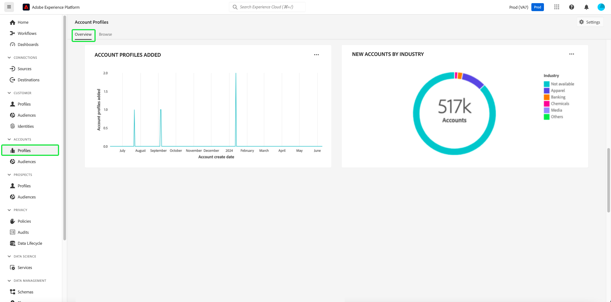

Weitere Informationen finden Sie in der Dokumentation zum [[!UICONTROL Account Profiles]](../../dashboards/guides/account-profiles.md)-Dashboard. Weitere Informationen dazu, wie Ihre Insights[Datenmodelle zum Erstellen benutzerdefinierter Diagramme für Ihre Dashboards verwendet werden können, finden Sie in der Dokumentation unter Real-time Customer Data Platform Insights-Datenmodell B2B edition](../../dashboards/data-models/cdp-insights-data-model-b2b.md) .

## Lead-Konto-Zuordnung konfigurieren {#configure-lead-to-account-matching}

>[!IMPORTANT]
>
> Nur B2B-KI-Administratoren können den Lead-Konto-Abgleichdienst aktivieren, deaktivieren und konfigurieren. Nach der Deaktivierung des Service werden übereinstimmende Ergebnisse innerhalb von 24 Stunden gelöscht.

Um die Lead-Konto-Zuordnung zu konfigurieren, wählen Sie **[!UICONTROL Profiles]** unter [!UICONTROL Accounts] im linken Navigationsbereich aus. Klicken Sie auf der Registerkarte **[!UICONTROL Overview]** oben rechts auf **[!UICONTROL Settings]** .

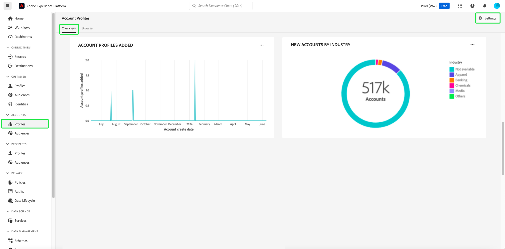

Das Dialogfeld **[!UICONTROL Account settings]** wird geöffnet. Wählen Sie von hier aus den Umschalter **[!UICONTROL Enable lead-to-account-matching]** aus, um die Funktion zu aktivieren. Wählen Sie im Dropdown-Menü **[!UICONTROL Daily]** für die **[!UICONTROL Matching cadence]** aus. Wählen Sie abschließend die entsprechenden **[!UICONTROL Matching criteria]** und anschließend **[!UICONTROL Save]** aus, um Ihre Einstellungen zu bestätigen und zum Bildschirm **[!UICONTROL Account Profiles]** zurückzukehren.

>[!NOTE]
>
> Die Adresse kann nicht als einziges übereinstimmendes Kriterium verwendet werden. Es müssen ein oder mehrere andere Übereinstimmungskriterien ausgewählt werden.

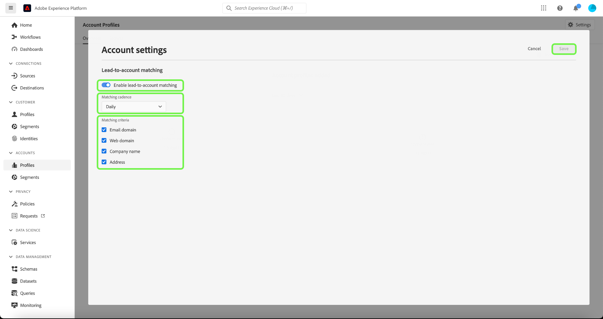

Weitere Informationen zur Lead-Konto-Zuordnung finden Sie unter [Lead-Konto-Zuordnung in der Real-Time CDP B2B-Übersicht](../../rtcdp/b2b-ai-ml-services/lead-to-account-matching.md).

## Durchsuchen von Account-Profilen {#browse-account-profiles}

Um Account-Profile zu durchsuchen, wählen Sie zunächst **[!UICONTROL Profiles]** unter [!UICONTROL Accounts] im linken Navigationsbereich aus.

Auf der Registerkarte **[!UICONTROL Browse]** können Sie Account-Profile mithilfe einer Account-ID aus einer verbundenen Unternehmensquelle analysieren oder Quelldetails direkt eingeben.

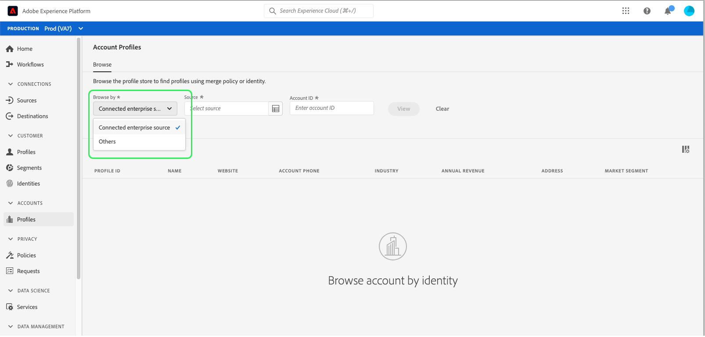

### Durchsuchen nach [!UICONTROL Connected enterprise source] {#browse-by-connected-enterprise-source}

Um Account-Profile nach einer verbundenen Unternehmensquelle zu durchsuchen, wählen Sie **[!UICONTROL Connected enterprise source]** aus dem Dropdown-Menü **[!UICONTROL Browse by]** und wählen Sie dann mithilfe der Auswahl-Schaltfläche neben dem Feld **[!UICONTROL Source]** eine verbundene Quelle aus.

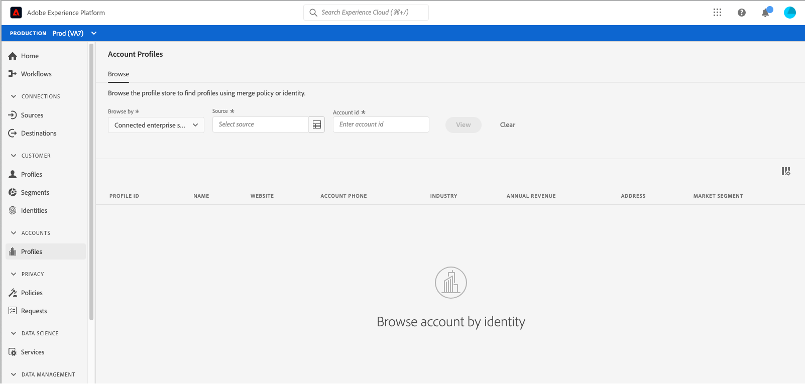

Dadurch wird das Dialogfeld **[!UICONTROL Select source]** geöffnet, in dem Sie eine Quelle auswählen können, die auf den Verbindungen basiert, die Ihr Unternehmen hergestellt hat.

>[!NOTE]
>
>In Ihrem Unternehmen können für denselben Dienstleister mehrere Quellen konfiguriert sein (z. B. Marketo). Daher ist es wichtig, den Verbindungsnamen, das Quellsystem und die Quellsysteminstanz zu überprüfen, um sicherzustellen, dass Sie nach der richtigen Quellinstanz suchen.

Weiterführende Informationen zum Verbinden von Unternehmensquellen finden Sie in der [Quellenübersicht](../sources/sources-overview.md).

Sie können eine Quelle auswählen, indem Sie die Optionsschaltfläche neben dem Verbindungsnamen auswählen und dann **[!UICONTROL Select]** verwenden, um zur Registerkarte [!UICONTROL Browse] zurückzukehren.

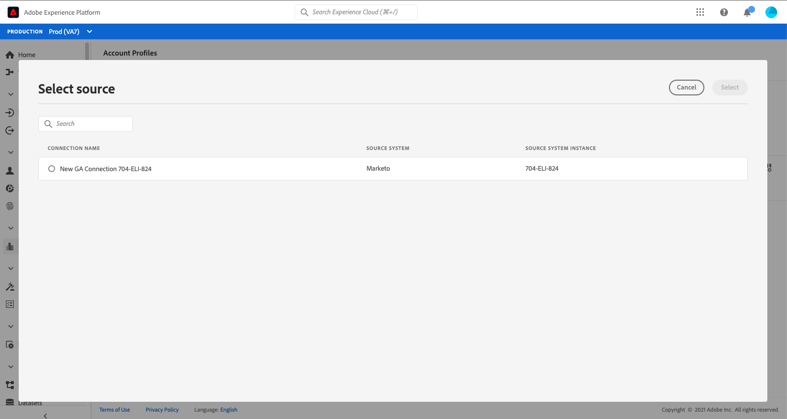

Wenn eine Quelle ausgewählt ist, müssen Sie jetzt eine **[!UICONTROL Account ID]** eingeben, die mit der Quelle verknüpft ist. Wenn Sie beispielsweise eine Salesforce-Quelle auswählen, müssen Sie eine Account-ID aus der Salesforce-Instanz eingeben, um das mit dieser ID verknüpfte Account-Profil anzuzeigen.

>[!NOTE]
>
>Für Marketo-Account-IDs können zwei Account-Tabellen referenziert werden. Daher müssen Sie eine bestimmte Syntax verwenden, um sicherzustellen, dass Sie den richtigen Account anzeigen.
>
>Die häufigste Standardsyntax ist die Marketo-Account-ID, an die `.mkto_org` angehängt wird (z. B. `1234567.mkto_org`). Marketo-Kunden mit Account-basiertem Marketing verfügen möglicherweise über zusätzliche Werte, die mithilfe der Marketo-Account-ID mit dem Anhang `.mkto_account` gefunden werden können. Wenn Sie sich nicht sicher sind, welche Syntax Sie verwenden sollten, wenden Sie sich an Ihren Marketo-Administrator.

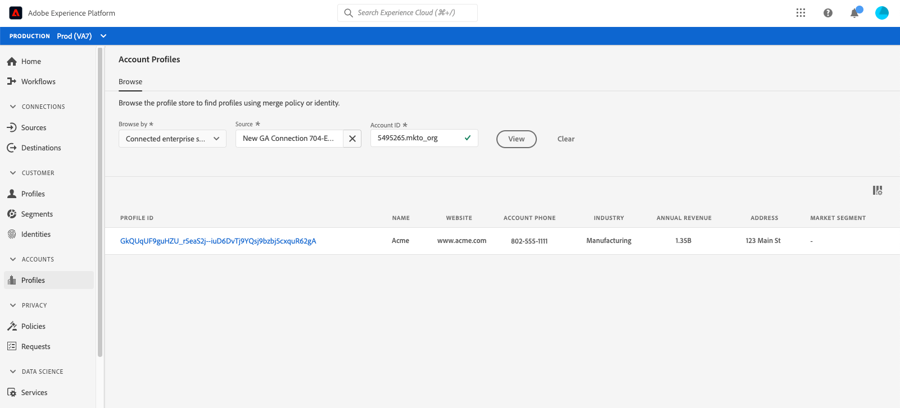

### Durchsuchen nach [!UICONTROL Others] {#browse-by-others}

Real-Time CDP, B2B edition unterstützt die Möglichkeit, eine direkte Suche durchzuführen, indem Sie einen **[!UICONTROL Source name]**, einen **[!UICONTROL Source instance]** und einen **[!UICONTROL Account ID]** für ein Konto eingeben, das Sie anzeigen möchten. Indem Sie den Quellnamen und die Instanz direkt eingeben, geben Sie den Kontext an, den Experience Platform benötigt, um nach den richtigen Account-Profildaten zu suchen und diese anzuzeigen.

Die Möglichkeit, eine direkte Suche durchzuführen, ist unter Umständen nützlich, wenn eine direkte Quellverbindung zu den Daten nicht möglich ist. Wenn Ihr Unternehmen beispielsweise über Data Governance-Richtlinien verfügt, die eine direkte Verbindung zu einem CRM verhindern, können Sie diese Daten in ein Cloud-Speichersystem exportieren und dann in Experience Platform aufnehmen.

Ein weiteres Beispiel könnte sein, dass Sie eine Transformation der Daten durchführen, nachdem diese ein System verlassen haben und bevor sie in Experience Platform eintreten. Sie können die Funktion für die direkte Suche verwenden, um einen Kontext für die Daten bereitzustellen (z. B. um anzugeben, dass es sich um Marketo-Daten handelt, obwohl sie beispielsweise von einem Amazon S3-Bucket stammen), sodass das System weiß, wo die Daten gesucht werden sollen und wie sie korrekt wiedergegeben werden.

Um eine direkte Suche zu starten, wählen Sie **[!UICONTROL Others]** aus der Dropdown-Liste **[!UICONTROL Browse by]** aus und geben Sie dann einen **[!UICONTROL Source name]**, eine **[!UICONTROL Source instance]** und eine **[!UICONTROL Account ID]** für das Konto ein, das Sie anzeigen möchten.

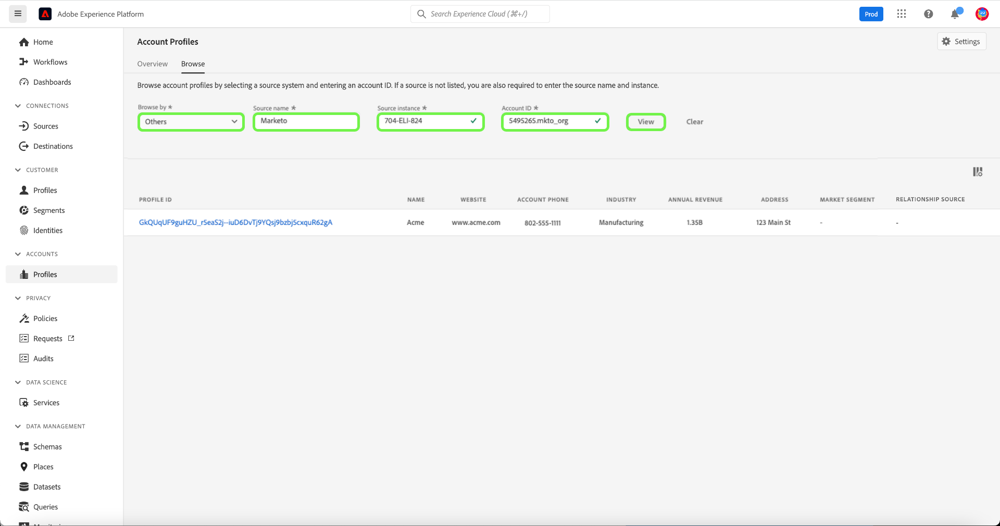

## Anzeigen von Details zum Account-Profil {#view-account-profile-details}

Nachdem Sie die Registerkarte **[!UICONTROL Browse]** zum Suchen eines Kontoprofils verwendet haben, wird durch Auswahl der **[!UICONTROL Profile ID]** die Registerkarte **[!UICONTROL Detail]** für das Kontoprofil geöffnet. Die auf der Registerkarte **[!UICONTROL Detail]** angezeigten Profildaten wurden aus mehreren Profilfragmenten zusammengeführt, um eine zentrale Ansicht des jeweiligen Accounts zu erstellen. Dazu gehören Account-Details wie grundlegende Attribute und Social-Media-Daten.

Die Standardfelder können auch auf Organisationsebene geändert werden, um die bevorzugten Account-Profil-Attribute anzuzeigen.

>[!NOTE]
>
>Ähnliche Funktionen sind für Kundenprofile verfügbar und es gibt eine schrittweise Anleitung zum Hinzufügen und Entfernen von Attributen, zum Ändern der Größe von Panels usw. Weitere Informationen finden Sie im [Handbuch zur Anpassung von Profildetails](../../profile/ui/profile-customization.md).

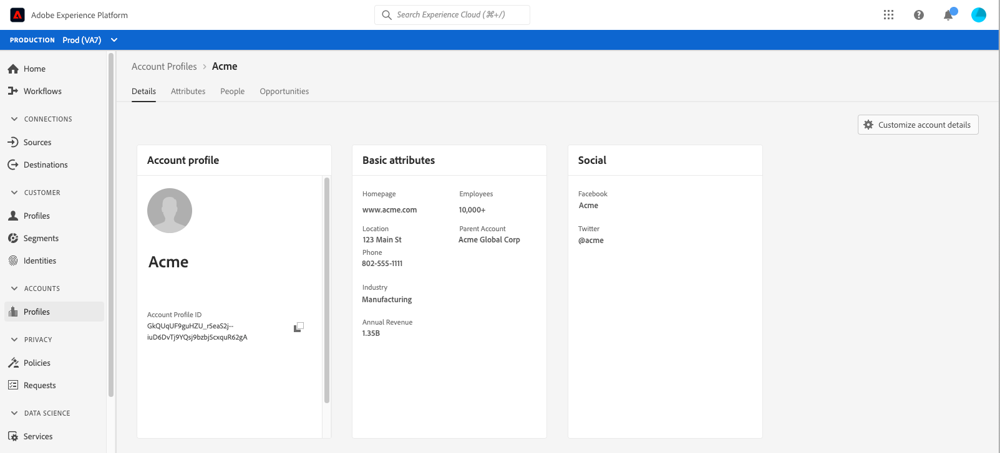

Sie können zusätzliche Details zum Konto anzeigen, indem Sie eine andere der verfügbaren Registerkarten auswählen. Diese Registerkarten umfassen Attribute, Personen und die Registerkarte „Opportunitys“, auf der die offenen und geschlossenen Chancen für das Konto in Ihren Unternehmenssystemen angezeigt werden. Weitere Informationen zu den einzelnen Registerkarten finden Sie in den folgenden Abschnitten.

## Registerkarte „Attribute“ {#attributes-tab}

Auf der Registerkarte **[!UICONTROL Attributes]** werden alle Datensatzinformationen aufgelistet, die sich auf den Account beziehen. Dazu gehören Attributdaten aus mehreren Quellen, die zusammengeführt wurden, um eine einzige Ansicht des Accounts zu bilden.

Sie können die Daten nicht nur in einer Liste anzeigen, sondern auch in der Suchleiste nach bestimmten Attributen suchen oder die Eintragsdaten als JSON anzeigen.

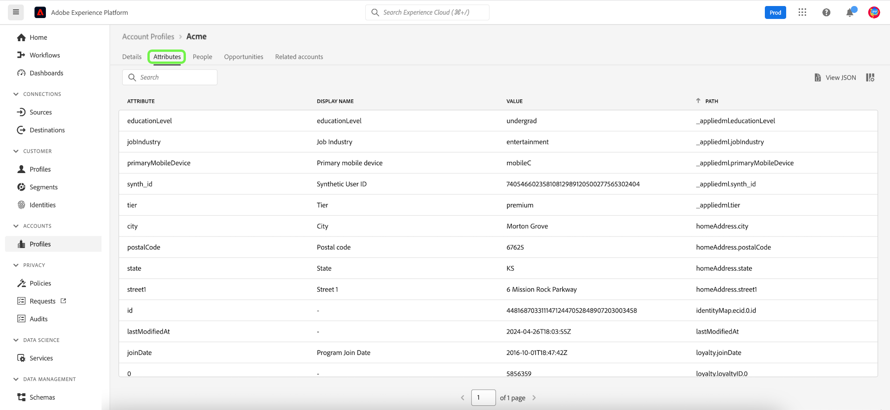

## Registerkarte „Personen“ {#people-tab}

Die Registerkarte **[!UICONTROL People]** enthält eine Liste der einzelnen Personen, die mit dem Account in Verbindung stehen. Diese Personen können Kontakte und Leads aus verschiedenen Unternehmenssystemen sein, die von verschiedenen Teams in Ihrem Unternehmen verwaltet werden. In Real-Time CDP, B2B edition werden sie jedoch in einer Liste zusammengefasst, sodass Sie eine ganzheitlichere Ansicht Ihrer Account-Kontakte erhalten.

>[!NOTE]
>
>Auf der Registerkarte [!UICONTROL People] wird eine Liste mit bis zu 25 Personen angezeigt, die mit dem Account in Verbindung stehen. Bei Accounts mit mehr als 25 Personen zeigt das System 25 zufällig ausgewählte Einträge an.

Neben der Anzeige einer Momentaufnahme der Informationen für den Kontakt enthält jede aufgeführte Person auch einen **[!UICONTROL Profile ID]**, bei dem es sich um einen anklickbaren Link handelt, über den Sie das Echtzeit-Kundenprofil für diese Person ermitteln können. Weitere Informationen zum Anzeigen einzelner Account-Profile in Bezug auf Ihre Accounts finden Sie im Handbuch [Durchsuchen von Profilen in Real-Time CDP, B2B edition](../profile/profile-browse.md).

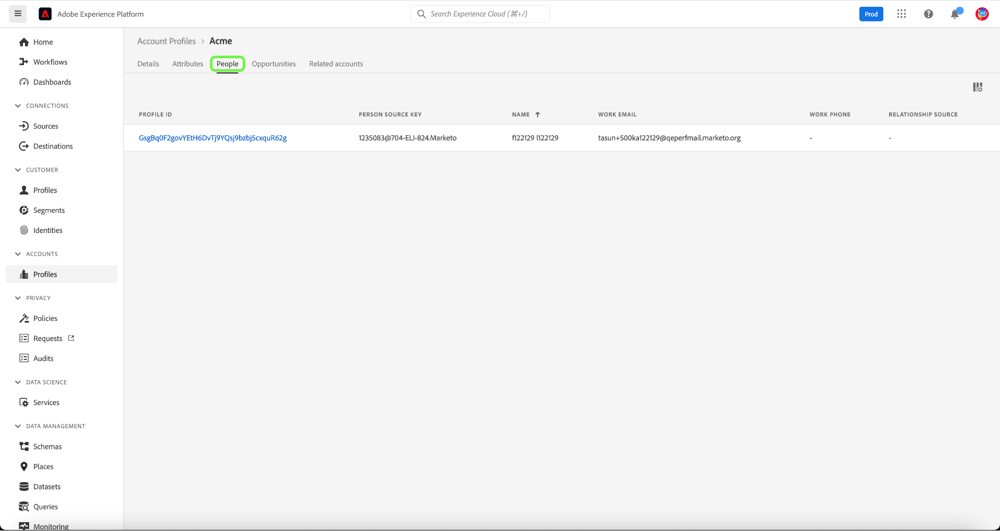

## Registerkarte „Opportunitys“ {#opportunities-tab}

Die Registerkarte **[!UICONTROL Opportunities]** enthält Informationen zu offenen und geschlossenen Opportunitys im Zusammenhang mit dem Account. Diese Opportunitys können aus verschiedenen Quellen in Experience Platform aufgenommen werden. Real-Time CDP, B2B edition, erleichtert es Marketing-Experten jedoch, all diese Opportunitys an einem Ort zu sehen.

>[!NOTE]
>
>Auf der Registerkarte [!UICONTROL Opportunities] wird eine Liste mit bis zu 25 mit dem Account verbundenen Opportunitys angezeigt. Bei Accounts mit mehr als 25 verbundenen Opportunitys zeigt das System 25 zufällig ausgewählte Einträge an.

Jede Opportunity umfasst Informationen wie den Namen der Opportunity, ihren Umfang, die Phase und ob die Opportunity offen, geschlossen, gewonnen oder verloren ist.

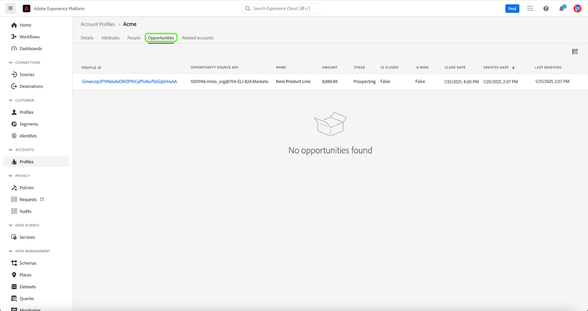

## Registerkarte „Verwandte Konten“ {#related-accounts-tab}

Die Registerkarte **[!UICONTROL Related accounts]** enthält Informationen zu anderen Konten, die mit dem Konto, das Sie durchsuchen, in Verbindung stehen können. Detaillierte Informationen zu den Funktionen finden Sie unter [Übersicht über verwandte Konten](/help/rtcdp/b2b-ai-ml-services/related-accounts.md).

>[!NOTE]
>
>* Eine Gruppe verwandter Konten kann maximal 30 Kontoprofile haben. Wenn mehr als 30 Account-Profile als verwandt gefunden wurden, werden sie willkürlich in mehrere Gruppen aufgeteilt, von denen jede nicht mehr als 30 Mitglieder hat. Die Gruppe Verknüpfte Konten eines Kontoprofils umfasst immer sich selbst.
>* Auf der Registerkarte [!UICONTROL Related accounts] wird derzeit eine Liste mit bis zu 25 verwandten Konten angezeigt, die mit dem Konto verknüpft sind, das Sie durchsuchen. Dies ist eine Einschränkung, die in einer zukünftigen Aktualisierung behoben wird. Trotz dieser Einschränkung der Benutzeroberfläche werden bei der Verwendung verwandter Konten in Segmentdefinitionen für Gruppen von 30 verwandten Kontoprofilen alle Profile für die Zielgruppenbestimmung verwendet.

Jedes zugehörige Konto enthält Informationen wie die Kontoprofil-ID und den Namen, den Kontoquellschlüssel und weitere Informationen zu Homepage, Adresse, übergeordnetem Konto, Telefon, Branche und Jahresumsatz.

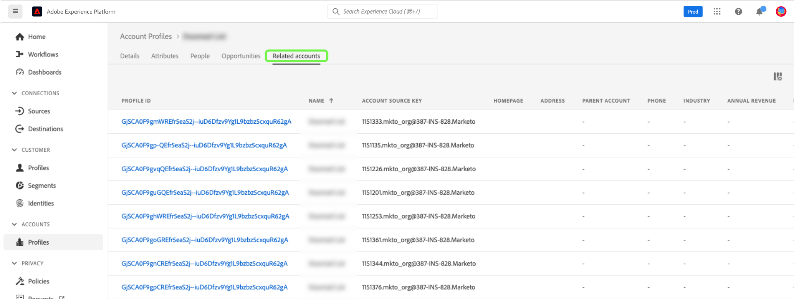

Sie können die zugehörigen Konten in dieser Liste für Segmentierungszwecke verwenden. In einem [Segmentierungsbeispiel](/help/rtcdp/segmentation/b2b.md#related-account) erfahren Sie, wie Sie mithilfe verwandter Konten Ihre Reichweite in Segmentdefinitionen erweitern können.