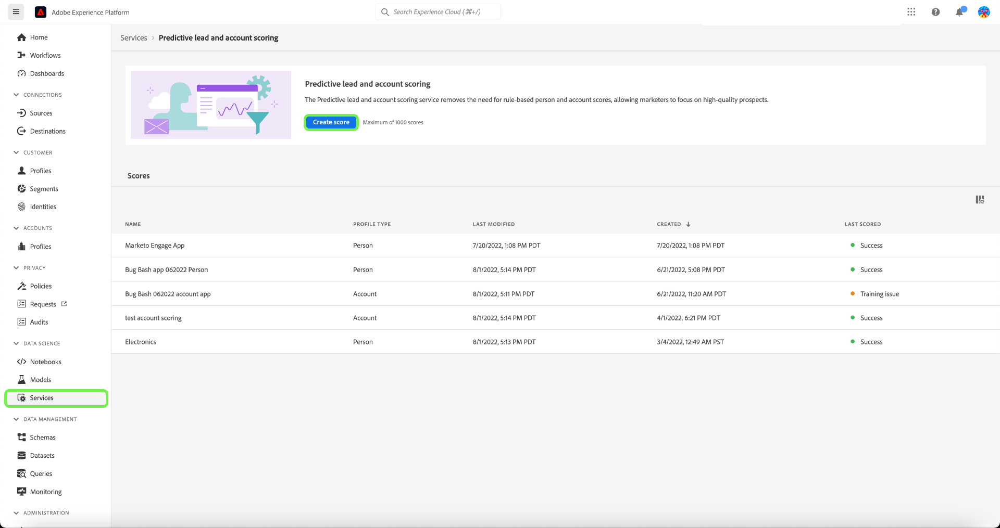
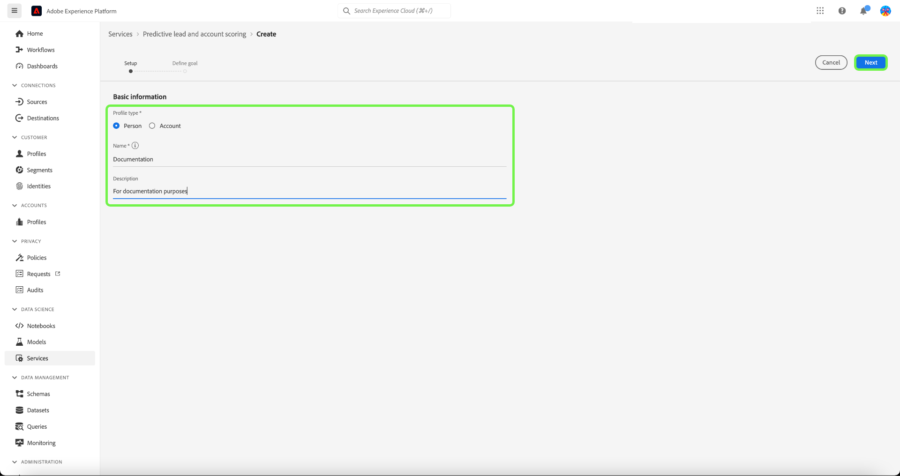
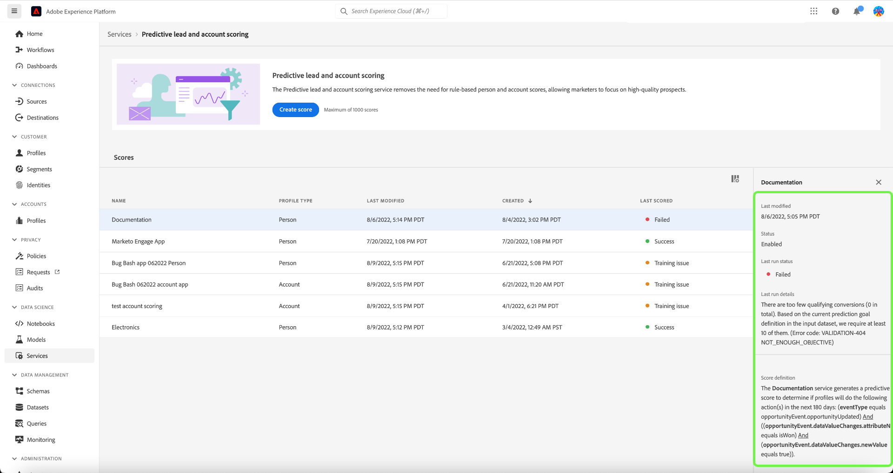
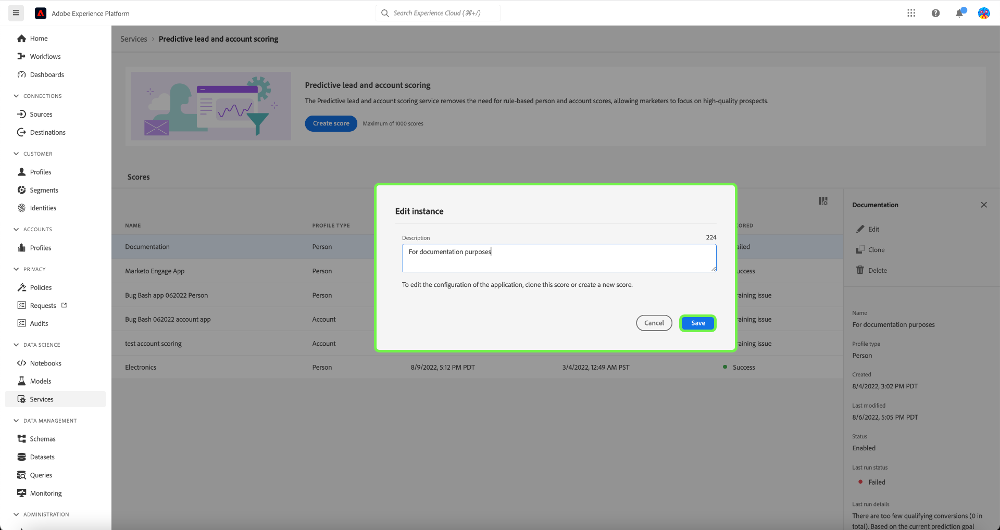
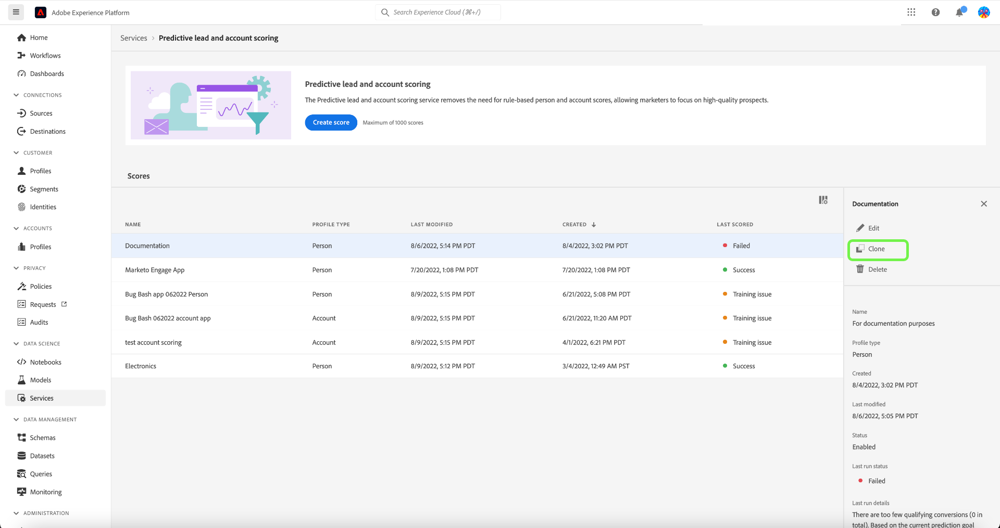

# Prädiktive Lead- und Kontobewertung in Adobe Real-time Customer Data Platform, B2B Edition verwalten

>[!NOTE]
>
>Nur Benutzer mit der Berechtigung B2B AI verwalten können Bewertungsziele erstellen, ändern und löschen.

Dieses Tutorial führt Sie durch die Schritte zum Verwalten der Bewertungsziele des prädiktiven Lead- und Kontoauswertungsdienstes. Score-Ziele können entweder für das Personenprofil oder das Kontoprofil festgelegt werden.

## Neues Ergebnis erstellen

Um eine neue Punktzahl zu erstellen, wählen Sie die **[!UICONTROL Dienste]** in der Seitenleiste und wählen Sie **[!UICONTROL Ergebnis erstellen]**.

Die **[!UICONTROL Basisinformationen]** angezeigt, in dem Sie aufgefordert werden, einen Profiltyp auszuwählen, einen Namen und eine optionale Beschreibung einzugeben. Wenn Sie fertig sind, klicken Sie auf die Schaltfläche **[!UICONTROL Weiter]**.

Die **[!UICONTROL Ziel definieren]** angezeigt. Wählen Sie den Dropdown-Pfeil aus und wählen Sie dann einen Zieltyp aus dem angezeigten Dropdown-Fenster aus.

Die **[!UICONTROL Zielspezifikationen]** wird geöffnet. Wählen Sie den Dropdown-Pfeil aus und wählen Sie dann im angezeigten Dropdown-Fenster den Zielfeldnamen aus.

Die **[!UICONTROL Zielbedingungen]** Auswahl angezeigt. Wählen Sie den Dropdown-Pfeil aus und wählen Sie dann die Bedingung aus dem angezeigten Dropdown-Fenster aus.

Die **[!UICONTROL Zielwert]** angezeigt. Konfigurieren Sie als Nächstes Ihre [!UICONTROL Zielspezifikationen]. Wählen Sie die [!UICONTROL Feldwert eingeben] und geben Sie Ihren Zielwert ein.

>[!NOTE]
>
>Es können mehrere Zielwerte hinzugefügt werden.

Um weitere Felder hinzuzufügen, wählen Sie **[!UICONTROL Feld hinzufügen]**.

Um den Prognosezeitrahmen zu konfigurieren, wählen Sie den Dropdown-Pfeil aus und wählen Sie dann den gewünschten Zeitrahmen aus.

Die ausgewählte Zusammenführungsrichtlinie bestimmt, wie die Feldwerte eines Personenprofils ausgewählt werden. Wählen Sie mithilfe des Dropdown-Pfeils die gewünschte Zusammenführungsrichtlinie aus und klicken Sie auf **[!UICONTROL Beenden]**.

Die **[!UICONTROL Die Einrichtung der Auswertung ist abgeschlossen.]** angezeigt, in dem bestätigt wird, dass die neue Punktzahl erstellt wurde. Wählen Sie **[!UICONTROL OK]** aus.

>[!NOTE]
>
>Es kann bis zu 24 Stunden dauern, bis jeder Scoring-Prozess abgeschlossen ist.

Sie kehren zum **[!UICONTROL Dienste]** -Tab, wo Sie die neue Punktzahl sehen können, die in der Liste der Bewertungen erstellt wurde.

Wählen Sie die Punktzahl aus, um Details und zusätzliche Informationen zu den letzten Ausführungsdetails anzuzeigen.

Ausführlichere Informationen zu den Fehlercodes, die unter den Details der letzten Ausführung angezeigt werden, finden Sie im Abschnitt unter [Führt AI-Pipeline-Fehlercodes](#leads-ai-pipeline-error-codes) in diesem Dokument.

## Ergebnis bearbeiten

Um eine Punktzahl zu bearbeiten, wählen Sie eine Punktzahl aus der **[!UICONTROL Dienste]** Registerkarte und wählen Sie **[!UICONTROL Bearbeiten]** über das Bedienfeld &quot;Zusätzliche Details&quot;auf der rechten Seite des Bildschirms.

Die **[!UICONTROL Instanz bearbeiten]** angezeigt, in dem Sie die Beschreibung für das Ergebnis bearbeiten können. Nehmen Sie Ihre Änderungen vor und wählen Sie **[!UICONTROL Speichern]**.

>[!NOTE]
>
>Die Punktkonfiguration kann nicht geändert werden, da dies die Umschulung und Neubewertung von Triggern zur Folge hat. Dies entspricht dem Löschen der Punktzahl und dem Erstellen einer neuen Punktzahl. Um die Konfiguration der Punktzahl zu bearbeiten, müssen Sie diese Punktzahl klonen oder eine neue Punktzahl erstellen.

Sie kehren zum **[!UICONTROL Dienste]** Registerkarte. Wählen Sie die Punktzahl aus, um die aktualisierten Beschreibungsdetails im Bedienfeld mit zusätzlichen Details auf der rechten Seite des Bildschirms anzuzeigen.

## Klonen einer Punktzahl

Um eine Punktzahl zu klonen, wählen Sie eine Punktzahl aus der **[!UICONTROL Dienste]** Registerkarte und wählen Sie **[!UICONTROL Klonen]** über das Bedienfeld &quot;Zusätzliche Details&quot;auf der rechten Seite des Bildschirms.

Die **[!UICONTROL Basisinformationen]** angezeigt. Der Profiltyp, der Name und die Beschreibung werden aus der ursprünglichen Punktzahl geklont. Ändern Sie diese Details und wählen Sie **[!UICONTROL Nächste]**.

Die **[!UICONTROL Ziel definieren]** angezeigt. Füllen Sie den Zielabschnitt wie bei der Erstellung einer neuen Punktzahl aus und wählen Sie **[!UICONTROL Beenden]**.

Sie kehren zum **[!UICONTROL Dienste]** -Tab, wo Sie die neu geklonte Punktzahl in der Liste sehen können.

>[!NOTE]
>
>Die **[!UICONTROL Ziel definieren]** -Abschnitt nicht aus der ursprünglichen Punktzahl geklont.

## Löschen eines Punkts

Um eine Punktzahl zu löschen, wählen Sie eine Punktzahl aus der **[!UICONTROL Dienste]** Registerkarte und wählen Sie **[!UICONTROL Löschen]** über das Bedienfeld &quot;Zusätzliche Details&quot;auf der rechten Seite des Bildschirms.

Die **[!UICONTROL Dokumentation löschen]** Bestätigungsdialogfeld angezeigt. Wählen Sie **[!UICONTROL Löschen]** aus.

>[!NOTE]
>
>Wenn Sie die Punktzahl-Definition löschen, werden auch alle prognostizierten Werte für das Personenprofil oder Kontoprofil gelöscht, nicht jedoch die für die Punktzahl-Definition erstellte Feldergruppe. Die Feldergruppe bleibt im Datenmodell &quot;verwaist&quot;.

Sie kehren zum **[!UICONTROL Dienste]** -Tab, wo die Punktzahl nicht mehr in der Liste angezeigt wird.

## Führt AI-Pipeline-Fehlercodes aus

| Fehler-Code | Fehlermeldung |
| --- | --- |
| 401 | FEHLER 401. Lead-AI-Pipeline angehalten: nicht genügend gültige Konten für die Kontobewertung. Zählung der Konten: {}. |
| 402 | FEHLER 402. Lead-AI-Pipeline angehalten: nicht genügend gültige Kontakte für die Auswertung von Kontakten. Anzahl der Kontakte: {}. |
| 403 | FEHLER 403. Lead-AI-Pipeline angehalten: für das Modelltraining nicht genügend Aktivitätsvolumen. Anzahl der Ereignisse: {}. |
| 404 | FEHLER 404. Lead-AI-Pipeline angehalten: nicht genügend Konversionen für das Trainieren von Modellen. Zählung der Konversionen: {}. |
| 405 | FEHLER 405. Lead-AI-Pipeline angehalten: -Aktivität zu sparsam für eine gültige Modellschulung. Nur {} Prozent der Konten haben Aktivitäten. |
| 406 | FEHLER 406. Lead-AI-Pipeline angehalten: -Aktivität zu sparsam für eine gültige Modellschulung. Nur {} Prozent der Kontakte haben Aktivität. |
| 407 | FEHLER 407. Lead-AI-Pipeline angehalten: Die Aktivitätstypen für Scoring-Daten stimmen nicht mit den Trainings-Daten überein. |
| 408 | FEHLER 408. Lead-AI-Pipeline angehalten: Die fehlende Rate ist für Aktivitätsfunktionen zu hoch. Fehlende Rate: {}. |
| 409 | FEHLER 409. Lead-AI-Pipeline angehalten: Die Testauc ist zu niedrig. Testauc: {}. |
| 410 | FEHLER 410. Lead-AI-Pipeline angehalten: Die Testauc ist nach der Parameteroptimierung zu niedrig. Testauc: {}. |
| 411 | FEHLER 411. Lead-AI-Pipeline angehalten: Schulungsdaten verfügen nicht über genügend Konversionen, um ein zuverlässiges Modell zu erstellen. Konversionen: {}. |
| 412 | FEHLER 412. Lead-AI-Pipeline angehalten: Testdaten haben keine Konversion zur Berechnung von AUC-ROC. |

| Warn-/Info-Code | Nachricht |
| --- | --- |
| 100 | INFO 100. Führt eine KI-Qualitätsprüfung durch: Die Rechnungsanzahl beträgt: {}. |
| 101 | INFO 101. Führt eine KI-Qualitätsprüfung durch: die Anzahl der Kontakte: {}. |
| 102 | INFO 102. Führt eine KI-Qualitätsprüfung durch: Die Anzahl der Möglichkeiten beträgt: {}. |
| 103 | INFO 103. Führt eine KI-Qualitätsprüfung durch: Testauc ist gering. Parameteroptimierung starten. Testauc: {}. |
| 200 | WARNUNG 200. Führt eine KI-Qualitätsprüfung durch: Die fehlende Rate von firmografischen Funktionen ist: {}. |
| 201 | WARNUNG 201. Führt eine KI-Qualitätsprüfung durch: Die fehlende Rate von Aktivitätsfunktionen lautet: {}. |

## Nächste Schritte

In diesem Tutorial können Sie jetzt erfolgreich Bewertungen erstellen und verwalten. Weiterführende Informationen finden Sie in folgenden Dokumenten:

* [Prädiktives Lead- und Konto-Scoring](/help/rtcdp/b2b-ai-ml-services/predictive-lead-and-account-scoring.md)
* [Überwachen von prädiktiven Lead- und Kontobewertungsaufträgen](/help/dataflows/ui/b2b/monitor-profile-enrichment.md)
