# Verwalten von prädiktivem Lead- und Konto-Scoring in Adobe Real-Time Customer Data Platform, B2B edition

>[!NOTE]
>
>Nur Benutzer mit der Berechtigung B2B-KI verwalten können Score-Ziele erstellen, ändern und löschen.

Dieses Tutorial führt Sie durch die Schritte zum Verwalten der Score-Ziele des Predictive Lead and Account Scoring-Service. Score-Ziele können entweder für das Personenprofil oder das Kontoprofil festgelegt werden.

## Neuen Score erstellen

Um einen neuen Score zu erstellen, wählen Sie den **[!UICONTROL Services]** in der Seitenleiste aus und klicken Sie auf **[!UICONTROL Create score]**.

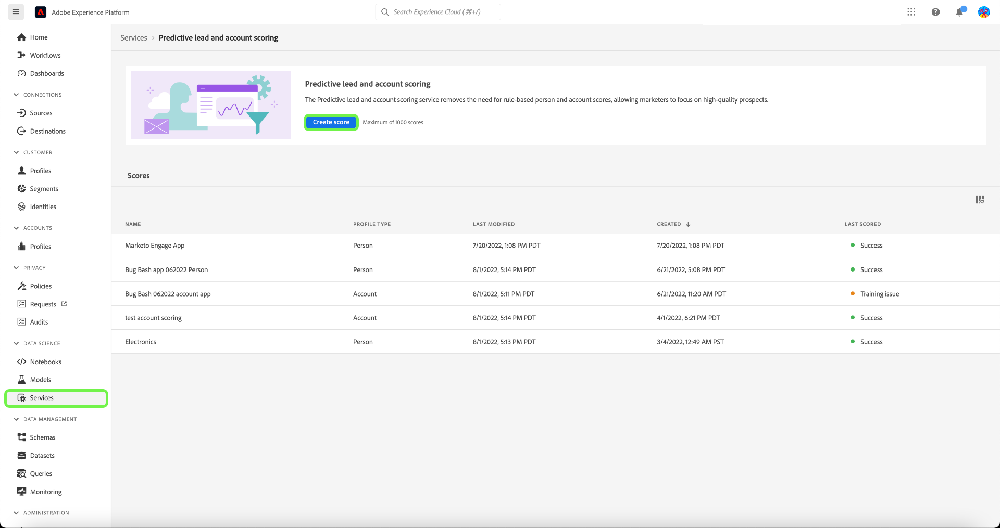

Der Bildschirm **[!UICONTROL Basic information]** wird angezeigt, in dem Sie aufgefordert werden, einen Profiltyp auszuwählen, einen Namen und eine optionale Beschreibung einzugeben. Wenn Sie fertig sind, wählen Sie **[!UICONTROL Next]** aus.

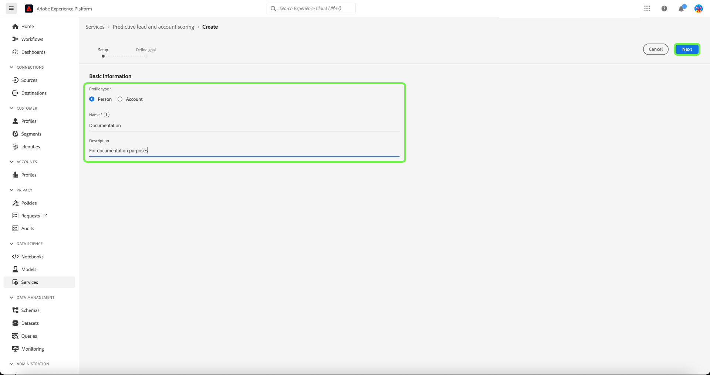

Der Bildschirm **[!UICONTROL Define your goal]** wird angezeigt. Wählen Sie den Dropdown-Pfeil und dann im angezeigten Dropdown-Fenster einen Zieltyp aus.

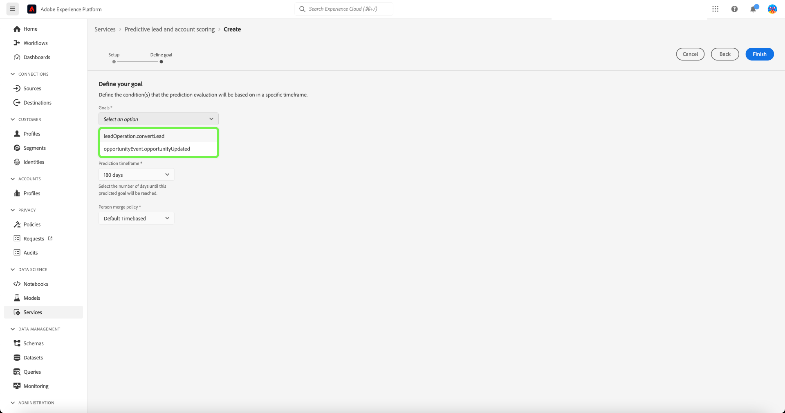

Das Dialogfeld **[!UICONTROL Goal specifics]** wird geöffnet. Wählen Sie den Dropdown-Pfeil und dann aus dem angezeigten Dropdown-Fenster den Namen des Zielfelds aus.

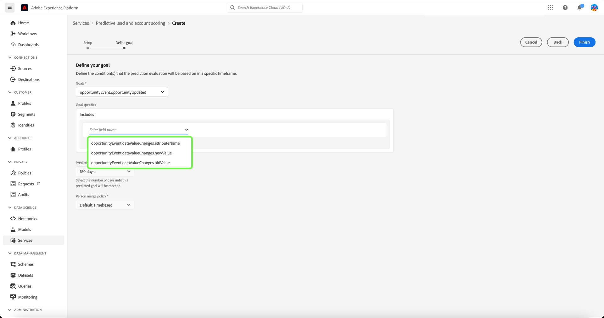

Die **[!UICONTROL Goal conditions]** wird angezeigt. Wählen Sie den Dropdown-Pfeil und dann im angezeigten Dropdown-Fenster Bedingung aus.

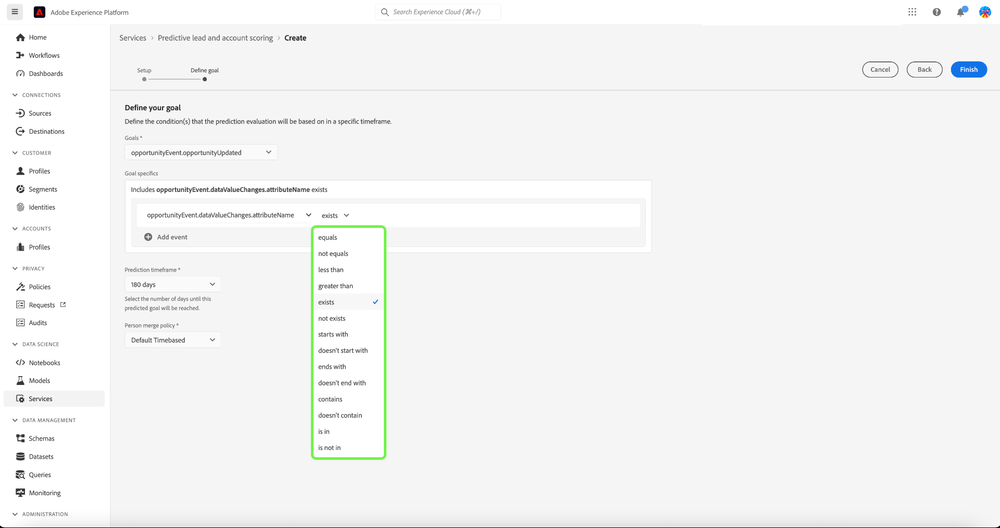

Das Feld **[!UICONTROL Goal value]** wird angezeigt. Konfigurieren Sie anschließend Ihre [!UICONTROL Goal specifics]. Wählen Sie das Bedienfeld [!UICONTROL Enter Field Value] aus und geben Sie Ihren Zielwert ein.

>[!NOTE]
>
>Es können mehrere Zielwerte hinzugefügt werden.

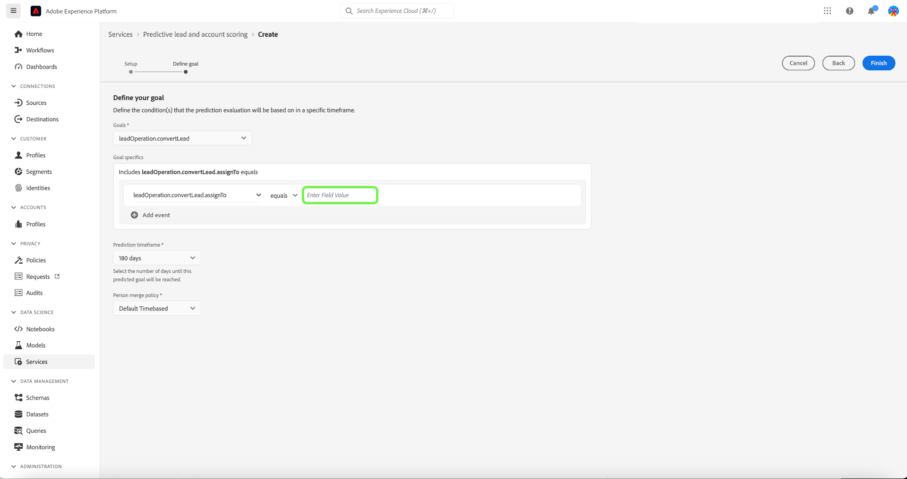

Um zusätzliche Felder hinzuzufügen, wählen Sie **[!UICONTROL Add field]** aus.

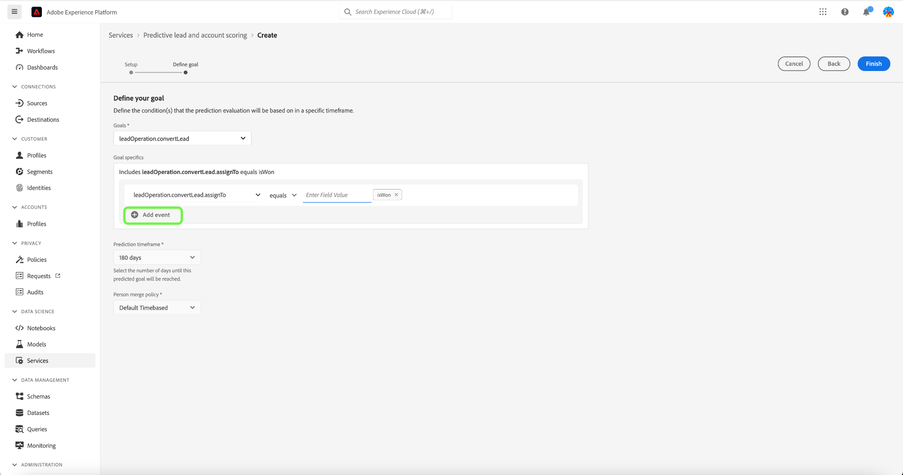

Um den Prognosezeitrahmen zu konfigurieren, klicken Sie auf den Dropdown-Pfeil und wählen Sie dann Ihren gewünschten Zeitrahmen aus.

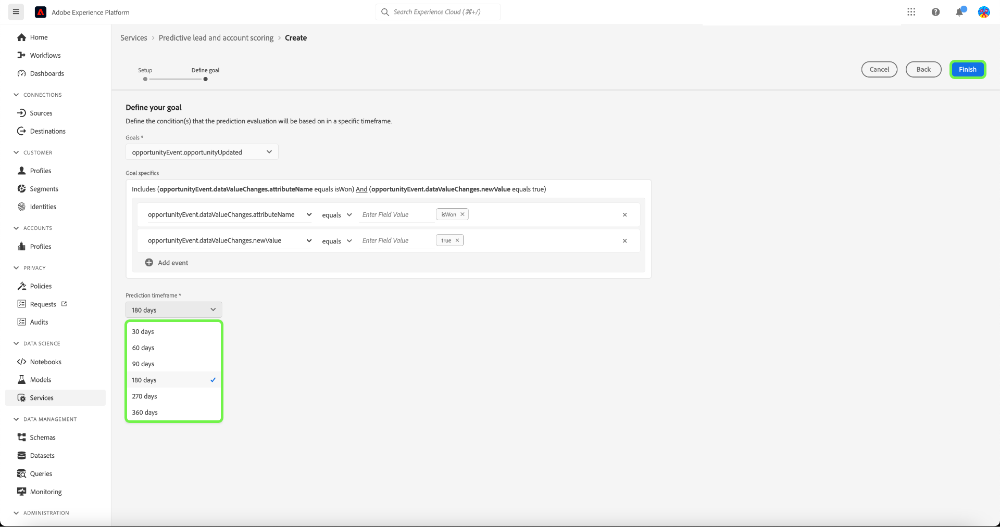

Die ausgewählte Zusammenführungsrichtlinie bestimmt, wie die Feldwerte eines Personenprofils ausgewählt werden. Wählen Sie mithilfe des Dropdown-Pfeils Ihre gewünschte Zusammenführungsrichtlinie aus und klicken Sie dann auf **[!UICONTROL Finish]**.

Das Dialogfeld **[!UICONTROL Scoring setup is complete]** wird angezeigt und bestätigt, dass der neue Score erstellt wurde. Wählen Sie **[!UICONTROL OK]** aus.

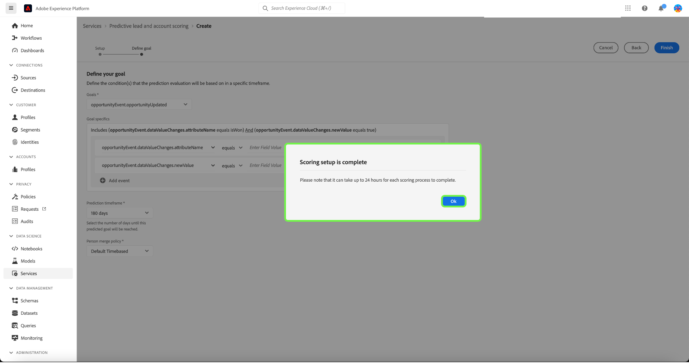

>[!NOTE]
>
>Es kann bis zu 24 Stunden dauern, bis jeder Scoring-Prozess abgeschlossen ist.

Sie kehren zur Registerkarte **[!UICONTROL Services]** zurück, auf der Sie den neuen Score in der Liste der Score-Werte sehen können.

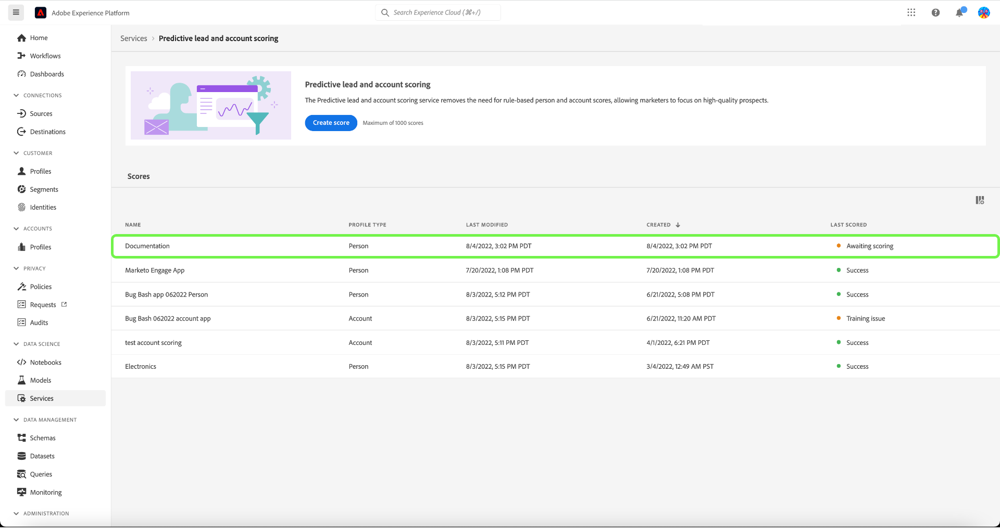

Wählen Sie die Punktzahl aus, um Details und zusätzliche Informationen zum letzten Durchgang anzuzeigen.

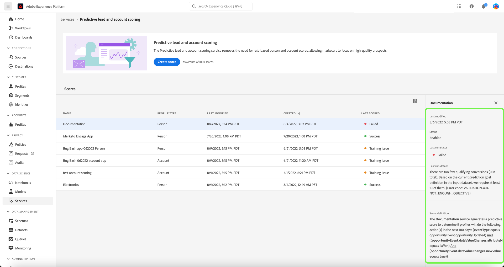

Weitere Informationen zu den Fehler-Codes, die unter den Details des letzten Durchgangs angezeigt werden, finden Sie im Abschnitt zu [Leads-KI-Pipeline-Fehler](#leads-ai-pipeline-error-codes) in diesem Dokument.

## Punktzahl bearbeiten

Um einen Score zu bearbeiten, wählen Sie einen Score auf der Registerkarte **[!UICONTROL Services]** und wählen Sie **[!UICONTROL Edit]** aus dem Bedienfeld Zusätzliche Details auf der rechten Seite des Bildschirms.

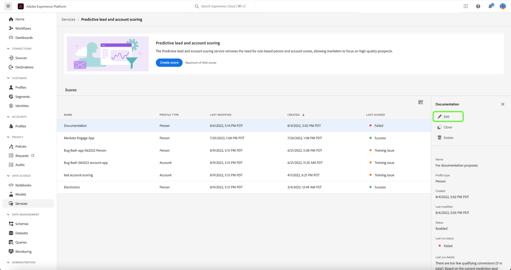

Das Dialogfeld **[!UICONTROL Edit instance]** wird angezeigt, in dem Sie die Beschreibung für den Score bearbeiten können. Nehmen Sie Ihre Änderungen vor und wählen Sie **[!UICONTROL Save]** aus.

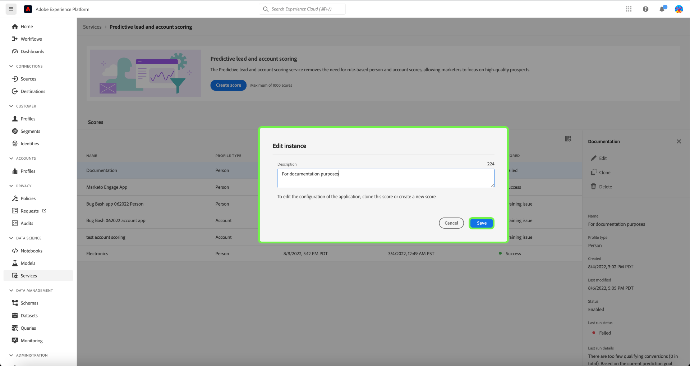

>[!NOTE]
>
>Die Score-Konfiguration kann nicht geändert werden, da dies das Trainings- und Scoring-Modell des Triggers verändert. Dies entspricht dem Löschen des Punktwerts und dem Erstellen eines neuen Punktwerts. Um die Konfiguration des Punktwerts zu bearbeiten, müssen Sie diesen Punktwert klonen oder einen neuen Punktwert erstellen.

Sie kehren zur Registerkarte **[!UICONTROL Services]** zurück. Wählen Sie die Punktzahl aus, um die aktualisierten Beschreibungsdetails im Bedienfeld Zusätzliche Details auf der rechten Seite des Bildschirms anzuzeigen.

## Punktzahl klonen

Um einen Score zu klonen, wählen Sie einen Score auf der Registerkarte **[!UICONTROL Services]** und wählen Sie **[!UICONTROL Clone]** aus dem Bedienfeld Zusätzliche Details auf der rechten Seite des Bildschirms.

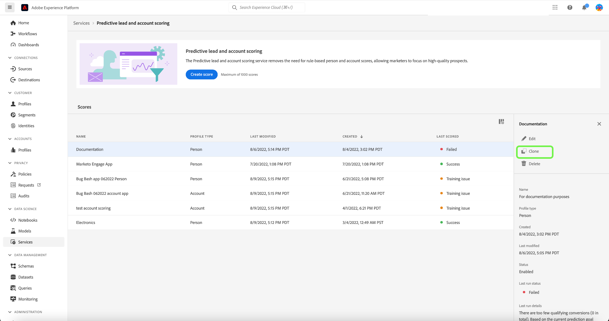

Der Bildschirm **[!UICONTROL Basic information]** wird angezeigt. Der Profiltyp, der Name und die Beschreibung werden aus der ursprünglichen Bewertung geklont. Ändern Sie diese Details und wählen Sie **[!UICONTROL Next]** aus.

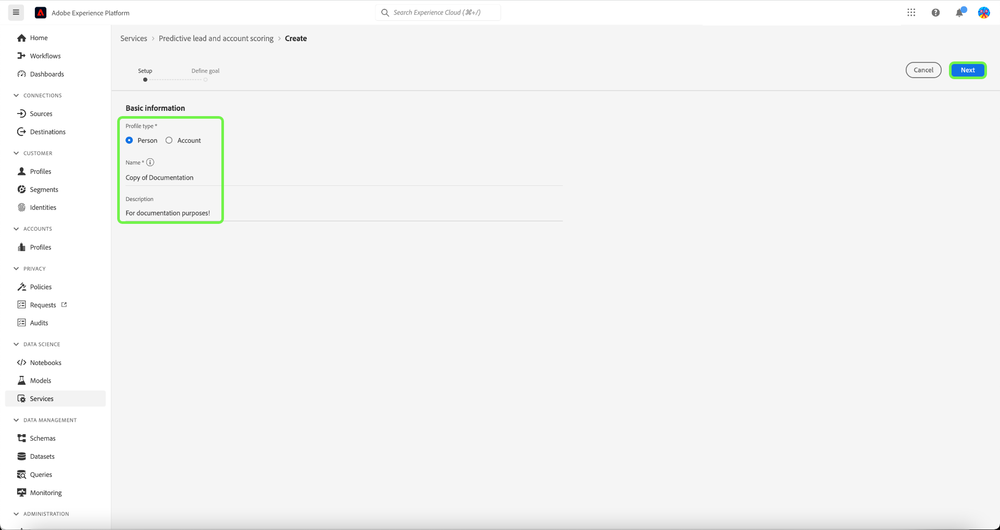

Der Bildschirm **[!UICONTROL Define your goal]** wird angezeigt. Füllen Sie den Abschnitt Ziele wie bei der Erstellung eines neuen Punktwerts aus und wählen Sie **[!UICONTROL Finish]** aus.

Sie kehren zur Registerkarte **[!UICONTROL Services]** zurück, auf der Sie den neu geklonten Score in der Liste sehen können.

>[!NOTE]
>
>Der **[!UICONTROL Define your goal]** Abschnitt wird nicht aus der ursprünglichen Bewertung geklont.

## Punktzahl löschen

Um eine Bewertung zu löschen, wählen Sie eine Bewertung auf der Registerkarte **[!UICONTROL Services]** und wählen Sie **[!UICONTROL Delete]** im Bedienfeld „Zusätzliche Details“ auf der rechten Seite des Bildschirms aus.

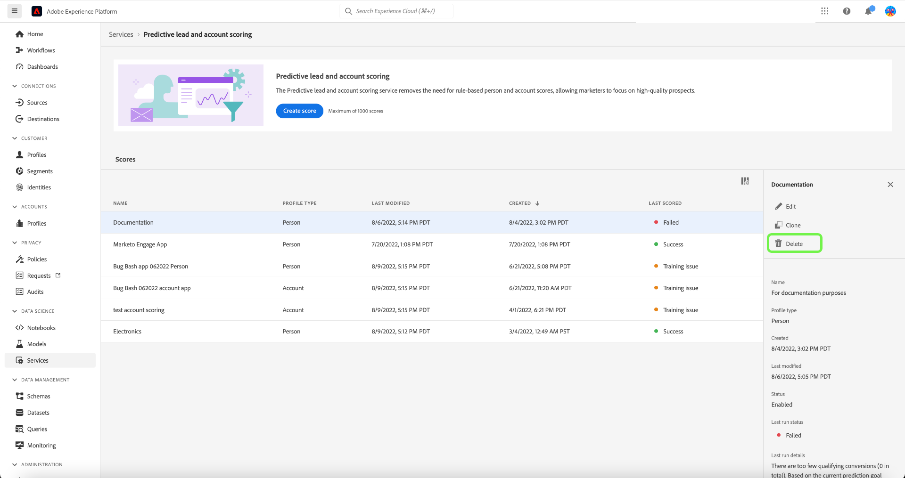

Das **[!UICONTROL Delete documentation]** Bestätigungsdialogfeld wird angezeigt. Wählen Sie **[!UICONTROL Delete]** aus.

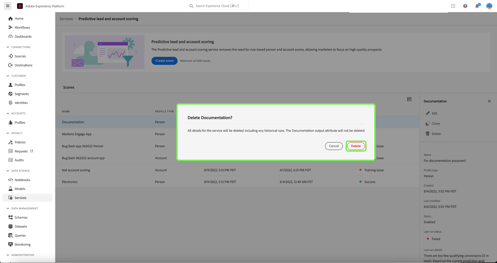

>[!NOTE]
>
>Durch das Löschen der Score-Definition werden auch alle prognostizierten Score-Werte für das Personen- oder Kontoprofil gelöscht, jedoch nicht die für die Score-Definition erstellte Feldergruppe. Die Feldergruppe bleibt im Datenmodell „verwaist“.

Sie kehren zur Registerkarte **[!UICONTROL Services]** zurück, auf der Sie den Score in der Liste nicht mehr sehen können.

## Leads-KI-Pipeline-Fehler-Codes

| Fehler-Code | Fehlermeldung |
| --- | --- |
| 401 | FEHLER 401. Leads-KI-Pipeline gestoppt: Nicht genügend gültige Konten für Kontobewertung. Anzahl Konten: {}. |
| 402 | FEHLER 402. Leads-KI-Pipeline gestoppt: nicht genügend gültige Kontakte für Kontaktbewertung. Anzahl der Kontakte: {}. |
| 403 | FEHLER 403. Leads-KI-Pipeline gestoppt: Nicht genügend Aktivitätsvolumen für Modelltraining. Anzahl der Ereignisse: {}. |
| 404 | FEHLER 404. Leads-KI-Pipeline gestoppt: Nicht genügend Konversionen für Modellschulung. Anzahl der Konversionen: {}. |
| 405 | FEHLER 405. Leads-KI-Pipeline gestoppt: Aktivität zu dünn für gültiges Modell-Training. Nur {} Prozent der Konten sind aktiv. |
| 406 | FEHLER 406. Leads-KI-Pipeline gestoppt: Aktivität zu dünn für gültiges Modell-Training. Nur {} Prozent der Kontakte haben Aktivität. |
| 407 | FEHLER 407. Leads-KI-Pipeline gestoppt: Die Aktivitätstypen für die Bewertungsdaten stimmen nicht mit den Schulungsdaten überein. |
| 408 | FEHLER 408. Leads-KI-Pipeline gestoppt: fehlende Rate ist zu hoch für Aktivitätsfunktionen. Fehlende Quote: {}. |
| 409 | FEHLER 409. Leads-KI-Pipeline gestoppt: Test-AUC ist zu niedrig. Test-AUC: {}. |
| 410 | FEHLER 410. Leads-KI-Pipeline gestoppt: Test-AUC ist nach der Parameteroptimierung zu niedrig. Test-AUC: {}. |
| 411 | FEHLER 411. Leads-KI-Pipeline gestoppt: Bei Trainingsdaten fehlen Konversionen, um ein zuverlässiges Modell zu erstellen. Konversionen: {}. |
| 412 | FEHLER 412. Leads-KI-Pipeline gestoppt: Für die Testdaten findet keine Konversion zur Berechnung des AUC-ROC statt. |

| Warn-/Informationscode | Nachricht |
| --- | --- |
| 100 | INFO 100. Leads-KI-Qualitätsprüfung: Die Anzahl der Konten ist: {}. |
| 101 | INFO 101. Leads-KI-Qualitätsprüfung: Die Anzahl der Kontakte ist: {}. |
| 102 | INFO 102. Leads-KI-Qualitätsprüfung: Die Anzahl der Opportunities ist: {}. |
| 103 | INFO 103. Leads-KI-Qualitätsprüfung: Die Testauc ist niedrig. Parameteroptimierung starten. Testen der AUC: {}. |
| 200 | WARNUNG 200. Leads AI-Qualitätsprüfung: Die fehlende Rate firmografischer Funktionen ist: {}. |
| 201 | WARNUNG 201. Leads-KI-Qualitätsprüfung: Die fehlende Aktivitätsrate ist: {}. |

## Nächste Schritte

In diesem Tutorial können Sie jetzt erfolgreich Scores erstellen und verwalten. Weiterführende Informationen finden Sie in folgenden Dokumenten:

* [Prädiktives Lead- und Konto-Scoring](/help/rtcdp/b2b-ai-ml-services/predictive-lead-and-account-scoring.md)
* [Überwachen von prädiktiven Lead- und Konto-Scoring-Aufträgen](/help/dataflows/ui/b2b/monitor-profile-enrichment.md)
