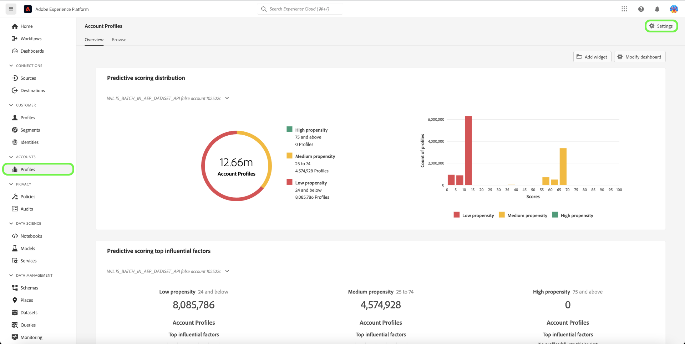

# Verwandte Konten in Real-Time CDP B2B Edition

## Übersicht {#overview}

B2B-Unternehmen haben häufig ihre Kundeninformationen in mehreren Systemen gespeichert, von denen jedes nur teilweise oder sogar widersprüchliche Daten für dieselbe reale Geschäftseinheit enthält. Dies stellt eine enorme Herausforderung dar, eine genaue Ansicht der Kunden zu erhalten und so die Effizienz und Effektivität ihrer B2B-Marketing- und Verkaufsaktivitäten zu reduzieren.

| ID | Name | Website | Branche | Land | Telefon | Hat eine Opportunity mit dem Wert > `$1 million` |
|---|---|---|---|---|---|---|
| 1 | Acme | acme.com | Software | CA | (408)536-6000 |   |
| 2 | Acme | acm.com | Software | CA | 4085366000 | x |
| 3 | Acme Inc |   |   | CA | (408)5366000 |   |
| 4 | Acme Consulting Service | `http://www.acme.com/consulting` | Technologieberatung | NY | (212)471-0904 | x |
| 5 | Acme IT |   |   | CA |   |   |

{style="table-layout:auto"}

mit den entsprechenden Konten, [!DNL Real-Time CDP B2B] zeigt Ihnen jetzt eine Liste von Konten an, die dem Konto, das Sie durchsuchen, ähnlich sind.

Verwenden Sie diese Funktion, um verwandte Kontoprofile für ein Kontoprofil in der Experience Platform-Benutzeroberfläche anzuzeigen und dann die zugehörigen Konten in Ihre Segmentdefinitionen aufzunehmen, um Ihre Reichweite zu erweitern oder umfassendere Kriterien in Ihren Zielgruppen anzuwenden.

## Aktivieren des zugehörigen Kontodienstes {#enable}

Um den Dienst zu aktivieren, wählen Sie **[!UICONTROL Profile]** in der Seitenleiste gefolgt von **[!UICONTROL Einstellungen]**.

Umschalten neben [!UICONTROL Zugehörige Konten aktivieren] , um den Dienst zu aktivieren, und wählen Sie dann **[!UICONTROL Speichern]**.

## Funktionsweise {#how-it-works}

Tägliche Aufträge für maschinelles Lernen verwenden einen hierarchischen Algorithmus, um ähnliche Kontoprofile basierend auf drei Faktoren in Gruppen zu gruppieren:

* Link zum übergeordneten Konto
* Webdomäne
* Kontoname

Nach einem erfolgreichen Verarbeitungsauftrag wird jedes Mitglied der Kontoprofilgruppe mit der Liste Zugehörige Konten markiert. Sie können die Liste im **Verwandte Konten** auf der Seite &quot;Kontoprofil&quot;ein und verwenden Sie die zugehörigen Konten in den Segmentdefinitionen.

Weitere Informationen zu den [Vorgänge im Zusammenhang mit der Profilanreicherung](/help/dataflows/ui/b2b/monitor-profile-enrichment.md).

## Darstellung verwandter Konten {#how-to-view}

Sie können zugehörige Konten für ein Konto, das Sie durchsuchen, in der Experience Platform-Benutzeroberfläche anzeigen.

Weitere Informationen zu den [Finden verwandter Konten in der Benutzeroberfläche](/help/rtcdp/accounts/account-profile-ui-guide.md#related-accounts-tab).

## Verwendung verwandter Konten {#how-to-use}

Sie können Konten und zugehörige Konten bei der Segmentierung verwenden. Die Entscheidung, ob verwandte Konten in Ihren Segmentdefinitionen verwendet werden sollen, hängt von Ihrem Marketing-Anwendungsfall ab. Sie können beispielsweise verwandte Konten für E-Mail-Marketing- oder Werbekampagnen verwenden, bei denen Sie im Austausch für eine größere Reichweite eine geringere Genauigkeit akzeptieren können.

Siehe [Segmentierungsbeispiel](/help/rtcdp/segmentation/b2b.md#related-accounts) , die verwandte Konten verwendet.
