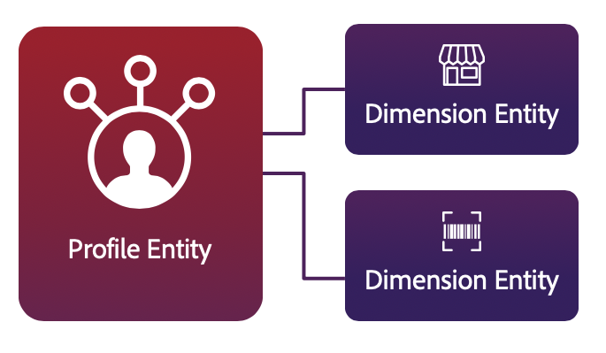

# Standardmäßige Limits für Real-time Customer Data Platform B2B Edition

>[!NOTE]
>
>Die in diesem Dokument beschriebenen Einschränkungen stellen die von Real-time Customer Data Platform B2B Edition aktivierten Änderungen dar. Für eine vollständige Liste der Standardbeschränkungen für Real-Time CDP B2B Edition kombinieren Sie diese Beschränkungen mit den allgemeinen Adobe Experience Platform-Beschränkungen, die im Abschnitt [Limits für die Dokumentation zu Echtzeit-Kundenprofil-Daten](../profile/guardrails.md).

Mit der Real-time Customer Data Platform B2B Edition können Sie personalisierte kanalübergreifende Erlebnisse bereitstellen, die auf verhaltensbezogenen Einblicken und Kundenattributen in Form von Echtzeit-Kundenprofilen und Kontoprofilen basieren. Um diesen neuen Ansatz bei Profilen zu unterstützen, verwendet Experience Platform ein stark denormalisiertes Hybrid-Datenmodell, das sich vom herkömmlichen relationalen Datenmodell unterscheidet.

Dieses Dokument enthält standardmäßige Verwendungs- und Ratenbeschränkungen, die Ihnen helfen, Ihre Daten für eine optimale Systemleistung zu modellieren. Bei der Überprüfung der folgenden Leitlinien wird davon ausgegangen, dass Sie die Daten korrekt modelliert haben. Wenden Sie sich bei Fragen zum Modellieren Ihrer Daten an Ihren Kundenbetreuer.

>[!INFO]
>
>Die meisten Kunden überschreiten diese Standardbeschränkungen nicht. Wenden Sie sich an Ihren Kundenbetreuer, wenn Sie mehr über benutzerdefinierte Beschränkungen erfahren möchten.

## Arten von Beschränkungen

In diesem Dokument gibt es zwei Arten von Standardbeschränkungen:

* **Weiche Grenze:** Es ist möglich, über eine weiche Grenze hinauszugehen, jedoch bieten weiche Grenzen eine empfohlene Richtlinie für die Systemleistung.

* **Harte Grenze:** Eine harte Grenze bietet ein absolutes Maximum.

>[!INFO]
>
>Die in diesem Dokument dargelegten Beschränkungen werden ständig verbessert. Achten Sie regelmäßig auf Updates. Wenden Sie sich an Ihren Kundenbetreuer, wenn Sie mehr über benutzerdefinierte Beschränkungen erfahren möchten.

## Datenmodellbeschränkungen

Die folgenden Leitlinien bieten empfohlene Beschränkungen bei der Modellierung von Echtzeit-Kundenprofildaten. Weitere Informationen zu primären Entitäten und Dimensionsentitäten finden Sie im Abschnitt zu [Entitätstypen](#entity-types) in der Anlage.

### Leitlinien für primäre Entitäten

>[!NOTE]
>
>Die in diesem Abschnitt beschriebenen Datenmodellbeschränkungen stellen die von Real-time Customer Data Platform B2B Edition aktivierten Änderungen dar. Für eine vollständige Liste der Standardbeschränkungen für Real-Time CDP B2B Edition kombinieren Sie diese Beschränkungen mit den allgemeinen Adobe Experience Platform-Beschränkungen, die im Abschnitt [Limits für die Dokumentation zu Echtzeit-Kundenprofil-Daten](../profile/guardrails.md).

| Beschränkung | Limit | Art von Limit | Beschreibung |
| --- | --- | --- | --- |
| Real-Time CDP B2B Edition Standard-XDM-Klassendatensätze | 60 | Weich | Es wird empfohlen, maximal 60 Datensätze zu verwenden, die die standardmäßigen Experience-Datenmodell (XDM)-Klassen von Real-Time CDP B2B Edition nutzen. Eine vollständige Liste der Standard-XDM-Klassen für B2B-Anwendungsfälle finden Sie im Abschnitt [Schemata in der Dokumentation zu Real-Time CDP B2B Edition](schemas/b2b.md).   *Hinweis: Aufgrund der Beschaffenheit des denormalisierten Hybrid-Datenmodells von Experience Platform überschreiten die meisten Kunden diese Grenze nicht. Wenden Sie sich an Ihren Kundenbetreuer, wenn Sie Fragen zur Datenmodellierung haben oder mehr über benutzerdefinierte Limits erfahren möchten.* |
| Alte Beziehungen mit mehreren Entitäten | 20 | Weich | Es werden maximal 20 Beziehungen mit mehreren Entitäten empfohlen, die in primären Entitäten oder Dimensionsentitäten definiert sind. Zusätzliche Beziehungszuordnungen sollten erst vorgenommen werden, wenn eine vorhandene Beziehung entfernt oder deaktiviert wurde. |
| Viele-zu-eins-Beziehungen pro XDM-Klasse | 2 | Weich | Es wird empfohlen, pro XDM-Klasse maximal zwei Viele-zu-eins-Beziehungen zu definieren. Zusätzliche Beziehungen sollten erst dann hergestellt werden, wenn eine vorhandene Beziehung entfernt oder deaktiviert wurde. Anweisungen zum Erstellen einer Beziehung zwischen zwei Schemas finden Sie im Tutorial zum [Erstellen von B2B-Schemabeziehungen](../xdm/tutorials/relationship-b2b.md). |

### Leitlinien für Dimensionsentitäten

>[!NOTE]
>
>Die in diesem Abschnitt beschriebenen Datenmodellbeschränkungen stellen die von Real-time Customer Data Platform B2B Edition aktivierten Änderungen dar. Für eine vollständige Liste der Standardbeschränkungen für Real-Time CDP B2B Edition kombinieren Sie diese Beschränkungen mit den allgemeinen Adobe Experience Platform-Beschränkungen, die im Abschnitt [Limits für die Dokumentation zu Echtzeit-Kundenprofil-Daten](../profile/guardrails.md).

| Beschränkung | Limit | Art von Limit | Beschreibung |
| --- | --- | --- | --- |
| Keine verschachtelten Legacy-Beziehungen | 0 | Weich | Sie sollten keine Beziehung zwischen zwei Nicht-[!DNL XDM Individual Profile]-Schemas erstellen. Die Möglichkeit, Beziehungen zu erstellen, wird für keine Schemas empfohlen, die nicht Teil des einheitlichen [!DNL Profile]-Schemas sind. |
| Nur B2B-Objekte können Teil von Viele-zu-eins-Beziehungen sein | 0 | Hart | Das System unterstützt nur Viele-zu-Eins-Beziehung zwischen B2B-Objekten. Weiterführende Informationen zu Viele-zu-Eins-Beziehungen finden Sie im Tutorial zum [Definieren von B2B-Schemabeziehungen](../xdm/tutorials/relationship-b2b.md). |
| Maximale Tiefe verschachtelter Beziehungen zwischen B2B-Objekten | 3 | Hart | Die maximale Tiefe verschachtelter Beziehungen zwischen B2B-Objekten beträgt 3. Das bedeutet, dass Sie in einem hochverschachtelten Schema keine Beziehung zwischen B2B-Objekten haben sollten, die mehr als drei Ebenen tief verschachtelt sind. |

## Datengrößenbeschränkungen

In den folgenden Leitlinien erhalten Sie Informationen zur Datengröße und zu empfohlenen Beschränkungen für Daten, um eine problemlose Aufnahme, Speicherung und Abfrage zu gewährleisten. Weitere Informationen zu primären Entitäten und Dimensionsentitäten finden Sie im Abschnitt zu [Entitätstypen](#entity-types) in der Anlage.

>[!INFO]
>
>Die Datengröße wird an den unkomprimierten Daten in JSON zum Zeitpunkt der Aufnahme gemessen.

### Leitlinien für primäre Entitäten

>[!NOTE]
>
>Die in diesem Abschnitt beschriebenen Datengrößenbeschränkungen stellen die von Real-time Customer Data Platform B2B Edition aktivierten Änderungen dar. Für eine vollständige Liste der Standardbeschränkungen für Real-Time CDP B2B Edition kombinieren Sie diese Beschränkungen mit den allgemeinen Adobe Experience Platform-Beschränkungen, die im Abschnitt [Limits für die Dokumentation zu Echtzeit-Kundenprofil-Daten](../profile/guardrails.md).

| Beschränkung | Limit | Art von Limit | Beschreibung |
| --- | --- | --- | --- |
| Batches, die pro XDM-Klasse pro Tag aufgenommen werden | 45 | Weich | Die Gesamtanzahl der täglich pro XDM-Klasse aufgenommenen Batches sollte 45 nicht überschreiten. Die Aufnahme zusätzlicher Batches kann die optimale Leistungsfähigkeit verringern. |

### Leitlinien für Dimensionsentitäten

>[!NOTE]
>
>Die in diesem Abschnitt beschriebenen Datengrößenbeschränkungen stellen die von Real-time Customer Data Platform B2B Edition aktivierten Änderungen dar. Für eine vollständige Liste der Standardbeschränkungen für Real-Time CDP B2B Edition kombinieren Sie diese Beschränkungen mit den allgemeinen Adobe Experience Platform-Beschränkungen, die im Abschnitt [Limits für die Dokumentation zu Echtzeit-Kundenprofil-Daten](../profile/guardrails.md).

| Beschränkung | Limit | Art von Limit | Beschreibung |
| --- | --- | --- | --- |
| Gesamtgröße für alle dimensionalen Entitäten | 5 GB | Weich | Die empfohlene Gesamtgröße für alle dimensionalen Entitäten beträgt 5 GB. Die Aufnahme großer Dimensionsentitäten kann die Systemleistung beeinträchtigen. Es wird beispielsweise nicht empfohlen, einen 10 GB großen Produktkatalog als Dimensionsentität zu laden. |
| Datensätze pro Dimensionsentitätsschema | 5 | Weich | Es wird empfohlen, maximal 5 Datensätze mit jedem Dimensionsschema zu verknüpfen. Wenn Sie beispielsweise ein Schema für „Produkte“ erstellen und fünf beitragende Datensätze hinzufügen, sollten Sie keinen sechsten Datensatz erstellen, der mit dem Produktschema verknüpft ist. |
| Dimensionsentitäts-Batches, die pro Tag aufgenommen werden | 4 pro Entität | Weich | Die empfohlene maximale Anzahl von Dimensionsentitäts-Batches, die pro Tag aufgenommen werden, beträgt 4 pro Entität. Sie können beispielsweise Aktualisierungen an einem Produktkatalog bis zu 4-mal täglich aufnehmen. Die Aufnahme zusätzlicher Dimensionsentitäts-Batches für dieselbe Entität kann sich auf die Systemleistung auswirken. |

## Leitlinien für die Segmentierung

Die in diesem Abschnitt beschriebenen Leitlinien beziehen sich auf die Anzahl und Beschaffenheit der Segmente, die ein Unternehmen in Experience Platform erstellen kann, sowie auf die Zuordnung von Segmenten zu Zielen bzw. ihre Aktivierung für Ziele.

>[!NOTE]
>
>Die in diesem Abschnitt beschriebenen Segmentierungsbeschränkungen stellen die von Real-time Customer Data Platform B2B Edition aktivierten Änderungen dar. Für eine vollständige Liste der Standardbeschränkungen für Real-Time CDP B2B Edition kombinieren Sie diese Beschränkungen mit den allgemeinen Adobe Experience Platform-Beschränkungen, die im Abschnitt [Limits für die Dokumentation zu Echtzeit-Kundenprofil-Daten](../profile/guardrails.md).

| Beschränkung | Limit | Art von Limit | Beschreibung |
| --- | --- | --- | --- |
| Segmente pro B2B-Sandbox | 400 | Weich | Eine Organisation kann insgesamt über mehr als 400 Segmente verfügen, sofern in jeder einzelnen B2B-Sandbox weniger als 400 Segmente vorhanden sind. Der Versuch, zusätzliche Segmente zu erstellen, kann sich auf die Systemleistung auswirken. |

## Nächste Schritte

Die in diesem Dokument beschriebenen Einschränkungen stellen die von Real-time Customer Data Platform B2B Edition aktivierten Änderungen dar. Für eine vollständige Liste der Standardbeschränkungen für Real-Time CDP B2B Edition kombinieren Sie diese Beschränkungen mit den allgemeinen Adobe Experience Platform-Beschränkungen, die im Abschnitt [Limits für die Dokumentation zu Echtzeit-Kundenprofil-Daten](../profile/guardrails.md).

## Anhang

Dieser Abschnitt enthält zusätzliche Details zu den Limits in diesem Dokument.

### Entitätstypen

Das [!DNL Profile]-Datenspeichermodell besteht aus zwei Kernentitätstypen:

* **Primäre Entität:** Eine primäre Entität oder Profilentität führt Daten zu einer „Single Source of Truth“ für einen Kontakt zusammen. Diese einheitlichen Daten werden mithilfe einer so genannten „einheitlichen Ansicht“ dargestellt. Eine einheitliche Ansicht aggregiert die Felder aller Schemas, die dieselbe Klasse implementieren, in ein einziges einheitliches Schema. Das einheitliche Schema für [!DNL Real-time Customer Profile] ist ein denormalisiertes Hybrid-Datenmodell, das als Container für alle Profilattribute und Verhaltensereignisse fungiert.

   Zeitunabhängige Attribute, auch „Datensatzdaten “genannt, werden mithilfe von [!DNL XDM Individual Profile] modelliert, während die auch als „Ereignisdaten“ bezeichneten Zeitreihendaten mit [!DNL XDM ExperienceEvent] modelliert werden. Wenn Datensatz- und Zeitreihendaten in Adobe Experience Platform aufgenommen werden, dient dies als Trigger für [!DNL Real-time Customer Profile], um mit der Aufnahme von Daten zu beginnen, die für diese Verwendung aktiviert wurden. Je mehr Interaktionen und Details erfasst werden, desto zuverlässiger werden die einzelnen Profile.

   

* **Dimensionsentität:** Während der Profildatenspeicher, in dem Profildaten verwaltet werden, kein relativer Speicher ist, ermöglicht das Profil die Integration mit kleinen Dimensionsentitäten, um Segmente auf vereinfachte und intuitive Weise zu erstellen. Diese Integration wird als [Segmentierung mehrerer Entitäten](../segmentation/multi-entity-segmentation.md) bezeichnet. Ihr Unternehmen kann auch XDM-Klassen definieren, um abgesehen von Einzelpersonen auch andere Dinge zu beschreiben, z. B. Geschäfte, Produkte oder Eigenschaften. Diese Nicht-[!DNL XDM Individual Profile]-Schemas werden als „Dimensionsentitäten“ bezeichnet und enthalten keine Zeitreihendaten. Dimensionsentitäten stellen Suchdaten bereit, die Segmentdefinitionen mit mehreren Entitäten unterstützen und vereinfachen. Sie müssen klein genug sein, damit die Segmentierungsmaschine den gesamten Datensatz in den Speicher laden kann, um eine optimale Verarbeitung zu gewährleisten (schnelle Punktsuche).

   
