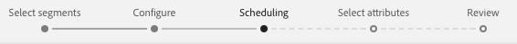

# Profile und Segmente für ein Ziel aktivieren

Aktivieren Sie die Daten, die in der Echtzeit-Kundendatenplattform von Adobe vorhanden sind, indem Sie Segmente Zielen zuordnen. Gehen Sie dazu wie folgt vor.

## Voraussetzungen  {#prerequisites}

Um Daten für Ziele aktivieren zu können, müssen Sie eine erfolgreiche [Verbindung zu einem Ziel](/help/rtcdp/destinations/connect-destination.md) hergestellt haben. Wenn Sie das noch nicht getan haben, navigieren Sie zum [Zielkatalog](/help/rtcdp/destinations/destinations-catalog.md), durchsuchen Sie die unterstützten Ziele und richten Sie ein oder mehrere Ziele ein.

## Daten aktivieren {#activate-data}

Die Schritte im Arbeitsablauf zum Aktivieren unterscheiden sich geringfügig von den Zieltypen. Der vollständige Arbeitsablauf für alle Zieltypen wird nachfolgend beschrieben.

### Wählen Sie das Ziel aus, für das die Daten aktiviert werden sollen {#select-destination}

Gilt für: Alle Ziele

1. Navigieren Sie in der CDP-Benutzeroberfläche &quot;Adobe in Echtzeit&quot;zu **[!UICONTROL Ziele]** > **[!UICONTROL Durchsuchen]**und wählen Sie das Ziel aus, an dem Sie Ihre Segmente aktivieren möchten.
   
2. Klicken Sie auf den Namen des Ziels. Dadurch gelangen Sie zum Arbeitsablauf für die Aktivierung.
   
Note that if an activation workflow already exists for a destination, you can see the segments that are currently being activated to the destination. Wählen Sie in der rechten Leiste die Option **[!UICONTROL Aktivierung bearbeiten]** und führen Sie die unten beschriebenen Schritte aus, um die Aktivierungsdetails zu ändern.
3. Select **[!UICONTROL Activate]**.

<br> 

### **[!UICONTROL Schritt Segmente]** auswählen {#select-segments}

Gilt für: Alle Ziele


In the **[!UICONTROL Activate destination]** workflow, on the **[!UICONTROL Select Segments]** page, select one or more segments to activate to the destination. Klicken Sie auf **[!UICONTROL Weiter]** , um mit dem nächsten Schritt fortzufahren.


<br> 

### **[!UICONTROL Schritt zur]** Identitätszuordnung {#identity-mapping}


Gilt für: Social-Ziele und Werbeziel Google-Kunden-Übereinstimmung

Bei *Social-Zielen* können Sie im Schritt zur **[!UICONTROL Identitätszuordnung]** Quellattribute auswählen, die als Zielgruppen-Identitäten im Ziel zugeordnet werden sollen. Dieser Schritt ist entweder optional oder obligatorisch, je nachdem, welche primäre Identität Sie im Schema verwenden. <br> 

*E-Mail-Adresse als primäre Identität*: Wenn Sie die E-Mail-Adresse als primäre Identität in Ihrem Schema verwenden, können Sie den Schritt für die Identitätszuordnung überspringen, wie nachfolgend gezeigt:


<br> 

*Eine weitere ID als primäre Identität*: Wenn Sie eine andere ID wie *Belohnungs-ID* oder *Loyalität-ID* als primäre Identität in Ihrem Schema verwenden, müssen Sie die E-Mail-Adresse aus Ihrem Identitäts-Schema manuell als Zielgruppen-ID im Social-Ziel zuordnen, wie nachfolgend gezeigt:


Select `Email_LC_SHA256` as target identity if you hashed customer email addresses on data ingestion into Adobe Experience Platform, according to [!DNL Facebook] [email hashing requirements](/help/rtcdp/destinations/facebook-destination.md#email-hashing-requirements). <br> Select `Email` as target identity if the email addresses you are using are not hashed. Adobe Echtzeit-CDP-Dateien werden die E-Mail-Adressen mit Hashing versehen, um die [!DNL Facebook] Anforderungen zu erfüllen.


<br> 

### **[!UICONTROL Konfigurieren]** des Schritts {#configure}

Gilt für: E-Mail-Marketing-Ziele und Cloud-Datenspeicherung-Ziele


 Dieser Schritt ist optional. Im Schritt **[!UICONTROL Konfigurieren]** können Sie die Dateinamen für jedes Segment konfigurieren, das Sie exportieren. Die Standarddateinamen bestehen aus dem Zielnamen, der Segment-ID und einer Datums- und Zeitanzeige. Sie können beispielsweise die Namen der exportierten Dateien bearbeiten, um zwischen verschiedenen Kampagnen zu unterscheiden, oder um die Datenexportzeit an die Dateien anhängen zu lassen.

Wählen Sie **[!UICONTROL Weiter]** , um die Standarddateinamen zu verwenden, oder klicken Sie auf das Stiftsymbol, um ein modales Fenster zu öffnen und die Dateinamen zu bearbeiten. Beachten Sie, dass Dateinamen auf 255 Zeichen begrenzt sind.


Im Dateinameneditor können Sie verschiedene Komponenten auswählen, die dem Dateinamen hinzugefügt werden sollen. Der Zielname und die Segment-ID können nicht aus den Dateinamen entfernt werden. Darüber hinaus können Sie Folgendes hinzufügen:

* **[!UICONTROL Segmentname]**: Sie können den Segmentnamen an den Dateinamen anhängen.
* **[!UICONTROL Datum und Uhrzeit]**: Wählen Sie zwischen dem Hinzufügen eines `MMDDYYYY_HHMMSS` Formats oder eines 10-stelligen Unix-Zeitstempels für den Zeitpunkt der Erstellung der Dateien. Wählen Sie eine dieser Optionen aus, wenn für Ihre Dateien bei jedem inkrementellen Export ein dynamischer Dateiname generiert werden soll.
* **[!UICONTROL Benutzerdefinierter Text]**: hinzufügen benutzerdefinierter Text in die Dateinamen.

Wählen Sie Änderungen **[!UICONTROL anwenden]** , um Ihre Auswahl zu bestätigen.

>[!IMPORTANT]
> 
>Wenn Sie die **[!UICONTROL Datums- und Uhrzeitkomponente]** nicht auswählen, sind die Dateinamen statisch und die neue Exportdatei überschreibt bei jedem Export die vorherige Datenspeicherung im Speicherort. Bei der Ausführung eines wiederkehrenden Importauftrags von einer Datenspeicherung in eine E-Mail-Marketingplattform wird diese Option empfohlen.


<br> 

### **[!UICONTROL Segment Schedule]** step {#segment-schedule}

Gilt für: Werbeziele, soziale Ziele


On the **[!UICONTROL Segment schedule]** page, you can set the start date for sending data to the destination, as well as the frequency of sending data to the destination.

>[!IMPORTANT]
>
>Für Ziele in sozialen Netzwerken müssen Sie in diesem Schritt die Herkunft Ihrer Zielgruppe auswählen. Sie können mit dem nächsten Schritt erst fortfahren, nachdem Sie eine der Optionen in der folgenden Abbildung ausgewählt haben.


<br> 

### **[!UICONTROL Scheduling]** step {#scheduling}

Applies to: email marketing destinations and cloud storage destinations



On the **[!UICONTROL Scheduling]** page, you can see the start date for sending data to the destination as well as the frequency of sending data to the destination. These values cannot be edited.

<br> 

### **[!UICONTROL Select attributes]** step {#select-attributes}

Applies to: email marketing destinations and cloud storage destinations


On the **[!UICONTROL Select Attributes]** page, select **[!UICONTROL Add new field]** and select the attributes that you want to send to the destination.

>[!NOTE]
>
> Adobe Real-time CDP prefills your selection with four recommended, commonly-used attributes from your schema: `person.name.firstName`, `person.name.lastName`, `personalEmail.address`, `segmentMembership.status`.

File exports will vary as follows, depending on whether `segmentMembership.status` is selected:
* Wenn das `segmentMembership.status` Feld ausgewählt ist, enthalten exportierte Dateien **aktive** Mitglieder in den ersten vollständigen Schnappschuss sowie **aktive** und **abgelaufene** Mitglieder in nachfolgenden inkrementellen Exporten.
* Wenn das `segmentMembership.status` Feld nicht ausgewählt ist, enthalten exportierte Dateien nur **aktive** Mitglieder im ersten vollständigen Schnappschuss und in nachfolgenden inkrementellen Exporten.


We recommend one of the attributes to be a [unique identifier](/help/rtcdp/destinations/email-marketing-destinations.md#identity) from your schema. Weiterführende Informationen zu obligatorischen Attributen finden Sie unter „Identität“ im Artikel [E-Mail-Marketing-Ziele](/help/rtcdp/destinations/email-marketing-destinations.md#identity).

>[!NOTE]
> 
>Wenn Datenverwendungsbeschriftungen auf bestimmte Felder in einem Datensatz angewendet wurden (und nicht auf den gesamten Datensatz), erfolgt die Durchsetzung dieser Beschriftungen auf Feldebene bei der Aktivierung unter folgenden Bedingungen:
>* Die Felder werden in der Segmentdefinition verwendet.
>* Die Felder sind als projizierte Attribute für das Ziel der Zielgruppe konfiguriert.

>
> 
Betrachten Sie den Screenshot unten. Wenn das Feld beispielsweise bestimmte Beschriftungen für die Datenverwendung enthält, die mit dem Marketing-Verwendungsfall des Ziels kollidieren, wird Ihnen im Review-Schritt (Schritt 9) eine Verletzung der Datenverwendungsrichtlinie angezeigt. `person.name.firstName` Weitere Informationen finden Sie unter [Datenverwaltung in Echtzeit-CDP](/help/rtcdp/privacy/data-governance-overview.md#destinations).


<br> 

### **[!UICONTROL Schritt überprüfen]** {#review}

Gilt für: alle Ziele


Auf der Seite **[!UICONTROL Überprüfen]** können Sie eine Zusammenfassung Ihrer Auswahl sehen. Wählen Sie **[!UICONTROL Abbrechen]**, um den Fluss abzubrechen, **[!UICONTROL Zurück]**, um die Einstellungen zu ändern, oder **[!UICONTROL Fertig stellen]**, um Ihre Auswahl zu bestätigen und mit dem Senden von Daten an das Ziel zu beginnen.

>[!IMPORTANT]
>
>In diesem Schritt sucht CDP in Echtzeit nach Verstößen gegen die Datenverwendungsrichtlinie. Unten sehen Sie ein Beispiel, bei dem eine Richtlinie verletzt wird. Sie können den Segmentarbeitsablauf erst dann abschließen, wenn Sie die Aktivierung gelöst haben. Informationen zum Beheben von Richtlinienverletzungen finden Sie unter [Richtliniendurchsetzung](/help/rtcdp/privacy/data-governance-overview.md#enforcement) im Abschnitt zur Datenverwaltung.


Wenn keine Richtlinienverletzungen festgestellt wurden, wählen Sie **[!UICONTROL Fertig stellen]** , um Ihre Auswahl zu bestätigen und den Beginn, der Daten an das Ziel sendet, zu bestätigen.


## Aktivierung bearbeiten {#edit-activation}

Gehen Sie wie folgt vor, um vorhandene Aktivierungsflüsse in der Echtzeit-Kundendatenplattform zu bearbeiten:

1. Wählen Sie in der linken Navigationsleiste **[!UICONTROL Ziele]**, klicken Sie dann auf die Registerkarte **[!UICONTROL Durchsuchen]** und klicken Sie auf den Zielnamen.
2. Wählen Sie in der rechten Leiste **[!UICONTROL Aktivierung bearbeiten]**, um zu ändern, welche Segmente an das Ziel gesendet werden.

## Überprüfen, ob die Segmentaktivierung erfolgreich war {#verify-activation}

### E-Mail-Marketing-Ziele  und Cloud-Speicher-Ziele {#esp-and-cloud-storage}

Bei E-Mail-Marketing- und Cloud-Speicher-Zielen erstellt die Echtzeit-Kundendatenplattform von Adobe eine tabulatorgetrennte `.csv`- oder `.txt`-Datei am von Ihnen angegebenen Speicherort. An diesem Speicherort wird täglich eine neue Datei erstellt. The default file format is:
`<destinationName>_segment<segmentID>_<timestamp-yyyymmddhhmmss>.csv|txt`

Beachten Sie, dass Sie das Dateiformat bearbeiten können. Weitere Informationen finden Sie unter Ziele für Cloud-Datenspeicherung und E-Mail-Marketing-Ziele [konfigurieren](/help/rtcdp/destinations/activate-destinations.md#configure) .

Beim standardmäßigen Dateiformat könnten die Dateien, die Sie an drei aufeinander folgenden Tagen erhalten würden, wie folgt aussehen:

```
Salesforce_Marketing_Cloud_segment12341e18-abcd-49c2-836d-123c88e76c39_20200408061804.csv
Salesforce_Marketing_Cloud_segment12341e18-abcd-49c2-836d-123c88e76c39_20200409052200.csv
Salesforce_Marketing_Cloud_segment12341e18-abcd-49c2-836d-123c88e76c39_20200410061130.csv
```

Das Vorhandensein dieser Dateien an Ihrem Speicherort bestätigt die erfolgreiche Aktivierung. Um zu verstehen, wie die exportierten Dateien strukturiert sind, können Sie eine .csv-Beispieldatei [herunterladen](assets/sample_export_file_segment12341e18-abcd-49c2-836d-123c88e76c39_20200408061804.csv). This sample file includes the profile attributes `person.firstname`, `person.lastname`, `person.gender`, `person.birthyear`, and `personalEmail.address`.

### Werbeziele

Check your account in the respective advertising destination that you are activating your data to. Wenn die Aktivierung erfolgreich war, werden in Ihrer Werbeplattform Zielgruppen ausgefüllt.

### Ziele in sozialen Netzwerken

For [!DNL Facebook], a successful activation means that a [!DNL Facebook] custom audience would be created programmatically in [[!UICONTROL Facebook Ads Manager]](https://www.facebook.com/adsmanager/manage/). Segmentmitgliedschaft in der Zielgruppe wird hinzugefügt und entfernt, wenn Anwender für die aktivierten Segmente qualifiziert oder disqualifiziert werden.

>[!TIP]
>
>The integration between Adobe Real-time CDP and [!DNL Facebook] supports historical audience backfills. All historical segment qualifications get sent to [!DNL Facebook] when you activate the segments to the destination.

## Aktivierung deaktivieren {#disable-activation}

Gehen Sie wie folgt vor, um einen vorhandenen Aktivierungsfluss zu deaktivieren:

1. Wählen Sie in der linken Navigationsleiste **[!UICONTROL Ziele]**, klicken Sie dann auf die Registerkarte **[!UICONTROL Durchsuchen]** und klicken Sie auf den Zielnamen.
2. Klicken Sie in der rechten Leiste auf das Steuerelement **[!UICONTROL Aktiviert]**, um den Status des Aktivierungsflusses zu ändern.
3. Wählen Sie im Fenster **Datenflussstatus aktualisieren** die Option **Bestätigen**, um den Aktivierungsfluss zu deaktivieren.
