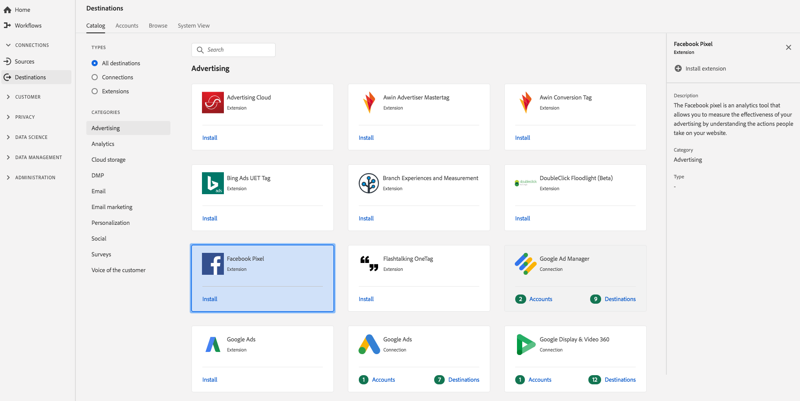

# [!DNL Facebook Pixel]-Erweiterung {#facebook-pixel-extension}

## Übersicht {#overview}

The [!DNL Facebook Pixel] is an analytics tool that allows you to measure the effectiveness of your advertising by understanding the actions people take on your website.

[!DNL Facebook Pixel] ist eine Werbeerweiterung in der Adobe Echtzeit-Kundendatenplattform. Weiterführende Informationen zur Erweiterungsfunktion finden Sie auf der [Facebook-Pixel-Website](https://developers.facebook.com/docs/facebook-pixel/).

Dieses Ziel ist eine Experience Platform Launch-Erweiterung. Weitere Informationen zur Funktionsweise von Launch-Erweiterungen in der Echtzeit-Kundendatenplattform von Adobe finden Sie unter [Experience Platform Launch-Erweiterungen – Übersicht](/help/rtcdp/destinations/experience-platform-launch-extensions.md).

## Voraussetzungen  {#prerequisites}

This extension is available in the [!DNL Destinations] catalog for all customers who have purchased Adobe Real-time CDP.

Um diese Erweiterung verwenden zu können, benötigen Sie Zugriff auf Experience Platform Launch. Experience Platform Launch ist für Adobe Experience Cloud-Kunden als integrierte, Mehrwert bietende Funktion verfügbar. Wenden Sie sich an den Administrator Ihres Unternehmens, um Zugriff auf Launch zu erhalten. Bitten Sie ihn, Ihnen die Berechtigung **[!UICONTROL manage_properties]** zu erteilen, damit Sie Erweiterungen installieren können.

## Installieren einer Erweiterung {#install-extension}

So installieren Sie die [!DNL Facebook Pixel] Erweiterung:

1. In the [Adobe Real-time CDP interface](http://platform.adobe.com/), go to **[!UICONTROL Destinations]** > **[!UICONTROL Catalog]**.
2. Wählen Sie die Erweiterung aus dem Katalog aus oder verwenden Sie die Suchleiste.
3. Click on the destination to highlight it, then select **[!UICONTROL Configure]** in the right rail. If the **[!UICONTROL Configure]** control is greyed out, you are missing the **[!UICONTROL manage_properties]** permission. Siehe [Voraussetzungen](#prerequisites).
4. Wählen Sie im Fenster **[!UICONTROL Verfügbare Launch-Eigenschaft auswählen]** die Launch-Eigenschaft aus, in der Sie die Erweiterung installieren möchten. Sie können auch eine neue Eigenschaft in Launch erstellen. Eine Eigenschaft ist eine Sammlung von Regeln, Datenelementen, konfigurierten Erweiterungen, Umgebungen und Bibliotheken. Informationen zu Eigenschaften finden Sie im [Eigenschaften-Seitenabschnitt](https://docs.adobe.com/content/help/de-DE/launch/using/reference/admin/companies-and-properties.html#property-seite) der Launch-Dokumentation.
5. Der Workflow leitet Sie an Launch weiter, um die Installation abzuschließen.

Sie können die Erweiterung auch direkt in der [Benutzeroberfläche von Experience Platform Launch](https://launch.adobe.com/) installieren. Siehe [Hinzufügen einer neuen Erweiterung](https://docs.adobe.com/content/help/de-DE/launch/using/reference/manage-resources/extensions/overview.html#add-a-new-extension) in der Launch-Dokumentation.

## Verwenden der Erweiterung {#how-to-use}

Sobald Sie die Erweiterung installiert haben, können Sie direkt in Launch Regeln für die Erweiterung einrichten.

In Launch können Sie Regeln für Ihre installierten Erweiterungen einrichten, damit nur in bestimmten Situationen Ereignisdaten an das Erweiterungsziel gesendet werden. Weitere Informationen zum Einrichten von Regeln für Erweiterungen finden Sie in der [Regeldokumentation](https://docs.adobe.com/help/de-DE/launch/using/reference/manage-resources/rules.html).

## Konfigurieren, Aktualisieren und Löschen von Erweiterungen {#configure-upgrade-delete}

Sie können Erweiterungen in der Benutzeroberfläche von Launch konfigurieren, aktualisieren und löschen.

>[!TIP]
>
>Wenn die Erweiterung bereits in einer Ihrer Eigenschaften installiert ist, wird in der Benutzeroberfläche der Echtzeit-Kundendatenplattform von Adobe weiterhin **[!UICONTROL Installieren]** für die Erweiterung angezeigt. Starten Sie den Installations-Workflow, wie unter [Installieren einer Erweiterung](#install-extension) beschrieben, um zu Launch zu wechseln und Ihre Erweiterung zu konfigurieren oder zu löschen.

Informationen zum Aktualisieren Ihrer Erweiterung finden Sie unter [Erweiterungs-Upgrade](https://docs.adobe.com/content/help/de-DE/launch/using/reference/manage-resources/extensions/extension-upgrade.html) in der Launch-Dokumentation.
