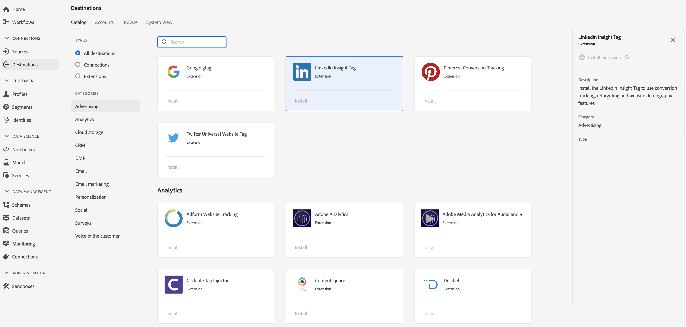

# [!DNL LinkedIn Insight Tag] Erweiterung {#linkedin-insights-extension}

## Übersicht {#overview}

Install the [!DNL LinkedIn Insight Tag] to use conversion tracking, retargeting and website demographics features.

[!DNL LinkedIn Insight Tag] ist eine Werbeerweiterung in der Adobe Echtzeit-Kundendatenplattform. Weiterführende Informationen zur Erweiterungsfunktion finden Sie unter [LinkedIn Insight-Tag](https://business.linkedin.com/de-de/marketing-solutions/insight-tag).

Dieses Ziel ist eine Adobe Experience Platform Launch-Erweiterung. For more information about how Platform Launch extensions work in Adobe Real-time CDP, see [Adobe Experience Platform Launch extensions overview](/help/rtcdp/destinations/experience-platform-launch-extensions.md).

## Voraussetzungen  {#prerequisites}

This extension is available in the [!DNL Destinations] catalog for all customers who have purchased Adobe Real-time CDP.

Um diese Erweiterung verwenden zu können, benötigen Sie Zugriff auf Adobe Experience Platform Launch.  Platform Launch ist für Adobe Experience Cloud-Kunden als integrierte, Mehrwert bietende Funktion verfügbar. Contact your organization administrator to get access to Platform Launch and ask them to grant you the **[!UICONTROL manage_properties]** permission so you can install extensions.

## Installieren einer Erweiterung {#install-extension}

So installieren Sie die [!DNL LinkedIn Insight Tag] Erweiterung:

1. In the [Adobe Real-time CDP interface](http://platform.adobe.com/), go to **[!UICONTROL Destinations]** > **[!UICONTROL Catalog]**.
2. Wählen Sie die Erweiterung aus dem Katalog aus oder verwenden Sie die Suchleiste.
3. Click on the destination to highlight it, then select **[!UICONTROL Configure]** in the right rail. If the **[!UICONTROL Configure]** control is greyed out, you are missing the **[!UICONTROL manage_properties]** permission. Siehe [Voraussetzungen](#prerequisites).
4. In the **[!UICONTROL Select available Platform Launch property]** window, select the Platform Launch property in which you want to install the extension. Sie haben auch die Möglichkeit, eine neue Eigenschaft in Platform Launch zu erstellen. Eine Eigenschaft ist eine Sammlung von Regeln, Datenelementen, konfigurierten Erweiterungen, Umgebungen und Bibliotheken. Learn about properties in the [Properties page section](https://docs.adobe.com/content/help/de-DE/launch/using/reference/admin/companies-and-properties.html#property-seite) of the Platform Launch documentation.
5. Der Arbeitsablauf führt Sie zum Plattformstart, um die Installation abzuschließen.

Informationen zu den Konfigurationsoptionen und zur Installationsunterstützung von Erweiterungen finden Sie unter [LinkedIn Insight-Tag](https://business.linkedin.com/de-de/marketing-solutions/insight-tag).

You can also install the extension directly in the [Adobe Experience Platform Launch interface](https://launch.adobe.com/). See [Add a new extension](https://docs.adobe.com/content/help/de-DE/launch/using/reference/manage-resources/extensions/overview.html#add-a-new-extension) in the Platform Launch documentation.

## Verwenden der Erweiterung {#how-to-use}

Nachdem Sie die Erweiterung installiert haben, können Sie Beginn zum Einrichten von Regeln für diese Erweiterung direkt in Platform Launch einrichten.

Unter &quot;Plattformstart&quot;können Sie Regeln für Ihre installierten Erweiterungen einrichten, um nur in bestimmten Situationen Ereignis-Daten an das Erweiterungsziel zu senden. Weitere Informationen zum Einrichten von Regeln für Erweiterungen finden Sie in der [Regeldokumentation](https://docs.adobe.com/help/de-DE/launch/using/reference/manage-resources/rules.html).

## Konfigurieren, Aktualisieren und Löschen von Erweiterungen {#configure-upgrade-delete}

Sie können Erweiterungen in der Benutzeroberfläche &quot;Plattformstart&quot;konfigurieren, aktualisieren und löschen.

>[!TIP]
>
>Wenn die Erweiterung bereits in einer Ihrer Eigenschaften installiert ist, wird in der Benutzeroberfläche der Echtzeit-Kundendatenplattform von Adobe weiterhin **[!UICONTROL Installieren]** für die Erweiterung angezeigt. Kick off the installation workflow as described in [Install extension](#install-extension) to get to Platform Launch and configure or delete your extension.

To upgrade your extension, see [Extension upgrade](https://docs.adobe.com/content/help/de-DE/launch/using/reference/manage-resources/extensions/extension-upgrade.html) in the Platform Launch documentation.
