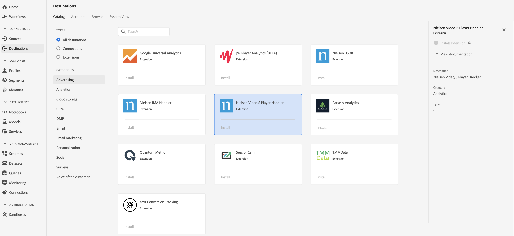

# [!DNL Nielsen VideoJS Player Handler] Erweiterung {#nielsen-vjs-extension}

## Übersicht {#overview}

[!DNL Nielsen Digital SDK] Messung der Audience von Angeboten mit der Erweiterung über die folgenden Digitalmessprodukte:

DCR: Eine Messlösung, die eine tägliche Messung von nicht-linearen digitalen Inhalten einschließlich Inhalten mit Anzeigen ermöglicht; erlaubt eine umfassende Ansicht des Verbrauchs an digitalen Inhalten von Desktop-, Mobil-, Tablet- und vernetzten Geräten in Audiences.

DTVR: Dies ermöglicht teilnehmenden Programmierquellen eine lineare Fernsehwiedergabe auf Desktop- und Mobilgeräten. Das ist die erste Lösung, die eine Akkreditierung des MRC für ihren Beitrag zur Messung der Zuschauerzahlen von auf Computern und Mobilgeräten angesehenen Programmen erhalten hat.

[!DNL Nielsen VideoJS Player Handler] ist eine Analyseerweiterung in der Adobe Echtzeit-Kundendatenplattform. Weiterführende Informationen zur Erweiterungsfunktion finden Sie auf der Erweiterungsseite in [Adobe Exchange](https://exchange.adobe.com/experiencecloud.details.101361.nielsen-digital-sdk-extension.html).

Dieses Ziel ist eine Experience Platform Launch-Erweiterung. Weiterführende Informationen zur Funktionsweise von Launch-Erweiterungen in der Echtzeit-Kundendatenplattform von Adobe finden Sie unter [Übersicht über Experience Platform Launch-Erweiterungen](/help/rtcdp/destinations/experience-platform-launch-extensions.md).

## Voraussetzungen {#prerequisites}

This extension is available in the [!DNL Destinations] catalog for all customers who have purchased Adobe Real-time CDP.

Um die Erweiterung verwenden zu können, benötigen Sie Zugriff auf Experience Platform Launch. Experience Platform Launch ist für Adobe Experience Cloud-Kunden als inbegriffene, Mehrwert bietende Funktion verfügbar. Wenden Sie sich an den Administrator Ihrer Organisation, um Zugriff auf Launch zu erhalten, und bitten Sie ihn, Ihnen die Berechtigung **[!UICONTROL manage_properties]** zu erteilen, damit Sie Erweiterungen installieren können.

## Erweiterung installieren {#install-extension}

So installieren Sie die [!DNL Nielsen VideoJS Player Handler] Erweiterung:

1. Wechseln Sie in der [Benutzeroberfläche der Adobe Echtzeit-Kundendatenplattform](http://platform.adobe.com/) zu **[!UICONTROL Ziele > Katalog]**.
2. Wählen Sie die Erweiterung aus dem Katalog oder verwenden Sie die Suchleiste.
3. Klicken Sie auf das Ziel, um es zu markieren, und wählen Sie dann in der rechten Leiste **[!UICONTROL Erweiterung installieren]**. Wenn das Steuerelement **[!UICONTROL Erweiterung installieren]** ausgegraut ist, fehlt Ihnen die Berechtigung **[!UICONTROL manage_properties]**. Siehe [Voraussetzungen](#prerequisites).
4. Wählen Sie im Fenster **[!UICONTROL Verfügbare Launch-Eigenschaft auswählen]** die Launch-Eigenschaft aus, in der Sie die Erweiterung installieren möchten. Außerdem haben Sie die Möglichkeit, in Launch eine neue Eigenschaft zu erstellen. Eine Eigenschaft ist eine Sammlung von Regeln, Datenelementen, konfigurierten Erweiterungen, Umgebungen und Bibliotheken. Informationen zu Eigenschaften finden Sie im Abschnitt [Eigenschaftenseite](https://docs.adobe.com/content/help/de-DE/launch/using/reference/admin/companies-and-properties.html#Property-Seite) der Launch-Dokumentation.
5. Der Workflow führt Sie zu Launch, wo Sie die Installation abschließen.

Informationen zu den Konfigurationsoptionen für Erweiterungen und zur Installationsunterstützung finden Sie auf der [Nielsen Digital SDK-Seite in Adobe Exchange](https://exchange.adobe.com/experiencecloud.details.101361.nielsen-digital-sdk-extension.html).

Sie können die Erweiterung auch direkt in der [Experience Platform Launch-Oberfläche](https://launch.adobe.com/) installieren. Siehe [Hinzufügen einer neuen Erweiterung](https://docs.adobe.com/content/help/de-DE/launch/using/reference/manage-resources/extensions/overview.html#add-a-new-extension) in der Launch-Dokumentation.

## So verwenden Sie die Erweiterung {#how-to-use}

Nachdem Sie die Erweiterung installiert haben, können Sie direkt in Launch mit dem Einrichten von Regeln für diese Erweiterung beginnen.

In Launch können Sie Regeln für Ihre installierten Erweiterungen einrichten, um nur in bestimmten Situationen Ereignisdaten an das Erweiterungsziel zu senden. Weiterführende Informationen zum Einrichten von Regeln für Erweiterungen finden Sie in der [Dokumentation zu Regeln](https://docs.adobe.com/help/de-DE/launch/using/reference/manage-resources/rules.html).

## Erweiterung konfigurieren, aktualisieren und löschen {#configure-upgrade-delete}

Sie können Erweiterungen in der Launch-Benutzeroberfläche konfigurieren, aktualisieren und löschen.

>[!TIP]
>
>Wenn die Erweiterung bereits in einer Ihrer Eigenschaften installiert ist, wird in der Benutzeroberfläche der Adobe Echtzeit-Kundendatenplattform weiterhin **[!UICONTROL Installieren]** für die Erweiterung angezeigt. Starten Sie den Installationsvorgang, wie unter [Erweiterung installieren](#install-extension) beschrieben, um zu Launch zu wechseln und Ihre Erweiterung zu konfigurieren oder zu löschen.

Informationen zum Upgraden Ihrer Erweiterung finden Sie in der Launch-Dokumentation unter [Erweiterungs-Upgrade](https://docs.adobe.com/content/help/de-DE/launch/using/reference/manage-resources/extensions/extension-upgrade.html).