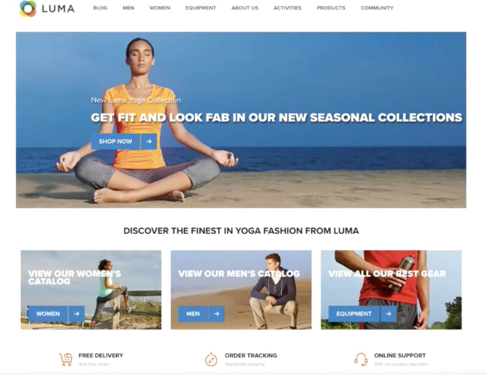
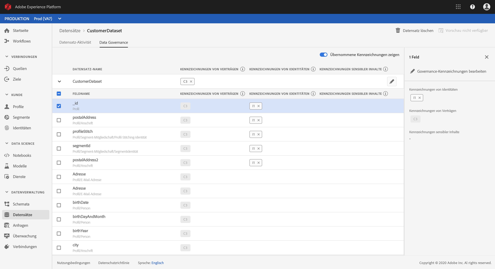
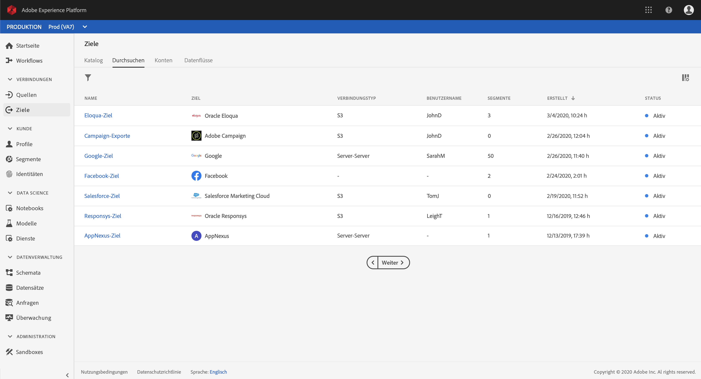

# Erste Schritte mit der Echtzeit-Kundendatenplattform von Adobe

Die ersten Schritte führen Sie durch eine Beispielimplementierung der Echtzeit-Kundendatenplattform von Adobe. Sie können sie bei der Einrichtung einer eigenen Implementierung als Muster verwenden. Zwar enthält das vorliegende Handbuch spezifische Beispiele, doch gibt es auch Links zu weiteren Informationen, die Sie bei der Einrichtung nutzen können.

Dieses Beispiel macht deutlich, welche Funktionen die Echtzeit-Kundendatenplattform von Adobe bietet, die auf Adobe Experience Platform basiert:

* Daten aus verschiedenen Quellen erfassen
* Zusammenführen zu einem [!DNL real-time customer profile]
* Ein konsistentes, relevantes und personalisiertes Erlebnis auf allen Geräten ermöglichen

## Anwendungsfall

Luma, ein Sportbekleidungsunternehmen, arbeitet kontinuierlich daran, sein Kundenerlebnis zu verbessern. Das Unternehmen verfügt über eine neue Initiative zur Steigerung der Geschenkumsätze. Außerdem soll übermäßige Kommunikation verringert werden (z. B. aufdringliche Anzeigen, die Kunden überall hin folgen).

Aktuell gibt das Unternehmen zu viel Geld für Medien aus, in denen immer wieder Artikel vorgestellt werden, die der Besucher sowieso nicht kaufen wird. Beispielsweise möchte Luma niemanden erneut wegen eines Artikels ansprechen, der als einmaliger Kauf für eine andere Person gedacht war.

Momentan sind die Daten von Luma auf verschiedene Quellen verteilt. Daher steht das Unternehmen vor großen Herausforderungen:

* Die Marketing-Abteilung muss mit verschiedenen Teams zusammenarbeiten, die jeweils für eine eigene Datenquelle verantwortlich sind (z. B. Website, App, Treuesysteme, CRM usw.).
* Wenn das Marketing-Team endlich Zugriff auf die Daten erhält, sind diese oft schon veraltet und für zeitsensible Kampagnen nicht mehr relevant.
* Es muss die Daten vereinheitlichen, damit diese auf Personen abzielen und nicht auf Kanäle.

Daher verfolgt Luma folgende Geschäftsziele:

* Erstellen einer einheitlichen Echtzeitansicht von Kunden auf Basis unterschiedlicher Datenquellen.
* Personalisieren von Marketing-Kampagnen mit relevanten Botschaften über verschiedene Kanäle und Geräte hinweg.

Um diese Ziele erreichen zu können, muss das Marketing-Team dazu in der Lage sein, Kundendaten in großem Umfang zu verwalten.

Mit der Echtzeit-Kundendatenplattform auf Basis von Adobe Experience Platform kann die Marketing-Abteilung von Luma folgende Ziele erreichen:

1. Erfassen von Daten aus unterschiedlichen Plattformen und Sicherstellen, dass diese später für andere Marketing-Aktivitäten verfügbar sind.
1. Einrichten einer zentralen Echtzeitansicht von Kunden, unabhängig davon, woher die Daten stammen.
1. Bereitstellen eines konsistenten, relevanten und personalisierten Erlebnisses an jedem Touchpoint.

## Schritte

Dieses Tutorial umfasst folgende Schritte:

1. [Kundenprofil](#customer-profile) erstellen.
1. Anwendererlebnis [personalisieren](#personalizing-the-user-experience).
1. [Verschiedene Datenquellen](#using-multiple-data-sources) verwenden.
1. [Datenquelle konfigurieren](#configuring-a-data-source).
1. [Daten erfassen](#bringing-the-data-together-for-a-specific-customer) für einen bestimmten Kunden.
1. [Segmente](#segments) einrichten.
1. [Ziele](#destinations) einrichten.
1. [Profil geräteübergreifend zusammenführen](#cross-device-identity-stitching).
1. [Profil analysieren](#analyzing-the-profile).

## Kundenprofil

Wenn Kunden Ihre Site zum ersten Mal besuchen, wissen Sie gar nichts über sie.



Bei der Navigation werden Daten in Echtzeit erfasst und nicht nur an eine Report Suite in Adobe Analytics gesendet, sondern auch direkt an Adobe Experience Platform. As data is collected, you begin to form a single view of the consumer, based on behavioral data in [!DNL Experience Platform's real-time customer profile].

Bei vielen Besuchern der Website handelt es sich wahrscheinlich um wiederkehrende Kunden, die zuvor bereits bei Luma gekauft haben.  Es ist wichtig, dass Luma Botschaften und Angebote personalisieren kann, um sowohl neue und wiederkehrende Besucher als auch bekannte Kunden anzusprechen.

### Erstbesuch eines neuen Kunden

Ein nicht identifizierter Besucher navigiert auf der Luma-Site beispielsweise zum Bereich „Herren“ und sieht sich Lauf-Shirts an.


As the customer clicks to learn more about these products, these product views are collected in Adobe Analytics and sent to [!DNL Experience Platform].

<!---->

Luma kann das Verhalten des Besuchers einem Nutzerprofil in Adobe Experience Platform zuordnen und damit beginnen, sich einen genaueren Überblick über das Verhalten des Kunden zu verschaffen.

### Detailliertere Ansicht des Kunden

Wenn der Kunde weiter mit der Website interagiert, ergibt sich nach und nach ein klareres Bild. Angenommen, der Besucher fügt dem Warenkorb ein Produkt hinzu und meldet sich an.

Bei der Anmeldung identifiziert sich der Kunde als Sarah Rose.


Zwei Identitäten werden zusammengeführt:

* die anonymen Browsing-Daten
* die vorhandenen Daten, die mit dem Konto von Sarah Rose verknüpft sind.

Both identies are combined into a single profile in [!DNL Experience Platform]. Luma verfügt nun über eine zentrale Ansicht dieses Kunden.

Wenn man das Browsing-Verhalten des anonymen Besuchers im Herrenbereich der Site betrachtet, hätte man erwarten können, dass der Kunde männlich ist. Nach der Anmeldung sieht Luma jedoch, dass es sich um Sarah Rose handelt. Luma uses the power of the [!DNL Real-time Customer Profile] to refine the messaging delivered to her across channels.

## Personalisierung des Kundenerlebnisses

Sarah wird mit einer Treuebotschaft begrüßt und ihr wird dafür gedankt, dass sie Bronze-Mitglied ist. Zudem erhält sie weitere Informationen zu Vorteilen und dazu, wie sie ihren Status und Punktestand verbessern kann.

Sie klickt auf die Startseite, um weiter zu suchen.


Sarah receives a personalized home page experience that is dynamically delivered, based on her [!DNL Real-time Customer Profile] in Adobe Experience Platform.

Dank der Adobe Sensei-basierten Personalisierung in Adobe Target, bei der ihre bisherigen Käufe sowie ihre Affinität für Laufbekleidung und -ausrüstung berücksichtigt werden, werden ihr relevante Inhalte angezeigt. Außerdem passt Luma den Inhalt des Herrenkatalogs anhand ihres letzten Suchverhaltens in Richtung Laufausrüstung für Herren an.

Weiter unten auf der Seite werden Sarah vorgestellte Produkte sowie eine Ablage mit neuen Empfehlungen angezeigt, die auf ihren zuletzt angezeigten Artikeln basieren.

Diese personalisierten Inhalte helfen Sarah dabei, rasch passende Artikel zu finden. Dadurch wird die Konversionsrate verbessert und ein angenehmeres Kundenerlebnis entsteht.

### Den Kunden zurückholen

Sarah wird abgelenkt und verlässt die Site, wodurch ihre Sitzung beendet wird. Luma kann ihre Daten in Adobe Experience Platform verwenden, um sie zurück auf die Site zu holen.

Die Echtzeit-Kundendatenplattform von Adobe, die auf Adobe Experience Platform basiert, wurde für das Customer Experience Management konzipiert. Mit ihrer Hilfe können Unternehmen folgende Aufgaben erledigen:

* Datenintegration und -aktivierung vereinfachen
* Nutzung bekannter und unbekannter Daten steuern
* Marketing-Anwendungsfälle skaliert beschleunigen

## Verwenden verschiedener Datenquellen

Das Team von Luma verfügt über alle Verhaltens- und Kundendaten an einem Ort.


Es kann Daten aus allen der folgenden Quellen erfassen:

* Vorhandene Daten aus Adobe Experience Cloud-Lösungen
* Daten aus Nicht-Adobe-Quellen, wie z. B. dem Treueprogramm von Luma, dem Callcenter und Point-of-Sale-Systemdaten
* Echtzeit-Streaming-Daten aus Luma-Datenquellen
* Echtzeit-Daten aus Adobe-Lösungen (keine neuen Tags erforderlich)

Alle diese Daten aus unterschiedlichen Quellen werden in einem einheitlichen Kundenprofil zusammengeführt.

## Konfigurieren einer Datenquelle

Verwenden Sie diese Option, [!DNL Real-time Customer Data Platform] um neue Datenquellen in die Plattform zu integrieren. Die Echtzeit-Kundendatenplattform enthält einen Katalog mit Datenquellen, die mit wenigen Klicks zum Profil hinzugefügt werden können.


Um beispielsweise die CRM-Daten von Luma zu erfassen, filtern Sie den Katalog nach *CRM*. Daraufhin werden alle vordefinierten Connectoren aufgelistet, die *CRM* enthalten. So fügen Sie [!DNL Microsoft Dynamics CRM] Daten hinzu:

1. Lassen Sie die Verbindung zu.

   

1. Wählen Sie aus einer Empfehlungsliste mit vorab zugeordneten XDM-Tabellen aus, um zu entscheiden, was Sie importieren möchten.

   <!--     -->

   Wählen Sie beispielsweise **[!UICONTROL Kontakte]**. Eine Vorschau der Kontaktdaten wird automatisch geladen, damit Sie überprüfen können, ob alles wie erwartet aussieht.

   Adobe Experience platform takes a lot of the manual work out of this process by auto-mapping standard fields to the [!DNL Experience Data Model] (XDM) profile schema.

1. Überprüfen Sie die Feldzuweisungen.

   <!--     -->

   Prüfen Sie beispielsweise, ob das E-Mail-Feld für Kontakte richtig zugeordnet ist.\
   Sie haben die Möglichkeit, eine Vorschau der Daten anzuzeigen und eine erweiterte Zuordnung vorzunehmen.

1. Legen Sie einen Zeitplan fest.

   

Damit ist der Vorgang abgeschlossen. Sie haben soeben [!DNL Microsoft CRM] als Datenquelle hinzugefügt [!DNL Experience Platform].

### Bezeichnen von erfassten Daten für Nutzungsrichtlinien

Luma hat viele interne Richtlinien, die die Nutzung bestimmter Arten von erfassten Informationen einschränken und auch rechtlichen und datenschutzrechtlichen Vorgaben bezüglich der Nutzung von Daten entsprechen müssen. Using Adobe Experience Platform [!DNL Data Governance], predefined data usage labels can be applied to datasets (and specific fields within those datasets), allowing Luma to categorize their data according to specific usage restrictions.



Once data usage labels have been applied, Luma can then use [!DNL Data Governance] to create data usage policies. Datennutzungsrichtlinien sind Regeln, die beschreiben, welche Arten von Aktionen Sie für Daten ausführen dürfen, die bestimmte Bezeichnungen enthalten. Bei dem Versuch, eine Aktion in der Echtzeit-CDP durchzuführen, die eine Richtlinienverletzung darstellt, wird die Aktion verhindert und eine Warnung angezeigt, die zeigt, welche Richtlinie verletzt wurde und warum.

## Zusammenführen der Daten für einen bestimmten Kunden

Durchsuchen Sie in diesem Szenario Profile nach Sarah Rose. Ihr Profil erscheint mit der E-Mail-Adresse, die sie zum Anmelden verwendet hat.

<!--  -->

Alle Profilinformationen, die Luma zu Sarah hat, werden angezeigt. Dazu gehören persönliche Daten wie Adresse und Telefonnummer, Kommunikationseinstellungen und die Segmente, für die sie qualifiziert ist.

| Kategorie | Beschreibung |
|---|---|
| Identitäten | Shows the identities that have been linked together in [!DNL Platform] from Sarah&#39;s interactions with Luma across channels and devices. Ihre ECID von der Website wird angezeigt. Her identity also includes the ECID from her mobile app, her email ID, a CRM ID from the recently added [!DNL Microsoft Dynamics] dataset, and a loyalty ID passed into Adobe Experience Platform from the Luma loyalty system. |
| Ereignisse | Zeigt alle Interaktionsdaten von Sarah mit der Marke Luma an. Dazu gehören der Artikel, den sie gerade angesehen hat, alles, was Sarah in der Vergangenheit angesehen hat, die E-Mails, die sie erhalten hat, ihre Interaktionen mit dem Callcenter sowie Daten darüber, auf welchem Kanal und welchem Gerät die einzelnen Interaktionen stattgefunden haben. |

Das Profil in der Echtzeit-CDP reduziert den Arbeitsaufwand für das Luma-Marketing-Team von Wochen in Minuten und bietet auf Grundlage dieser 360-Grad-Kundenansicht umfassende Möglichkeiten zur Personalisierung. Das Profil fasst die Verhaltensdaten, die erfasst wurden, als sie die Site vor dem Anmelden durchsucht hat, mit ihrem bestehenden Kundenprofil zusammen und erlaubt so einen genauen Überblick über Sarah.

The marketing team can use this enhanced, [!DNL Real-time Customer Profile] to better personalize Sarah&#39;s experience and increase her brand loyalty with Luma.

## Segmente

The powerful Adobe Experience Platform segmentation capabilities enable marketers to combine attributes, events and existing segments, based on data captured in the [!DNL Real-time Customer Profile].

<!--  -->

In diesem Szenario weisen Sarahs letzte Interaktionen auf der Site auf ein anderes Verhalten als bei ihren vergangenen Aktionen hin. Sarah kauft normalerweise Damenkleidung. Der Artikel in ihrem Warenkorb ist jedoch ein Shirt in einer großen Herrengröße.

Das Data-Science-Team von Luma hat Modelle zur Kauftendenz entwickelt. Ein Modell identifiziert eine plötzliche Änderung bei der Bekleidungskategorie (z. B. Herren/Damen) oder der Größe für den bestehenden Kunden. Sarahs verändertes Kaufverhalten deutet darauf hin, dass sie nicht für sich selbst einkauft.

<!--  -->

### Definieren eines Segments

Ändern oder erstellen Sie ein Segment, das Warenkorb-Abbrecher repräsentiert, die vermutlich gerade ein Geschenk kaufen:

```
Profile: Category != Preferred Category 
AND 
Product Size != Preferred Size 
in last 7 days.  
AND 
Abandoned Cart 
AND 
Loyalty member 
```

<!-- -->

Da Sarah wahrscheinlich einen Geschenkartikel in den Warenkorb gelegt und den Vorgang dann abgebrochen hat, kann Luma sie mit einem Angebot zum kostenlosen Einpacken des Geschenks locken.

## Ziele

Wenn Sie das Segment „Warenkorb-Abbrecher, die ein Geschenk kaufen“ hinzugefügt haben, können Sie ungefähr sehen, wie viele Personen Teil dieses Segments sind. Sie können aktiv werden und es für Personalisierungszwecke kanalübergreifend bereitstellen.

Klicken Sie auf **[!UICONTROL An Ziele senden]**.

In der Echtzeit-Kundendatenplattform von Adobe kann Luma zur Personalisierung nahtlos auf Zielgruppensegmente reagieren.\
Hier sehen Sie alle Ziele, an die Luma dieses Ziel senden kann, sowohl Adobe- als auch Nicht-Adobe-Lösungen:



### Auswählen von Zielen

In diesem Szenario möchte Luma die Zielgruppe mit Personalisierung über folgende Ziele hinweg erneut ansprechen:

* Google, für Anzeige

   <!--* Facebook -->
* Adobe Campaign, für E-Mail

<!--  -->

### Planen von Zielen

Außerdem können Sie planen, dass das Segment zu einer bestimmten Zeit beginnen oder enden soll. Das Segment wird an den geplanten Daten veröffentlicht und in den konfigurierten Plattformen automatisch aktualisiert.

>[!NOTE]
>Wenn Sie optional auf das Datumsfeld klicken, wird automatisch für 90 Tage geplant.

Klicken Sie auf **[!UICONTROL Speichern]**, um zur nächsten Seite zu wechseln.

Wenn ein Kunde in dieser Zielgruppe einen Kauf tätigt, wird seine Mitgliedschaft in dieser Zielgruppe in Echtzeit unterdrückt. Er ist dann nicht mehr qualifiziert, weil sich sein Status geändert hat.

Das spart dem Direktor des Medien-Teams von Luma Hunderttausende von Dollar, da er Inventar nicht für eine Zielgruppe verwenden muss, die gar nicht qualifiziert ist.

### Durchsetzung von Datennutzungsrichtlinien für Ziele

Adobe Experience Platform enthält Datenschutz- und Sicherheitskontrollen, um zu ermitteln, ob ein Segment für ein bestimmtes Ziel aktiviert werden kann. Die Aktivierung ist je nach Marketing-Zweck, der dem Ziel beim Erstellen zugewiesen wurde, sowie den von Ihrem Unternehmen festgelegten Datennutzungsrichtlinien aktiviert oder eingeschränkt.

Wenn Ihre Aktivität gegen eine Richtlinie verstößt, wird eine Warnmeldung angezeigt. Diese Warnmeldung enthält Informationen zur Datenherkunft, mit denen Sie erkennen können, wie gegen die Richtlinie verstoßen wurde und was Sie tun können, um den Verstoß zu beheben.

With these controls, [!DNL Experience Platform] helps Luma comply with regulations and market responsibly. Diese Steuerelemente sind flexibel und können an die Anforderungen der Sicherheits- und Governance-Teams von Luma angepasst werden, sodass sie die regionalen und organisatorischen Anforderungen für die Verwaltung bekannter und unbekannter Kundendaten sicher handhaben können.

### Arbeitsfläche für Datenflüsse

Beim Speichern zeigt eine visuelle Arbeitsfläche für Datenflüsse an, dass das Segment vom einheitlichen Profil den drei ausgewählten Zielen zugeordnet ist.


## Geräteübergreifende Identitätszuordnung

Sarah durchsucht eine Social-Media-Site auf ihrem Mobilgerät und sieht eine Anzeige von Luma. Diese erinnert sie an den Artikel, den sie im Warenkorb gelassen hat.

Später öffnet sie ihre E-Mail und sieht die Retargeting-Nachrichten. Sie klickt in einer E-Mail auf einen Link zu Luma.

Über den Link gelangt Sarah zur mobilen Startseite von Luma, auf der ihr auf Grundlage von Adobe Target ein voll personalisiertes Erlebnis geboten wird.

* Sie wird als Bronze-Mitglied begrüßt.
* Sie sieht die „Geschenk“-Nachricht.
* Außerdem sieht sie die Nachricht „Kostenlose Geschenkverpackung“, die Teil ihrer Bronze-Mitgliedschaft ist.
* Aufgrund ihrer Laufaffinität gehört sie im Hero Image weiterhin zur Zielgruppe.

Sie kauft das Shirt, fügt die Geschenkpackung hinzu und verfasst eine Karte zu dem Geschenk. Außerdem hat sie die Möglichkeit, dieses Ereignis zu speichern und im nächsten Jahr eine Erinnerung an das Besorgen eines neuen Geschenks zu erhalten. Sarah stimmt zu und ist für eine E-Mail-Kampagne im folgenden Jahr angemeldet, bei der sie daran erinnert wird, wieder ein Geschenk zu kaufen.

Dank der Funktionen für Zielgruppenunterdrückung wird Sarah nicht mehr in die Zielgruppe für dieses Herren-Shirt aufgenommen.

## Analysieren des Profils

Marketer von Luma verwenden Adobe Experience Platform, um sich im Dashboard der Echtzeit-Kundendatenplattform das Segment „Schenkende“ anzusehen. Sie sehen die Ergebnisse dieser Initiative im Laufe der Zeit und erkennen, dass sie erfolgreich ist. Kunden reagieren auf Angebote und geben mehr Geld aus.

Das bedeutet, dass Marketer auf das Signal reagieren können, das auf der Verfügbarkeit dieser Daten in der Kundendatenplattform und der Verknüpfung von Kunden (wie z. B. Sarah) mit dem Segment beruht.

Mithilfe dieser Daten gelingt es Luma, die Loyalität und Kundenzufriedenheit zu steigern.
