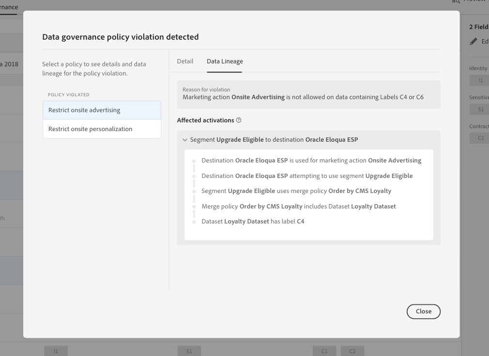

# Erste Schritte mit der Adobe Echtzeit-Kundendatenplattform

Diese Anleitung führt Sie durch eine Beispielimplementierung der Adobe Echtzeit-Kundendatenplattform (Echtzeit-CDP). Sie können es als Beispiel verwenden, wenn Sie Ihre eigene Implementierung einrichten. Obwohl dieses Handbuch spezifische Beispiele zeigt, enthält es Links zu zusätzlichen Informationen, die Sie beim Erstellen Ihres Setups verwenden können.

Dieses Beispiel zeigt, wie leistungsfähig die Adobe Echtzeit-Kundendatenplattform auf der Grundlage der Adobe Experience Platform ist:

* Daten aus mehreren Quellen erfassen
* Zusammenführen in einem einzigen Echtzeit-Kundenprofil
* Stellen Sie eine konsistente, relevante und personalisierte Erfahrung für alle Geräte bereit.

## Anwendungsfall

Luma, ein Sportbekleidungsunternehmen, versucht immer, ihre Kundenerfahrung zu verbessern. Sie haben eine neue Initiative zur Steigerung des Geschenksumsatzes. Sie möchten auch die Überbelichtung reduzieren, z. B. lästige Anzeigen, die Kunden folgen.

Zurzeit geben sie zu viel für Medien aus, die sich gegen Artikel richten, die der Besucher nicht kaufen wird, und die vorwärts gehen. Luma möchte beispielsweise niemanden mit einem Artikel ansprechen, der als einmaliger Kauf für eine andere Person gedacht war.

Derzeit werden die Daten von Luma über mehrere Quellen verteilt. Sie stehen daher vor großen Herausforderungen:

* Die Marketingorganisation muss mit verschiedenen Teams zusammenarbeiten, die jeweils eine Datenquelle besitzen, einschließlich einer Website, mobilen App, Treuesystemen, CRM usw.
* Sobald das Marketingteam Zugriff auf die Daten erhält, ist diese oft veraltet und für ihre zeitkritische Kampagne nicht mehr relevant.
* Sie müssen die Daten vereinheitlichen, damit sie auf eine Person abzielen, nicht auf Kanäle.

Luma verfolgt daher folgende Geschäftsziele:

* Erstellen Sie aus unterschiedlichen Datenquellen eine einheitliche Echtzeitansicht der Verbraucher.
* Personalisieren Sie Marketingkampagnen mit relevanten Botschaften über verschiedene Kanäle und Geräte.

Um diese Ziele zu erreichen, muss das Marketingteam in der Lage sein, Kundendaten in großem Umfang zu verwalten.

Mit CDP in Echtzeit auf Basis der Adobe Experience Platform kann Lumas Marketingorganisation:

1. Erfassen Sie Daten von unterschiedlichen Plattformen und stellen Sie sicher, dass sie nachgelagert für andere Marketingaktivitäten verfügbar sind.
1. Erstellen Sie eine einzige Echtzeit-Ansicht der Verbraucher, unabhängig davon, wo die Daten stammen.
1. Steigern Sie ein konsistentes, relevantes und personalisiertes Erlebnis für jeden Touchpoint.

## Schritte

Dieses Lernprogramm umfasst die folgenden Schritte:

1. Erstellen Sie das [Kundenprofil](#customer-profile).
1. [Personalisieren Sie](#personalizing-the-user-experience) die Benutzererfahrung.
1. Verwenden Sie [mehrere Datenquellen](#using-multiple-data-sources).
1. [Konfigurieren einer Datenquelle](#configuring-a-data-source).
1. [Erfassen Sie die Daten](#bringing-the-data-together-for-a-specific-customer) eines bestimmten Kunden.
1. Richten Sie [Segmente](#segments)ein.
1. Richten Sie [Ziele](#destinations)ein.
1. [Stellen Sie das Profil geräteübergreifend](#cross-device-identity-stitching)zusammen.
1. [Analysieren Sie das Profil](#analyzing-the-profile).

## Kundenrprofil

Wenn Kunden Ihre Site zum ersten Mal besuchen, wissen Sie nichts darüber.


Während der Navigation werden Daten in Echtzeit erfasst und nicht nur an eine Report Suite in Adobe Analytics gesendet, sondern auch direkt an Adobe Experience Platform gesendet. Während Daten gesammelt werden, beginnen Sie, anhand von Verhaltensdaten im Echtzeit-Kundenprofil von Experience Platform eine einzelne Ansicht des Verbrauchers zu bilden.

Viele Besucher der Website sind wahrscheinlich wiederholte Kunden, die zuvor bei Luma gekauft haben.  Es ist wichtig, dass Luma Messaging und Angebote personalisieren kann, um sowohl neue als auch rückkehrende Besucher sowie bekannte Kunden anzusprechen.

### Erstbesuch eines neuen Kunden

Ein nicht identifizierter Besucher navigiert beispielsweise zum Abschnitt &quot;Männer&quot;auf der Luma-Site und zeigt ein paar Pullover an.


Wenn der Kunde klickt, um mehr über diese Produkte zu erfahren, werden diese Produktansichten in Adobe Analytics erfasst und an Experience Platform gesendet.

<!---->

Luma kann das Verhalten des Besuchers einem Benutzerprofil auf der Adobe Experience Platform zuordnen und damit beginnen, einen umfassenderen Überblick über das Verhalten des Benutzers zu gewinnen.

### Detailliertere Ansicht des Kunden

Wenn der Kunde weiterhin mit der Website interagiert, ergibt sich ein klareres Bild. Angenommen, der Besucher fügt dem Warenkorb ein Produkt hinzu und meldet sich an.

Wenn sich der Kunde anmeldet, identifiziert sie sich als Sarah Rose.


Zwei Identitäten werden zusammengeführt:

* Anonyme Browserdaten
* Die vorhandenen Daten zum Konto von Sarah Rose

Beide Identitäten werden in Experience Platform zu einem Profil zusammengefasst. Luma hat jetzt eine einheitliche Sicht auf diesen Verbraucher.

Aufgrund des Browsing-Verhaltens des anonymen Besuchers im Herrenbereich der Site könnte davon ausgegangen werden, dass der Kunde männlich war. Nachdem sie sich angemeldet hat, erkennt Luma Sarah Rose. Luma nutzt die Leistungsfähigkeit des Echtzeit-Kundenprofils, um die Nachrichten zu verfeinern, die ihr über Kanäle übermittelt werden.

## Benutzererlebnis personalisieren

Sarah wird mit einer Loyalitätsbotschaft willkommen geheißen und dankt dafür, dass sie Mitglied der Bronze ist und mehr Informationen über Leistungen und wie sie ihren Status und ihre Punkte verbessern kann.

Sie klickt auf die Homepage, um weitere zu durchsuchen.


Sarah erhält eine personalisierte Homepage, die dynamisch bereitgestellt wird, basierend auf ihrem Echtzeit-Kundenprofil in Adobe Experience Platform.

Sie sieht relevante Inhalte, dank der Personalisierung durch Adobe Sensei in Adobe Target, bei der sie ihre bisherigen Käufe und ihre Affinität zum Bekleiden und zur Ausrüstung berücksichtigt. Luma passt den Kataloginhalt von Männern auch auf Laufgeräte für Männer an, basierend auf ihrem letzten Durchsuchen.

Weiter unten auf der Seite werden Sarah spezielle Produkte sowie eine neue Empfehlungsablage angezeigt, die auf ihren zuletzt angezeigten Artikeln basiert.

Dieser personalisierte Inhalt hilft Sarah, relevante Artikel schnell zu finden. Dies erhöht die Konversionen und bietet ein angenehmeres Kundenerlebnis.

### Zurückholen des Kunden

Sarah wird abgelenkt und verlässt die Site und beendet ihre Sitzung. Luma kann ihre Daten in Adobe Experience Platform verwenden, um sie wieder auf die Site zu bringen.

Die Adobe Echtzeit-Kundendatenplattform auf Basis der Adobe Experience Platform ist für das Kundenerlebnis-Management konzipiert. Sie ermöglicht Organisationen,

* Vereinfachung der Datenintegration und -aktivierung
* Bekannte und unbekannte Datenverwendung steuern
* Beschleunigte Marketingverwendung

## Verwenden mehrerer Datenquellen

Das Team von Luma hat alle ihre Verhaltens- und Kundendaten an einem Ort.


Sie können Daten aus allen folgenden Quellen erfassen:

* Daten zu bestehenden Adobe Experience Cloud-Lösungen
* Nicht-Adobe-Quellen, wie z. B. das Treueprogramm von Luma, das Call-Center und die Point-of-Sale-Systemdaten
* Echtzeit-Streaming-Daten aus Luma-Datenquellen
* Echtzeit-Daten aus Adobe-Lösungen (keine neuen Tags erforderlich)

Alle diese Daten aus unterschiedlichen Quellen werden in einem einzigen einheitlichen Kundenprofil zusammengeführt.

## Datenquelle konfigurieren

Verwenden Sie die Echtzeit-Kundendatenplattform, um neue Datenquellen in die Plattform zu integrieren. Echtzeit-CDP enthält einen Katalog von Datenquellen, die in wenigen Klicks zum Profil hinzugefügt werden können.


Um beispielsweise Lumas CRM-Daten zu erfassen, filtern Sie den Katalog nach *CRM*, und es werden alle Out-of-the-Box-Connectors aufgelistet, die *CRM* enthalten. Hinzufügen von Microsoft Dynamics CRM-Daten:

1. Autorisieren Sie die Verbindung.

   

1. Wählen Sie aus einer empfohlenen Liste mit vorab zugeordneten XDM-Tabellen aus, was Sie importieren möchten.

   <!--     -->

   Wählen Sie beispielsweise **[!UICONTROL Kontakte]**. Eine Vorschau der Kontaktdaten wird automatisch geladen, damit Sie sicherstellen können, dass alles wie erwartet aussieht.

   Die Adobe Experience-Plattform nimmt einen Großteil der manuellen Arbeit aus diesem Prozess heraus, indem sie Standardfelder automatisch dem Experience Data Model (XDM)-Profilschema zuordnet.

1. Überprüfen Sie die Feldzuordnungen.

   <!--     -->

   Überprüfen Sie beispielsweise, ob das E-Mail-Feld für Kontakte korrekt zugeordnet ist.\
   Sie haben die Möglichkeit, eine Vorschau der Daten anzuzeigen und eine erweiterte Zuordnung durchzuführen.

1. Legen Sie einen Zeitplan fest.

   

Es ist fertig. Sie haben Microsoft CRM gerade als Datenquelle zu Experience Platform hinzugefügt.

## Zusammenführen der Daten für einen bestimmten Kunden

Suchen Sie in diesem Szenario nach Profilen für Sarah Rose. Ihr Profil erscheint mit der E-Mail, die sie zum Anmelden verwendet hat.

<!--  -->

Alle Profilinformationen, die Luma zu Sarah hat, werden angezeigt. Dazu gehören persönliche Daten wie Adresse und Telefonnummer, Kommunikationseinstellungen und die Segmente, für die sie sich qualifiziert.

| Kategorie | Beschreibung |
|---|---|
| Identitäten | Zeigt die Identitäten, die in Plattform aus Sarahs Interaktionen mit Luma über Kanäle und Geräte miteinander verknüpft wurden. Ihre ECID von der Website wird angezeigt. Zu ihrer Identität gehören auch die ECID aus ihrer mobilen App, ihre E-Mail-ID, eine CRM-ID aus dem kürzlich hinzugefügten Microsoft Dynamics-Datensatz und eine Loyalität-ID, die vom Luma-Treuesystem an Adobe Experience Platform weitergeleitet wird. |
| Ereignisse | Zeigt alle Interaktionsdaten von Sarah mit der Marke Luma an. Dazu gehören der Artikel, den sie gerade angesehen hat, alles, was sie in der Vergangenheit gesehen hat, die E-Mails, die sie erhalten hat, ihre Interaktionen mit dem Call-Center und auf welchem Kanal und welchem Gerät jede dieser Interaktionen stattfand. |

Das Echtzeit-CDP-Profil reduziert den Arbeitsablauf des Luma-Marketingteams von Wochen zu Minuten und ermöglicht die Personalisierung auf Grundlage dieser 360-Grad-Kundenansicht. Das Profil führt die Verhaltensdaten zusammen, aus denen sie die Site durchsuchte, bevor sie sich anmeldete, mit ihrem bestehenden Kundenprofil und bietet so einen umfassenden Überblick über Sarah.

Das Marketing-Team kann dieses erweiterte Kundenprofil in Echtzeit nutzen, um Sarahs Erfahrung besser zu personalisieren und die Markenloyalität mit Luma zu erhöhen.

## Segmente

Die leistungsstarken Segmentierungsfunktionen der Adobe Experience Platform ermöglichen es Marketingexperten, Attribute, Ereignisse und vorhandene Segmente auf der Grundlage der im Echtzeit-Kundenprofil erfassten Daten zu kombinieren.

<!--  -->

In diesem Szenario zeigen Sarahs jüngste Interaktionen auf der Site ein anderes Verhalten als ihre bisherigen Aktionen. Sie kauft für gewöhnlich Damenkleidung. Der Artikel in ihrem Einkaufswagen ist jedoch ein großes Pullover für Männer.

Das Luma Data Science Team hat Modelle zur Kaufneigung entwickelt. Ein Modell identifiziert eine plötzliche Änderung der Bekleidungskategorie (z. B. Männer/Frauen) oder der Größe des bestehenden Verbrauchers. Sarahs verändertes Kaufverhalten deutet darauf hin, dass sie nicht selbst einkauft.

<!--  -->

### Definieren eines Segments

Ändern oder erstellen Sie ein Segment, das Warenkorbabbrecher repräsentiert, die während des Kaufvorgangs eines Geschenkens zu sein scheinen:

```
Profile: Category != Preferred Category 
AND 
Product Size != Preferred Size 
in last 7 days.  
AND 
Abandoned Cart 
AND 
Loyalty member 
```

<!-- -->

Da Sarah einen scheinbaren Geschenkartikel in den Einkaufswagen legte und ihn aufgab, kann Luma sie mit einem kostenlosen Geschenkangebot ansprechen.

## Ziele

Wenn Sie das Segment &quot;Geschenkgutscheine mit Warenkorb&quot;hinzugefügt haben, können Sie ungefähr sehen, wie viele Personen Teil dieses Segments sind. Sie können daran aktiv werden und sie kanalübergreifend zur Personalisierung bereitstellen.

Klicken Sie auf **[!UICONTROL An Ziele]** senden.

In Adobe Echtzeit-CDP kann Luma zur Personalisierung nahtlos auf ihre Zielgruppensegmente reagieren.\
Hier sehen Sie alle Ziele, an die Luma dieses Ziel senden kann, sowohl Adobe- als auch Nicht-Adobe-Lösungen:

<!--  -->

<!-- ### Privacy

Adobe Experience Platform includes privacy and security controls to ensure a segment is available to be activated to a particular destination based on its profile policy. If your activity violates policy, a warning appears. 



With these controls, Experience Platform helps Luma be compliant with regulations and to market responsibly.  

Luma can confidently address regional and organizational requirements for managing known and unknown customer data with unified governance tools.  

These controls are flexible and can be modified to meet the requirements of Luma’s security and governance teams.
-->

### Ziele auswählen

In diesem Szenario möchte Luma diese Zielgruppe mit Personalisierung über folgende Ziele hinweg neu ausrichten:

* Google, zur Anzeige
   <!--* Facebook -->
* Adobe Campaign, für E-Mail

<!--  -->

### Planen von Zielen

Sie können auch planen, dass das Segment zu einem bestimmten Zeitpunkt beginnt oder endet. Das Segment wird an den geplanten Daten veröffentlicht und automatisch auf den konfigurierten Plattformen aktualisiert.

>[!NOTE]
>Wenn Sie auf das Datumsfeld klicken, wird es optional automatisch für 90 Tage planen.

Klicken Sie auf **[!UICONTROL Speichern]** , um zur nächsten Seite zu wechseln.

Wenn ein Kunde in dieser Zielgruppe einen Kauf tätigt, wird seine Mitgliedschaft in dieser Zielgruppe in Echtzeit unterdrückt. Sie qualifizieren sich nicht mehr, weil sich ihr Status geändert hat.

Dies spart dem Direktor des Luma-Medienteams Hunderttausende Dollar, indem er nicht die Bestandsaufnahme für eine Zielgruppe verwendet, die nicht qualifiziert ist.

### Arbeitsfläche für Datenfluss

Beim Speichern zeigt eine Arbeitsfläche mit visuellen Datenströmen das Segment an, das den drei ausgewählten Zielen aus dem einheitlichen Profil zugeordnet ist.


## Geräteübergreifende Identitätszuordnung

Sarah durchsucht eine Social Media-Site auf ihrem Mobilgerät und sieht eine Luma-Anzeige. Es erinnert sie an den Artikel, den sie in ihrem Warenkorb gelassen hat.

Später öffnet sie ihre E-Mail und sieht die umgeleiteten E-Mails. Sie klickt in einer E-Mail auf einen Link zu Luma.

Über den Link gelangt Sarah zur mobilen Luma-Homepage, auf der sie ein hoch personalisiertes Erlebnis mit Adobe Target sieht.

* Sie ist als Bronzemanatin willkommen.
* Sie sieht die Nachricht &quot;Geschenk&quot;.
* Sie sieht auch die Nachricht &quot;Free Gift Wrap&quot;, die Teil ihrer Bronze-Mitgliedschaft ist.
* Sie ist immer noch auf das Heldenbild ausgerichtet, basierend auf ihrer Affinität zum Laufen.

Sie kauft den Pullover, fügt Geschenkpackung hinzu und schreibt einen Geschenkgutschein. Sie hat auch die Möglichkeit, sich an diese Veranstaltung zu erinnern und im nächsten Jahr eine Erinnerung zu erhalten, um zu dieser Zeit ein Geschenk zu erhalten. Sie sagt ja, und ist in eine E-Mail-Kampagne im folgenden Jahr geplant, um sie daran zu erinnern, ein weiteres Geschenk zu kaufen.

Dank der Unterdrückungsmöglichkeiten für das Publikum wird Sarah nicht auf den Pullover dieser Männer zugeschnitten sein, der sich vorwärts bewegt.

## Analyse des Profils

Luma-Marketingexperten verwenden Adobe Experience Platform, um sich das Geschenkartikelsegment im Echtzeit-CDP-Dashboard anzusehen. Sie sehen die Ergebnisse dieser Initiative im Laufe der Zeit und sehen, dass sie wächst. Kunden reagieren auf Angebote und geben mehr Geld aus.

Diese Einblicke ermöglichen es Marketingexperten, auf dieses Signal zu reagieren, das durch die Verfügbarkeit dieser Daten in CDP und die Anbringung von Kunden wie Sarah an das Segment angeheizt wurde.

Luma nutzt diese CDP-Daten, um die Kundenzufriedenheit zu steigern.
